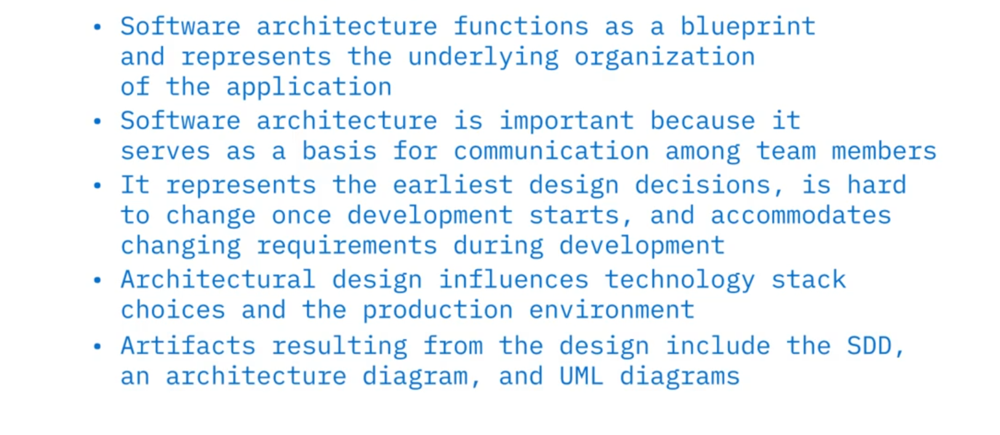
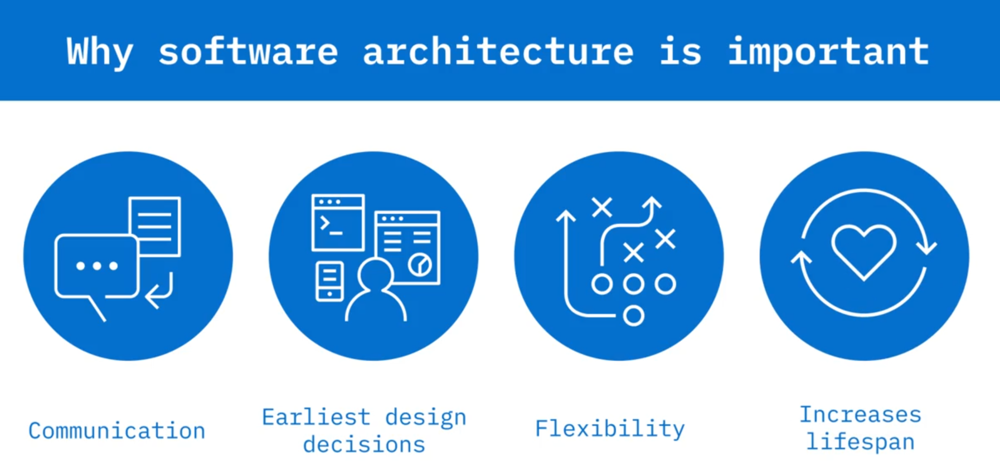
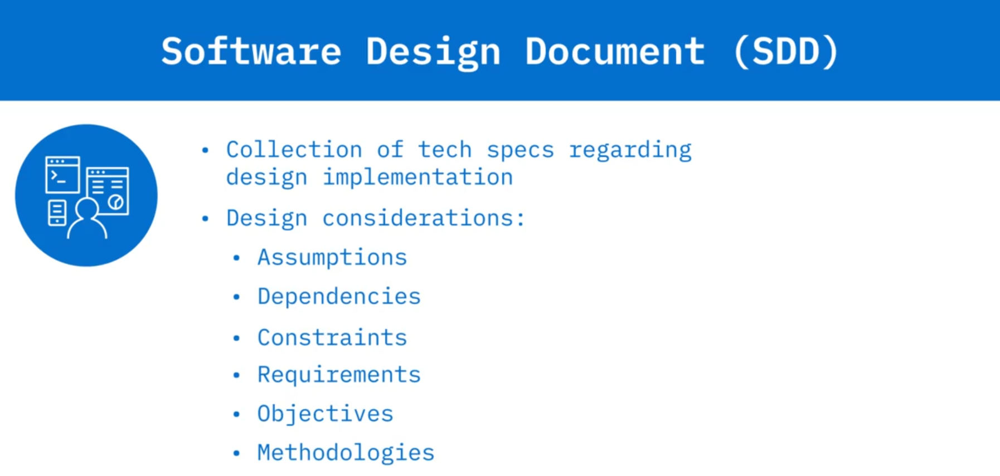
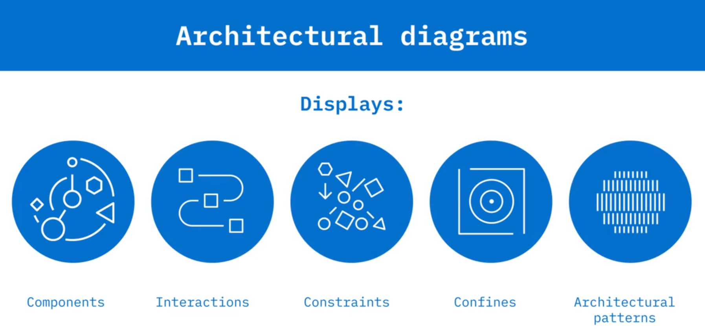
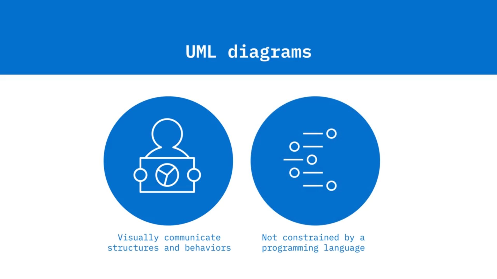

# 04-001 Software Architecture Introduction

**Software architecture** is the organisation of a system.

Acts like blueprint that defines the fundamental structures of a software system and explains its behaviour.

It establishes how components interact with each other, the operating environment, and the design principles governing the system.

### The **Early Design decisions**

Architecture captures decisions made during the design phase of the SDLC that are costly to change once implemented. These decisions conflate subsequent coding and implementation choices throughout development.

### But, also, the **Non-functional aspects**

Architecture addresses critical qualities including:

* Performance
* Scalability
* Maintainability
* Interoperability
* Security
* Manageability

***

### Importance of Well-Designed Architecture

1. **Stakeholder balance:** Balances differing needs of stakeholders and establishes a basis for communication among team members.
2. **Foundation for decisions:** Represents earliest design decisions that influence all subsequent implementation choices.
3. **Agility and longevity:** Enables adaptation to changing requirements and increases the lifespan of the software system even when implementation details change.
4. **Increases the lifespan cycle**.

***

### Technology Stack Selection

Architecture directly influences **technology stack** choices—the complete list of technologies including software, programming languages, libraries, and frameworks used to create the system.

Architects must understand each stack's advantages and disadvantages to anticipate development needs and address non-functional requirements.

***

### Production Environment

The architecture drives choices about the **production environment**—the infrastructure that runs and delivers the application to end-users, comprising servers, load balancers, databases, and other operational components.

***

### Architectural Artifacts

Three primary deliverables communicate design decisions:

* **SOFTWARE DESIGN DOCUMENT - SDD** 
* **ARCHITECTURAL DIAGRAM** 
* **UML Diagrams** 

| Artifact                           | Purpose                                                                                                                                                                             |
| ---------------------------------- | ----------------------------------------------------------------------------------------------------------------------------------------------------------------------------------- |
| **Software Design Document (SDD)** | Collection of technical specifications including functional description, design considerations, assumptions, dependencies, constraints, requirements, objectives, and methodologies |
| **Architectural Diagram**          | Displays components, their interactions, constraints, and confines; illustrates architectural patterns                                                                              |
| **UML Diagrams**                   | Communicate structure and behaviour using language-agnostic notation                                                                                                                |

***

## Lesson Speech

Welcome to Introduction to Software Architecture. After watching this video, you will be able to: **Describe what software architecture is**; **Explain the importance of well-designed software architecture**; **Explain how software architecture impacts design decisions** such as tech stacks and production environments; and **List several artifacts from software architecture design**.

**Software design and documentation** take place during the design phase of the SDLC. **Software architecture, simply put, is the organisation of the system**. **Software architecture serves as a blueprint** for the software system that the programmers use to develop the interacting components of the software. The architecture comprises the **fundamental structures of a software system** and explains the behaviour of that system. The architecture **defines how components should interact with each other**, the operating environment, and the principles used to design the software.

The software architecture **captures early design decisions** that are often costly to change once implemented. A software's architecture addresses **non-functional aspects** of the application such as **performance, scalability, maintainability, interoperability, security, and manageability**. **Well-designed software architecture is important** for a number of reasons. First, it **balances the differing needs of the stakeholders** and serves as a basis for communication among team members. Next, the architecture **represents the earliest design decisions**, and those decisions conflate other coding implementation decisions later in the development process. Also, the well-designed architecture **allows for agility due to changing requirements**. A well-organised architecture **increases the lifespan of the software system** even when implementation details change.

**Architectural design also guides the choice of technology stacks** used for the system. Remember that architecture addresses non-functional capabilities so choosing stacks that address these requirements is paramount in the design phase. Recall that a **tech stack is a list of all the technologies** including software, programming languages, libraries, and frameworks that will be used to create the system. The architects must be aware of the stack's advantages and disadvantages to anticipate development needs. Much like blueprints communicate design decisions to the builders of a house, **there are also several artifacts produced during the architectural design phase** that are used to communicate the software design to the stakeholders. These artifacts include a **software design document, or SDD**, an **architectural diagram**, and **unified modelling language, or UML, diagrams**. The SDD is a **collection of technical specifications** that indicate how the design should be implemented.

It provides a **functional description of the software** and design considerations such as **assumptions, dependencies, constraints, requirements, objectives, and methodologies**. The **architectural diagram displays components**, their interactions, their constraints, and their confines. It **displays the architectural patterns** used in the design. **Architectural patterns are general, reusable solutions to commonly occurring problems** and will be discussed in more detail in an upcoming video. **UML diagrams are diagrams that communicate structure and behaviour** using common programming language agnostic notation. UML diagrams will also be discussed in more detail in another video. Another topic to be discussed in this module as it relates to software architecture includes **production deployment considerations**.

The **architecture drives choices about the environment** in which the software is released. The **production environment is comprised of the infrastructure** that runs and delivers the application to the end-user such as the servers, load balancers, and databases. In this video you learned that: **Software architecture functions as a blueprint** and represents the underlying organisation of the application. **A good architectural design is important** because it serves as a basis for communication among team members. **Software architecture represents the earliest design decisions**, is hard to change once development starts, and accommodates changing requirements during development. **Architectural design influences technology stack choices** and the production environment and **Artifacts resulting from the design include the SDD, the architecture diagram, and UML diagram**.
