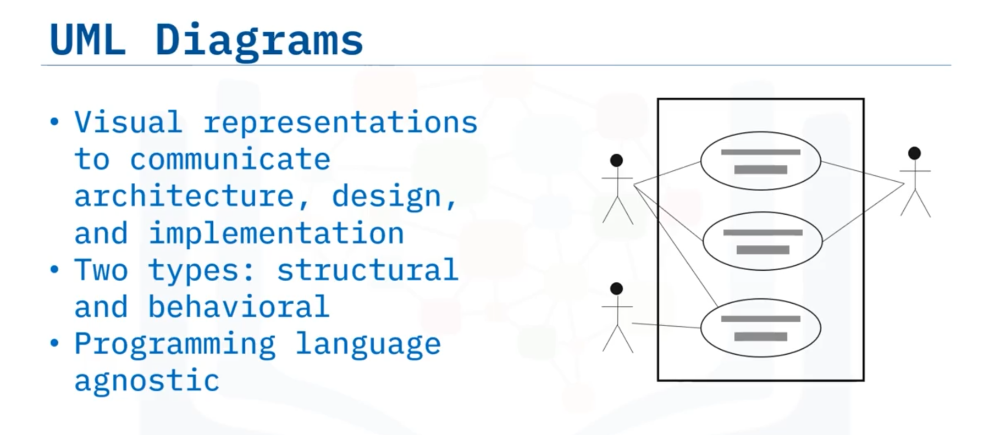
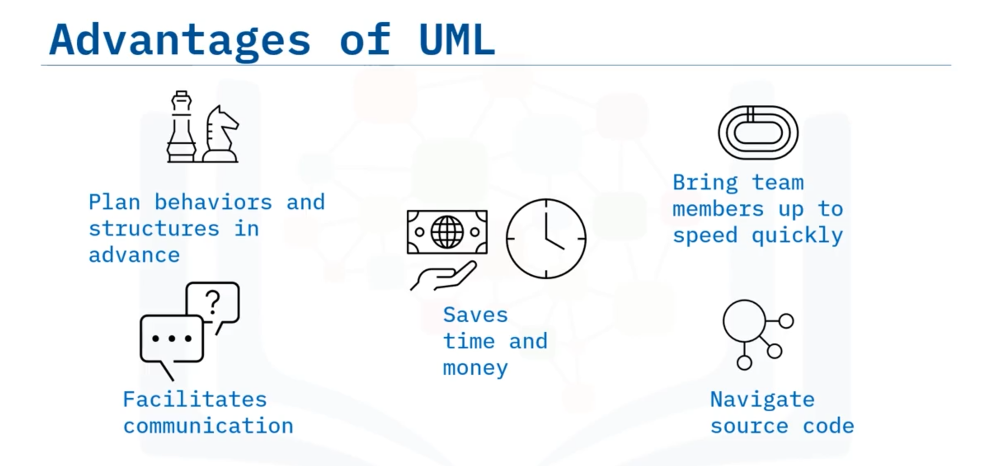
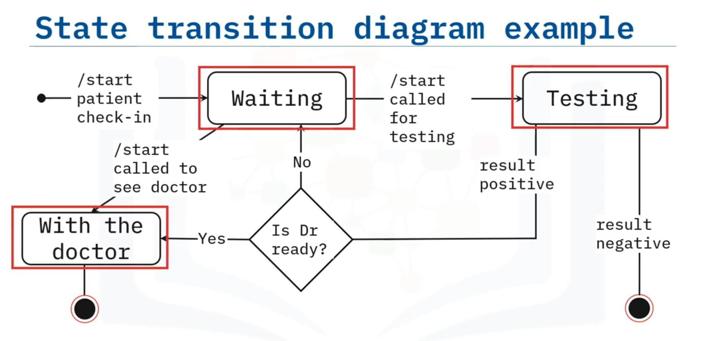

# 04-002 Software Modelling Design

**Software design** is a process during which structural components and behavioural attributes of software are documented before development.  

A key activity is **modelling**—creating visual or diagrammatic representations of the software solution, its sub-components, and their interactions.

---

### Structured Design

**Structured design** conceptualises a software problem into well-organised smaller solution elements called **modules and sub-modules**.   

It stresses organisation to achieve cohesive, effective solutions.

**Key principles:**

- **Cohesion:** All functionally related elements are grouped together within a module.
- **Loose coupling:** Modules are weakly associated so changes in one component have minimal effect on another. This architectural principle underpins service-oriented architectures and microservices-based patterns.

Modules are arranged hierarchically with data flowing between them, enabling clear organisation and maintainability.

### Behavioural Models

**Behavioural models** describe what a system does without explaining how it implements that behaviour.   
They communicate overall system behaviour through various UML diagram types.

### Unified Modelling Language (UML)

**UML** is a standardised, **programming language agnostic** visual notation for representing architecture, design, and implementation of complex software systems.  

It can be applied throughout development regardless of the programming language used.

UML diagrams are classified into two categories:
- **Structural diagrams:** Show static structure
- **Behavioural diagrams:** Show dynamic interactions and state changes

#### Advantages of UML

1. **Cost and time savings:** Plan features before coding begins
2. **Team onboarding:** Enable new members or transferred developers to quickly understand the system
3. **Communication:** Facilitate dialogue between technical and non-technical audiences
4. **Navigation:** Provide visual relationships among modules, aiding source code navigation

---

### Behavioural Diagram Types

#### **State Transition Diagram** 
A collection of **states** and **events** describing different system states and the events triggering state changes. Arrows represent possible transitions with event labels.

#### **Interaction Diagram (Sequence Diagram)** 
Models the **dynamic nature** of a software system, visualising objects and their relationships.   

A sequence diagram displays communication between objects **with respect to time**, showing temporal ordering of interactions.

---

## Lesson Speech

Welcome to software design and modelling. After watching this video, you will be able to: **Compare and contrast the terms "structured design" and "behavioural models"**; **Describe Unified Modelling Language (or UML) and its advantages** when designing software; and **discuss the purpose of an interaction and a state transition diagram**.

**Software Design is a process** during which **structural components and behavioural attributes of the software are documented** before it can be developed. One of the key activities of the design process is **modelling the software** to express its design. This involves **creating visual or diagrammatic representations** of the bigger software solution, and its sub-components, as well as the interactions between them.

This can be done using simple flowcharts or more **standardised methods like UML**. A software system can be construed in terms of structural elements. **Structured design conceptualises a software problem into well-organised smaller solution elements called modules and sub-modules**. **Structured design stresses organisation** in order to achieve a solution. A well-structured design should contain modules that are **cohesive and loosely coupled**. **Cohesion means that all functionally related elements are grouped together**. **Coupling is the communication between different modules**. For a system to be **loosely coupled** the modules should be weakly associated so changes in one component have minimal effect on another. **Loose coupling is an architectural principle** often used in service-oriented architectures and microservices based architectural patterns, which will be discussed later in the module.

The diagram shows a simplified example billing system. Modules are arranged in a hierarchy and communicate with each other. The rectangles represent the modules and sub-modules. You can see that "billing" is the main module, and the other rectangles are sub-modules to the main billing module. In this example the sub-modules are "insurance verification," "submit claim," and "output total." The arrows represent the flow of the data in the system. **Behavioural models describe what a system does, without explaining how it does it**.

The overall behaviour of a system can be communicated through behaviour models. There are a number of different UML diagrams that can be used to communicate the behaviour of a system. We will discuss two such diagrams, a state transition diagram, and an interaction diagram. When developing a complex software system with interconnected modules, it can be difficult to remember the relationships, behaviours, and hierarchies among different elements. **UML, which stands for Unified Modelling Language, is a way to visually represent the architecture, design, and implementation of complex software systems**. **UML is a standardised modelling language** that can be used throughout development processes. **UML diagrams can be divided into two classes: either structural or behavioural**.

**UML is programming language agnostic**, so software developers can readily interpret and apply it to their work no matter which language they are developing in. **There are several advantages of using UML** to communicate architecture, behaviour, and structure with development teams. **The biggest advantage of UML diagrams is that they allow you to plan out features before any coding takes place** which saves time and money. Secondly, the diagrams can be used to **bring new team members or developers switching teams to get up to speed quickly**. Also, the diagrams can be used to **facilitate communication between technical and non-technical audiences** more easily. And finally, **having a visual representation of the system allows developers to navigate the source code** because they can see the relationships among modules. So there are many types of UML diagrams but generally, **UML diagrams can be classified as either behavioural or structural**.

We will discuss behavioural models next and then object-oriented design. **The behaviour of a system can be explained and represented with the help of a UML diagram called a state transition diagram**. **The state transition diagram is a collection of states and events** that describes the different states that a system has and the events which cause a change of state in the system. The diagram shown is an example of a state transition diagram that models a patient going to see a doctor at a clinic. The different states include "waiting," "testing," and "with the doctor." The arrows represent possible transitions from one state to another and names the event that triggers the transition. **An interaction diagram is used to model the dynamic nature of a software system**. They help visualise objects and their relationships. A sequence diagram, which is the type of interaction diagram shown here, **displays the communication between objects with respect to time**. This example shows a patient making an appointment in an online portal. This is another example of a behavioural UML diagram.

In this video you learned that: **Structured design breaks down a software problem into well-organised smaller solution elements**. **Behavioural models describe the behaviour of the system without explaining how the system implements the behaviour**. **Developing UML diagrams saves time and money** by helping developers quickly get up to speed on a project, plan features in advance of coding, and help developers navigate source code easily. **A state transition diagram is a behavioural model containing a collection of states and events** that describe the different states of a system and the events which cause a change of state. And finally, **an interaction diagram describes how interacting objects communicate**.
