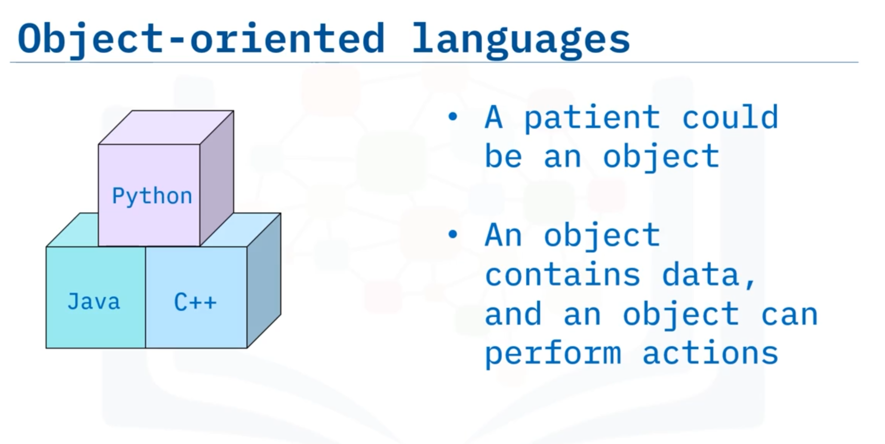
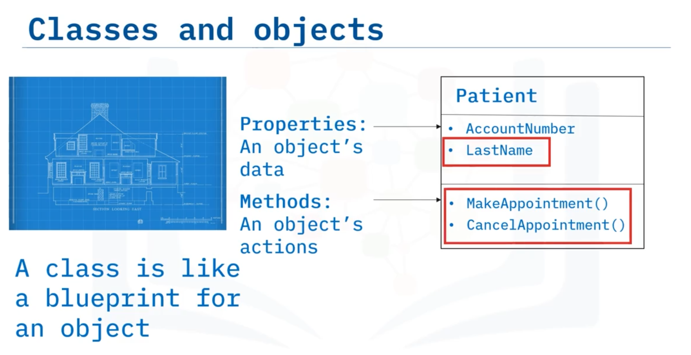
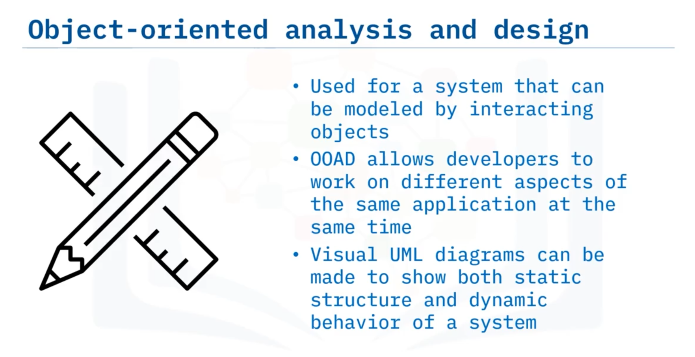

# 04-003 Object-Oriented Analysis

**Object-Oriented Analysis and Design (OOAD)** is an approach for analysing and designing software systems developed using object-oriented programming languages (Java, C++, Python, etc.).

---

### Objects and Classes

**Objects** are the fundamental building blocks of OOAD.   
Each object contains:

-   **Data:** Properties that describe the object's state
-   **Behaviours:** Methods that prescribe the actions the object can take

**Classes** are generic blueprints or templates for creating objects.

A class defines the structure and capabilities that instances will possess, specifying generic attributes (properties and methods) without assigning particular values until an object is instantiated.

**Instantiation** is the process of creating a specific object (instance) from a class. When instantiated, the generic attributes defined in the class are assigned particular values.   

For example, the `Patient` class may define a `LastName` property as a placeholder; when a specific patient object is instantiated (e.g., Pepito Perez), `LastName` receives a concrete value.

---

### Advantages of OOAD

-   Allows complex systems to be decomposed into interacting objects

-   Enables multiple developers to work on different components simultaneously

-   Provides a structured approach aligned with object-oriented programming paradigms

---

### Class Diagrams

**Class diagrams** are structural UML diagrams used to communicate a software system's structure in OOAD. They display:

- **Classes:** Each box represents a class

- **Attributes:** Properties (data) and methods (actions) available to the class
- **Relationships:** How classes relate to and interact with one another

#### Inheritance

**Inheritance** allows subclasses to inherit attributes (properties and methods) from parent classes. A subclass possesses all properties and methods of its parent class and may add additional attributes.

#### Example hierarchy

- **Medical Personnel** (parent class)
  - **Nurse** (subclass)
  - **Doctor** (subclass)
    - **Specialist** (subclass of Doctor)

In this structure, specialists can perform all actions doctors can, and doctors can perform all actions medical personnel can.

---

## Lesson Speech

Welcome to object-oriented analysis and design. After watching this video, you will be able to: **Explain what objects and classes are**; **Describe the purpose of a class diagram**; and **explain object-oriented design in relation to software architecture**.

**Object-oriented analysis and design, or OOAD for short, is an approach for analysing and designing a software system** when the system will use object-oriented programming languages to develop it. So, before we discuss OOAD, let's learn a little more about object-oriented programming in languages like Java, C++, or Python. **At the heart of OOAD are objects**. **Objects contain data, and they also have behaviours that prescribe the actions the object can take**.

I could create an object for example, that represents a patient. And, let's say the patient's name is Naya Patel and Naya needs to cancel an appointment she made. Before creating Naya, however, we must first create a generic version of a patient object. **The generic version of an object is called a "class"**. Let's discuss classes next before we discuss more about Naya. **Specific objects, also called instances, are created from "classes" which are blueprints or templates for an object**. So, from our previous example, considering Naya Patel, Naya would be an instance of the patient class.

**The class contains the object's generic attributes – the properties and methods** – but it is only when the object is created, which is called **"instantiation,"** inside the code that these generic attributes are set to particular values. So, the patient class might have a variable called LastName, which is a property but does not specify what that last name is. LastName is just a placeholder until the object is created and assigned a name. And once the object has been instantiated its methods can be called to make the object perform some action such as making or cancelling an appointment. **OOAD is used for a system that can be broken down into objects that interact with each other**. In this way, **multiple developers can work on different aspects of the application at the same time**. As noted earlier, visual UML diagrams can be created that show both the static structure and dynamic behaviour of a system.

We've seen a couple of examples of behavioural UML diagrams already, so now let's look at a structural UML diagram called a **"class diagram"** next now that we know what classes are. **This is an example of a "class diagram."** **Class diagrams are commonly used to communicate a software system's structure in OOAD**. **The class diagram shows how the classes in an object-oriented design relate to one another**. Each box represents a class and shows its attributes. Recall that **an object's attributes are both its properties or its data, and its available actions, called methods**. **A class diagram also shows the relationships between classes**.

**A subclass is said to "inherit" its parent class attributes** meaning it has the same properties and methods as the parent class but also may add additional properties and methods. In this diagram, the nurse, doctor, and technician classes are subclasses of medical personnel, and the specialist class is a subclass of the doctor class. This means that **doctors can do anything medical personnel can do and specialists can do anything a doctor can do**. In this video you learned that: **Object-oriented analysis and design is the process of planning a software system based on the behaviours of interacting objects**. **Objects contain data, and they also have behaviours that prescribe the actions the object can take**. **Classes are blueprints for objects**. And **a class diagram is a structural UML diagram that shows the relationship between objects**.
