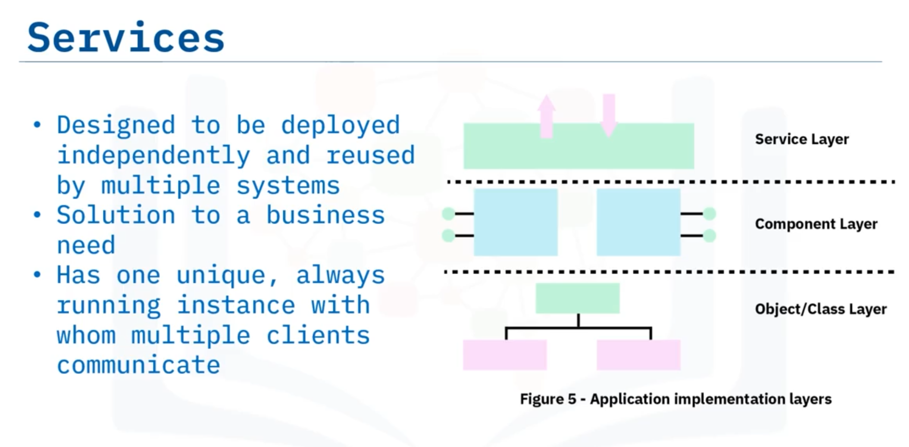
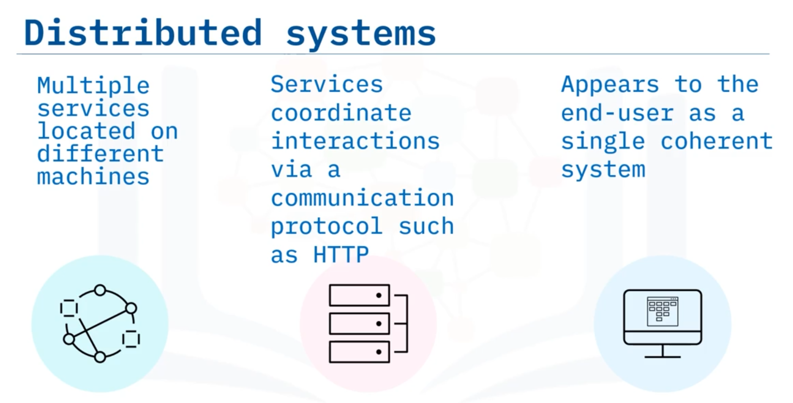
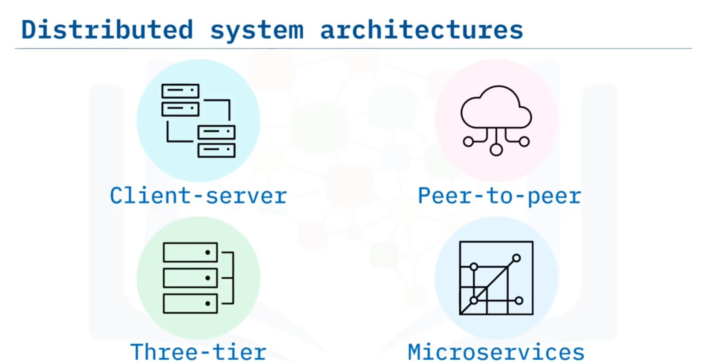

# 04-006 Approaches to Application Architecture

### Components

A **component** is an individual unit of encapsulated functionality serving as part of an application in conjunction with other components  

Components operate at a higher level of abstraction than objects.

#### Six Characteristics of Components

1. **Reusable:** Designed to be reused across different applications
2. **Replaceable:** Easily substituted with another component
3. **Independent:** No dependencies on other components
4. **Extensible:** Ability to add behaviour without modifying other components
5. **Encapsulated:** Bundles data and methods, hiding internal state and implementation details
6. **Non-context specific:** Operates in different environments; data setting internal state is passed in rather than included within or accessed by the component

#### Examples of Components

- **APIs:** Open-source or proprietary APIs connecting systems to databases or services, reusable across multiple systems  

- **Data Access Objects (DAO):** Database interfaces allowing application switching between databases without code modification  

- **Controllers:** Determine which components to invoke for particular events, controlling data flow between components

### Component-Based Architecture

**Component-based architecture** focuses on decomposing the design into logical, independent components.   

It emphasises composing loosely coupled, independent components that work together to create an application, providing higher abstraction than object-oriented design alone.

### Services

A **service** is a unit of functionality designed for **independent deployment** and reuse by multiple systems, focusing on solutions to business needs.

**Key Difference from Components:** A service operates as a **single unique, always-running instance** with multiple clients communicating with it, whereas components may exist in multiple instances.

**Examples of services:** Credit verification, loan payment calculation, mortgage application processing.

**Layered relationship:** Services are composed of components, and components consist of objects.

### Service-Oriented Architecture (SOA)

**Service-Oriented Architecture (SOA)** structures systems around services that are **loosely coupled** and **interface via communication protocols over a network**.   

SOA enables building distributed systems delivering services to other applications through standardised protocols.

---

### Distributed Systems

A **distributed system** comprises multiple services located on different machines that **coordinate interactions by passing messages** via communication protocols (such as HTTP).   

Despite operating across multiple machines, distributed systems appear to end-users as a **single coherent system**.

#### Characteristics of Distributed Systems

- **Fault-tolerant:** System continues operation if a node or service fails; may change during execution without service interruption  

- **Concurrent operations:** Multiple activities run simultaneously, reducing latency and increasing throughput  

- **Scalable:** Performance adapts as user numbers increase  

- **Heterogeneous:** No requirement for uniform hardware, operating systems, or programming languages across nodes  

- **Resource sharing:** Distributed sharing of hardware, software, and data

#### Nodes

A **node** is any device on a network capable of recognising, processing, and transmitting data to other network nodes.  

Distributed systems consist of multiple interconnected nodes running one or more services in an SOA structure.

#### Distributed System Architectures

Distributed systems typically employ one or more fundamental architectures:  

- Client-server
- Three-tier
- Peer-to-peer
- Microservices

---

## Lesson Speech

Welcome to Approaches to Application Architecture. After this guide, you will be able to: **Describe component-based architectures and service-oriented architecture**; **Explain the characteristics of a component**; **Differentiate between components and services**; and **describe the characteristics of distributed systems**.

**A component is an individual unit of encapsulated functionality** that serves as a part of an application in conjunction with other components. **There are six characteristics of components.** Components should be **reusable, replaceable, independent, extensible, encapsulated, and non-context specific.** Let's briefly discuss each of these principles.

**Reusable** implies that components should be designed such that they can be reused in different applications. **Replaceable** means that a component should be easily replaced with another component. **Independent** means the component should be designed so it doesn't have dependencies on other components. **Extensibility** entails the ability to add behaviour to a component without changing other components. **Encapsulation** consists of bundling a component's data and methods to hide its internal state, so it doesn't expose its specific implementation. Creating a component that is **non-context-specific** involves designing it so it operates in different environments. Data that sets its internal state should be passed to the component rather than included within or accessed by the component.

Let's take a look at some examples of components. **An API can be packaged as a component** if it can be reused across multiple systems and applications. For instance, a component could be an open-source API that connects a system to a particular database. **A component can also be the interface for a database, called a data access object**, that switches the user to a different database without the application knowing about the switch. And **a controller is a type of component** that determines which other components need to be called for a particular event. It controls the flow of data between two other components. **Component-based architecture, then, focuses on the decomposition of the design into these logical components**.

**Component-based architecture provides a higher level of abstraction** than object-oriented designs. **A component-based architecture should define, compose, and implement loosely coupled independent components** so they work together to create an application. **A service is like a component**, also a unit of functionality, but **it is designed to be deployed independently and reused by multiple systems.** **A service focuses on a solution to a business need.** **A key difference between a component and a service is that a service will only have one unique, always running instance** with whom multiple clients communicate. This diagram displays the relationship between objects, components, and services in a layered architecture. **Services are made of components and components consist of objects.**

**A service is a type of component.** It is meant to be deployed independently of the overall system. **Examples of services include: checking a customer's credit, calculating a monthly loan payment, or processing a mortgage application.** **In a service-oriented architecture, or SOA, services are loosely coupled and interface with each other via a communication protocol over a network.** **SOA supports building distributed systems that deliver services to other applications** through the communication protocol. So, let's discuss distributed systems next. **A distributed system is a system with multiple services located on different machines that coordinate interactions by passing messages to each other** via a communication protocol such as **hypertext transfer protocol, also known as HTTP.**

Even though the services on a distributed system operate on multiple machines, **a distributed system appears to the end-user as a single coherent system**. A distributed system **shares resources such as hardware, software, and data.** **They are fault-tolerant, meaning if a node or a service fails the system continues to run** also implying that the system may change during execution without service interruption. **Multiple activities run concurrently on a distributed system reducing latency and increasing throughput.** **Another property of distributed systems is that they are scalable** as the number of users increases. **The computers running the distributed system do not need to use the same kind of hardware or operating systems.** **A distributed system may be made up of different kinds of computers and programming languages.** Now **a node is any device on a network** that can recognise, process, and transmit data to other nodes on the network.

**A distributed system consists of multiple interconnected nodes** where the nodes are running one or more services in an SOA. **Distributed systems generally use one or more of the following basic types of architecture: client-server, three-tier, peer-to-peer or microservices.** These application architectures and their characteristics will be discussed in another guide. In this guide, you learned that: **Components are reusable, independent, replaceable, extensible, encapsulated, and non-context specific.** **Component-based architecture is the decomposition of the system into logical independent components.** **Services are made of components and components consist of objects.** **Services are deployed independently and can be reused by multiple systems.**

**In an SOA services are loosely coupled and interface with each other via a communication protocol over a network.** And lastly, **distributed systems run on multiple services on different machines and they appear to the end-user as a single coherent system**.
