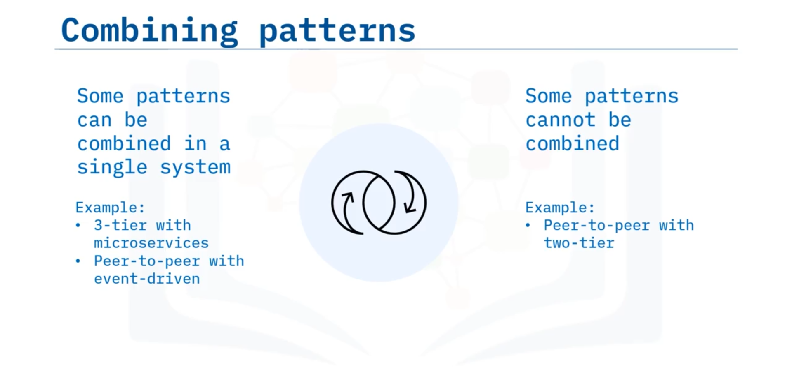

# 04-007 Architectural Patterns

### Architectural Patterns Overview

An **architectural pattern** is a repeatable solution to a problem in software architecture.   

Patterns highlight common internal elements and structures of software systems, though different patterns may share related characteristics and can often be combined.

---

### 2-Tier (Client-Server) Architecture

**2-tier architecture**, also called **client-server**, is a computing model in which the server hosts, delivers, and manages most resources and services delivered to the client.   

The interface resides on the client machine, making requests to the server for data or services.  

Typically multiple client computers connect to a server component over a network connection.

**Example:** Text messaging applications (client initiates request, server routes message to recipient); database clients connecting to database servers.

---

### 3-Tier Architecture

**3-tier architecture** (or **n-tier** with more than three layers) is the most common software architecture.  

It comprises several horizontal tiers functioning together as a single unit.   

A tier only communicates with tiers directly above and below it; related components reside within the same tier, and changes in one tier do not affect others.

#### **Three logical and physical tiers:**

1.  **Presentation tier:** User interface
2.  **Application tier (middle tier):** Business logic processing
3.  **Data tier:** Data storage and management

**Examples:** Web applications using web servers (presentation), application servers (business logic), and database servers (data management).

---

### Peer-to-Peer (P2P) Architecture

**Peer-to-peer architecture** consists of a decentralised network of nodes that are **both clients and servers**.  

Workload is partitioned among nodes; peers make portions of their resources (processing power, disk storage, network bandwidth) directly available to other participants without requiring central coordination.  

Peers both supply and consume resources, contrasting with traditional client-server architecture where only clients consume and servers supply.

**Use cases:** File sharing, instant messaging, collaboration, high-performance computing.

**Example:** Cryptocurrencies such as Bitcoin and Ethereum; each computer in the blockchain acts as both server and client.

---

### Event-Driven Architecture

An **event** is anything resulting in a change of state—an action triggered by end-user interaction (e.g., mouse click) or another program component.   

**Event-driven architecture** focuses on producers and consumers of events:

*   **Producers** listen for and react to triggers.
*   **Consumers** process events. 

The producer publishes the event to an **event router**, which determines which consumer receives the event. The triggering event generates an **event notification** message to the listening consumer.

Components are **loosely coupled**, making this pattern appropriate for modern distributed systems.

**Example:** Ride-sharing applications (Lyft, Uber) where customers send ride requests (events) routed to available drivers (consumers).

---

### Microservices Architecture

**Microservices** break an application's functionality into modular components called **services**. An **API** is the part of an application communicating with other applications, defining how two applications share and modify each other's data.  

#### APIs create microservices-based architectures.   
1.  The **API Gateway** routes API requests from clients to services

2.  The **orchestration** handles communication between services. Services are **loosely coupled** individual services behaving as a single system.

**Example:** Social media sites composed of microservices—a user account can request different services such as adding friends, targeted ad recommendations, and displaying content.

---

### Pattern Compatibility and Combinations

Architectural patterns are **not necessarily mutually exclusive**; two or more patterns can be combined in a single system. For instance:

-   A three-tiered architecture can be microservice-based
-   A peer-to-peer architecture can also be event-driven

#### However, **some patterns are mutually exclusive**.  
Peer-to-peer cannot combine with 2-tier because P2P nodes are both clients and servers, whereas 2-tier explicitly separates client from server.

System architects determine which patterns the software system should adopt based on requirements.

---

## Lesson Speech

Welcome to architectural patterns in software! After this guide, you will be able to: **Describe different software architectures such as 2-tier, 3-tier, peer-to-peer, event-driven, and microservices**; and **provide an example of each architectural pattern**.

**An architectural pattern is a repeatable solution to a problem in software architecture.** **Patterns highlight common internal elements and structures of a software system.** Different architecture patterns may share related characteristics. In this guide, we will discuss 2-tier, 3-tier, peer-to-peer, event-driven, and microservices.

However, there are many other patterns that will not be covered in this guide. These patterns include model-view-controller, message-broker, blackboard, pipe-filter, and controller-responder. **The 2-tier architecture, also called client-server, is a computing model in which the server hosts, delivers, and manages most of the resources and services delivered to the client.** **The interface resides on the client machine and makes requests to a server for data or services.** This type of architecture usually has more than one client computer connected to a server component over a network connection. **A 3-tier architecture, or an n-tier architecture where there are more than three layers, is the most common software architecture.** **The 3-tier architecture is composed of several horizontal tiers that function together as a single unit of software.**

**A tier only communicates with other tiers located directly above and below it.** **Related components are placed within the same tier.** **Changes in one tier do not affect the other tier.** **The 3-tier architecture organises applications into three logical and physical computing tiers: the presentation tier, or user interface; the middle tier which is usually the application tier, is where business logic is processed; the data tier, where the data is stored and managed.** **The peer-to-peer architecture, or P2P for short, consists of a decentralised network of nodes that are both clients and servers.** **The workload is partitioned among these nodes.** **Peers make a portion of their resources directly available to other network participants**, without the need for central coordination by servers. Resources are things like processing power, disk storage, or network bandwidth.

**Peers both supply and consume resources**, in contrast to the traditional client-server architecture in which the consumption happens strictly by the client and the servers supply the resources. **Peer-to-peer architecture is useful for file sharing, instant messaging, collaboration, and high-performance computing.** **An event is anything that results in a change of state.** An event can be thought of as an action that is triggered by the end-user, such as a mouse click, or another part of the program. **Event-driven architecture focuses on producers and consumers of events.** **Producers listen for and react to triggers whilst consumers process an event.** **The producer publishes the event to an event router.** **The router determines which consumer to push the event to.** **The triggering event generates a message, called an event notification, to the consumer** which is listening for the event. **The components in event-driven architectures are loosely coupled** making the pattern appropriate for use with modern, distributed systems.

**Microservices are an approach to building an application that breaks its functionality into modular components called services.** **An application programming interface, also called an API, is the part of an application that communicates with other applications.** **An API defines how two applications share and modify each other's data.** **APIs can be used to create a microservices-based architecture.** **The API Gateway routes the API from the client to a service.** **Orchestration handles communication between services.** Let's discuss an example for each of these patterns.

**A text messaging app is an example of a 2-tier pattern.** The client initiates a request to send a text message through a server and the server responds by sending that message to another different client. Another example of the 2-tier pattern is database clients connecting with database servers. **Many web apps use the 3-tier pattern.** They use a web server to provide the user interface, an application server to process user inputs, and a database server that handles data management. The functions of these three types of servers will be discussed in more detail in another guide. **Ride-sharing apps such as Lyft and Uber are examples of event-driven patterns.** The customer sends a notification that they need a ride from a particular location to another location, and that event is routed to a consumer. **Cryptocurrencies such as Bitcoin and Ethereum use a peer-to-peer pattern.** Each computer in the blockchain acts as both server and client. **Finally, social media sites are composed of microservices.**

A user has an account. That account can request different services such as adding friends, targeted ad recommendations, and displaying content. **Architectural patterns are not necessarily mutually exclusive.** In other words, **two or more of these patterns can be combined.** For instance, **a three-tiered architecture can also be microservice-based, or a peer-to-peer architecture can also be event-driven.** However, **not all architectural patterns can be used in conjunction with others.** **A peer-to-peer cannot also be two-tier because a single machine in a peer-to-peer architecture represents both a client and a server whereas a two-tier architecture separates the client from the server.**

It is up to the system architect to determine which architectural patterns the software system should adhere to. In this guide, you learned that: **An architectural pattern is a repeatable solution to an architectural problem.** **A 2-tier pattern has a client and server.** **Text messaging apps use a 2-tier pattern.** **A 3-tier pattern has 3-tiers that interact with each other.** **Web apps use a 3-tier pattern.** **An event-driven pattern has actions that are produced and responded to by a consumer.** **Ride-sharing apps use an event-driven pattern.**

**The peer-to-peer pattern consists of a decentralised network of nodes that act as clients and servers.** **Cryptocurrency is an example of the peer-to-peer pattern.** **Microservices are loosely coupled individual services that behave as a single system and interact with the client.** **Communication is orchestrated among services.** **Social media sites are an example** and **two or more patterns can be combined in a single system** but some are **not mutually exclusive**.
