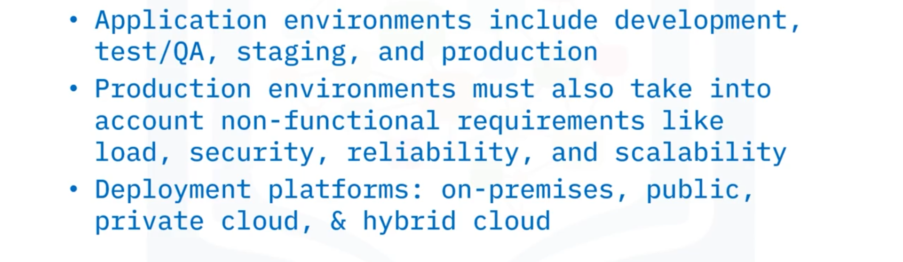
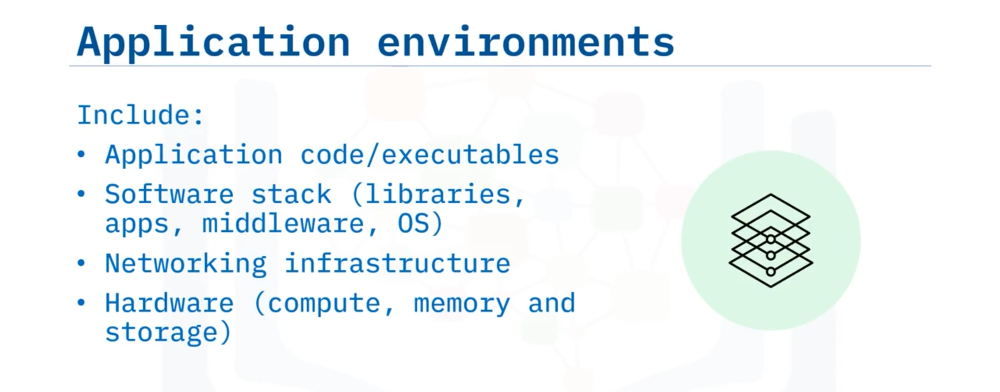
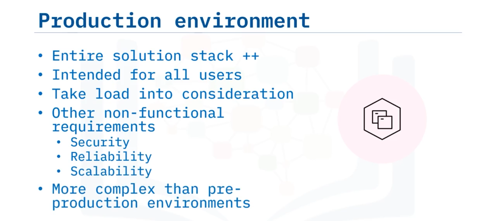
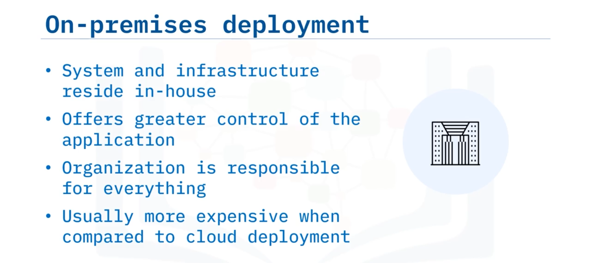

# 04-008 Application Deployment Environments

### Application Environment Overview

An **application environment** is the combination of hardware and software resources required to run an application, comprising:

-   Application code and/or binary executables for components or modules
-   Software stack (modules, libraries, dependencies)
-   Third-party applications and middleware
-   Operating system, networking components, and infrastructure
-   Physical or virtual hardware (computing, memory, storage resources)

---

### Pre-Production Environments

**Pre-production environments** are platforms on which applications reside in various forms as they prepare for production release.  

Common pre-production environments include:

-   **Development Environment:** The platform where application code is actively developed, often the developer's workstation. Developers build and test code locally or in a shared development server.

-   **QA Environment (Testing):** Allows the quality assurance team to test application components systematically, identifying bugs and validating functionality before production release.

-   **Staging Environment:** Replicates the production environment as closely as possible without serving general users. This environment enables final testing under production-like conditions, identifying environment-specific issues.

---

### Production Environment

The **production environment**, often called "production," includes the entire solution stack (hardware and software) on which the live application operates, serving all end-users. Unlike pre-production environments, production must account for:

-   **Application load:** High concurrent user volumes (thousands or millions for enterprise applications)

-   **Non-functional requirements:**
  -     Security
  -     Reliability
  -     Scalability
  -     Performance

Production environments are significantly more complex and robust than pre-production alternatives due to these additional considerations.

---

### Deployment Options

#### On-Premises Deployment

The system and infrastructure reside in-house within the organisation's physical location, typically behind a **firewall** (which prevents unauthorised access to or from private networks).

**Characteristics:**
-   Organisation retains full control and ownership
-   Organisation responsible for system, hardware, infrastructure, and maintenance
-   Greater security and control possible
-   Typically higher cost than cloud deployment

---

#### Cloud Deployment Models

#### **Public Cloud**
Leverages cloud infrastructure over the open internet on hardware owned by cloud providers. Hardware and services are shared with other companies, offering maximum scalability and cost-effectiveness.

*    **Public cloud providers:**  
    Amazon Web Services (AWS), Microsoft Azure, Google Cloud Platform, IBM Cloud,...

#### **Private Cloud** 
Cloud infrastructure provisioned for exclusive use by a single organisation. Infrastructure may be on-premises or owned, managed, and operated by a service provider (e.g., AWS private cloud).

**Advantages:** Increased security, full customisation flexibility.

#### **Hybrid Cloud**
A seamless combination of public and private cloud infrastructures, optimising advantages of both models regarding cost, security, scalability, and flexibility.

---

## Lesson Speech

Welcome to Application Deployment Environments. After this guide you will also be able to: **List different types of pre-production environments and state their purpose**; **Differentiate a production environment from other application environments**; and **compare and contrast deployment options**.

**An application environment is the combination of the hardware and software resources required to run an application.** This includes: **the application code and/or binary executables for its various components or modules**; **the software stack it requires for running the application** such as modules and libraries it depends on, third-party applications and middleware; and **the operating system, any networking components and infrastructure, as well as any physical or virtual hardware** including computing or processing resources, memory, and storage.

**There are a variety of environment types depending on the application's stage in the lifecycle.** **The pre-production environments are those platforms that the application resides on in various forms as it gets prepared for production.** **Common pre-production environments are "development," "QA," which stands for quality assurance, and "staging."** **The development environment is the platform on which the application is being actively coded**, and in many cases it may just be the developer's workstation. **The QA environment, sometimes called "testing," is the environment that allows the QA team to test the application's components.** **The staging environment is the environment that is as close to replicating the production environment as possible** but is not meant for general users.

Now, let's discuss the production environment. **The production environment, often just called "production," includes the entire solution stack consisting of both hardware and software on which the application runs as additional infrastructure components.** **The production environment is intended for all users.** Unlike the pre-production environments, **this robust environment must take the application "load" into consideration** because it is the environment intended for general use, possibly by thousands or millions of people at the same time for enterprise-level applications. **Production environments must also take into account non-functional requirements like security, reliability, and scalability.** **This makes the production environment more complicated than the pre-production ones.**

Now, let's take a look at the production environment infrastructure. **There are several options for deploying application environments.** **In on-premises deployment, the system and its infrastructure reside in-house, within the organisation's physical location, often behind a firewall.** **Firewalls prevent unauthorised access to or from a private network.** If an organisation desires greater security or control of an application and the data in use by that application, it may deploy the application on-premises. **For on-premises software deployments, an organisation is responsible for the system, hardware, related infrastructure, and maintenance required to run the application.** **On-premises deployment is usually more expensive when compared to cloud deployment.**

Let's discuss cloud deployments next. **There are three types of cloud deployment models—public, private, and hybrid.** **The public cloud is when you leverage the software's supporting infrastructure over the open internet on hardware owned by the cloud provider.** **That hardware and the associated services are shared with other companies.** **Public cloud providers include Amazon Web Services (AWS), Microsoft Azure, Google Cloud Platform, and IBM Cloud.** **The public cloud is the most common due to its scalability and cost.**

**With a private cloud, the cloud infrastructure is provisioned for exclusive use by a single organisation.** **The software system can be run on-premises, or the infrastructure could be owned, managed, and operated by a service provider.** For example, AWS is also a private cloud service provider. **The main advantage of a private cloud is increased security**, but it also allows for more flexibility because it can be fully customised. **Now a mix of both public and private clouds, working together seamlessly, is called a hybrid cloud model.** **A hybrid cloud potentially optimises the advantages of both public and private cloud models with regard to cost, security, scalability, and flexibility.**

In this guide you learned that: **Application environments include: development, testing or QA, staging, and production.** **Production environments must also take into account non-functional requirements like load, security, reliability, and scalability.** And **application environments can be deployed either on-premises on traditional hardware, or on public, private, or hybrid cloud platforms**.
