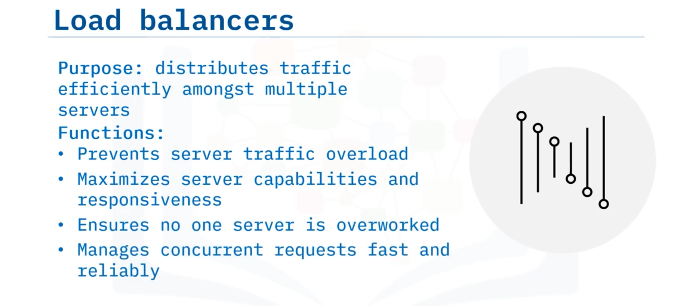

# 04-009 Production Deployment Components

### Production Environment Architecture

A typical n-tier architecture for production deployment comprises multiple tiers, with all tiers except the presentation tier located behind a firewall:

1.  **Presentation tier:** Front-end client applications
2.  **Web tier:** Web load balancer distributing traffic to multiple web servers
3.  **Application server tier:** App load balancer or proxy server routing traffic to application servers
4.  **Data tier:** Database server with high availability replicas for reliability

**Note:** Not all components are necessary for every deployment; architecture varies based on requirements.

### Firewall

A **firewall** is a security device that monitors traffic between networks, permitting or blocking requested data based on security rules. It acts as a barrier preventing viruses, malware, and hackers from accessing the internal network.

### Load Balancer

A **load balancer** distributes network traffic efficiently amongst multiple servers (a **server farm**) on a network. Located between clients and servers, load balancers:

- Prevent server traffic overload
- Determine which servers best fulfil requirements, maximising availability and responsiveness
- Ensure no single server is overworked
- Manage concurrent client requests, returning data quickly and reliably

#### Servers

### Web Server

A **web server** is software or hardware that delivers content (web pages, files, images, videos) to clients.   

Web servers primarily respond to **HTTP (HyperText Transfer Protocol)** requests from web browsers, serving website content to users.

### Application Server

An **application server** runs **business logic** and provides the application to clients rather than clients running the application locally.   

Its primary function is enabling interaction between end-users and server-side application code. Business logic determines data creation, storage, and modification, dictating transaction results and database operations.

### Proxy Server

A **proxy server** is an intermediate server positioned between two tiers, handling requests between them. Proxy servers serve multiple purposes including:

- Load balancing
- System optimisation
- Caching
- Firewall functionality
- Request source obscuring
- Encryption
- Malware scanning

Proxy servers improve efficiency, privacy, and security of data flowing through networks.

### Database Server

A **database** is a collection of related data stored on a computer, accessible through various methods and typically controlled by **database management system (DBMS)** software.  

The DBMS connects the database to users or other programs, controlling database access. The **database server** controls data flow and storage, connecting the DBMS to applications so data can be retrieved or manipulated by application code.

---

## Lesson Speech

Welcome to production deployment components. After this guide you will be able to: **Describe components commonly required for deployment in a production environment**; **Describe the purpose of a firewall and a load balancer**; and **differentiate between different types of servers**.

Let's consider an **n-tier architecture required to deploy an application in a production environment** and represent the infrastructure using a diagram. **The top tier is the presentation tier which contains the front-end client applications.** **All of the other tiers are located behind a firewall.** Firewalls and other components mentioned in this diagram will be discussed in further detail later in the guide. **The next tier is the web tier which has a web load balancer that distributes incoming traffic to several web servers.** **The tier below the web tier is the application server tier.** **This tier contains an app load balancer or a proxy server that routes traffic to different application servers.** **The bottom tier is the data tier that contains the database server.** **A high availability replica of the database is often used to ensure reliability.**

Some environments may have additional components or tiers. Also, **not all of these components are necessary for every deployment.** For example, in some environments there might not be a need for both application servers in addition to web servers. Now, let's look at these components in further detail. **A firewall is a security device that monitors traffic between networks.** **It permits or blocks requested data based on a set of security rules.** **It acts as a barrier between networks to block viruses, malware, and hackers from accessing the internal network.**

**The purpose of load balancers is to distribute network traffic efficiently amongst multiple servers, called a server farm, on a network.** **Load balancers are used to prevent server traffic overload** and are located between clients and the servers. **A load balancer determines which servers are capable of fulfilling those requirements in a manner that maximises availability and responsiveness.** **Load balancers ensure that no one server is overworked.** **They manage concurrent requests from clients and return the correct data in a fast and reliable manner.**

**Web and application servers are either software or machines that provides services, resources, data, or applications to another computer programme, called the client.** **Servers store, process, and manage network data, devices, and systems.** **A web server delivers content such as web pages, files, images, and guides to a client.** And **a web server primarily responds to hypertext transfer protocol requests coming from a web browser** such as a user accessing a website. **An app server is a server that runs business logic and provides the application to the client** rather than the client running the app on their own machine. **Its primary job is to enable interaction between the end-user and the server-side application code.** **The application code represents the business logic that determines how data can be created, stored, and changed.** And **that logic dictates things like transaction results and what data is written to and retrieved from a database.**

Next, **a proxy server is an intermediate server that sits in between two tiers and handles requests between those tiers.** **A proxy server can serve multiple purposes such as load balancing, system optimisation, caching, acting as a firewall, obscuring the source of the request, encryption, scanning for malware, and more.** And **a proxy server can improve the efficiency, privacy, and security of data flowing through a network.**

Finally, **a database is a collection of related data, stored on a computer that can be accessed in various ways.** **A database is usually controlled by software called a database management system or DBMS.** **The DBMS controls a database by connecting the database to users or other programmes.** **The database server controls the flow and storage of data.** **The DBMS connects the database server to an application so data stored in the database can be retrieved or manipulated by the application.**

In this guide you learned that: **Common components needed for a production environment include a firewall, a load balancer, web and application servers, proxy servers, and database servers.** **A firewall is a security device that monitors traffic between networks.** **A load balancer distributes network traffic amongst servers.** **A web server delivers content such as web pages, files, images, and guides to a client.** **An application server runs business logic and provides the application to the client** rather than the client running the app on their own machine. And **finally, a database server stores and controls the flow of data through a database management system**.
