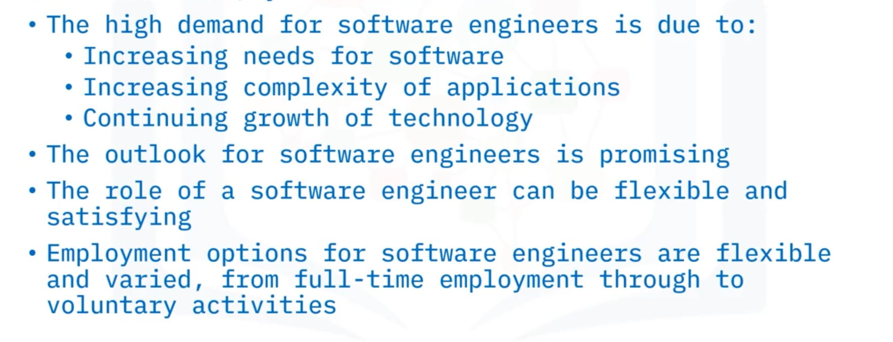
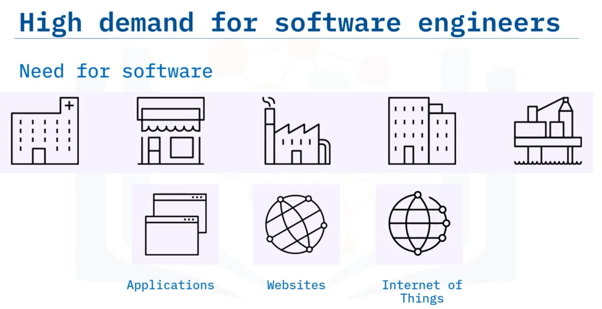
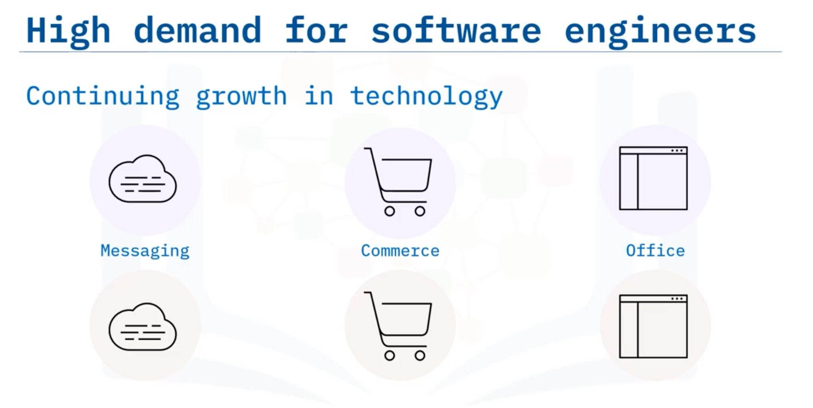

# 05-006 Job Outlook for Software Engineers

### Drivers of High Demand for Software Engineers

**Industry adoption:** Almost all industries require software to compete and grow, creating continuous demand. Most organisations require applications and websites for internal operations and customer interaction.

**Internet of Things:** Expanding need for software interacting with physical products, with sustained growth expected long-term.

**Competitive pressure:** Vendors continuously release new versions and enhanced functionality, requiring software engineers for development, enhancement, and new capabilities across platforms.

---

### Job Outlook and Statistics

The US Bureau of Labor Statistics projects **22% job growth** for software developers, analysts, and testers from 2020 to 2030—**higher than average growth**.   

This represents approximately **200,000 job openings annually in the United States alone**, spanning diverse industries including mobile development, healthcare, and insurance.

**Security software** represents a particularly large growth area due to increasing cybersecurity threats and computer crime.

---

### Hiring Trends and Accessibility

Historically, software engineers held degrees in software engineering or computer science. However, major employers (IBM, Google, Tesla) increasingly hire non-graduates demonstrating required skills, widening industry access and reducing educational cost barriers.

---

### Compensation

Software engineer salaries vary significantly with experience:

- **Junior roles:** $90,000 USD
- **Experienced roles:** $120,000+ USD
- **Average:** ~$110,000 USD annually (2.5× average US base salary)

**Additional benefits** include medical insurance, gym membership, profit shares, and retirement plans, making software engineering financially attractive.

---

### Role Expectations and Working Conditions

**Dress codes:** Typically informal unless customer-facing.

**Hours:** Flexible, often around core midday hours. Increased hours near product release deadlines, frequently without matching pay increases.

**Location:** Work-from-home flexibility varies by employer but technology enables remote work. Some global teams operate across all time-zones.

---

### Employment Contexts

Employers span all sectors:

-   **Large technology companies:** FAANG (Facebook, Amazon, Apple, Netflix, Google)
-   **Medium software companies:** Specialised software development
-   **Small software houses and start-ups**
-   **Large non-technology companies:** Banks, retailers, pharmaceuticals requiring internal/external systems

---

### Professional Development

Most employers encourage continuous learning—expanding technical or soft skills. Organisations typically invest in keeping engineer skills current to enable optimal software solutions.

---

### Employment Options

**Employed roles:** Apprenticeships, internships, part-time, full-time positions providing stability and regular income.

**Independent contracting:** Extensive market for contract/consultancy services on time-based or project-based models.

**Freelance work:** Short-term contracts on projects of interest.

**Open source contribution:** Volunteer coding on open-source projects, providing experience, skill enhancement, employment opportunities, and technical reputation whilst contributing to important causes or communities.

---

## Lesson Speech

Welcome to Job Outlook for Software Engineers. After this guide, you will be able to **explain why demand is high for software engineers, describe the job outlook for a software engineer, describe what to expect from a software engineering role and describe the employment options in software engineering**.

**There are various reasons behind the current high demand for software engineers.** **Almost all industries need software to compete and grow.** **This results in a continuous demand for software engineers.** **Most organisations require applications and websites for their company to function.** **Some apps and websites are for internal use, while others are used to interact with customers.**

**The Internet of Things is also driving the need for software** that interacts with products. **This is a need that will continue to expand for the foreseeable future.** **All types of software programmes, from messaging applications to commerce websites to office software, are available in different flavours from different vendors.** **Whenever one vendor releases a new version of their particular programme, a competing company is likely to also update their programme**, requiring **more software engineers to create the new releases, enhance functionality, and add new capabilities.**

**So, the outlook is bright for software engineers.** **The US Bureau of Labor Statistics predicts a higher than average 22% job growth rate for software developers, analysts, and testers from 2020 to 2030.** **That's an average of almost 200,000 openings each year—in the United States alone!**

**These roles are likely to be across many industries, from mobile application development to health and insurance.** **There is also predicted to be a large increase in security software** due to the **increase in computer security threats and cyber-crime.** **Many software engineers are graduates with degrees in software engineering or computer science.** However, **increasingly employers like IBM, Google, and Tesla are starting to hire non-graduates who demonstrate the required skills for the role.** **This opens software engineering up to a wider range of society** ensuring that **the cost of obtaining a degree doesn't preclude candidates from the industry.**

**Salaries for software engineers vary significantly with years of experience in the field.** **As you acquire more experience and become harder to replace, employers typically provide higher compensation.** **In the USA, salaries range from $90,000 for a junior role through to $120,000 or higher for an experienced position.** **The average of $110,000 per annum for a software engineer is more than 2.5 times the average base salary across the USA.** **This, alongside bonuses and benefits such as medical insurance, gym membership, profit shares, and retirement plans make a software engineering role an attractive proposition.**

**So, what should you expect from a software engineering role?** **Dress codes are unlikely to be formal unless you're in a customer facing situation.** **Hours are often flexible, sometimes around core hours set in the middle of the day.** **You may occasionally be required to attend meetings or calls** which can dictate a physical or online presence at a particular time of the day.

**The number of hours are likely to increase as you get near to product release dates, often without any matching increase in pay.** **The flexibility to work from home varies across employers, but there is no technological reasons why this cannot be done.** **In fact, some software teams are spread across the globe, working across all hours of the day.**

**Software engineer employers include almost any type of business that you can imagine.** **From large technology companies such as Facebook, Amazon, Apple, Netflix, and Google (also known as FAANG), to medium-sized software companies that develop specific software and solutions, to small software houses and start-ups.** And **almost all large non-technology companies like banks, retailers, and pharmaceuticals need software engineers** for their own internal or external systems. **And lastly, most employers will encourage continual learning**, whether that be **expanding your technical skills or enhancing your soft skills.** **They're usually keen to invest in keeping your skills up to date** so that **you can develop the best software solutions for them.**

**Now in the software engineering world, regardless of your job title, there are different employment options to suit your lifestyle and situation.** **Employed roles in a company or organisation provide stability and a regular income.** **These can range from an apprenticeship or internship, to a part-time role, through to a full-time role.** **In software engineering, more so than a typical job, there is a huge independent contracting market and opportunities in the gig economy.** **These can range from simple website development to super-specialised skills, languages, stacks, and products.** **In this type of employment, you can provide contract or consultancy services to organisations on a time-based or project-based model** or **you can work on a freelance basis taking on short-term contracts to work on projects that interest you.**

And **many software engineers also code for free as volunteers contributing to open source projects.** **This can help you gain experience, enhance your skills, improve your employment opportunities, and enhance your technical eminence.** **It also makes you feel good by doing something for a cause or community or social initiative that's important to you.**

In this guide, you learned that: **the high demand for software engineers is due to increasing needs for software, increasing complexity of applications, and a continuing growth of technology**; **the outlook for software engineers is promising**; **the role of a software engineer can be flexible and satisfying**; and **employment options for software engineers are flexible and varied, from full-time employment through to voluntary activities**.
