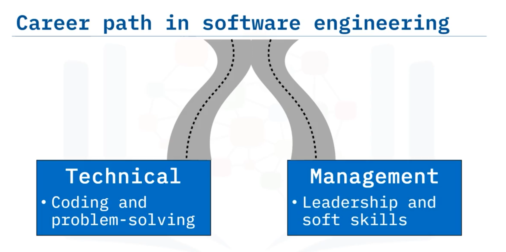
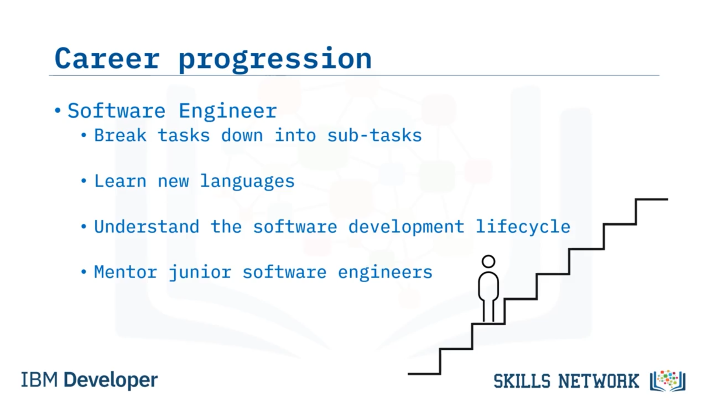
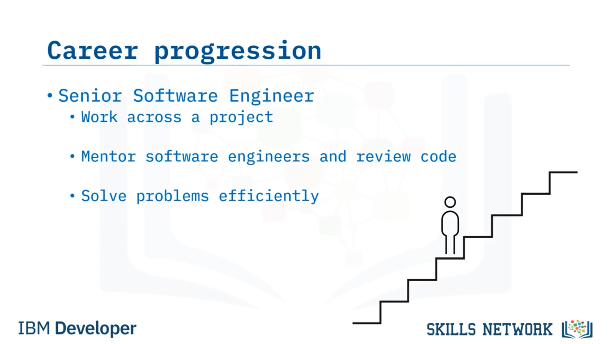
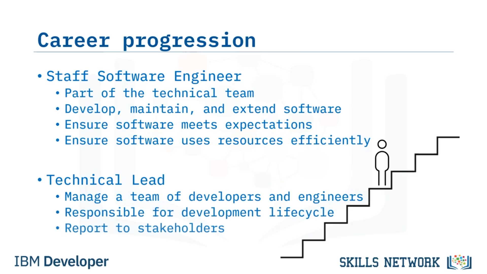
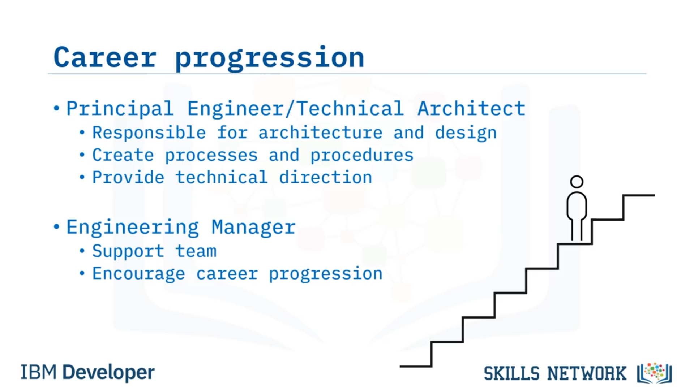
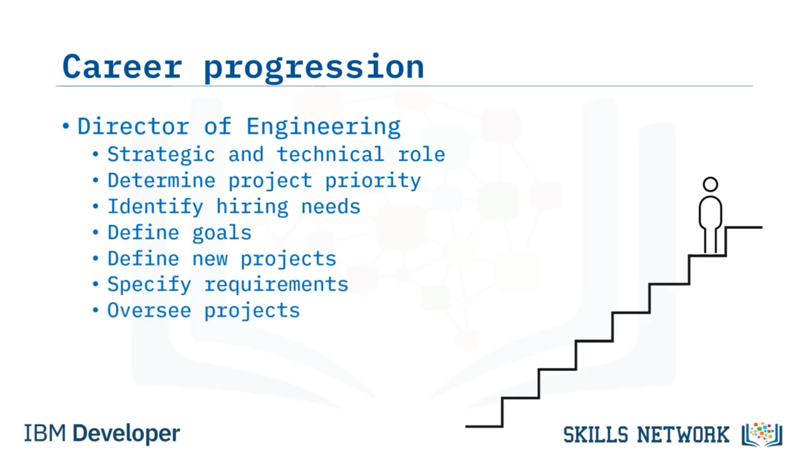

# 05-007 Career Paths in Software Engineering

### Career Path Overview

Software engineering careers typically progress in one of two directions as experience and skills develop:

1. **Technical path:** Continued focus on coding, problem-solving, and technology mastery
2. **Management path:** Leadership development and team oversight

Career progression involves increasing responsibility, broader project scope, and expanded skill sets across roles.

***

### Entry Level: Junior/Associate Software Engineer

**Responsibilities:** Developing small software chunks meeting agreed specifications.

**Support:** Assignment of team leader or mentor providing guidance and support.

**Learning:** Steep learning curve gaining skills and experience with each code implementation.

**Characteristics:** Foundation-building phase establishing core competencies.

***

### Mid-Level: Software Engineer

**Responsibilities:** Greater independence; breaking larger tasks into achievable sub-tasks; learning new programming languages; demonstrating software development lifecycle understanding.

**Additional duties:** Potentially mentoring junior engineers; taking responsibility for larger project sections.

**Growth:** Transition from task execution to problem decomposition and strategic thinking.

***

### Senior Level: Senior Software Engineer

**Responsibilities:** Project-wide involvement and entire codebase understanding; mentoring software engineers; conducting code reviews; efficient problem-solving across diverse technical challenges.

**Scope:** Broader technical authority and knowledge-sharing responsibilities.

***

### Technical Career Continuation

**Staff Software Engineer:** Development, maintenance, and extension of software; ensuring customer/user satisfaction; efficient resource utilisation; team collaboration within technical structure.

**Principal Engineer/Technical Architect:** Architecture and design responsibility; solution development; process and procedure creation; technical direction provision.

### Management Career Path

**Technical Lead:** Team management of developers and engineers; potential entire development lifecycle responsibility; stakeholder reporting.

**Engineering Manager:** Team support and encouragement; career progression facilitation; team capability development.

**Director of Engineering:** Strategic and technical dual role:

* **Strategic:** Project prioritisation; hiring needs identification; long-term goal definition
* **Technical:** Project definition; requirement specification; project oversight

**Chief Technology Officer (CTO):**\

Organisational technology arm leadership; research and development oversight; systems and infrastructure monitoring; budget alignment; technology evaluation for competitive advantage.

***

### Alternative Career Transitions

Software engineering provides foundation skills enabling transitions into various roles:

* **Technical sales/customer support:** For engineers preferring client interaction
* **Data engineer/data scientist:** For those combining coding with numerical and data analysis interests
* **Database administrator/developer:** For those specialising in data management
* **Software tester:** For engineers focused on bug identification and fixing
* **Other technical/leadership roles:** Leveraging transferable skills across IT field

### Career Characteristics

* Continuous learning required as technology evolves
* Increasing responsibility with each progression level
* Flexibility in role transitions throughout career
* Software engineering foundation enabling diverse career opportunities
* Varied organisational job titles with similar role functions

***

## Lesson Speech

Welcome to Career Paths in Software Engineering. After this guide, you will be able to **describe typical career paths for a software engineer, and identify the likely roles within career paths**.

**A career path in software engineering opens up as you gain experience and attain new skills.** **Often it heads in one of two directions: technical or management.** **If you thrive on working with code and solving problems, then the technical path enables you to continue working closely with technology as your career progresses.** Or, **if you exhibit strong leadership qualities alongside the soft skills of a good software engineer, you might progress onto managing a team of software engineers and the work that they do.**

So, let's take a look at a common career path for a software engineer progressing on the technical or managerial path. **Remember that different organisations will use different job titles, but the roles will be similar across the board.** **You're likely to start out in an entry-level position as a Junior Software Engineer or Associate Software Engineer.** **At this level you'll be developing small chunks of software to meet agreed client specifications.** **You'll be assigned a team leader or mentor who will guide you along the way and provide support when you need it.** **During this phase of your career, you'll be on a steep learning curve, gaining new skills and experience with every block of code that you write.**

**You could then move on to a Software Engineer position.** **In this role you'll be expected to be more independent and able to break larger tasks down into smaller achievable sub-tasks.** **You may be learning new programming languages and demonstrating an understanding of the software development lifecycle.** **At this stage, you might be asked to mentor a junior software engineer or take responsibility for a larger part of a project.**

**The next stage of your career could be a Senior Software Engineer position.** **In this role you're likely to have involvement across the whole of a project and with an entire codebase.** **You may be asked to mentor software engineers and to conduct code reviews across the team.** And **from the experience you've gained in earlier roles, you'll be expected to be able to solve a wide range of problems in an efficient way.**

**If you choose to follow the technical path, then your next role might be as a Staff Software Engineer.** **In this role you'll work as part of the technical team developing, maintaining, and extending software.** **You'll be responsible for ensuring that the software meets customer and user expectations and that it uses resources efficiently.**

**If you decide to follow a managerial career path, you could become a Technical Lead.** **In this role you'll manage the team of developers and engineers developing the software in your organisation.** **You could be responsible for the entire development lifecycle and report to the project stakeholders.**

**Continuing along the technical path, you might progress to be a Principal Engineer or Technical Architect.** **At this stage you'll be responsible for the architecture and design of a software solution, as well as the development of it.** **You'll be expected to create processes and procedures for your team and provide technical direction.**

**On the managerial path, you could become an Engineering Manager.** **In this role, you'll ensure that the entire team is appropriately supported and encouraged to progress in their careers.** **Becoming a Director of Engineering could be the next stage in the progression of your career.** **It is a strategic and technical role.** **On the strategic side, you'll determine priorities for the projects within the company, identify hiring needs, and define long term goals.** **On the technical side of the role, you'll be involved in defining new projects, specifying requirements, and overseeing the project.**

**The lead of an organisation's technology arm is likely to be the Chief Technology Officer (or CTO).** **In this role, you oversee all of the research and development in the company.** **You'll also monitor the company's systems and infrastructure to ensure that it meets your needs and budget.** **Even at this level, you'll continue learning.** **As technology evolves and new products appear on the market, you'll be responsible for deciding which ones meet your business needs and could give your organisation a competitive advantage.**

**Of course, not everyone who starts out as a Junior Software Engineer follows these traditional software engineering paths**, but **you'll find that the skills you gain will benefit you in a wide variety of other roles.** **If after working on client projects for a while you decide that you prefer interacting with the clients to writing the code, you could transition into a technical sales or customer support role.**

**If you enjoy coding, but find working with numbers and data is more appealing, you could transition into a data engineer or data scientist role.** And, **if you find the data side of your new role is your passion, you could move on to become a database administrator or database developer.** **And if you enjoy finding and fixing bugs, you might transition to a software tester role.**

**IT is a vast field with an abundance of opportunities across many skill sets**, so **starting your career in software engineering is a great choice even if you use it as a stepping stone to move to other technical or leadership roles in the future.**

In this guide, you learned that: **A career in software engineering is likely to follow a technical or managerial path.** **At each stage on that path, you will take on more responsibility and a wider range of tasks.** And, **starting out as a software engineer enables you to take an array of other options at any stage in your career**.
