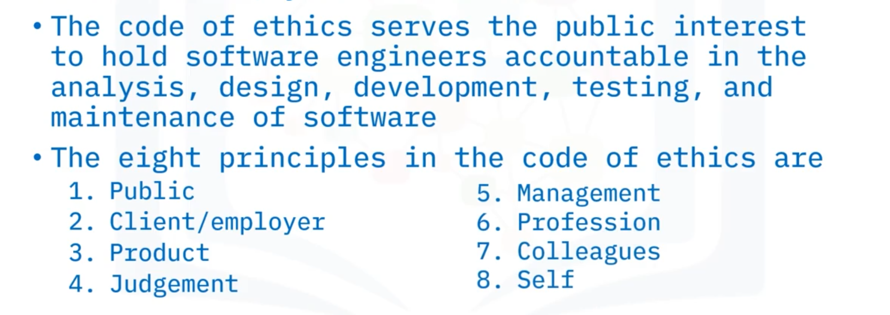
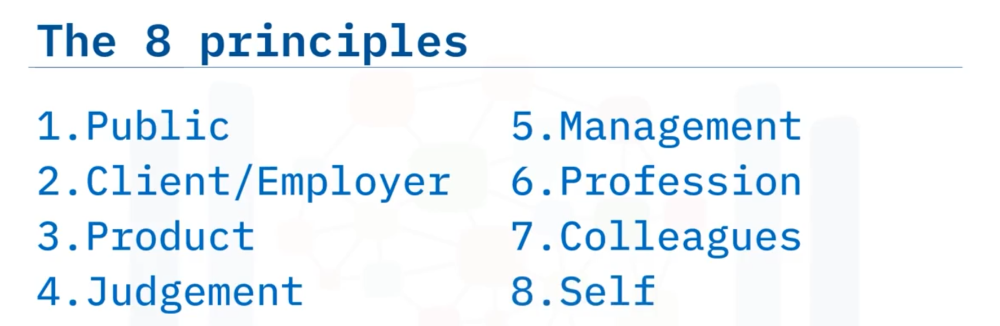
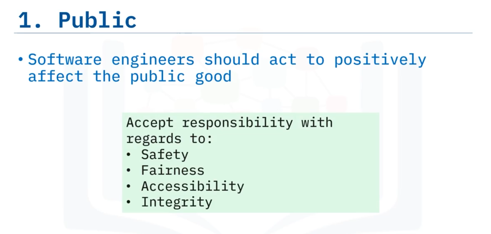
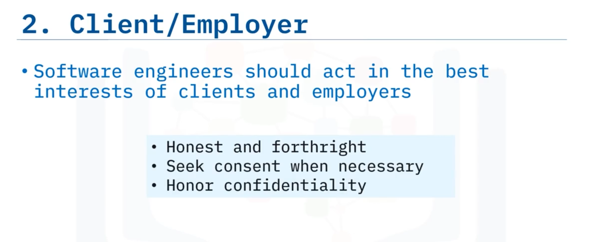
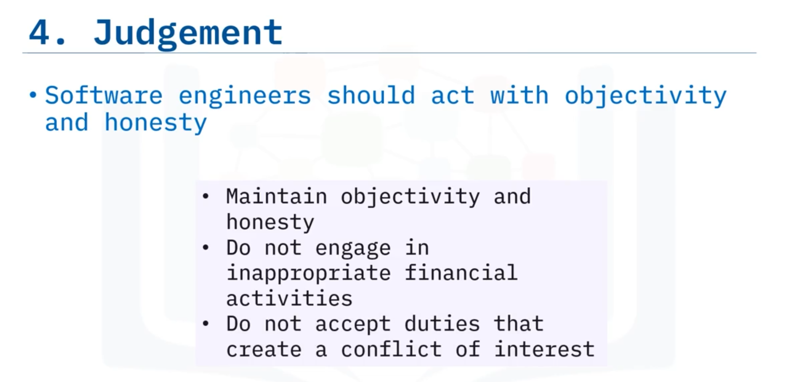
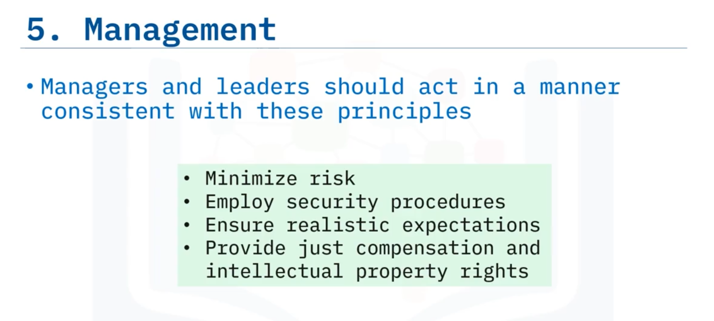
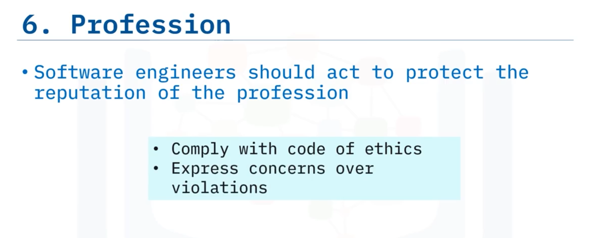
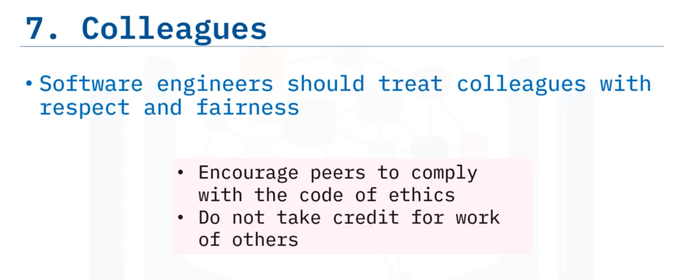
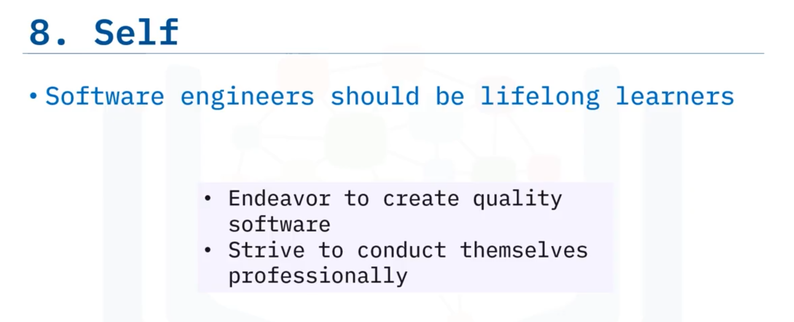
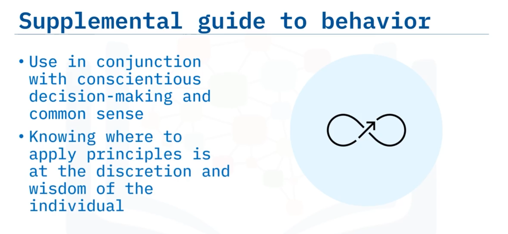

# 05-009     Software Engineering Code of Ethics

---

The **Joint Task Force on Software Engineering Ethics and Professional Practices** developed a Code of Ethics outlining goals and standards for software engineers.  

The task force, formed by the **Institute of Electrical and Electronics Engineers Computer Society (IEEE-CS)** and the **Association for Computing Machinery (ACM)**, recognised computing's prominence in global commerce, government, and society.

The Code of Ethics holds software engineers accountable, maintaining the profession's status as beneficial and respected.   

Eight principles pertain to software specification, analysis, design, development, testing, and maintenance, dedicated to serving public interest.

**Intended audience:** Engineers, mentors, instructors, managers, students, and policymakers.

---

### Eight Core Principles

---

#### 1. Public

Listed first, reflecting prioritisation of public interest above all other considerations.

**Primary focus:** Positively affecting public good.

**Responsibilities:**   Accepting responsibility for work regarding safety, fairness, accessibility, and integrity.

---

#### 2. Client or Employer

**Responsibilities:**   Acting in clients' and employers' best interests; honesty regarding unethical actions (plagiarism, illegal activities); seeking consent where necessary; honouring confidentiality.

---

#### 3. Product

**Focused on:**     Seeking quality whilst balancing cost and timelines in software under production.

---

#### 4. Judgement

**Responsibilities:**   Acting with integrity and independence; maintaining **objectivity and honesty** in software and documentation work; avoiding inappropriate financial activities (bribery, double billing); declining duties creating conflicts of interest.

---

#### 5. Management

**Scope:**  Management behaviour consistent with all principles.

**Management Responsibilities:**    Minimising risk; employing security procedures; ensuring realistic staff expectations; providing fair compensation; procuring intellectual property rights appropriately.

---

#### 6. Profession

**Focused on:**     Protecting profession reputation through integrity.

**Responsibilities:**   Acting with integrity; not elevating oneself at others' expense; notifying managers, employers, and clients of intention to comply with code; expressing concern over code violations.

---

#### 7. Colleagues

**Focused on:**     Treating peers with respect and fairness.

**Responsibilities:**   Encouraging colleague compliance with code; not claiming credit for others' work; collaborative professional conduct.

---

#### 8. Self

**Fosuced on:**     Professional development and personal responsibility.

**Responsibilities:**   Pursuing lifelong learning and professional development; endeavouring to create quality software; conducting oneself professionally and with integrity.

---

### Application and Limitations

The Code of Ethics supplements but does not replace conscientious decision-making and common sense.   

Application requires individual discretion and wisdom; engineers must determine when and where principles apply to specific situations.

---

## Lesson Speech

Welcome to Software Engineering Code of Ethics. After this guide, you will be able to: **State each of the eight principles in the Software Engineering Code of Ethics.** And, **explain each of the eight principles in the Software Engineering Code of Ethics**.

**The Joint Task Force on Software Engineering Ethics and Professional Practices developed a Code of Ethics** outlining their goals and standards for software engineers engaged in the design and creation of software. **The task force was formed by the Institute of Electrical and Electronics Engineers Computer Society or IEEE-CS and the Association for Computing Machinery or ACM** in order to **recognise the prominence of computing in global commerce, government, and society.** **This IEEE-CS ACM joint task force championed the need to hold software engineers accountable** so that **the present and future status of the field as a beneficial and respected profession is maintained.**

**The Code of Ethics consists of eight principles that pertain to the specification analysis, design, development, testing, and maintenance of software, and are dedicated to serving the public interest.** **These principles are intended for anyone who is in or related to the profession, and includes engineers, mentors, instructors, managers, students, and policymakers.**

Here, we will summarise each principle. However, the full text of each principle and its additional clarifying clauses can be found on the IEEE-CS and ACM websites. **The principles in the software engineering code of ethics focus on the following topics: Public, Client or employer, Product, Judgement, Management, Profession, Colleagues, Self.**

**The public principle comes first because it is expected that software engineers should act primarily in accordance to positively affect the public good.** **This includes accepting responsibility for their work with regard to safety, fairness, accessibility, and integrity.**

**Next, software engineers should act in the best interests of both the clients and their employers.** **They should act honestly and be forthright when it comes to unethical actions such as plagiarism or illegal activities.** **They should seek consent where necessary and appropriate and honour confidentiality.**

**The third principle relates to the product under production.** **Software engineers should seek quality while keeping in mind cost and timelines.**

**This next principle outlines how software engineers act with integrity and independence in their professional judgement.** **They are expected to maintain objectivity and honesty when working with the software and relevant documents they are involved with.** **Software engineers should not engage in any inappropriate financial activities such as bribery and double billing, nor may they accept duties that create a conflict of interest.**

**Software engineering managers and leaders should also behave in a manner consistent with these principles where it applies to them and those they manage.** **They should work to minimise risk and employ security procedures.** **Managers and leaders should also work to ensure realistic expectations of their staff, provide just compensation, and procure intellectual property rights whenever appropriate.**

**The profession is principle describes the duty of software engineers to protect the reputation of the profession by acting with integrity and not elevating themselves at the expense of others.** **Software engineers should let managers, employers, and clients know they intend to act in compliance with this code of ethics and express concern over violations of the code.**

**Similar to the profession principle, software engineers shall treat their colleagues with respect and fairness.** **They should encourage their peers to comply with this code of ethics and not take credit for the work of others.**

**The final principle, focused on the software engineer themselves reminds software engineers about the importance of lifelong learning and professional development.** **They should endeavour to create quality software and strive to conduct themselves in a professional manner.**

**It should be noted that this code of ethics is not a replacement for conscientious decision-making and common sense, but it can be used as a supplemental guide.** **Knowing when and where to apply these principles will always be up to the discretion and wisdom of the individual.**

In this guide, you learned that: **The code of ethics serves the public interest to hold software engineers accountable in the analysis, design, development, testing, and maintenance of software.** **The eight principles in the code of ethics are Public, Client or employer, Product, Judgement, Management, Profession, Colleagues and Self.**
