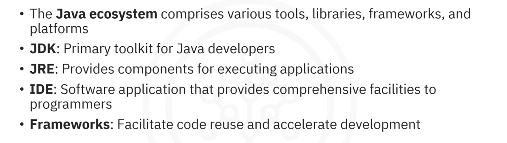
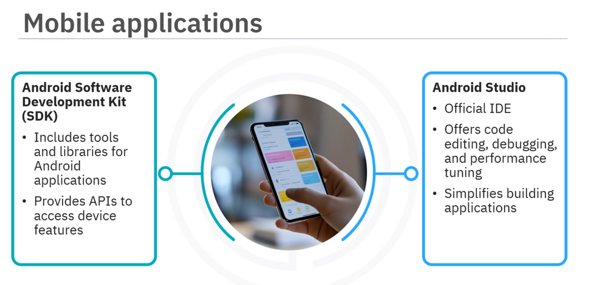

# 01-006 The Java Ecosystem

 

***

**Java** is a prominent programming language, pivotal in software development. Created by Sun Microsystems in 1995 and now owned by Oracle Corporation, the **Java ecosystem** comprises various tools, libraries, frameworks, and platforms enabling developers to create robust, scalable, and secure applications.

***

### Core Components

***

#### Java Development Kit (JDK)

.png>)

The **primary toolkit for Java developers**, comprising three key elements:

**Java Compiler (javac)**

Converts Java source code into platform-independent bytecode.

**Java Runtime Environment (JRE)**

Encompasses the JVM and core libraries, required for running Java applications.

**Utilities**

Command-line tools assisting in the development process.

***

#### Java Runtime Environment (JRE)

.png>)

Provides necessary components for executing Java applications:

**Java Virtual Machine (JVM)**

Executes bytecode, ensuring platform independence.

**Core libraries**

Essential APIs for input-output, networking, and concurrency functionalities.

***

### Integrated Development Environments (IDEs)

.png>)

**IDEs** are software applications providing comprehensive facilities for software development. Popular Java IDEs include:

| IDE               | Characteristics                                               |
| ----------------- | ------------------------------------------------------------- |
| **Eclipse**       | Open-source; known for powerful plugins                       |
| **IntelliJ IDEA** | Offers smart code completion and advanced features            |
| **NetBeans**      | Open-source; beginner-friendly with straightforward interface |

#### **Common IDE features**

.png>)

* Code editor
* Debugger
* Build automation tools
* Project management capabilities

***

### Frameworks

Frameworks facilitate code reuse and accelerate development:

#### **Spring Framewor**

.png>)

Comprehensive enterprise application framework featuring:

* **Dependency Injection (DI):** Promotes loosely coupled code
* **Aspect-Oriented Programming (AOP):** Separates cross-cutting concerns from business logic
* **Spring Boot:** Simplifies Spring application setup with embedded servers and pre-configured settings
* **Spring MVC:** Streamlines web application development through structured architecture

#### **Hibernate**

.png>)

Object-Relational Mapping (ORM) framework simplifying data handling by automating Java object-to-database table mapping.

***

### Build Tools

.png>)

Automate compiling code, managing dependencies, and packaging applications:

| Tool       | Characteristics                                                                           |
| ---------- | ----------------------------------------------------------------------------------------- |
| **Maven**  | Simplifies project management with dependency management and standardised build lifecycle |
| **Gradle** | Known for incremental builds and multi-project support using Groovy or Kotlin scripts     |

***

### Application Servers

.png>)

Provide environments for deploying and managing Java applications:

| Server            | Purpose                                                                         |
| ----------------- | ------------------------------------------------------------------------------- |
| **Apache Tomcat** | Open-source servlet container; ideal for small-to-medium-sized web applications |
| **JBoss**         | Supports full Java EE stack; suitable for large-scale enterprise applications   |

***

### Testing Frameworks

.png>)

Ensure application functionality through robust testing tools:

| Framework  | Features                                                                      |
| ---------- | ----------------------------------------------------------------------------- |
| **JUnit**  | Creates repeatable tests using annotations and assertions validating outcomes |
| **TestNG** | Offers data-driven testing and parallel test execution                        |

***

### Cloud-Native and Microservices Development

.png>)

#### **Spring Cloud**

Provides tools for building cloud-native applications, including service discovery and configuration management.

***

### Desktop Application Development

.png>)

#### **JavaFX**

Builds rich desktop applications with modern user interfaces; supports graphical elements (buttons, tables, charts)

#### **Swing**

Older GUI toolkit; lightweight, customisable components enabling traditional cross-platform desktop applications

***

### Mobile Application Development

#### **Android**

Most widely used mobile operating system globally, heavily reliant on Java.

**Android SDK**

Tools and libraries for building Android applications; provides APIs accessing device features (cameras, GPS, sensors)

**Android Studio**

Official IDE for Android development; offers code editing, debugging, and performance tuning

**Kotlin vs Java**

Whilst Kotlin is the preferred language, Java remains significant; many Android libraries are Java-based

***

### Embedded Systems Development

**Specialised computing systems** performing dedicated functions within larger mechanical or electrical systems. Java increasingly used due to portability and ease of use.

#### **Java Microedition (ME)**

 Subset of Java platform for resource-constrained devices; provides APIs tailored for mobile and embedded environments.

#### **Embedded Java**

 Platforms specifically designed for embedded hardware; implementations like Oracle's Java Embedded enable applications on sensors, gateways, and embedded systems

***

### Community and Support

**Available support forms:**

* **Online forums** (Stack Overflow): Ask questions, receive answers from experienced developers
* **Official Oracle documentation:** Detailed information on all Java aspects
* **Local meetups and conferences:** Connect with developers, learn new skills

***

## Lesson Speech

Welcome to this video about the **Java ecosystem.** **After watching this video, you'll be able to describe the Java ecosystem and explain its components.**

**Java is a prominent programming language, pivotal in software development.** **It was created by Sun Microsystems in 1995 and is now owned by Oracle Corporation.** **The Java ecosystem comprises various tools, libraries, frameworks, and platforms that allow developers to create robust, scalable, and secure applications.**

### Core Components

**Let's begin by exploring the core components of the Java ecosystem.** **The Java Development Kit, or JDK, is the primary toolkit for Java developers.** **It consists of three key elements.** **The Java Compiler, or javac, converts Java source code into platform-independent bytecode.** **The Java Runtime Environment, or JRE, which encompasses the Java Virtual Machine, or JVM, and core libraries, is required for running Java applications.** **Utilities refer to command-line tools that assist in the development process.**

**The JRE provides the necessary components for executing Java applications.** **These applications include the JVM, which executes bytecode and ensures platform independence, and the core libraries, which are essential APIs for various functionalities such as input-output, networking, and concurrency.**

### Integrated Development Environments (IDEs)

**To make programming in Java easier, many developers use Integrated Development Environments, or IDEs.** **An IDE is a software application that provides comprehensive facilities to programmers for software development.** **Here are some popular IDEs for Java.** **Eclipse is an open-source IDE known for its powerful plugins.** **IntelliJ IDEA offers smart code completion and various other features.** **NetBeans is an open-source IDE that is easy to use for beginners with a straightforward interface.**

**IDEs typically include features such as code editor, debugger, build automation tools, and project management capabilities.**

### Frameworks

**Frameworks in the Java ecosystem facilitate code reuse and accelerate development.** **Let's look at the different types of frameworks.** **The Spring Framework is a comprehensive framework for enterprise applications featuring Dependency Injection, or DI, which promotes loosely coupled code.** **Aspect-Oriented Programming, or AOP, which separates cross-cutting concerns from business logic.** **Spring Boot, which simplifies Spring application setup with embedded servers and pre-configured settings.** **And Spring Model View Controller, or MVC, which streamlines web application development through a structured architecture.** **Hibernate is an object-relational mapping, or ORM, framework that simplifies data handling by automating the mapping of Java objects to database tables.**

### Build Tools

**Build tools automate compiling code, managing dependencies, and packaging applications.** **Maven simplifies project management with features such as dependency management and a standardised build lifecycle.** **Gradle is known for incremental builds and multi-project support using Groovy or Kotlin for build scripts.**

### Application Servers

**Application servers provide environments for deploying and managing Java applications.** **Apache Tomcat is an open-source, servlet container ideal for small-to-medium-sized web applications.** **JBoss supports the full Java EE stack, suitable for large-scale enterprise applications.**

### Testing Frameworks

**Testing frameworks ensures application functionality through robust testing tools.** **JUnit is used for creating repeatable tests using annotations and assertions to validate outcomes.** **TestNG offers additional features, such as data-driven testing and parallel test execution.**

### Cloud-Native and Microservices Development

**The Java ecosystem also supports cloud-native and microservices-based development.** **For example, Spring Cloud provides tools for building cloud-native applications, including service discovery and configuration management.**

### Desktop, Mobile, and Embedded Development

**Let's look at how the Java ecosystem works for desktop, mobile, and embedded development.**

**Java for Desktop Applications uses certain key technologies.** **JavaFX is used for building rich desktop applications with modern user interfaces.** **JavaFX supports various graphical elements such as buttons, tables, and charts, making it easy to create visually appealing applications.** **Swing is an older GUI toolkit that is still widely used for building desktop applications.** **Swing provides a set of components that are lightweight and can be customised easily.** **It allows developers to create traditional desktop applications that can run on any platform that supports Java.**

**Java is also used for mobile applications.** **Android is the most widely used mobile operating system globally and it heavily relies on Java.** **The Android Software Development Kit, or SDK, includes tools and libraries specifically designed for building Android applications.** **It provides developers with APIs to access device features such as cameras, GPS, and sensors.** **Android Studio is the official IDE for Android development.** **It offers features such as code editing, debugging, and performance tuning.** **Android Studio simplifies the process of building applications with its robust tools and templates.** **Whilst Kotlin is the preferred language for Android development, Java remains a significant part of the ecosystem.**

**Many Android libraries are written in Java, making it essential for developers to understand both languages.**

**Embedded systems are specialised computing systems that perform dedicated functions within larger mechanical or electrical systems.** **Java increasingly being used in this domain due to its portability and ease of use.** **The key technologies used are Java ME and Embedded Java.** **Java Microedition, or ME, is a subset of the Java platform designed for developing applications on resource-constrained devices such as embedded systems.** **It provides a collection of APIs tailored for mobile and embedded environments.** **Embedded Java includes Java platforms specifically designed for embedded hardware.** **Implementations such as Oracle's Java Embedded allow you to run Java applications on devices such as sensors, gateways, and other embedded systems.**

### Community and Support

**The Java ecosystem is sustained successfully with the help of the community and support available in various forms.** **Online forums, such as Stack Overflow, allow you to ask questions and get answers from experienced developers.** **The official Oracle documentation provides detailed information about all aspects of Java.** **Attending local meetups or conferences can help you connect with other developers and learn new skills.**

### Summary

In this video, you learned that **the Java ecosystem comprises various tools, libraries, frameworks, and platforms.** **The JDK serves as the primary toolkit for Java developers.** **The JRE provides the necessary components for executing Java applications.** **An IDE is a software application that provides comprehensive facilities to programmers for software development.** **Frameworks facilitate code reuse and accelerate development.** **Build tools automate compiling code, managing dependencies, and packing applications.** **Application servers provide environments for deploying and managing Java applications.** **Testing frameworks ensure application functionality through robust testing tools.** **The Java ecosystem supports cloud-native and microservices-based development.** **It also supports desktop and mobile applications and development frameworks using certain key technologies.**
