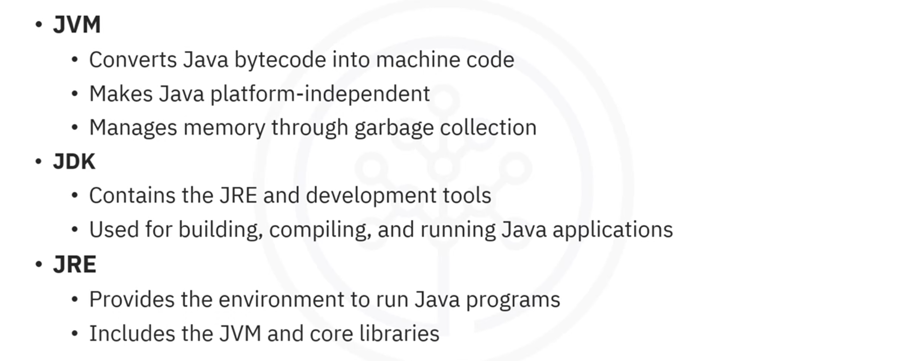
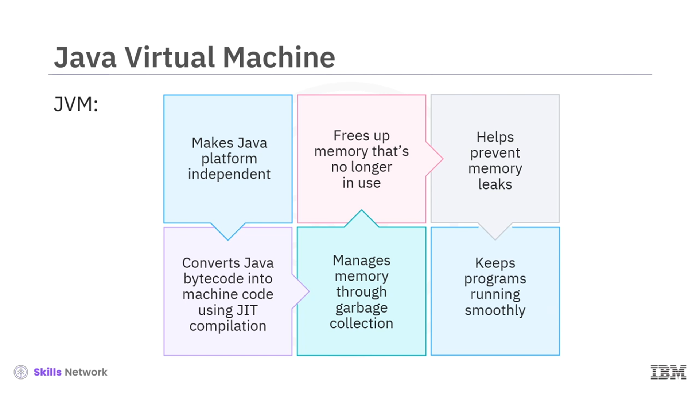
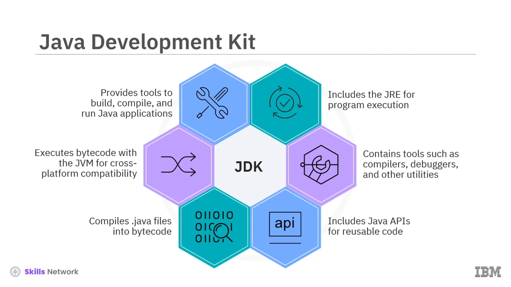
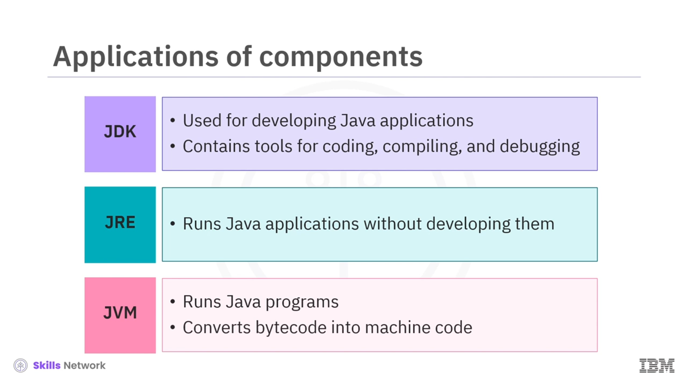

# 01-007    JVM, JDK, and JRE Explained

---

Java's versatility stems from three crucial components: 

-   **Java Virtual Machine (JVM)**
-   **Java Development Kit (JDK)**
-   **Java Runtime Environment (JRE)**

---

### Java Virtual Machine (JVM)

**The JVM** is crucial in making Java platform-independent. It is an abstract machine enabling computers to run Java programmes.

The JVM acts as a translator between humans and machines, **converting Java bytecode into machine code** the operating system comprehends and execites.

**How it works:**

1.  Java programmes are compiled into **Java bytecode** (a platform-independent format)
2.  The JVM converts bytecode into **machine code** the operating system understands
3.  This process is called **Just-In-Time (JIT) compilation**

##### **Memory management** 
The JVM manages memory through **garbage collection**, automatically freeing unused memory, preventing memory leaks, and maintaining smooth programme operation.

---

### Java Development Kit (JDK)

**The JDK** is an essential software package providing everything needed to build, compile, and run Java applications.

The JDK is like a complete carpenter's toolbox—just as carpenters use various tools for building furniture, developers use the JDK to create diverse Java applications from simple programmes to complex systems.

#### **JDK Components**
-   **Java Runtime Environment (JRE)** Necessary for executing Java programmes

-   **Development tools:** *Javac* compiler, debuggers, and other utilities for Java development

-   **Java APIs:** Collections of libraries offering reusable code for common programming tasks

#### **JDK Development process**

1.  Java programmes are saved to `.java` files
2.  Programmes are compiled to bytecode using **Javac compiler**
3.  Bytecode is executed using the **JVM** (runs on any platform)

---

### Java Runtime Environment (JRE)

**The JRE** provides the essential environment for running Java applications.  
**Does NOT contain development tools** such as compilers.  

When running Java applications, the JRE manages class file loading and execution via the JVM. With JRE installed, any Java programmes can run without the full JDK.  

So, JRE is like a fully furnished room ready for occupancy. It contains everything needed for comfortable functioning (JVM, libraries), but lacks renovation tools (which exist in the JDK).

#### ** JRE Components**
- **Java Virtual Machine (JVM)**
- **Core libraries**
- **Other execution components**

---

### Relationship Between JVM, JRE, and JDK

| Component | Purpose | Contains |
|-----------|---------|----------|
| **JVM** | Engine executing Java bytecode; converts to machine code | Bytecode interpreter and garbage collection |
| **JRE** | Environment for running Java applications | JVM + Core libraries (NO development tools) |
| **JDK** | Complete kit for Java development and execution | JRE + Development tools (Javac, debuggers, utilities) |

---

### **Usage scenarios**

-   **JDK:** When developing Java applications (requires all tools for coding, compiling, debugging)

-   **JRE:** When running Java applications without development (lighter weight, no development tools)

-   **JVM:** Core engine included in both JDK and JRE, executing programmes

---

### Current Versions and Updates

**Latest stable version:** Java 23 (released September 2024)  

**Version alignment:** JDK and JRE typically update together, ensuring version compatibility. JVM included in both follows the same version.  

**Update schedule:** JVM updates included in quarterly and critical patch updates from Oracle.  

---

## Lesson Speech

Welcome to this video on **Java Virtual Machine, Development Kit and Runtime Environment.** **After watching this video, you'll be able to explain the roles of the three primary components in Java in development and identify where they are used in developing or running Java applications.**

**Java is one of the most popular programming languages in the world.** **It is used to power everything from web applications to mobile devices.** **What makes Java so versatile?** **The answer lies in Java Virtual Machine or JVM, Java Development Kit or JDK, and Java Runtime Environment or JRE, three components of Java.** **Let's explore these components.**

### Java Virtual Machine (JVM)

**Java Virtual Machine or JVM is crucial in making Java platforms independent.** **It's an abstract machine that allows a computer to run Java programmes.** **When a Java programme is written, it gets compiled into a format called Java bytecode.** **The JVM converts this bytecode into machine code that the operating system can understand.** **This process is called just-in-time or JIT compilation.** **Additionally, JVM manages memory through garbage collection.** **This automatically frees up memory that's no longer in use, helping to prevent memory leaks and keep programmes running smoothly.**

**Imagine writing a letter in English to someone who only understands Spanish.** **The recipient needs a translator.** **The JVM acts as a translator between humans and machines, converting Java bytecode into machine code that the operating system can understand.**

### Java Development Kit (JDK)

**Next, let's dive into JDK.** **A Java Development Kit or JDK is an essential software package that provides everything needed to build, compile, and run Java applications.** **The JDK includes the Java Runtime Environment or JRE, which is necessary to execute Java programmes along with development tools such as the Javac compiler, debuggers, and other utilities required for Java development.** **It also contains Java APIs, which are collections of libraries offering reusable code for common programming tasks.**

**When a Java programme is written, it is saved to a .java file.** **To run the programme, it must be compiled into bytecode using the Javac compiler within the JDK.** **Once compiled, the bytecode is executed using the JVM, ensuring the programme can run on any platform.** **The JDK can be compared to a complete toolbox for a carpenter.** **Just as a carpenter relies on various tools to build different types of furniture, developers use the JDK to create a wide range of Java applications, from simple programmes to more complex systems.**

### Java Runtime Environment (JRE)

**Java Runtime Environment or JRE provides the essential environment for Java programmers.** **It includes the JVM, core libraries, and other components required to execute Java applications.** **However, it does not contain development tools such as compilers for creating Java programmes.** **When running a Java application, the JRE manages the loading of class files and executes them via the JVM.** **With the JRE installed, any Java programmes can be run without needing the full JDK.**

**An analogy for the JRE is a fully furnished room, ready for someone to live in.** **It contains everything needed to function comfortably such as the JVM and libraries.** **However, if there is a need to build or renovate the room, the tools required for such tasks are not found in the JRE.** **These tools are a part of the JDK.**

### Relationship and Usage

**Understanding the relationship between the JVM, JRE, and JDK is crucial for anyone working with Java.** **The JVM is the engine that executes Java bytecode and is part of the JDK and the JRE.** **The JRE package provides the libraries and components necessary to run Java applications, including the JVM, but not the development tools.** **The JDK is the complete kit for developing Java applications, containing the JRE and development tools.**

**The JDK is used when developing Java applications as it contains all the tools needed for coding, compiling, and debugging.** **The JRE is used when you want to run Java applications without developing them, as it is lighter and doesn't include development tools.** **The JVM, included in the JDK and JRE, runs Java programmes by converting bytecode into machine code.**

### Current Versions

**The latest stable version of JDK, Java 23, was released in September 2024.** **The JDK and JRE are usually updated together.** **Therefore, the JRE for Java 23 is aligned with the JDK version, providing the necessary tools and security features to run Java applications.** **The Java Virtual Machine, JVM, which is part of both the JDK and JRE, also follows the Java 23 version.** **JVM updates are included in quarterly and critical patch updates from Oracle.** **Java is constantly updated and you could be using a different version shortly.**

### Summary

In this video, you learned that **the JVM converts Java bytecode into machine code, making Java platform independent, and manages memory through garbage collection.** **The JDK contains the JRE and development tools and it is used for building, compiling, and running Java applications.** **The JRE provides the environment to run Java applications, including the JVM and core libraries, but lacks development tools such as compilers.**
