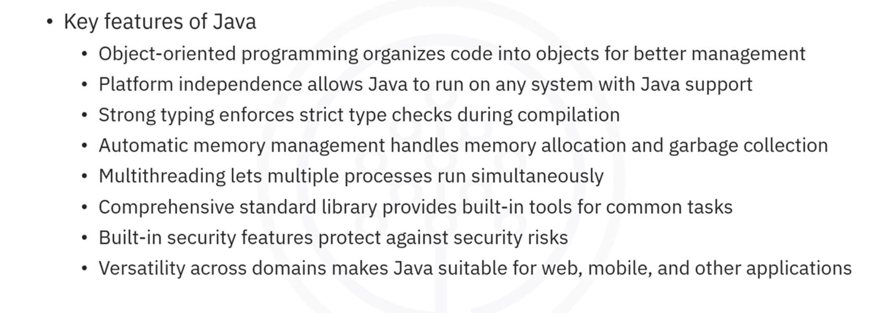
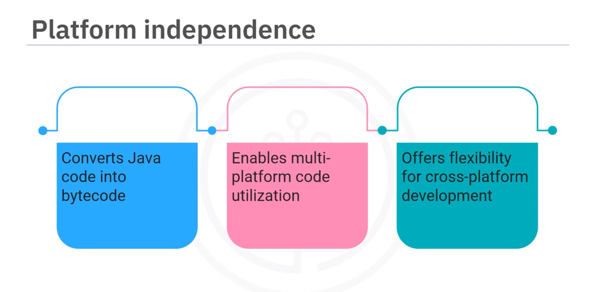
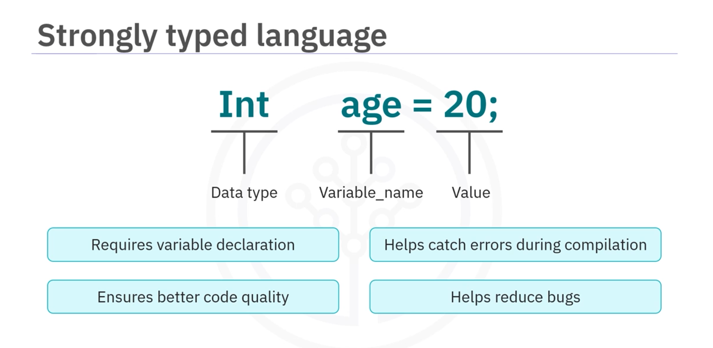
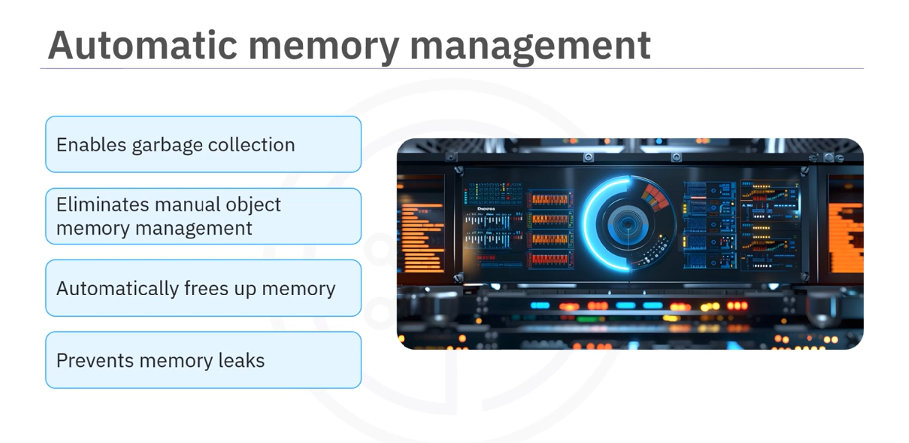
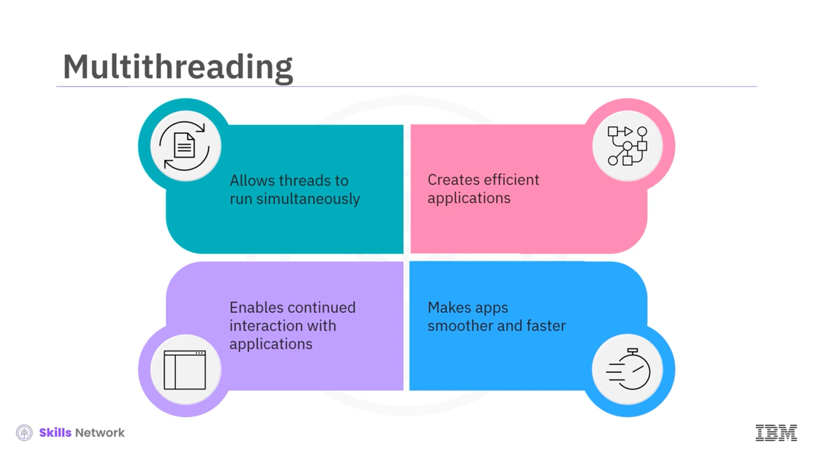
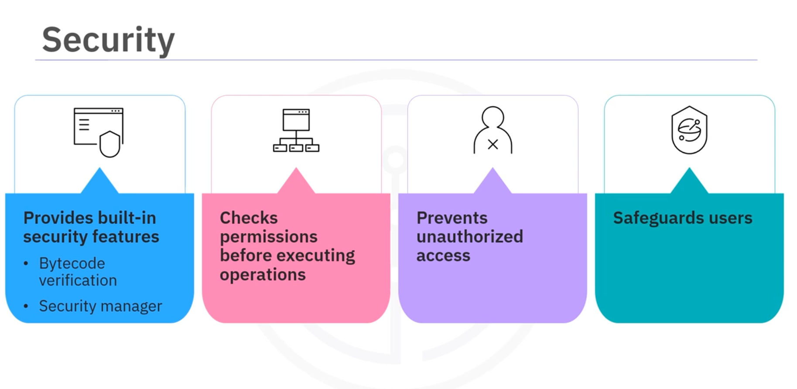
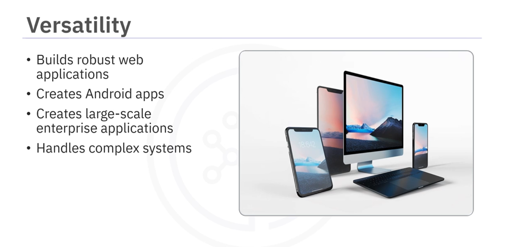
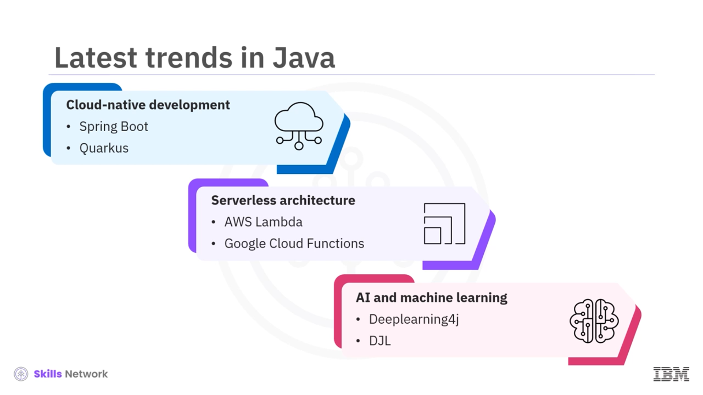

# 01-009 Java Features

## Language-Specific Features



-   **Object-Oriented Programming:** Organises code into objects for better management
-   **Platform Independence:** Allows Java to run on any system with Java support
-   **Strong Typing:** Enforces strict type checks during compilation
-   **Automatic Memory Management:** Handles memory allocation and garbage collection
-   **Multi-Threading:** Lets multiple processes run simultaneously
-   **Comprehensive Standard Library:** Provides built-in tools for common tasks
-   **Built-in Security Features:** Protects against security risks
-   **Versatility:** Suitable for web, mobile, enterprise, and other applications

---

### Java OOP Concepts


Java is fundamentally built around Object-Oriented Programming principles. Code is organised into objects that represent real-world entities with properties and actions.

**Example:** A `Cars` class might define properties such as colour, speed, and model, and actions such as accelerating, turning, or stopping. A specific car, such as a red Toyota Corolla, is an object created from the `Cars` class.


#### Inheritance

Inheritance allows one object to take features from another.  

For instance, a `Car` class can inherit features from a broader `Vehicle` class such as having wheels or an engine.

#### Polymorphism

Polymorphism means the same action can work differently depending on the object. For example, the `start` command could start a car's engine and turn on a boat's motor, even though the objects are different.

#### Encapsulation

Encapsulation keeps certain details private so that they can only be changed safely. For instance, a car's engine number is kept private so it can only be changed by authorised people or methods, preventing tampering.

---

## Platform Independence



Java achieves platform independence through the **Java Virtual Machine (JVM)**. When compiled, Java code is converted into bytecode that can run on any system with a JVM.  

This means you can write your code on one platform, such as Windows, and run it on others, such as macOS or Linux, without needing to change anything.

> **Example:** If a developer creates an application on their Windows computer, users can run it on any operating system without altering the code. 

This flexibility makes Java ideal for cross-platform development.

---

## Strong Typed language



Java is a strongly typed language, which means every variable must be declared with a specific datatype before use.   

This helps catch errors during compilation because each variable's datatype is known upfront.

> **Example:** If you declare a variable as an integer, you cannot accidentally assign it a string value later in the code. 

```java
// Primitive Datatypes

    byte b = 10;
    short s = 200;
    int n = 5000;
    long l = 900000L;
    float f = 3.14f;
    double d = 8.999;
    
    char c = 'A';
    
    boolean flag = true;

// Non-Primitive (Classes)

    String name = "Pepe";
    
    Integer numObj = 50;
    
    Boolean flagObj = false;

// Arrays

    int[] numbers = {1, 2, 3};
    String[] nanmes = {"Ana", "Luis"};

// Data Structures (from java.util)

    List<String> lista = new ArrayList<>();
    Map<String, Integer> mapa = new HashMap<>();
    Set<String> conjunto = new HashSet<>();

```

This strictness **ensures better code quality** and helps **reduce bugs**, especially in large applications where managing datatypes can be tricky.

---

## Automatic Memory Management

Java provides automatic memory management through **garbage collection**.  



This means developers do not need to manage object memory manually. The JVM automatically detects when an object is no longer needed and frees up that memory, helping to prevent memory leaks.


>   **Example:** Suppose you create an object representing a user session but forget to remove it after the session ends. In that case, Java's garbage collector will eventually reclaim that memory once it determines the object is no longer in use. 


This process helps improve efficiency and reduces the risk of memory-related issues.

---

## Multi-Threading



Java supports **multi-threading**, which allows multiple threads to run simultaneously within a program. 

This is important for creating efficient and responsive applications.


>   **Example:** In an online banking application, one thread could handle user input whilst another processes transactions in the background.

This way, users can continue interacting with the application without waiting for long processes, making the app smoother and faster.

---

## Comprehensive Standard Library


Java's comprehensive standard library offers many pre-built classes and methods for common tasks.  

These built-in libraries includes tools for networking, data structures, file handling, and much more.

>   **Example:** If you're developing a web application, you can use Java libraries to handle HTTP requests and responses without writing extensive code from scratch. 

This rich set of resources accelerates development and reduces the need to reinvent solutions for common problems.

---

## Built-in Security Features



Java is **focused on security**.  

Provides built-in features such as **bytecode verification** and a security manager that **checks permissions before executing operations**.

>   **Example:** When running Java applets in web browsers, the security manager prevents unauthorised access to files or network resources, safeguarding users from malicious code.

---

## Versatility Across Domains



Java is a versatile language used in various domains:

-   **Web Development:** Frameworks such as Spring are commonly used to build robust web applications.  

-   **Mobile Development:** Java is the primary language for creating Android apps.  

-   **Enterprise Applications:** Java is widely employed in creating large-scale enterprise applications thanks to its scalability, reliability, and ability to handle complex systems efficiently.

---

## Latest Java Trends




### Cloud-Native Development / Microservices

Java is increasingly used for cloud-native development and microservices, with frameworks such as **Spring Boot** and **Quarkus** gaining popularity.


### Serverless Architecture

Serverless architecture, supported by platforms such as **AWS Lambda** and **Google Cloud Functions** for Java development, is gaining popularity.


### AI and Machine Learning

Due to its stability, Java remains a top choice for AI and machine learning.  

Libraries such as **Deep Learning 4J** and **DJL** enables the development of AI models.

### Spring Framework Evolution

The Spring framework continues to evolve with updates such as **Spring Boot 3.0** and **Spring Native 6.0**, improving native image generation, cloud-native features, and performance.


### IDE's - Development Tools

Integrated development environments such as **IntelliJ IDEA**, **Eclipse**, and VS Code are widely adopted for Java development, offering enhanced features and support.


---

## Lesson Speech

Java is like a **well-paved road**, catering to both novice and experienced drivers. Just as a smooth, well-constructed road makes the journey easier and more efficient for anyone regardless of skill level, Java's design principles and features offer a straightforward path for beginners to get started whilst providing seasoned developers the flexibility and power to tackle more complex tasks.


Java is a programming language that uses **objects to represent real things**. A class is a set of instructions that defines what an object belonging to a class or category should have and what it can do. For example, a class known as `Cars` might define properties such as **colour**, **speed**, and **model** and actions such as **accelerating**, **turning**, or **stopping**. A specific car, such as a red Toyota Corolla, is an **object** created from the class called `Cars`.


**Inheritance** allows one object to take features from another. For instance, a `Car` class can inherit features from a broader `Vehicle` class such as having wheels or an engine.

**Polymorphism** means the same action can work differently depending on the object. For example, the `start` command could start a car's engine and turn on a boat's motor, even though the objects are different.

**Encapsulation** keeps certain details private so that they can only be changed safely. For instance, a car's engine number is kept private so it can only be changed by authorised people or methods, preventing tampering.

Another feature of Java is **platform independence**, which is made possible by the **Java Virtual Machine** or **JVM**. When compiled, Java code is converted into **bytecode** that can run on any system with a JVM. This means you can write your code on one platform, such as Windows, and run it on others, such as macOS or Linux, without needing to change anything. For example, if a developer creates an application on their Windows computer, users can run it on any operating system without altering the code. This flexibility makes Java **ideal for cross-platform development**.

Java is a **strongly typed language**. This implies that every variable must be declared with a specific datatype before use. This helps catch errors during compilation because each variable's datatype is known upfront. For example, if you declare a variable as an integer, you cannot accidentally assign it a string value later in the code. This strictness ensures **better code quality** and helps **reduce bugs**, especially in large applications where managing datatypes can be tricky.

Another feature of Java is **automatic memory management through garbage collection**. This means developers do not need to manage object memory manually. The JVM automatically detects when an object is no longer needed and frees up that memory, helping to **prevent memory leaks**. For example, suppose you create an object representing a user session but forget to remove it after the session ends. In that case, Java's garbage collector will eventually reclaim that memory once it determines the object is no longer in use. This process helps **improve efficiency** and reduces the risk of memory-related issues.

Java also supports **multi-threading**, which allows multiple threads to run simultaneously within a programme. This is important for creating **efficient and responsive applications**. For example, in an online banking application, one thread could handle user input whilst another processes transactions in the background. This way, users can continue interacting with the application without waiting for long processes, making the app smoother and faster.

Java's **comprehensive standard library** offers many pre-built classes and methods for common tasks. This library includes tools for networking, data structures, file handling, and much more. For example, if you're developing a web application, you can use Java libraries to handle HTTP requests and responses without writing extensive code from scratch. This rich set of resources **accelerates development** and reduces the need to reinvent solutions for common problems.

Java's **key focus is security**. Java provides built-in features such as **bytecode verification** and a **security manager** that checks permissions before executing operations to enable this. For example, when running Java applets in web browsers, the security manager prevents unauthorised access to files or network resources, **safeguarding users from malicious code**.

Java is a **versatile language** used in various domains. Frameworks, such as Spring, are commonly used to build robust web applications in **web development**. Java is the primary language for creating Android apps in **mobile development**. Additionally, Java is widely employed in creating large-scale **enterprise applications** thanks to its scalability, reliability, and ability to handle complex systems efficiently.

Now let's explore some of the **latest Java trends**. Java is increasingly used for **cloud-native development and microservices**, with frameworks such as Spring Boot and Quarkus gaining popularity. **Serverless architecture**, supported by platforms such as AWS Lambda and Google Cloud Functions for Java development, is gaining popularity. Due to its stability, Java remains a **top choice for AI and machine learning**. Libraries such as Deep Learning 4J and DJL enable the development of AI models.

The **Spring framework** continues to evolve with updates such as Spring Boot 3.0 and Spring Native 6.0, improving native image generation, cloud-native features, and performance. Lastly, **integrated development environments** such as IntelliJ IDEA, Eclipse, and VS Code are widely adopted for Java development, offering enhanced features and support.

Java's key features are **object-oriented programming**, which organises code into objects for better management; **platform independence**, which allows Java to run on any system with Java support; **strong typing**, which enforces strict type checks during compilation; **automatic memory management**, which handles memory allocation and garbage collection; **multithreading**, which lets multiple processes run simultaneously; a **comprehensive standard library**, which provides built-in tools for common tasks; **built-in security features**, which protect against security risks; and **versatility across domains**, which makes Java suitable for web, mobile, and other applications.
