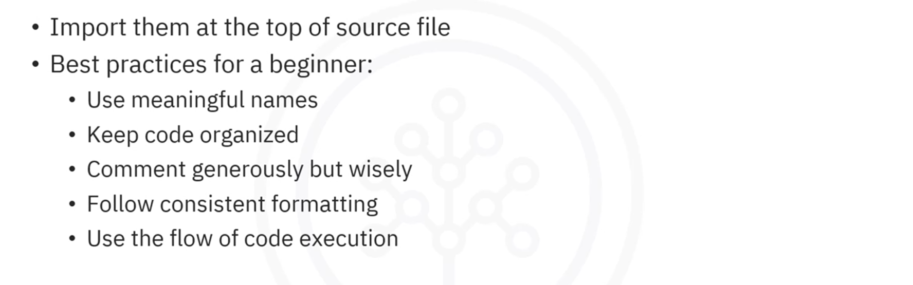
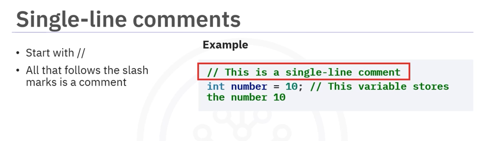
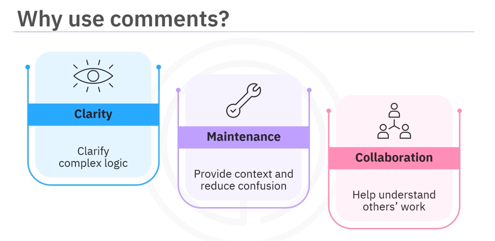
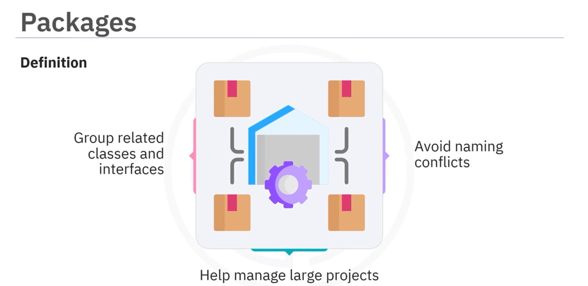
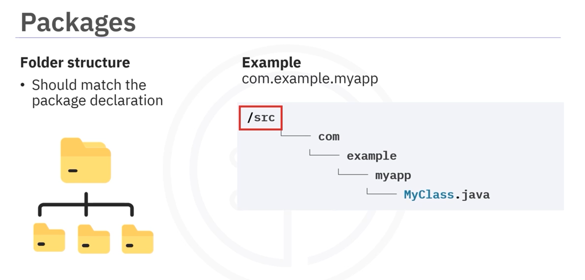
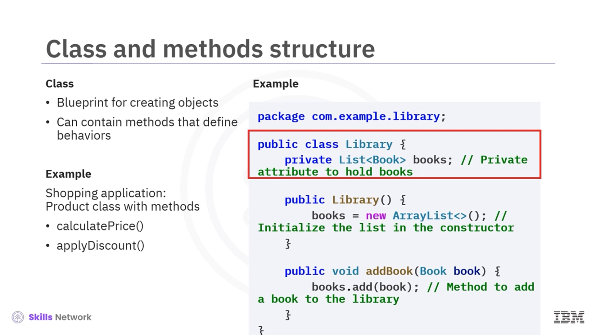
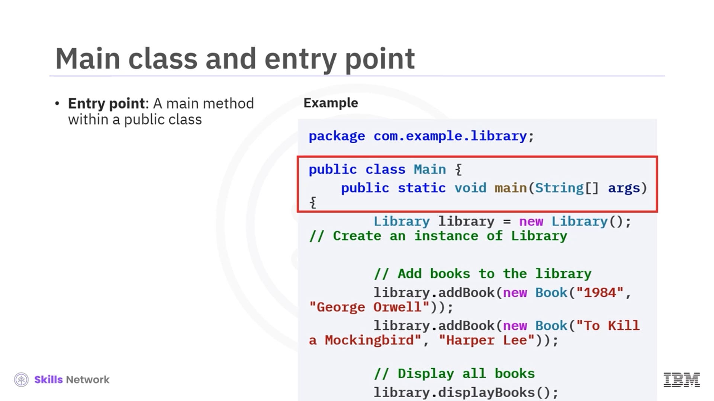
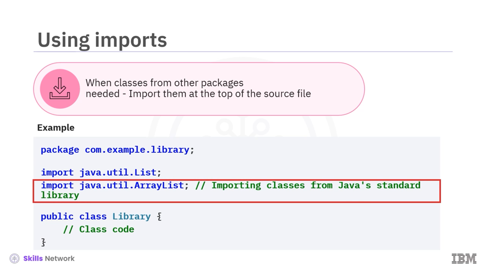
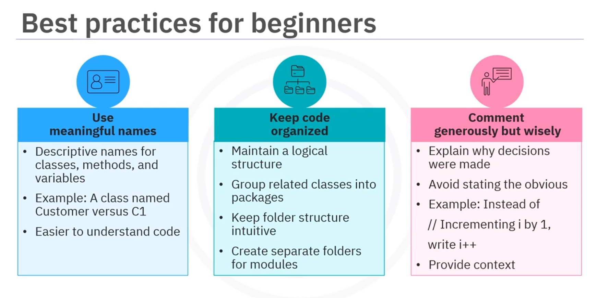

# 02-001 Java Code Structure and Comments

 

## Comments in Java

Comments are notes in the code that are not executed by the program.

They are meant for developers to explain, clarify, or annotate parts of the code.

Using comments is a good practice as it helps you and others to understand your code better when revisiting it later.

### Types of Comments

#### Single-Line Comments



Single-line comments start with **two forward slash marks** (`//`).\
Everything that follows on that line is treated as a comment.

```java
// This is a single-line comment
int number = 10; // This variable stores the number 10
```

#### Multi-Line Comments

.png>)

Multi-line comments start with a **forward slash and an asterisk** (`/*`) and end with **an asterisk and a forward slash** (`*/`).\
They can span multiple lines.

```java
/* This is a multi-line comment,
   it can explain a block of code
   or provide detailed information. */

int sum = 0; /* This variable will hold
               the sum of numbers */
```

#### Documentation Comments


Documentation comments are used to generate documentation using tools like **Javadoc**.

They start with a **forward slash followed by two asterisks** (`/**`).

```java
/**
 * This method calculates the square of a number.
 * @parameter number the number to be squared
 * @return the square of the input number
 */
```

### Why Use Comments?



* **Clarity:** Explain complex logic, making it easier for others to understand the content.
* **Maintenance:** Aid understanding by providing context and reducing confusion when revisiting code.
* **Collaboration:** Enable team members to better understand each other's work in team environments.

***

## Packages in Java



Packages are used to **group related classes and interfaces together**.\
They help avoid naming conflicts and make it easier to manage large projects.

The place where you "content" anything related to your application, or module/submodule.

### Creating a Package


To create a package, use the **`package`** keyword at the top of your Java source file:

```java
package com.example.myapp;

public class MyClass {

    public static .....

    }
```

### Package File Structure



The folder structure of your file system should **match the package declaration**:

```
src/
├── com/
│   └── example/
│       └── myapp/
│           └── MyClass.java
```

Each part of the package name corresponds to a folder.

Traditionally, the convention was com.organisationname.appname, where:

* `com`: Denoted a commercial organisation or enterprise.
* `organisationname`: Represented the registered name of the organisation.
* `appname`: Indicated the application’s name.

Today, it remains a good practice to include an "identifier" that reflects the developer, team, organisation, or enterprise name for clarity and ownership.

***


## Source Files and Naming Conventions

Each **public class should be in its own source file** named exactly after the class with a `.java` extension.

**Example:** If you have a class named `Book`, the file should be named `Book.java`.

```java
package com.example.library;

public class Book {
    String title;
    String author;
    
    public Book(String title, String author) {
        this.title = title;
        this.author = author;
    }
}
```

### Casing

| Java Element                     | Naming Convention                                       | Case Style                   | Example(s)                                   |
| -------------------------------- | ------------------------------------------------------- | ---------------------------- | -------------------------------------------- |
| **Classes**                      | Nouns starting with a capital letter.                   | PascalCase (Upper CamelCase) | `User`, `DataInputStream`, `BankAccount`     |
| **Interfaces**                   | Nouns or adjectives starting with a capital letter.     | PascalCase                   | `Runnable`, `Serializable`, `Processable`    |
| **Objects (Class Instances)**    | Follow the same convention as variables.                | lowerCamelCase               | `myObject`, `userList`                       |
| **Variables (Local & Instance)** | Meaningful names starting with a lowercase letter.      | lowerCamelCase               | `counter`, `userName`, `currentSpeed`        |
| **Methods (Functions)**          | Verbs or verb phrases starting with a lowercase letter. | lowerCamelCase               | `calculateTotal()`, `getName()`, `isEmpty()` |
| **Constants (static final)**     | Uppercase letters, words separated by underscores.      | SCREAMING\_SNAKE\_CASE       | `MAX_VALUE`, `PI`, `BUFFER_SIZE`             |
| **Packages**                     | Lowercase words separated by dots.                      | lowercase (with dots)        | `com.company.project`                        |

***

## Classes and Methods



In Java, **everything is organised into classes**.\
A class is a **blueprint for creating objects** and can contain methods or functions that define behaviours.

> **Example:** In a shopping application, you might have a `Product` class with methods like `calculatePrice()` or `applyDiscount()`.

### Method Naming Conventions


Methods should have descriptive names and follow a consistent naming convention. **camelCase** is commonly used, where:

* The first word is lowercase
* Subsequent words start with an uppercase letter

```java
public class Book {
    String title;
    String author;
    
    public void displayBookInfo() {
        // Method implementation
    }
    
    public void updateAuthor(String newAuthor) {
        // Method implementation
    }
}
```

***

## The Main Method / Entry Point



Every Java application needs an **entry point**, which is typically a **`main` method** within a public class.

```java
package com.example.library;

public class Library {

    public static void main(String[] args) {

        Library library = new Library();
        
        library.addBook(new Book("1984", "George Orwell"));
        
        library.addBook(new Book("To Kill a Mockingbird", "Harper Lee"));
        
        library.displayBooks();
    
    }
}
```

The code above:

1. Creates a new `Library` object
2. Adds books to the library
3. Displays all books in the library

***

## Import Statements



When you need to use classes from other packages, import them at the **top of your source file**:

```java
package com.example.library;

import java.util.List;
import java.util.ArrayList;

public class Library {
    
    private List<Book> books = new ArrayList<>();
    
    ...
}
```

***

## Best Practices for Beginners

 

### 1. Use Meaningful and Descriptive Names

* Choose names that are immediately understandable
* `Customer` is clearer than `C1`
* Makes it easier for anyone reading your code to understand its purpose

### 2. Keep Your Code Organised

* Manage a logical structure in your codebase
* Group related classes into packages
* Keep your folder structure intuitive
* Create separate folders for different modules (e.g., authentication, product management)

### 3. Comment Generously But Wisely

* Explain **why** certain decisions were made, especially if not immediately obvious
* Avoid stating the obvious
  * WRONG -> `// Increment i by one`
  * **BETTER** -> `i++`
* Provide context rather than repeating what the code already shows

### 4. Adhere to Consistent Formatting

* Use consistent indentation, spacing, and braces placement throughout
* Most coding environments have settings to enforce consistent formatting automatically

### 5. Follow the Flow of Code Execution

* Code execution in Java follows a **top-to-bottom approach** within methods
* The JVM starts executing from the **`main` method** of the class specified as the entry point
* Understanding this flow helps structure your methods logically

***

## Lesson Speech

Welcome to this guide about how to structure Java code and comments. After this guide, you'll be able to explain the meaning of comments in Java. You will also be able to describe the code structure used in Java. Finally, you will be able to discuss best practices for beginners using Java. Let's begin by exploring what comments are in Java. Comments are **notes in the code that are not executed by the program**. They are meant for developers to explain, clarify, or annotate parts of the code. Using comments is a good practice as it helps you and others to understand your code better when revisiting it later.

Java supports **three types of comments**. **Single-line comments** start with **two forward slash marks**. Everything that follows the slash on that line is treated as a comment. In this example, you can see two forward slashes and the commentary, "This is a single-line comment integer number equal to 10". Again, there are two forward slashes followed by the commentary, "This variable stores the number 10." **Multi-line comments** start with a **forward slash and then an asterisk**. The code ends with an **asterisk and a forward slash**. They can span multiple lines. In this example, you first see a slash followed by an asterisk followed by the commentary text, "This is a multi-line comment, it can explain a block of code or provide detailed information." The code ends with an asterisk and a forward slash.

You can also post multi-line comments after your code. In this example, you'll see the code "integer sum equals zero" followed by a space. Then you will see the forward slash, asterisk, and comment, "this variable will hold the sum of numbers," followed by an asterisk and a forward slash to end the multi-line comment. Developers use **documentation comments** to generate documentation using tools like **Javadoc**. Documentation comments start with a **single forward slash followed by two asterisks**. Then you'll enter an **asterisk and a space** at the start of each line before typing your comment code. In this example, you can see the forward slash and two asterisks.

On the next line, you can see an asterisk and the first comment. "This method calculates the number of a square." On the second line, you'll again see an asterisk, and then you'll see "@parameter number, the number to be squared." On the next line, you'll again see an asterisk and the text "@return the square of the input number." The next line displays an asterisk and a forward slash that ends the documentation code. After the asterisk slash, you can see the related Java code. Programmers use comments for several reasons. Comments **enhance clarity** as they explain complex logic making it easier for others to understand the content. Comments **help developers maintain code**. When you or someone else revisits the code later to maintain existing code, comments aid understanding by providing context and reducing confusion. Finally, in **team environments**, comments **enable collaboration** by helping team members better understand each other's work.

Next, let's understand **packages in Java**. **Packages are used to group related classes and interfaces together**. They help avoid naming conflicts and make it easier to manage large projects. To create a package, you use the **`package` keyword** at the top of your Java source file. This example demonstrates how to declare a package in Java and define a class within it. Here, the package name is `com.example.myapp`. It defines a **public class** named `MyClass`. The **`public` keyword** means this class can be accessed from other packages.

The double forward slash is where you add the actual functionality or code for the class, such as methods and variables. The **folder structure of your file system should match the package declaration**. This example represents how Java organises files in a project when using packages. Forward slash src is the root folder for the source code in your project. `com.example.myapp` is a directory structure that matches the package name. Each part of the package name corresponds to a folder. It is also important to note the **source files and naming conventions followed in Java**. **Each public class should be in its own source file named exactly after the class with a `.java` extension**. For example, if you have a class named `Book`, the file should be named `Book.java`.

This is the `Book` class, part of the `com.example.library` package. Inside this class, we have two pieces of information or attributes, `title` and `author`. There's also a **constructor**, a special method that helps create a new book. It takes the title and author as inputs and assigns them to a book. This class is a blueprint for creating book objects in a library system. In Java, **everything is organised into classes**. A **class is a blueprint for creating objects** and can contain methods or functions that define behaviours. For instance, in a shopping application, you might have a product class with methods like `calculatePrice` or `applyDiscount`.

In this example, the code defines a `Book` class inside the `com.example.library` package. `Package com.example.library` declares the package name where this class belongs. `Public class Book` defines a public class named `Book`. `String title` and `string author` are instance variables or attributes to store the title and author of a book. **Methods are used to encapsulate functionality within a class**. They should have **descriptive names and follow a consistent naming convention**. One such example is **camelCase** wherein the first word is lowercase and subsequent words start with an uppercase letter. It is commonly used for variable and method names in Java.

**Every Java application needs an entry point, which is typically a `main` method within a public class.** In this example, the code defines a main class in the `com.example.library` package with a main method to test the library system. The code `library library equals new library` creates a new library object to store books. `Library.addBook.newBook` adds books to the library by creating book objects, such as 1984 by George Orwell. `Library.displayBooks` displays all the books in the library by calling the displayBooks method. This code initialises a library, adds two books to it, and prints the list of books. It demonstrates object creation and method calls in a structured way.

**When you need to use classes from other packages, you need to import them at the top of your source file.** Here is an example. First, you declare the package. `Package com.example.library;` organises the code and places the library class inside the `com.example.library` package. Next, you import tools from Java's built-in library. `Import java.util.List;` lets you use the list interface to handle collections of items. `Import java.util.ArrayList;` allows you to create a dynamic list using the `ArrayList` class.

Finally, you define the library class. It's a public class where all the library-related code will go, such as storing and managing books. If you're just starting out using comments and structuring Java code, here are **some best practices that can help you**. **Use meaningful and descriptive names** for your classes, methods, and variables. A class-named `customer` is immediately understandable compared to a class named `C1`. Meaningful names make it easier for anyone reading your code to understand its purpose. **Keep your code organised by managing a logical structure in your codebase.**

**Group related classes into packages** and keep your folder structure intuitive. For instance, if you have different modules for user authentication and product management, create separate folders for each module. **Comment generously but wisely** to explain why certain decisions were made in your code, especially if they are not immediately obvious. Avoid stating the obvious. For example, instead of saying, forward slash, forward slash, incrementing i by one, just write `i++`. Focusing on providing context rather than repeating what the code already shows. **Adhere to consistent formatting throughout your code.** This includes indentation, spacing, and braces placement. Most coding environments have settings that can help enforce consistent formatting automatically.

**Follow the flow of code execution.** The flow of execution in Java follows a **top-to-bottom approach** within methods. When a program is run, the JVM starts executing from the **`main` method** of the class specified as the entry point. Understanding this flow helps in structuring your methods logically. In this guide, you learned that **comments in Java are notes in the code that are not executed by the program**. The **three types of comments are single-line, multi-line, and documentation**. Comments help with clarity, maintenance, and collaboration.

**Packages are used to group related classes and interfaces together.** **Each public class should be in its own source file, named exactly after the class.** **In Java, a class is a blueprint for creating objects** and can contain methods that define behaviours. **Every Java application has an entry point, which is a `main` method within a public class.** **When you need to use classes from other packages, you can import them at the top of your source file.** Finally, you learned that **some best practices for a beginner are: use meaningful names, keep your code organised, comment generously but wisely, follow consistent formatting, and use the flow of code execution.**
