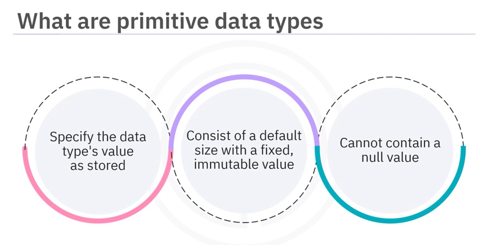
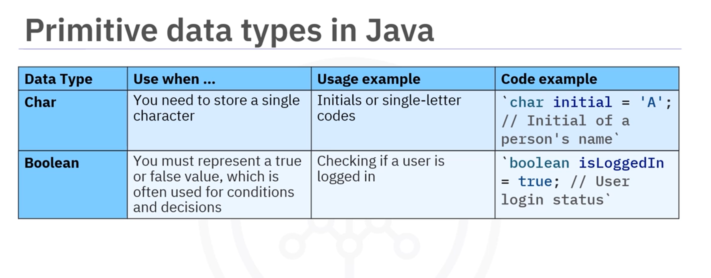

# 02-002 Data Types


---


Data types are **containers designed to hold specific types of information**.   

Think of them as specialised containers—you wouldn't store soup in a shopping bag or groceries in a drinking glass.  

In programming, each data type specifies the type of data a variable can store and has specific properties such as size and range. They determine what operations Java programs can perform on the data.


---

## Categories of Data Types

In Java, data types can be broadly categorised into two groups:

1.  **Primitive Data Types**
2.  **Reference Data Types**

---

## Primitive Data Types



### Characteristics

- Store the data type's stored value directly

- Consist of a fixed size and a default fixed, immutable value

- Cannot contain a null value


### Types of Primitive Data Types


| Data Type  | Size (bits) | Range                                                   | Example                               | Common Use                                        |
| ---------- | ----------- | ------------------------------------------------------- | ------------------------------------- | ------------------------------------------------- |
| **byte**   | 8           | -128 to 127                                             | `byte age = 25;`                      | Memory-efficient storage in large arrays          |
| **short**  | 16          | -32,768 to 32,767                                       | `short temperature = -5;`             | Small integer values (e.g., temperature)          |
| **int**    | 32          | -2,147,483,648 to 2,147,483,647                         | `int population = 1_000_000;`         | Default choice for whole numbers                  |
| **long**   | 64          | -9,223,372,036,854,775,808 to 9,223,372,036,854,775,807 | `long distanceToMoon = 384_400_000L;` | Very large integers (suffix `L`)                  |
| **float**  | 32          | ~±3.4×10³⁸ (≈7 decimal digits)                          | `float price = 19.99f;`               | Decimal numbers with lower precision (suffix `f`) |
| **double** | 64          | ~±1.8×10³⁰⁸ (≈15 decimal digits)                        | `double pi = 3.141592653589793;`      | High-precision decimal numbers                    |




| Data Type | Size (bits) | Range                 | Example               | Common Use                   |
| --------- | ----------- | --------------------- | --------------------- | ---------------------------- |
| **char**  | 16          | 0 to 65,535 (Unicode) | `char initial = 'A';` | Single characters or symbols |


| Data Type   | Size (bits) | Range             | Example                    | Common Use                        |
| ----------- | ----------- | ----------------- | -------------------------- | --------------------------------- |
| **boolean** | 1 (logical) | `true` or `false` | `boolean loggedIn = true;` | Conditional logic and state flags |


---

## Reference Data Types


Reference data types use a **memory address that finds the actual data's location**. They enable the use of more complex data structures.

### Types of Reference Data Types


#### Strings

Strings are **sequences of characters**. You can think of a string as a line of text, such as a name, a message, or any combination of letters and numbers.

```java
String greeting = "Hello, World!";
String name = "Alice";
```

#### Arrays

An **array is a collection of multiple values stored under a single variable name**.  
All values in an array must be of the same type.

```java
int[] scores = {95, 87, 92, 78};
```

Arrays are great for storing lists of items like student scores or names. You can access each value using its zero-index.

#### Classes

A **class is like a blueprint for creating objects**. 

Useful for:  

-   Organising related data and functions together
-   Creating templates for multiple smaller items
-   Enforcing consistent structure and behaviour

An **object is an instance of a class** that contains both data (attributes) and methods (functions) to operate on that data.

```java
public class Book {
    
    String title;
    String author;
    
    public void displayInfo() {
    
        System.out.println("Title: " + title);
    
    }
}
```

#### Interfaces

An **interface data type in Java is like a contract** that **defines a set of methods that a class must implement**. 

When you create an interface, you only declare the methods without providing their actual code.

Interfaces are useful for:  

-   Allowing a class to use features from multiple sources

-    Using different classes in the same way if they follow the same interface

-       Making code cleaner and easier to update

```java
public interface Animal {

    void makeSound();
    void move();

}
```

#### Enumerations (Enum)

An **enum, short for enumeration, is a special data type** that lets you **define a list of named values**. 

Useful for representing **fixed sets of options**, such as days of the week or colours.

```java
public enum Color {

    RED, GREEN, BLUE, YELLOW
}

public enum DayOfWeek {

    MONDAY, TUESDAY, WEDNESDAY, THURSDAY, FRIDAY, SATURDAY, SUNDAY

}
```

---

## Best Practices for Selecting Data Types


When selecting data types for your programs, consider the following recommendations:

-   **Use `int`** for whole numbers
-   **Use `double`** for decimal-based numbers
-   **Use `String`** for text-based data
-   **Use `boolean`** for yes/no conditions
-   **Be careful with decimal calculations** – ensure consistency in data types used (e.g., use `double` throughout monetary calculations rather than mixing `double` and `float`)


---

## Lesson Speech

Welcome to this video about exploring data types in Java. After watching this video about exploring data types in Java, you'll be able to define what data types are, explain the purpose of data types, discuss primitive data types in Java applications, and describe available reference data types in Java applications. **Every developer must understand data types.** Think of **data types as containers**, each designed to hold specific types of information. For example, you wouldn't store soup in a shopping bag or groceries in a drinking glass. In programming, **each data type specifies the type of data a variable can store** and has specific properties such as size and range. They **determine what operations Java programs can perform on the data.**

In Java, **data types can be broadly categorised into two groups: primitive data types and reference data types.** Let's compare these two data types. Let's begin with **primitive data types**. When you use a primitive data type, you specify the data type's stored value. **Primitive data types consist of a fixed size and a default fixed, immutable value**, such as a specific integer or a yes or no value. Finally, **primitive data types cannot contain a null value.** Next, let's explore some primitive data types.

Let's begin with the **byte data type**. A byte data type **saves memory in large arrays** for values between negative 128 and 127. For instance, `byte age = 25`. You can use the data type to represent a person's age. The **short data type** is **ideal for small integers** ranging from negative 32,768 to 32,767. Use this data type for values like temperature, such as negative 5 degrees. The **int data type** is the **most used integer data type** suitable for larger whole numbers, such as populations.

For example, `int population = 1,000,000`. The **long data type** **handles very large integers** that exceed the numbers available for int, such as the moon's distance in metres. For instance, `long distanceToMoon = 384400000L`. The **float data type** **stores decimal numbers with up to seven decimal places** when high precision isn't needed. Use it for prices like `float price = 19.99F`. The **double data type** **provides greater precision for decimal numbers** with up to 15 decimal places. One example is `double pi = 3.141592653589793`.

The **char type** stores a single character, perhaps used as an on-screen selection option, such as `char initial = 'A'`. The **boolean type** **represents true-false values**, often for conditions such as checking a user's login status. For example, you can have `boolean loggedIn = true`. Next, let's explore **reference data types**. **Java programs use reference data types to locate objects or collections of data.** Using reference data enables you to work with more complex data structures like text and lists. Next, learn about some reference data types.

Let's begin with the **strings data type**. **Strings are sequences of characters.** You can think of a string as a line of text, such as a name, a message, or any combination of letters and numbers. Strings are very useful for handling text in your programs. An example of a string is the phrase `"Hello, World!"`. Next, learn about the **array data type**. An **array is a collection of multiple values stored under a single variable name.**

**All the values in an array must be of the same type.** Arrays are great for storing lists of items like student scores or names. This example creates an array called scores that holds four integer values. You can access each value using its index positioned in the array. Remember that **indexing starts at zero**. **Classes** are another reference data type. **A class is like a blueprint for creating objects.**

Classes are useful for **organising related data and functions together**, **creating templates for multiple smaller items**, and **enforcing consistent structure behaviour**. An **object is an instance of a class** that contains both data (attributes) and methods (functions) to operate on that data. You can create your own data types using classes to model real-world things. Objects are useful for providing blueprints for classes, enabling a class to use features from multiple sources, enabling the use of multiple classes from one interface, and easing maintenance. An **interface data type in Java is like a contract** that defines a set of methods that a class must implement. When you create an interface, you only declare the methods without providing their actual code. **All methods in an interface are empty by default.**

Interfaces act like a blueprint that tells classes what methods to use. They let a class use features from multiple sources, and you can use different classes in the same way if the classes follow the same interface. Using interfaces, your code becomes cleaner and easier to update. Finally, **enum, short for enumeration, is a special data type** in Java that lets you **define a list of named values**. It is useful for representing fixed sets of options, such as days of the week or colours. Finally, let's look at **some best practices for selecting data types.** When selecting data types for your programs, consider the following recommendations.

The **int data type works well for whole numbers.** The **double data type works well for decimal-based numbers.** **Use the string data type for text-based data.** **For yes and no conditions, use the boolean data type.** **Be careful when working with decimal calculations.** For example, you can use the double data type for when the wallet, coffee, and the amount calculations use the double data type. However, you'll see that the final monetary number is displayed using the float data type.

Let's summarise what you've learned. In this video, you learned that **data types are containers** designed to hold specific types of information. **Each data type specifies the type of data a variable can store** and has specific properties such as size and range, which determine what operations Java programs can perform on that data. **Primitive data types consist of a fixed size and a default immutable value.** **Primitive data types include byte, short, int, long, float, double, char, and boolean.** **Reference data types use a memory address** that finds the actual data's location. **Reference data types enable the use of more complex data structures**, including texts and lists.

**Reference data types include strings, arrays, classes, interfaces, and enums.**
