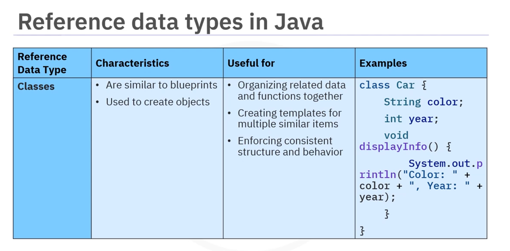

# IBM Java Cert > Course 2 'Java Beginnes' > Module 2 > 02-003 Exercise

This exercise is part of the **IBM Java Certification - Course 2: Java Beginners**, Module 2, Data Types - Data Cast.

***

## Data Types Reminder

### PRIMITIVES

 

| Data Type  | Size (bits) | Range                                                   | Example                               | Common Use                                        |
| ---------- | ----------- | ------------------------------------------------------- | ------------------------------------- | ------------------------------------------------- |
| **byte**   | 8           | -128 to 127                                             | `byte age = 25;`                      | Memory-efficient storage in large arrays          |
| **short**  | 16          | -32,768 to 32,767                                       | `short temperature = -5;`             | Small integer values (e.g., temperature)          |
| **int**    | 32          | -2,147,483,648 to 2,147,483,647                         | `int population = 1_000_000;`         | Default choice for whole numbers                  |
| **long**   | 64          | -9,223,372,036,854,775,808 to 9,223,372,036,854,775,807 | `long distanceToMoon = 384_400_000L;` | Very large integers (suffix `L`)                  |
| **float**  | 32          | \~±3.4×10³⁸ (≈7 decimal digits)                         | `float price = 19.99f;`               | Decimal numbers with lower precision (suffix `f`) |
| **double** | 64          | \~±1.8×10³⁰⁸ (≈15 decimal digits)                       | `double pi = 3.141592653589793;`      | High-precision decimal numbers                    |


| Data Type | Size (bits) | Range                 | Example               | Common Use                   |
| --------- | ----------- | --------------------- | --------------------- | ---------------------------- |
| **char**  | 16          | 0 to 65,535 (Unicode) | `char initial = 'A';` | Single characters or symbols |

| Data Type   | Size (bits) | Range             | Example                    | Common Use                        |
| ----------- | ----------- | ----------------- | -------------------------- | --------------------------------- |
| **boolean** | 1 (logical) | `true` or `false` | `boolean loggedIn = true;` | Conditional logic and state flags |

***

## REFERENTIALS


Reference data types use a **memory address that finds the actual data's location**. They enable the use of more complex data structures.

### Types of Reference Data Types

    

#### Strings

Strings are **sequences of characters**. You can think of a string as a line of text, such as a name, a message, or any combination of letters and numbers.

```java
String greeting = "Hello, World!";
String name = "Alice";
```

#### Arrays

An **array is a collection of multiple values stored under a single variable name**.\
All values in an array must be of the same type.

```java
int[] scores = {95, 87, 92, 78};
```

Arrays are great for storing lists of items like student scores or names. You can access each value using its zero-index.

#### Classes

A **class is like a blueprint for creating objects**.

Useful for:

* Organising related data and functions together
* Creating templates for multiple smaller items
* Enforcing consistent structure and behaviour

An **object is an instance of a class** that contains both data (attributes) and methods (functions) to operate on that data.

```java
public class Book {
    
    String title;
    String author;
    
    public void displayInfo() {
    
        System.out.println("Title: " + title);
    
    }
}
```

#### Interfaces

An **interface data type in Java is like a contract** that **defines a set of methods that a class must implement**.

When you create an interface, you only declare the methods without providing their actual code.

Interfaces are useful for:

* Allowing a class to use features from multiple sources
* Using different classes in the same way if they follow the same interface
* ```
    Making code cleaner and easier to update
  ```

```java
public interface Animal {

    void makeSound();
    void move();

}
```

#### Enumerations (Enum)

An **enum, short for enumeration, is a special data type** that lets you **define a list of named values**.

Useful for representing **fixed sets of options**, such as days of the week or colours.

```java
public enum Color {

    RED, GREEN, BLUE, YELLOW
}

public enum DayOfWeek {

    MONDAY, TUESDAY, WEDNESDAY, THURSDAY, FRIDAY, SATURDAY, SUNDAY

}
```

***

_2025, November, 12._
