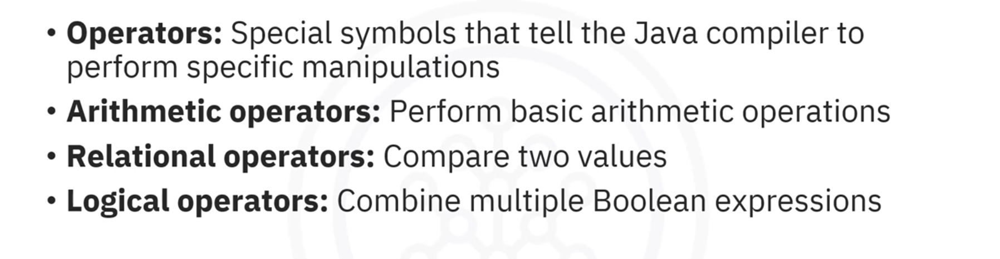

# 02-004 Operators



* **Operators are special symbols** that tell the Java compiler to perform specific operations
* **Arithmetic operators** are used for basic mathematical operations: `+`, `-`, `*`, `/`, `%`
* **Relational operators** are used to compare values and return boolean results: `==`, `!=`, `>`, `<`, `>=`, `<=`
* **Logical operators** are used to combine boolean expressions: `&&`, `||`, `!`

***

.png>)

**Operators are special symbols that perform operations on variables and values.**

Tells the Java compiler to perform specific mathematical or logical manipulations.

Operators can work with variables, constants, and expressions to produce the expected result.

**Example**

```java
int a = 10;
int b = 5;
int sum = a + b;  // The plus operator adds the values of a and b
```

***

## Arithmetic Operators

Used to perform basic arithmetic operations.

.png>)

| Operator       | Symbol | Description                                              | Example |
| -------------- | ------ | -------------------------------------------------------- | ------- |
| Addition       | `+`    | Adds two values                                          | `a + b` |
| Subtraction    | `-`    | Subtracts one value from another                         | `a - b` |
| Multiplication | `*`    | Multiplies two values                                    | `a * b` |
| Division       | `/`    | Divides one value by another                             | `a / b` |
| Modulus        | `%`    | Gives the remainder when one value is divided by another | `a % b` |

.png>)

```java
int a = 10;
int b = 5;

System.out.println("Addition: " + (a + b));        // Output: 15
System.out.println("Subtraction: " + (a - b));    // Output: 5
System.out.println("Multiplication: " + (a * b)); // Output: 50
System.out.println("Division: " + (a / b));       // Output: 2
System.out.println("Modulus: " + (a % b));        // Output: 0
```

***

## Relational Operators

.png>)

Used to **compare two values**.

They **return a boolean result:** `true` or `false`

| Operator                 | Symbol | Description                                               | Example  |
| ------------------------ | ------ | --------------------------------------------------------- | -------- |
| Equal to                 | `==`   | Checks if two values are the same                         | `a == b` |
| Not equal to             | `!=`   | Checks if two values are different                        | `a != b` |
| Greater than             | `>`    | Checks if one value is larger than the other              | `a > b`  |
| Less than                | `<`    | Checks if one value is smaller than the other             | `a < b`  |
| Greater than or equal to | `>=`   | Checks if one value is larger than or equal to the other  | `a >= b` |
| Less than or equal to    | `<=`   | Checks if one value is smaller than or equal to the other | `a <= b` |

.png>)

```java
int a = 10;
int b = 5;

System.out.println("Is a equal to b? " + (a == b));           // Output: false
System.out.println("Is a not equal to b? " + (a != b));       // Output: true
System.out.println("Is a greater than b? " + (a > b));        // Output: true
System.out.println("Is a less than or equal to b? " + (a <= b)); // Output: false
```

***

## Logical Operators

.png>)

Used to **combine multiple boolean expressions**.

| Operator    | Symbol | Description                                    | Example            |
| ----------- | ------ | ---------------------------------------------- | ------------------ |
| Logical AND | `&&`   | Returns true only if both conditions are true  | `a > b && b < c`   |
| Logical OR  | `\|\|` | Returns true if at least one condition is true | `a > b \|\| b < c` |
| Logical NOT | `!`    | Reverses a condition's result                  | `!( a > b)`        |

.png>)

```java
boolean x = true;
boolean y = false;

System.out.println("x && y: " + (x && y));  // Output: false (both must be true)
System.out.println("x || y: " + (x || y));  // Output: true (at least one is true)
System.out.println("!x: " + (!x));          // Output: false (reverses true to false)
```

***

## Lesson Speech

Welcome to this guide that introduces you to operators in Java. After this guide, you will be able to define operators in Java. You will also be able to describe some of the basic operators and explain how they work. When you write programs in Java, you often need to perform different types of operations on your data, such as adding numbers, comparing values, or combining conditions. This is where **operators come in**. **Operators are special symbols that perform operations on variables and values.** They **tell the Java compiler to perform specific mathematical or logical manipulations**. Operators can work with variables, constants, and expressions to produce the expected result.

Here is an example where the plus operator adds the values of a and b. `Integer a = 10` assigns the value 10 to the variable a. `Integer b = 5` assigns the value 5 to the variable b. `Integer sum = a + b` calculates the sum of a and b, storing the result 15 in the variable sum. **Java has several types of operators.** Let's explore them. **Arithmetic operators are used to perform basic arithmetic operations.** Let's go over them.

The **addition operator**, written as a plus sign, **adds two values**. For example, `a + b` adds a and b. The **subtraction operator**, written as a minus sign, **subtracts one value from another**. Example, `a - b` subtracts b from a. The **multiplication operator**, represented by an asterisk, **multiplies two values**. For example, `a * b` multiplies a and b. The **division operator**, written as a forward slash, **divides one value by another**. For example, `a / b` divides a by b. Finally, the **modulus operator**, written as a percentage sign, **gives the remainder when one value is divided by another**. For example, `a % b` finds the remainder of a divided by b. **These operators are the foundation of basic calculation in Java.**

In this example, you can see two numbers, `a = 10` and `b = 5`, to demonstrate basic maths operations in Java step by step. The code calculates `a + b`, which gives 15 and prints addition 15. Next, the code calculates `a - b`, which equals 5 and prints subtraction 5. By multiplying a and b, you get 50 and it prints multiplication 50. When dividing a by b, the result is 2, so it prints division 2. Finally, the modulus operator `a % b` finds the remainder when a is divided by b and prints modulus 0. **Relational operators are used to compare two values.** **They return a boolean result: true or false.** **Equal to**, symbolised by two equals signs (`==`), **checks if two values are the same.**

For example, `a == b` is true if a and b are equal. **Not equal to** shows an exclamation mark and an equal to sign. **Checks if the two values are different.** For example, `a != b` is true if a and b are not the same. **Greater than** checks if one value is larger than the other. For example, `a > b` is true if a is greater than b. **Less than** checks if one value is smaller than the other. For example, `a < b` is true if a is less than b. **Greater than or equal to** checks if one value is larger than or equal to the other. For example, `a >= b` is true if a is greater than or equal to b. **Less than or equal to** checks if one value is smaller than or equal to the other. For example, `a <= b` is true if a is less than or equal to b.

Here's an example. Let's start with `a = 10` and `b = 5`. The first line checks if a is equal to b. Since 10 is not equal to 5, it prints, "is a equal to b? False". The second line checks if a is not equal to b. Since 10 is different from 5, it prints, "is a not equal to b? True". The third line checks if a is greater than b. Since 10 is greater than 5, it prints, "is a greater than b? True". The fourth line checks if a is less than or equal to b. Since 10 is not less than or equal to 5, it prints, "is a less than or equal to b? False". **This is how relational operators compare numbers and make decisions in a program.** **Logical operators are used to combine multiple boolean expressions.** Let's look at some basic logical operators in Java.

**"Logical AND"**, written as two ampersands (`&&`), **checks if both conditions are true**. For example, in `a > b && b < c`, the result is true only if a is greater than b **and** b is less than c. **"Logical OR"**, written as two pipes (`||`), **checks if at least one condition is true**. For example, in `a > b || b < c`, the result is true if either a is greater than b **or** b is less than c. **"Logical NOT"**, written as an exclamation mark (`!`), **reverses a condition's result**. For example, `!(a > b)` means, "is it not true that a is greater than b?" If a is not greater than b, the result will be true. **These operators help to combine or negate conditions in your code.**

This example uses boolean values where true means yes and false means no. Here, `x = true` and `y = false`. Next, let's apply some logical operators. In the first instance, the result is true only if both x and y are true. Here, `x && y` gives false because y is false. In the second instance, the result is true if x or y are true. Here, `x || y` gives true because x is true. The final instance flips the value of x, so `!x` turns true into false. In this guide, you learned that **operators are special symbols that tell the Java compiler to perform specific mathematical or logical manipulations.** There can be **different types of basic operators.** **Arithmetic operators are used to perform basic arithmetic operations.** **Relational operators are used to compare two values.** **Logical operators are used to combine multiple boolean expressions.**
