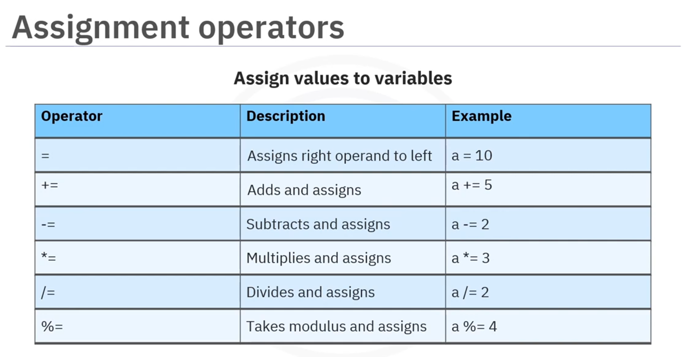
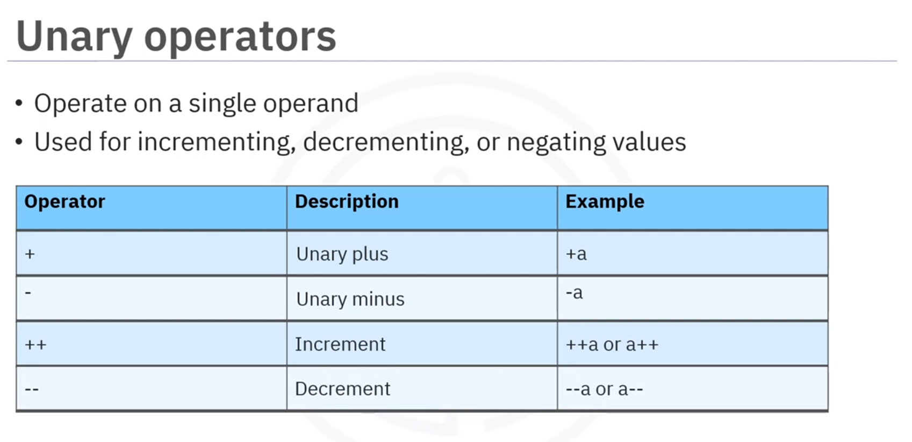
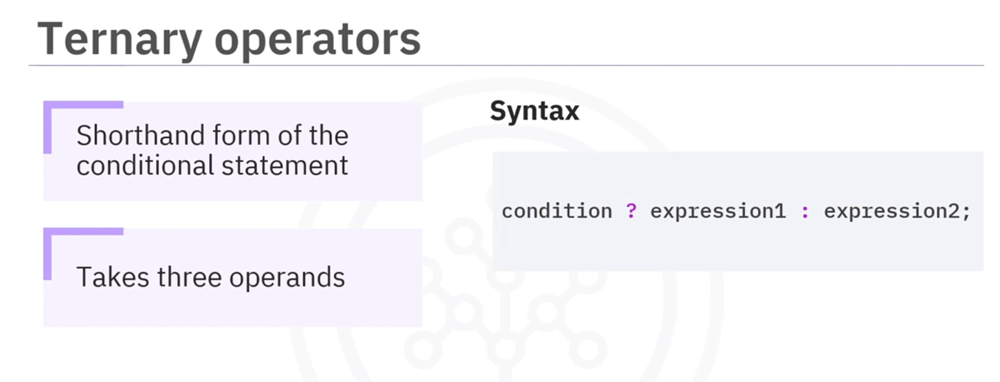

# 02-005 Advanced Operators


- **Advanced operators** work with binary data and perform low-level programming tasks
- **Assignment operators** combine mathematical operations with assignment: `=`, `+=`, `-=`, `*=`, `/=`, `%=`
- **Unary operators** operate on a single operand: `+`, `-`, `++`, `--`
- **Ternary operator** is a shorthand for if-else statements: `condition ? expression1 : expression2`

---


**Advanced operators, such as bitwise and shift operators in Java, go beyond basic arithmetic, comparison, and logical operators.**  

They are primarily used for **low-level programming tasks**, such as optimising performance or working with hardware.   

They can also be used for graphics programming, cryptography, and so on.

---

## Assignment Operators



Assignment operators are used to **assign values to variables** and combine mathematical operations with assignment.

| Operator | Symbol | Description | Example |
|----------|--------|-------------|---------|
| Assign | `=` | Assigns a value to a variable | `a = 10` |
| Add and assign | `+=` | Adds a value to a variable and updates it | `a += 5` (equivalent to `a = a + 5`) |
| Subtract and assign | `-=` | Subtracts a value and updates the variable | `a -= 2` (equivalent to `a = a - 2`) |
| Multiply and assign | `*=` | Multiplies the variable by a value and updates it | `a *= 3` (equivalent to `a = a * 3`) |
| Divide and assign | `/=` | Divides the variable by a value and updates it | `a /= 2` (equivalent to `a = a / 2`) |
| Modulus and assign | `%=` | Finds the remainder and updates the variable | `a %= 4` (equivalent to `a = a % 4`) |


```java
int a = 10;
System.out.println("Initial value: " + a);  // Output: 10

a += 5;  // Adds 5 to a
System.out.println("After a += 5: " + a);   // Output: 15

a *= 2;  // Multiplies a by 2
System.out.println("After a *= 2: " + a);   // Output: 30
```

---

## Unary Operators



Unary operators **operate on a single operand**.  

They can be used for incrementing, decrementing, or negating values.

| Operator | Symbol | Description | Example |
|----------|--------|-------------|---------|
| Unary plus | `+` | Doesn't change the value | `+a` |
| Unary minus | `-` | Negates the sign of a value | `-a` |
| Pre-increment | `++a` | Adds 1 to the variable (before using it) | `++a` |
| Post-increment | `a++` | Adds 1 to the variable (after using it) | `a++` |
| Pre-decrement | `--a` | Subtracts 1 from the variable (before using it) | `--a` |
| Post-decrement | `a--` | Subtracts 1 from the variable (after using it) | `a--` |


```java
int a = 10;

System.out.println("Unary plus: " + (+a));     // Output: 10
System.out.println("Unary minus: " + (-a));    // Output: -10

a++;  // Increment by 1
System.out.println("After increment: " + a);   // Output: 11

a--;  // Decrement by 1
System.out.println("After decrement: " + a);   // Output: 10
```

---

## Ternary Operator



The **ternary operator is a shorthand form of the conditional statement**. It takes three operands.

### Syntax

```java
condition ? expression1 : expression2
```


- If the condition is **true**, it executes **expression1**
- If the condition is **false**, it executes **expression2**

### Example

```java
int a = 10;
int b = 20;

int max = (a > b) ? a : b;
System.out.println("Maximum value: " + max);  // Output: 20
```

In this example:
- The condition `a > b` is checked
- Since 10 is not greater than 20, the condition is false
- Therefore, `b` (which is 20) is assigned to `max`

---

# Bitwise and Shift Operators 

-   **Bitwise operators** work directly on binary representations of integers

-   **AND (`&`)**, **OR (`|`)**, **XOR (`^`)**, and **NOT (`~`)** compare or invert individual bits

-   **Left shift (`<<`)** multiplies by powers of 2

-   **Right shift (`>>`)** divides by powers of 2 whilst preserving the sign

-   **Unsigned right shift (`>>>`)** always shifts in 0s

-   These operators are crucial for **performance optimisation**, **hardware manipulation**, **cryptography**, and **graphics programming**

---

## What are Bitwise Operators?

**Bitwise operators work directly with the binary representations of integers.**   

They manipulate individual bits (0s and 1s) to perform operations.   

These operators are essential for low-level programming, performance optimisation, hardware manipulation, and cryptography.

---

## Bitwise Operators

---
### Bitwise AND (`&`)

*   **Compares each bit of two operands.**
*   **Returns 1 only if both bits are 1.**

```
a = 5  →  0101 (binary)
b = 3  →  0011 (binary)
a & b  →  0001 (binary) = 1 (decimal)
```

```java
int a = 5;                      // 0101
int b = 3;                      // 0011
int result = a & b;             // 0001 = 1

System.out.println(result);     // Output: 1
```

---

### Bitwise OR (`|`)

*   **Compares each bit of two operands**
*   **Returns 1 if at least one bit is 1**

```
a = 5  →  0101 (binary)
b = 3  →  0011 (binary)
a | b  →  0111 (binary) = 7 (decimal)
```

```java
int a = 5;                      // 0101
int b = 3;                      // 0011
int result = a | b;             // 0111 = 7

System.out.println(result);     // Output: 7
```

---

### Bitwise XOR (`^`)

*   **Compares each bit of two operands**
*   **Returns 1 if bits are different, 0 if they're the sam**

```
a = 5  →  0101 (binary)
b = 3  →  0011 (binary)
a ^ b  →  0110 (binary) = 6 (decimal)
```

```java
int a = 5;                      // 0101
int b = 3;                      // 0011
int result = a ^ b;             // 0110 = 6

System.out.println(result);     // Output: 6
```

---

### Bitwise NOT (`~`)

*   **Inverts all bits. 0 becomes 1, and 1 becomes 0. This is a unary operator (works on one operand).**

```
a = 5  →  0101 (binary)
~a     →  1010 (binary) = -6 (decimal, two's complement)
```

```java
int a = 5;                      // 0101
int result = ~a;                // Inverts all bits

System.out.println(result);     // Output: -6
// Note: The result is -6 due to two's complement representation in Java.
```

---

## Shift Operators

Shift operators move all the bits of a number left or right by a specified number of positions.

### Left Shift (`<<`)

*   **Shifts all bits to the left** 
*   **Fills empty spaces on the right with 0s**
*   **Effectively multiplies by 2^n (where n is the shift amount)**

```
a = 5  →  0101 (binary)
a << 1 →  1010 (binary) = 10 (decimal)
a << 2 →  10100 (binary) = 20 (decimal)
```

```java
int a = 5;              // 0101
int result1 = a << 1;   // 1010 = 10
int result2 = a << 2;   // 10100 = 20

System.out.println("a << 1: " + result1);  // Output: 10
System.out.println("a << 2: " + result2);  // Output: 20
```

---

### Right Shift (`>>`)

*   **Shifts all bits to the right**
*   **Fills empty spaces on the left with the sign bit (preserves the sign)**
*   **Effectively divides by 2^n (where n is the shift amount)**

```
a = 20  →  10100 (binary)
a >> 1  →  01010 (binary) = 10 (decimal)
a >> 2  →  00101 (binary) = 5 (decimal)
```

```java
int a = 20;          // 10100
int result1 = a >> 1;  // 01010 = 10
int result2 = a >> 2;  // 00101 = 5

System.out.println("a >> 1: " + result1);  // Output: 10
System.out.println("a >> 2: " + result2);  // Output: 5
```

---

### Unsigned Right Shift (`>>>`)

*   **Shifts all bits to the right**
*   **Fills empty spaces on the left with 0s regardless of the sign (unsigned)**
*   **Always positive result**

```
a = -20 (with sign bit)
a >>> 1 shifts right, filling with 0s
```

```java
int a = -20;
int result = a >>> 1;

System.out.println(result);  // Output: Large positive number
```

---

## Practical Applications

### 1. Checking if a Bit is Set

```java
int flags = 5;                                  // 0101
boolean isBitSet = (flags & (1 << 2)) != 0;     // Check if bit 2 is set

System.out.println(isBitSet);                   // Output: true
```

### 2. Setting a Bit

```java
int flags = 5;              // 0101
flags = flags | (1 << 1);   // Set bit 1

System.out.println(flags);  // Output: 7 (0111)
```

### 3. Clearing a Bit

```java
int flags = 7;              // 0111
flags = flags & ~(1 << 1);  // Clear bit 1

System.out.println(flags);  // Output: 5 (0101)
```

### 4. Toggling a Bit

```java
int flags = 5;              // 0101
flags = flags ^ (1 << 2);   // Toggle bit 2

System.out.println(flags);  // Output: 1 (0001)
```

### 5. Multiplying/Dividing by Powers of 2

```java
int num = 10;
int multiplied = num << 2;  // 10 * 2^2 = 40
int divided = num >> 1;     // 10 / 2^1 = 5

System.out.println("10 << 2: " + multiplied);  // Output: 40
System.out.println("10 >> 1: " + divided);     // Output: 5
```

---

## Summary Table

| Operator | Name | Description | Example |
|----------|------|-------------|---------|
| `&` | Bitwise AND | Returns 1 if both bits are 1 | `5 & 3 = 1` |
| `\|` | Bitwise OR | Returns 1 if at least one bit is 1 | `5 \| 3 = 7` |
| `^` | Bitwise XOR | Returns 1 if bits differ | `5 ^ 3 = 6` |
| `~` | Bitwise NOT | Inverts all bits | `~5 = -6` |
| `<<` | Left Shift | Shifts left, fills with 0s | `5 << 1 = 10` |
| `>>` | Right Shift | Shifts right, fills with sign bit | `20 >> 1 = 10` |
| `>>>` | Unsigned Right Shift | Shifts right, fills with 0s | `-1 >>> 1 = Large positive` |


---

## Lesson Speech

Welcome to this guide about how to use advanced operators in Java. After this guide, you'll be able to describe the different types of advanced operators and explain how they work. **Advanced operators, such as bitwise and shift operators in Java, go beyond basic arithmetic, comparison, and logical operators.** They are primarily used for **low-level programming tasks**, such as **optimising performance or working with hardware**. They can also be used for graphics programming, cryptography, and so on. **Bitwise operators are used for working with binary data, and shift operators are for shifting bits and numbers.** **Assignment operators are used to assign values to variables.**

Let's go over some common assignment operators in Java. The **equals symbol** (`=`) **assigns a value to a variable.** For example, `a = 10`. The **add and equals symbol** (`+=`) **adds a value to a variable and updates it.** For example, `a += 5`. The **subtract and equals symbol** (`-=`) **subtracts a value and updates the variable.** For example, `a -= 2`.

The **multiply and equals symbol** (`*=`) **multiplies the variable by a value and updates it.** For example, `a *= 3`. The **divide and equals symbol** (`/=`) **divides the variable by a value and updates it.** For example, `a /= 2`. The **modulus and equals symbol** (`%=`) **finds the remainder when the variable is divided and updates it.** For example, `a %= 4`. **These operators combine a maths operation with an assignment, making the code shorter and easier to write.**

In this example, compound assignment operators update the value of the variable a. Start with `a = 10`. Then `a += 5` adds 5 to the value of a. So now, `a = 10 + 5`, which is 15. The programme prints, "new value of a, 15". Next, `a *= 2` multiplies a by 2. So now, `a = 15 * 2`, which is 30. The programme prints, "after multiplication, new value of a, 30". **This is how you can perform addition and multiplication directly on a variable whilst updating its value.** **Unary operators operate on a single operand.** They can be used for **incrementing, decrementing, or negating values.** Let's explore some unary operators in Java.

**Unary plus** doesn't change the value, but it sometimes is used for clarity. For example, `+a` simply means the value of a. **Unary minus** negates the sign of a value. For example, if `a = 5`, then `-a` becomes -5. **Increment** adds 1 to the variable. **Decrement** subtracts 1 from the variable. Here's an example. Suppose you have `a = 10`. Using the plus sign with a, as in `+a`, keeps the value the same. So it prints, "unary plus 10". Using the minus sign flips the sign of a. So `-a` becomes -10, and it prints, "unary minus -10".

**Increment** adds 1 to a. After incrementing, a becomes 11 and it prints, "after increment, 11". **Decrement** subtracts 1 from a. After decrementing, a goes back to 10, and it prints, "after decrement, 10". **This is how unary operators can flip a number's sign or increase and decrease its value.** **The ternary operator is a shorthand form of the conditional statement.** **It takes three operands.** This is the syntax for a ternary operator in Java, which is like a shortcut for an if-else statement. **How it works:** First, write a condition. **If the condition is true, it executes expression 1.** **If the condition is false, it executes expression 2.**

In this example, you use the ternary operator to find the larger of two numbers. There are two numbers, `a = 10` and `b = 20`. The line, "if a is greater than b, then a otherwise b," checks if a is greater than b. If the condition `a > b` is true, it assigns the value of a to `max`. If the condition is false, it assigns the value of b to `max`. Since a is not greater than b, the value of b, which is 20, is assigned to `max`. Finally, the programme prints "maximum value is 20". In this guide, you learned that **advanced operators are bitwise operators that work with binary data and shift operators that shift bits and numbers.** They can be of different types. **Assignment operators are used to assign values to variables.** **Unary operators operate on a single operand** and can be used for **incrementing, decrementing, or negating values.** **The ternary operator is a shorthand form of the conditional statement.**
