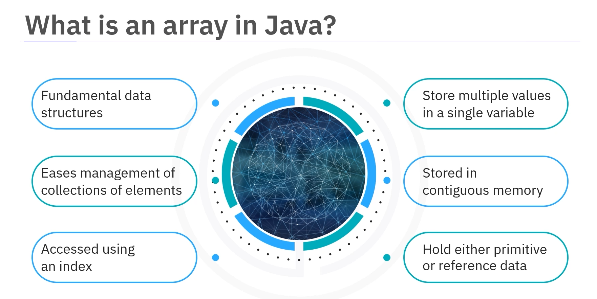
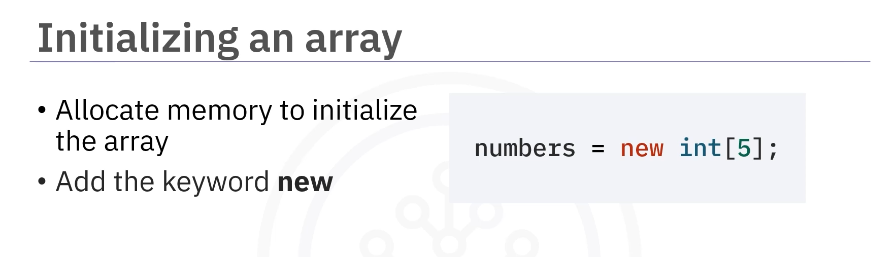
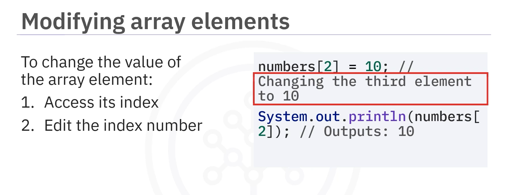

# 02-007 Arrays


***



**An array is a collection of elements, all of the same type, which are stored in contiguous memory locations.**

allow you to store multiple values in a single variable, making it easier to manage collections of data.

Each element in an array can be accessed using an **index**, which is a numerical representation of the element's position within the array.

In Java, arrays can hold **primitive data types** (such as int, char, or boolean) or **reference types** (such as objects).

***

## Declaring Arrays


#### Syntax

```java
dataType[] arrayName;
```

```java
int[] numbers;
String[] names;
double[] prices;
boolean[] flags;
```

***

## Initialising Arrays

After declaring an array, you need to **initialise the array to allocate memory**. Use the keyword **`new`** followed by the data type and the size.

### Method 1: Using `new` with Size



```java
int[] numbers = new int[5];  // Creates an array of 5 integers
```

### Method 2: Using Initialiser List


```java
int[] numbers = {1, 2, 3, 4, 5};  // Creates and initialises array with values
```

### Method 3: Declare and Initialise in One Line

```java
int[] numbers = new int[]{1, 2, 3, 4, 5};
```

***

## Accessing Array Elements


Each element in an array can be accessed by its **index**, which **starts at 0**.

```java
int[] numbers = {10, 20, 30, 40, 50};

System.out.println(numbers[0]);  // Output: 10 (first element)
System.out.println(numbers[4]);  // Output: 50 (last element)
```

***

## Modifying Array Elements

 You can change the value of an array element by specifying its index:

```java
int[] numbers = {1, 2, 3, 4, 5};

numbers[2] = 10;  // Changes the third element to 10
System.out.println(numbers[2]);  // Output: 10
```

***

## Array Length

To determine how many elements are in an array, use the **`length` property**:

```java
int[] numbers = {1, 2, 3, 4, 5};

System.out.println(numbers.length);  // Output: 5
```

***

## Iterating Through Arrays

### For Loop


```java
int[] numbers = {1, 2, 3, 4, 5};

for (int i = 0; i < numbers.length; i++) {
    System.out.println(numbers[i]);
}
```

When the integer `i` equals or exceeds the array length, the loop stops.\
After each iteration, `i++` increments `i` by 1, moving to the next array element.

### For-Each Loop


```java
int[] numbers = {1, 2, 3, 4, 5};

for (int num : numbers) {
    System.out.println(num);
}
```

The enhanced for loop simplifies iteration by automatically handling the index.

***

## Multidimensional Arrays

Java supports **multidimensional arrays**, which are essentially **arrays of arrays**.

The most common type is the **two-dimensional (2D) array**, which can be visualised as a grid or table.

### Declaring and Initialising 2D Arrays


```java
int[][] matrix = {
    {1, 2, 3},
    {4, 5, 6},
    {7, 8, 9}
};
```

The `[][]` tells Java you want a 2D array (a grid), not a single line of numbers. This creates a 3×3 grid where:

* Each inner set of `{}` represents one row
* Each element within those braces is a column value

### Accessing 2D Array Elements

To retrieve a value from a 2D array, specify both the row and column index:


```java
int[][] matrix = {
    {1, 2, 3},
    {4, 5, 6},
    {7, 8, 9}
};

System.out.println(matrix[0][1]);  // Output: 2 (first row, second column)
System.out.println(matrix[2][2]);  // Output: 9 (third row, third column)
```

### Iterating Through 2D Arrays with Nested Loops


```java
int[][] matrix = {
    {1, 2, 3},
    {4, 5, 6},
    {7, 8, 9}
};

for (int i = 0; i < matrix.length; i++) {
    for (int j = 0; j < matrix[i].length; j++) {
        System.out.print(matrix[i][j] + " ");
    }
    System.out.println();  // New line after each row
}
```

The outer loop (`i`) handles each **row**, whilst the inner loop (`j`) handles each **column** in the current row. Together, these loops walk through the grid row by row, printing each number until the entire grid is displayed.

***

***

## Lesson Speech

Welcome to this guide about working with arrays in Java. After this guide, you will be able to define what an array is as used in Java, describe how to declare, create, and modify an array, and explain how to iterate through arrays. **Arrays are one of the fundamental Java data structures and many other programming languages.** **Arrays allow you to store multiple values in a single variable**, making it easier to manage collections of data. Worded another way, **an array is a collection of elements, all of the same type, which are stored in contiguous memory locations.** **Each element in an array can be accessed using an index**, which is a numerical representation of the element's position within the array. In Java, **arrays can hold primitive data types** such as int, char, or boolean, **or reference types** such as objects.

**To declare an array in Java, use the following syntax:** `dataType[] arrayName;` For example, if you want to declare an array of integers, you would type `int[] number;`. After you declare an array, you need to **initialise the array to allocate memory to the array.** You can accomplish this task by adding the keyword **"new".** Here is how to create and initialise an array of 5 integers. Use the code `numbers = new int[5];`. You can also declare and initialise an array in a single line, notice the keyword new. Alternatively, you can create an array and assign values using `{ }`.

**You can access individual elements in an array by specifying the index inside \[].** **Remember that indices start at 0.** In the first example, the first index for the number is set to 0, which provides an output of 1. In the second example, the specified index is 4, which provides an output of 5. Next, learn about modifying array element values and changing an array's length. **You can change the value of an array element by accessing its index.** You'll change the value of the array element `numbers[2] = 10`. You change the third element to the number 10. **To determine how many elements are in an array, you can use the `length` property.** When you run the `System.out.println` code and it reports the `numbers.length`.

**A common operation with arrays is iterating through them to read or modify their elements.** **You can use a for loop for this purpose.** Here is an example that prints all elements in the numbers array. **When the integer `i` equals or exceeds the array length, the loop stops.** After each iteration, the `i++` code increments `i` by 1, moving to the next array element. You can also use the **enhanced for loop**, also known as the **for-each loop.** **Java supports multidimensional arrays**, which are essentially **arrays of arrays.** **The most common type is the two-dimensional array.**

Here's how to declare and initialise a 2D array. The code `int[][] matrix = {` creates a variable named matrix that can hold whole numbers arranged in this grid pattern. The `[][]` tell Java that you want a 2D array, a grid, instead of a single line of numbers. The name matrix is the grid's name. The numbers inside the `{ }` are the actual values that are part of the grid. **Each inner set of `{ }` represents one row of the grid.** So when you write `{1, 2, 3}, {4, 5, 6}, {7, 8, 9}`, you're creating a 3 by 3 grid.

When you want to retrieve a number from this grid, you'll need to specify which row and column you want, just like giving coordinates on a map. Next, you can access elements in a two-dimensional array by specifying the matrix for both indices. You can access elements of a two-dimensional array by specifying both indices as here where you specify matrix array and index 0 by index 1. **You can use nested loops to iterate through all elements of a 2D array.** In this instance, the code reads each for loop and then follows the system print instructions. The code `for (int i = 0; i < matrix.length; i++)` **creates the outer loop that handles each row.** The second line which reads `for (int j = 0; j < matrix[i].length; j++)` **creates the inner loop that handles each column** in the current row.

The next line reads `System.out.print(matrix[i][j] + " ");`. This **prints each number in the grid with a space after it.** Finally, `System.out.println();` **moves the programme to a new line after printing each row.** Together, these loops walk through the grid row by row printing each number until the entire grid is displayed. In this guide, you learned that **an array is a collection of elements, all the same type, which are stored in contiguous memory locations.** **To declare an array, write the data type followed by \[] and then add a space and the array name with a semicolon at the end.** **Initialise an array to allocate memory to the array.** **Initialise an array by adding the keyword "new".** **Specify the index inside \[] to access individual elements in an array.** **You can use for loops, either singular or nested, to iterate through arrays** to read or modify their elements. **And you can use nested loops to iterate through all elements of a 2D array.**
