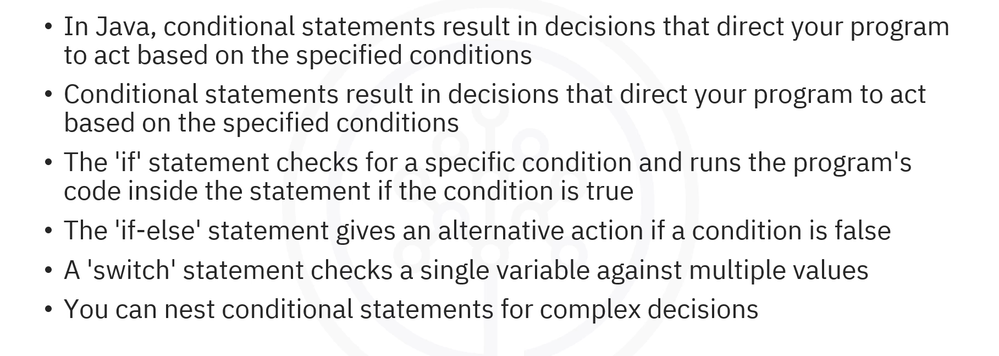
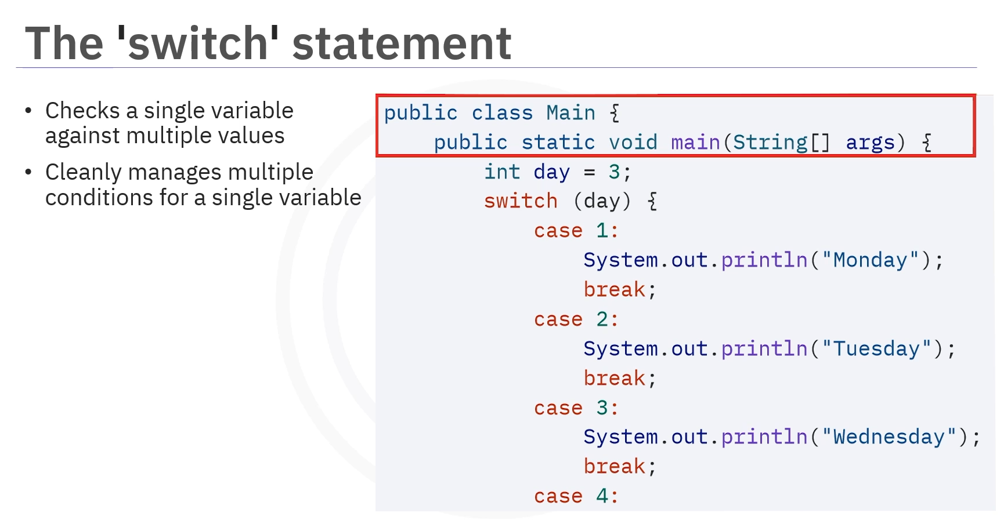
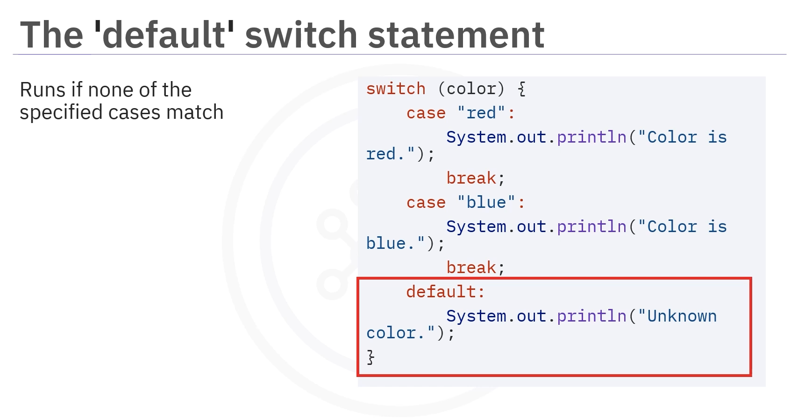
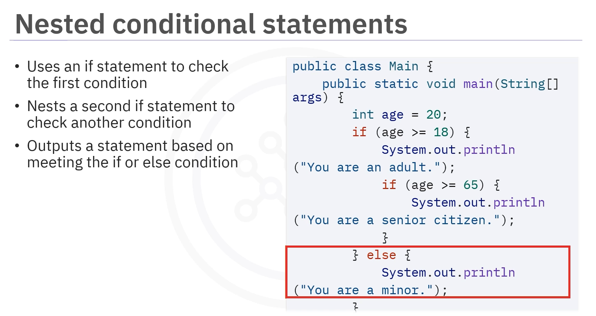

# 03-001 Conditional Statements



- **Conditional statements** result in decisions that direct your program to act based on specified conditions
- **`if` statement** checks for a specific condition and runs code if that condition is true
- **`if-else` statement** gives an alternative action if a condition is false
- **`else-if` statement** allows you to check multiple conditions sequentially
- **`switch` statement** checks a single variable against multiple values, with `default` as a fallback
- **Nested conditional statements** allow for complex decision-making by combining multiple conditions


---

**Conditional statements are an important programming construct.**   

In Java, **conditional statements result in decisions that direct your program to act based on the specified conditions.** Think of conditional statements as questions that your program asks whilst running. You direct the program's next actions based on the answer to those questions, such as true or false.

---

## Types of Conditional Statements

Java uses several conditional statements:  


- `if` statement
- `if-else` statement
- `else-if` statement
- `switch` statement

---

## `if` Statement


The **`if` statement checks for a specific condition.** If the condition is true, the programme runs the code inside the statement.

### Syntax

```java
if (condition) {
    // Code runs if condition is true
}
```

### Example

```java
int number = 10;

if (number > 5) {
    System.out.println("The number is greater than 5");
}
```


---

## `if-else` Statement


The **`if-else` statement gives an alternative action if a condition is false.** You use this conditional statement to run different code depending on whether the condition is true or false.

### Syntax

```java
if (condition) {
    // Code runs if condition is true
} else {
    // Code runs if condition is false
}
```

### Example

```java
int number = 3;

if (number > 5) {
    System.out.println("The number is greater than 5");
} else {
    System.out.println("The number is not greater than 5");
}
```


---

## `else-if` Statement

You can **check multiple conditions by including the `else-if` in a code block.** This allows you to test several conditions sequentially.

### Syntax

```java
if (condition1) {
    // Code runs if condition1 is true
} else if (condition2) {
    // Code runs if condition1 is false and condition2 is true
} else {
    // Code runs if both conditions are false
}
```

### Example

```java
int number = 5;

if (number > 5) {
    System.out.println("The number is greater than 5");
} else if (number == 5) {
    System.out.println("The number equals 5");
} else {
    System.out.println("The number is less than 5");
}
```


---

## `switch` Statement



A **`switch` statement checks a single variable against multiple values.**   

Compared to writing many `if-else` statements, the `switch` statement helps you cleanly manage multiple conditions for a single variable.

### Syntax

```java
switch (variable) {
    case value1:
        // Code runs if variable equals value1
        break;
    case value2:
        // Code runs if variable equals value2
        break;
    default:
        // Code runs if no cases match
}
```

### Example

```java
int day = 3;

switch (day) {
    case 1:
        System.out.println("Monday");
        break;
    case 2:
        System.out.println("Tuesday");
        break;
    case 3:
        System.out.println("Wednesday");
        break;
    default:
        System.out.println("Weekend");
}
```


### The `default` Case



**When using a `switch` statement, it's good practice to include a `default` case,** which runs if none of the specified cases match, acting as a fallback option.

---

## Nested Conditional Statements



**You can nest conditional statements for complex decisions.** Nested statements allow you to check multiple conditions in a hierarchy.

### Example

```java
int age = 20;

if (age >= 18) {
    System.out.println("You are an adult");
    
    if (age >= 65) {
        System.out.println("You are a senior citizen");
    }
} else {
    System.out.println("You are a minor");
}
```


```
Output:
You are an adult
```

(The second message does not print because 20 is not greater than or equal to 65.)

---


## Lesson Speech

Welcome to this video about conditional statements in Java. After this video, you'll be able to: define what conditional statements are, explain the purpose of conditional statements, apply `if`, `if-else`, and `else-if` statements in Java; use the `switch` statement, describe when to use the `default` case, and implement nested conditional statements in Java applications. **Conditional statements are an important programming construct.** In Java, **conditional statements result in decisions that direct your programme to act based on the specified conditions.** Think of conditional statements as questions that your programme asks whilst running. You direct the programme's next actions based on the answer to those questions, such as true or false.

**Java uses several conditional statements**, including the `if` statement, the `if-else` statement, the `else-if` statement, and the `switch` statement. Let's explore how you can use each of these statements. **The `if` statement checks for a specific condition.** **If the condition is true, the programme runs the code inside the statement.** In this example, this code displays an integer number equal to 10. The code contains a conditional statement that reads, "if number greater than sign (>) 5" and checks if the number is greater than (>) 5. Because the number 10 is greater than (>) 5, the programme follows the code instructions of `System.out.println()`, and prints the statement that "The number is greater than 5."

Next, **the `if-else` statement gives an alternative action if a condition is false.** You would use this conditional statement to run the code inside the statement if the condition is false. In this example, the code displays an integer number equal to 3. The code contains a conditional statement that reads, "if number greater than sign 5," and checks if the number is greater than 5, and uses the code `else System.out.println("the number is greater than 5")` to print a statement confirming that the number is greater than 5 if that statement is true. The next line of the code displays the `else` condition, which reads as, "else System.out.println("the number is not greater than 5")." Because the number 3 is less than 5, the programme follows the code instructions of the `else` conditional statement, and prints the statement, "the number is not greater than 5."

Next, let's check out the **`else-if` statement.** **You can check multiple conditions by including the `else-if` in a code block.** For example, the following programme has an integer variable called number with a value of 5. The programme uses the `if`, `else-if`, and `else` statements. For the first `if` condition, the programme asks, "is the number greater than 5?" If the variable number is true, the programme uses the `System.out.println()` statement to print, "the number is greater than 5". If the condition is false, such as if the number equals 5, the programme skips printing and moves to the next condition. The `else-if` condition asks, "is the number equal to 5?" If this condition is true, the programme prints "the number equals 5." If the condition is false, the programme skips this part of the code and moves to the final condition. If the programme gets to the final `else` condition, and if neither of the earlier conditions are true, the programme prints "the number is less than 5." In this instance, the integer meets the second condition, and the programme ends with the second condition.

A **`switch` statement checks a single variable against multiple values.** Compared to writing many `if-else` statements, the `switch` statement helps you cleanly manage multiple conditions for a single variable. In this programme, you can use a `switch` statement to check the value of the variable named "day." Each case represents a day of the week, such as `case 1` for Monday, `case 2` for Tuesday, and so on. If no cases match, the `default` case runs, printing "weekend." Here, since "day" equals 3, which matches `case 3`, the programme outputs Wednesday. **When using a `switch` statement, it's good practice to include a `default` case,** which runs if none of the specified cases match, acting as a fallback option.

**You can nest conditional statements for complex decisions.** For example, this code uses nested `if` statements to handle multiple conditions. First, the code uses an `if` statement to check if the age is 18 or older. If true, the programme prints "you are an adult." Inside this block, the code nests another `if` statement, checks if the age is 65 or older, and prints "you are a senior citizen." If the first condition is false, the programme prints "you are a minor." Since the age is 20, the programme prints "you are an adult." The second message does not print because 20 is not greater than or equal to 65.

Now let's recap what you've learned. In this video, you learned that **in Java, conditional statements result in decisions that direct your programme to act based on the specified conditions.** **The `if` statement checks for a specific condition** and runs the programme's code inside the statement if that condition is true. **The `if-else` statement gives an alternative action if a condition is false.** **A `switch` statement checks a single variable against multiple values.** **And you can nest conditional statements for more complex decisions.**
