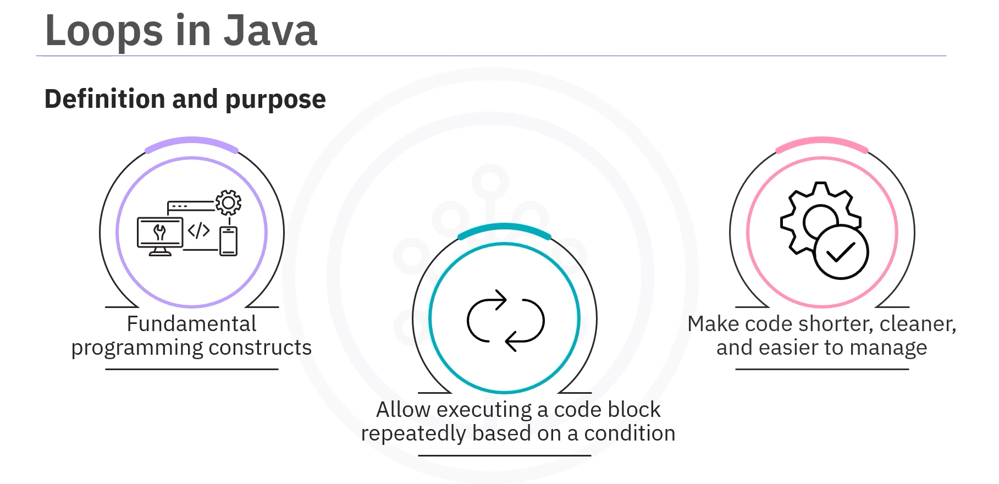
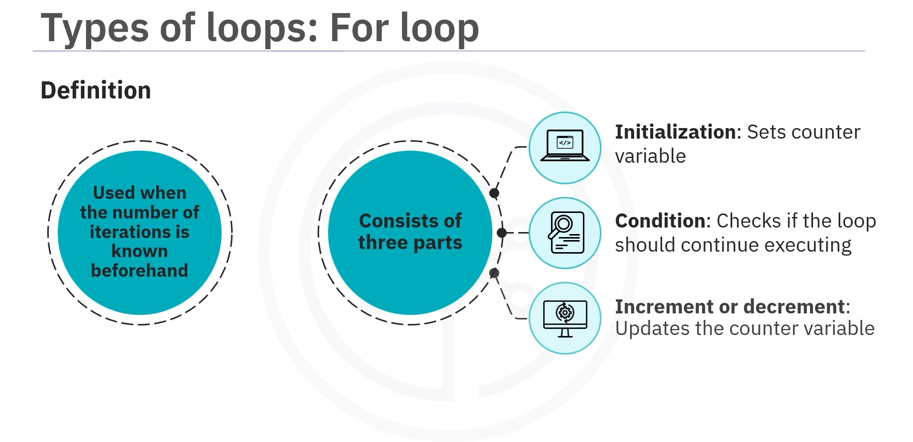
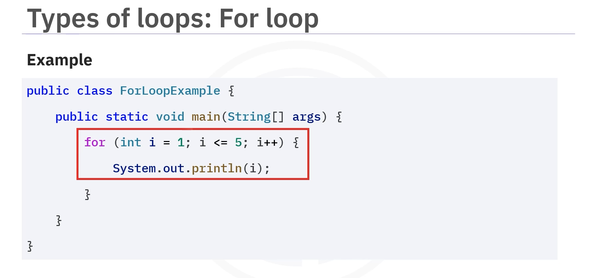
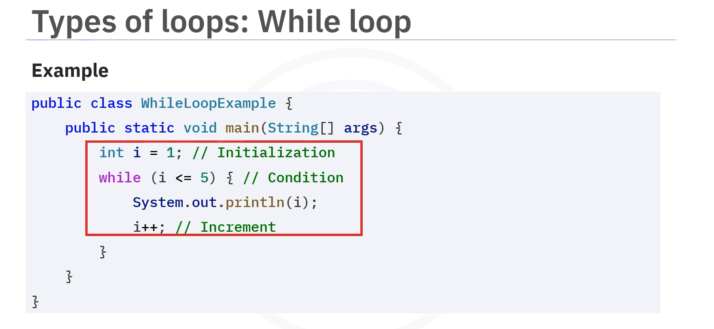
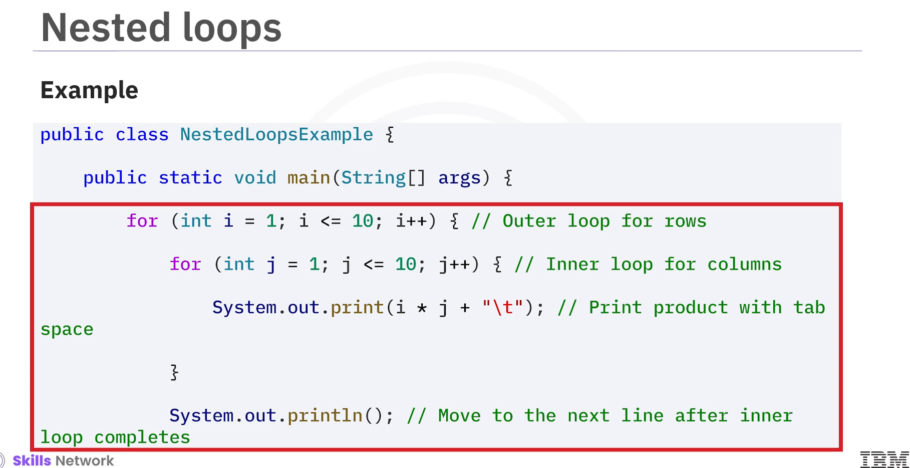
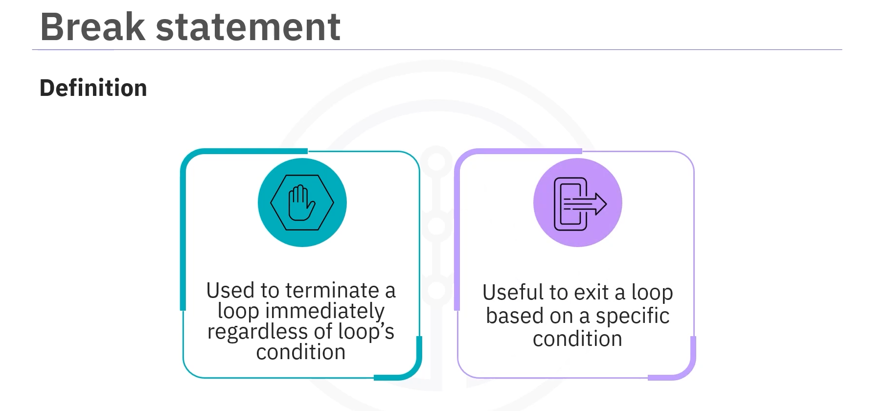
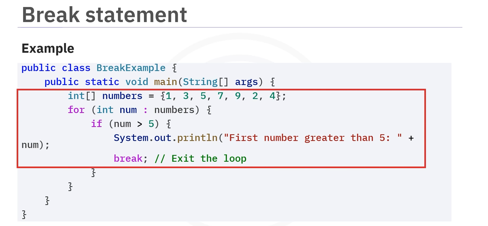
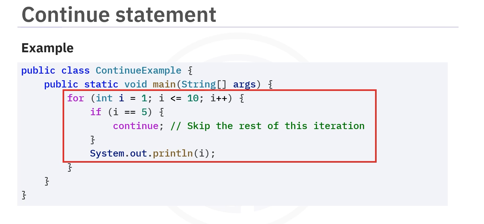

# 03-002 Loops


* **Loops** are fundamental programming constructs for executing code repeatedly
* **`for` loop:** Used when the number of iterations is known beforehand
* **`while` loop:** Used when the number of iterations is not known in advance
* **`do-while` loop:** Similar to `while` but executes at least once before checking the condition
* **Nested loops:** Useful for working with multidimensional data structures
* **`break` statement:** Terminates a loop immediately
* **`continue` statement:** Skips the current iteration and moves to the next one

***

**Loops are fundamental programming constructs that allow you to execute a block of code repeatedly based on a condition.**



Imagine you need to print the numbers from 1 to 10. Instead of writing 10 separate print statements, you can use a loop to accomplish this task with just a few lines of code.

**In Java, loops help you perform repetitive tasks efficiently.**

Loops make code shorter, cleaner, and easier to manage.

***

## Types of Loops

Java provides three primary types of loops:

1. `for` loop
2. `while` loop
3. `do-while` loop

***

## `for` Loop



The **`for` loop is used when the number of iterations is known beforehand.**

It consists of three parts:

* **Initialization:** Sets a counter variable
* **Condition:** Checks that the loop should continue executing
* **Increment/Decrement:** Updates the counter variable after each iteration

### Syntax

```java
for (initialization; condition; increment/decrement) {
    
    // Code executed in each iteration

}
```

### Example



```java
for (int i = 1; i <= 5; i++) {

    System.out.println(i);

}

/*
OUTPUT:

        1
        2
        3
        4
        5
*/
```

In this example:

* **Initialisation** starts the counter at 1
* **Condition** (`i <= 5`) checks if the loop should continue
* **Increment** (`i++`) increases `i` by 1 after each iteration

***

## `while` Loop


The **`while` loop is used when the number of iterations is not known in advance.**

It **continues executing as long as the specified condition remains true.**

### Syntax

```java
while (condition) {

    // Code executed whilst condition is true

}
```

1. The loop first checks the condition.
2. If the condition is true, it runs the code inside the curly braces.
3. After running the code, it checks the condition again.
4. The loop continues until the condition becomes false.

### Example



```java
int i = 1;

while (i <= 5) {

    System.out.println(i);
    
    i++;

}


/*
OUTPUT:

        1
        2
        3
        4
        5
*/
```

***

## `do-while` Loop


The **`do-while` loop is similar to the `while` loop but guarantees that the code block executes at least once before checking the condition.**

### Syntax

```java
do {

    // Code executed at least once

} while (condition);
```

1. The code inside the curly braces is executed first, no matter what.
2. Then the condition inside the parentheses is checked.
3. If the condition is true, the loop runs again.
4. This process repeats until the condition becomes false.

### Example


```java
int i = 1;

do {
    
    System.out.println(i);
    
    i++;

} while (i <= 5);

/*
OUTPUT:
        1
        2
        3
        4
        5
*/
```

> **Important:** Even if the initial value of `i` were set to a number greater than 5, the loop would still execute once before checking the condition.

***

## Nested Loops


**You can also use loops inside other loops, known as nested loops.**\
This is useful for working with multidimensional data structures such as arrays or matrices.

### Example: Multiplication Table



```java
for (int i = 1; i <= 10; i++) {
    
    for (int j = 1; j <= 10; j++) {
        
        System.out.print((i * j) + "\t");
    
    }
    
    System.out.println();

    }
```

1. The **outer loop controls the rows**, with `i` starting at 1 going up to 10.
2. The **inner loop handles the columns**, with `j` also running from 1 to 10.
3. Inside the inner loop, the product of `i` and `j` is calculated and printed, followed by a tab for spacing.
4. After the inner loop finishes, `System.out.println()` moves to the next line to start a new row.

***

## `break` Statement



The **`break` statement is used to terminate a loop immediately, regardless of the loop's condition.**

This can be useful when you want to exit a loop based on a specific condition that may occur during its execution.

### Syntax

```java
break;
```

### Example



```java
int[] numbers = {1, 2, 3, 7, 8, 9};

for (int i = 0; i < numbers.length; i++) {

    
    if (numbers[i] > 5) {
        
        System.out.println("Found: " + numbers[i]);
        break;
    
    }

}


// Output: `Found: 7`
```

1. The loop iterates through the `numbers` array.
2. As soon as it finds a number greater than 5 (which is 7), it prints the number and exits the loop with the `break` statement.

***

## The `continue` Statement


The **`continue` statement is used to skip the current iteration of a loop and move to the next iteration.**\
It's useful when you want to skip certain conditions but continue executing the rest of the loop.

### Syntax

```java
continue;
```

### Example



```java
for (int i = 1; i <= 10; i++) {

    if (i == 5) {
    
        continue;
    
    }
    
    System.out.println(i);
}
/*
Output:

        1
        2
        3
        4
        6
        7
        8
        9
        10
*/
```

1. When `i` equals 5, the `continue` statement is executed, skipping the `System.out.println(i)` command for that iteration.
2. The loop continues with the next value.

***

## Lesson Speech

Welcome to this guide that introduces you to loops in Java. After this guide, you'll be able to define loops in Java and explain why they are used. You will also be able to describe the different types of loops. Imagine you need to print the numbers from 1 to 10. Instead of writing 10 separate print statements, you can use a loop to accomplish this task with just a few lines of code. **Loops are fundamental programming constructs that allow you to execute a block of code repeatedly based on a condition.** **In Java, loops help you perform repetitive tasks efficiently.** **Loops make your code shorter, cleaner, and easier to manage.**

**Java provides three primary types of loops:** `for` loop, `while` loop, and `do-while` loop. **The `for` loop is used when the number of iterations is known beforehand** and **consists of three parts.** **Initialisation sets a counter variable.** **Condition checks that the loop should continue executing.** **Increment or decrement updates the counter variable after each iteration.** In the syntax shown here, the code inside the curly braces is what gets repeated during each loop. Let's say you want to print the numbers from 1 to 5. This code shows a `for` loop in action counting from 1 to 5. You start with the class named `ForLoopExample` and the `main` method where the programme begins. In this example, initialisation starts the counter at 1. **The condition `i <= 5` checks if `i` is less than or equal to 5.** **The increment `i++` increases `i` by 1 after each iteration.** When you run this code, the output is numbers 1 to 5.

**The `while` loop is used when the number of iterations is not known in advance.** **It continues executing as long as the specified condition remains true.** The syntax for the `while` loop is displayed here. **The loop first checks the condition inside these parentheses.** **If the condition is true, it runs the code inside the curly braces.** After running the code, it checks the condition again. **The loop continues until the condition becomes false.**

Suppose you want to print numbers from 1 to 5 using a `while` loop. In this example, initialisation starts the counter at 1. **The condition `i <= 5` checks if `i` is less than or equal to 5.** After printing `i`, you increment it by 1. The loop continues until `i` exceeds 5. The output will be numbers 1 to 5. **The `do-while` loop is similar to the `while` loop but guarantees that the code block executes at least once before checking the condition.** Here's how the syntax for the `do-while` loop works.

**The code inside the curly braces is executed first, no matter what.** Then the condition inside the parentheses is checked. **If the condition is true, the loop runs again.** This process repeats until the condition becomes false. Let's modify the previous example to use a `do-while` loop. Initialisation starts the counter at 1. **The `do` block runs the code inside at least once** and prints the value of `i`. `i++` increases `i` by 1 after each print. **The condition, or the loop checks `while`, that is, if `i` is less than or equal to 5.** If true, it keeps running. If false, it stops. Here, too, you will see the output will be numbers 1 to 5. **Even if the initial value of `i` were set to a number greater than 5, the loop would still execute once before checking the condition.**

**You can also use loops inside other loops, known as nested loops.** **This is useful for working with multidimensional data structures such as arrays or matrices.** Let's look at an example of nested loops. This instance demonstrates nested loops in Java by creating a multiplication table. **The outer loop controls the rows**, with `i` starting at 1 going up to 10. **The inner loop handles the columns**, with `j` also running from 1 to 10. Inside the inner loop, the product of `i` and `j` is calculated and printed, followed by a tab for spacing. After the inner loop finishes, `System.out.println()` command moves to the next line to start a new row. The result is a neatly formatted multiplication table from 1 to 10.

**The `break` statement is used to terminate a loop immediately, regardless of the loop's condition.** This can be useful when you want to exit a loop based on a specific condition that may occur during its execution. The syntax is the `break` statement followed by a semicolon. Let's say you want to find the first number that is greater than 5 in an array of integers. You can use the `break` statement to exit the loop as soon as you find it. So, in this example, the loop iterates through the `numbers` array. **As soon as the loop finds a number greater than 5, which is 7, it prints the number and exits the loop with the `break` statement.**

**The `continue` statement is used to skip the current iteration of a loop and move to the next iteration.** **It's useful for when you want to skip certain conditions but continue executing the rest of the loop.** The syntax is the `continue` statement followed by a semicolon. Suppose you want to print all the numbers from 1 to 10, but you want to skip printing the number 5. **When `i` equals 5, the `continue` statement is executed, skipping the `System.out.println(i)` command for that iteration.**

The output will be numbers 1 to 10. In this guide, you learned that **loops are fundamental programming constructs that allow you to execute a block of code repeatedly based on a condition.** **The `for` loop is used when the number of iterations is known beforehand.** **The `while` loop is used when the number of iterations is not known in advance.** **The `do-while` loop is similar to the `while` loop but guarantees that the code block executes at least once before checking the condition.** **Nested loops are useful for working with multidimensional data structures.** **The `break` statement is used to terminate a loop early, regardless of the loop's condition.** **The `continue` statement is used to skip the current iteration of a loop and move to the next iteration.**
