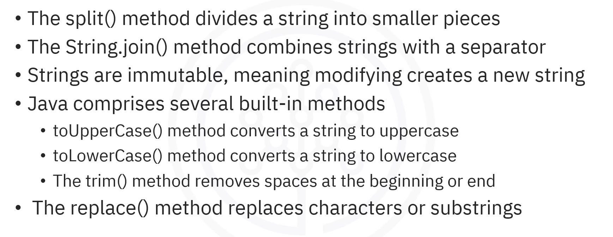
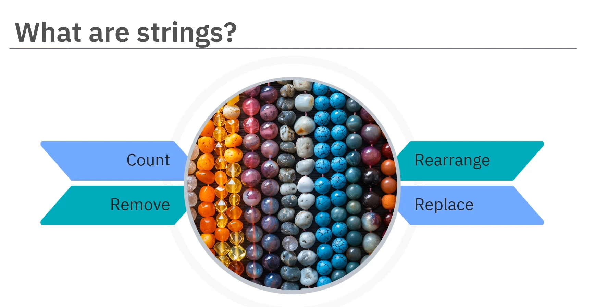
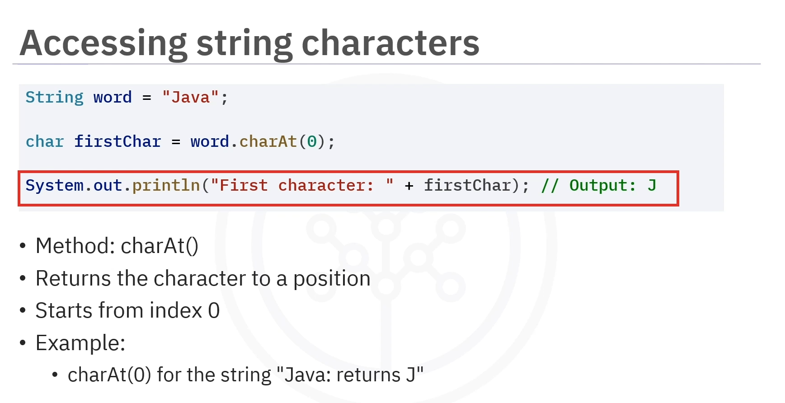
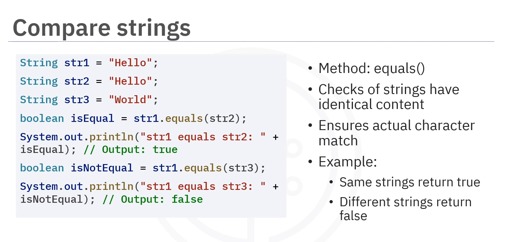
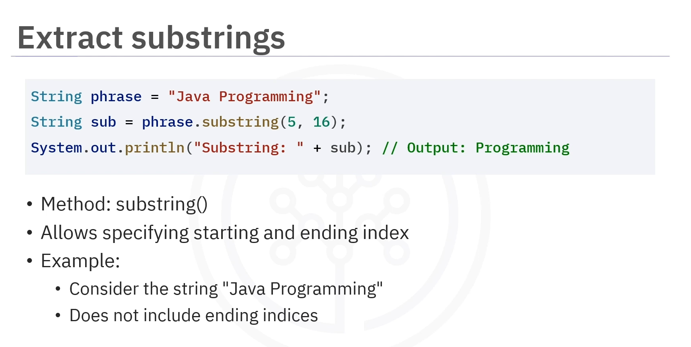
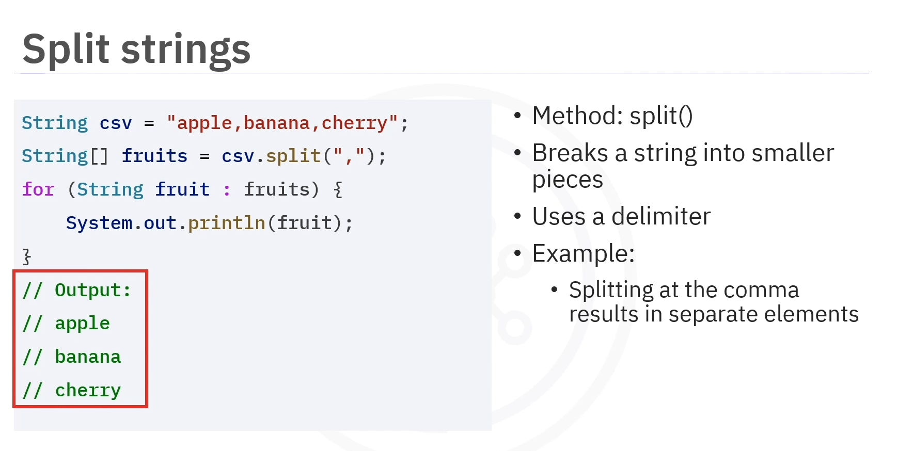
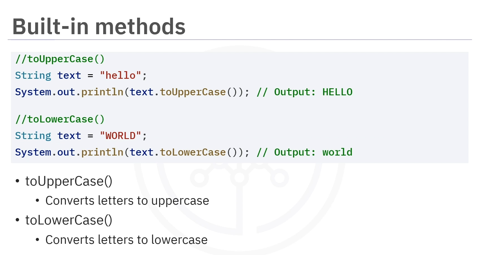
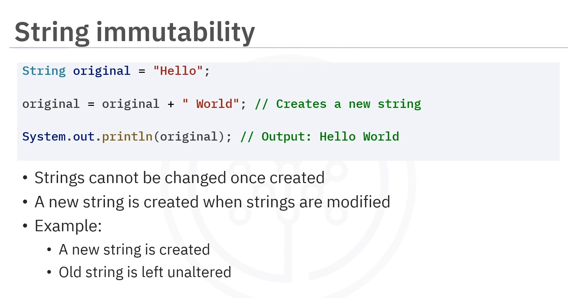

# 03-004 Working with Strings




-   **Strings** are sequences of characters, including spaces and punctuation
-   **Strings are immutable** – modifying them creates a new string
-   Strings can be created using **string literals** or the **`new` keyword**

String Methods:     
-   **`length()` method** returns the number of characters in a string
-   **`charAt()` method** retrieves a character at a specific index
-   **Concatenation** combines strings using `+` or `concat()` method
-   **`equals()` method** compares two strings for identical content
-   **`substring()` method** extracts a part of a string
-   **`split()` method** divides a string into smaller pieces
-   **`String.join()` method** combines strings with a separator

Built-in Methods:   
-   **`toUpperCase()`** and **`toLowerCase()`** convert case
-   **`trim()` method** removes leading and trailing spaces
-   **`.strip() method**, since Java 11, also removes them.
-   **`replace()` method** replaces characters or substrings


---
## What are Strings?


**A string is a sequence of characters, like a line of text in a book.** They include spaces and punctuation.   
For example, `"Hello, World!"` is a string with 13 characters.  



**Strings are essential in Java for handling text like names or messages.**  
Think of a string as a bead necklace where each bead represents a character, and the entire necklace represents the string, just as you can:
-   Count
-   Remove
-   Rearrange
-   Replace
... beads on the necklace, you can manipulate characters in a string to get the requested result.

---

## Creating Strings

Strings in Java can be created in two ways:
-   **String Literals**
-   `new`**Keyword**


Both methods create a string, though the **literal approach is more commonly used**.


### A -  String Literal

```java
String greeting = "Hello, World!";
```

### Using the `new` Keyword

```java
String greeting = new String("Hello, World!");
```

---

## Common String Methods

-   **.length()**
-   **.charAt()**
-   **.concat()**
-   **.equals()**
-   **.substring()**
-   **.split()**
-   **.join()**


-   **.toUpperCase()** / **.toLowerCase()**
-   **.trim()**
-   **.strip()**
-   **.replace()**

---

### `.length()` - String (char) Counting

**The `length()` method finds the number of characters in a string.** It returns the total number of characters, including spaces.


```java
String text = "Java Programming";


int length = text.length();  // Returns 16

System.out.println(length);  // Output: 16
```

##### `.length-1' as "Last Index Of" 

In Java, the last element of an array or string always has the index `length - 1`. 

Therefore, when you want to **access the last element without knowing its exact position**, instead of using `.lastIndexof()'  method, the `<array>.length - 1` should be used. 

It's a very common pattern in loops and data manipulation, especially when you need to traverse an array backwards or when you want to avoid `ArrayIndexOutOfBoundsException` errors.


---

### `charAt()` - String Counting

**The `charAt()` method is used to access individual characters from a string.** This method returns the character at a specific position, starting from index 0.



```java
String word = "Java";

char firstChar = word.charAt(0);  // Returns 'J'

System.out.println(firstChar);    // Output: J
```

---

### `.concat()` - String Concatenation

**Combining strings is known as concatenation.** This operation can be executed with the `+` operator or the `concat()` method, both of which yield the same output.


```java
String firstName = "John";
String lastName = "Doe";

// Using + Operator
String fullName1 = firstName + " " + lastName;

// Using .concat() method
String fullName2 = firstName.concat(" ").concat(lastName);


System.out.println(fullName1);  // Output: John Doe

System.out.println(fullName2);  // Output: John Doe
```

---

### `.equals()` - Strings Comparison

**Comparing strings is done using the `equals()` method, which checks if two strings have identical content.**  

The `equals()` method ensures that the actual characters in the strings match and is case-sensitive.



```java
String str1 = "Hello";
String str2 = "Hello";
String str3 = "World";


System.out.println(str1.equals(str2));  // Output: true

System.out.println(str1.equals(str3));  // Output: false
```

---

### `.substring()` - String Extraction

**Substrings within strings can be extracted using the `substring()` method.**  

It allows specifying a starting and ending index.  

The ending index is not included in the result.



#### Syntax
`<String>.substring(beginIndex: x, endIndex: y)`

```java
String text = "Java Programming";

String sub = text.substring(5, 16);  // Returns "Programming"

System.out.println(sub);             // Output: Programming
```

---

### `.split()` - String Destructuring

**Strings can be split up using the `split()` method, which breaks a string into smaller pieces based on a specified delimiter.**



```java
String items = "apple,banana,cherry";
String[] fruits = items.split(",");

for (String fruit : fruits) {
    System.out.println(fruit);
}
```

Output:
```
apple
banana
cherry
```

---

### `.join()` - Strings Combining

**Joining strings can also be done using the `String.join()` method.**  

If there is an array of strings and the goal is to combine them into one single string, this method allows specifying a separator.


#### Syntax
`String.join("<separator>", <varname>)`

```java
String[] colours = {"Red", "Green", "Blue"};

String result = String.join(", ", colours);

System.out.println(result);  // Output: Red, Green, Blue
```

---
### Built-in Methods

### `toUpperCase()` and `toLowerCase()` - Built-in Methods

**The `toUpperCase()` method converts all letters in a string to uppercase, and the `toLowerCase()` method converts all letters in a string to lowercase.**




```java
String text = "Hello World";

System.out.println(text.toUpperCase());   // Output: HELLO WORLD
System.out.println(text.toLowerCase());   // Output: hello world
```

---

### `trim()` - 

**The `trim()` method removes any extra spaces at the beginning or end of a string.**

```java
String text = "  Hello World  ";
String trimmed = text.trim();

System.out.println(trimmed);  // Output: Hello World
```

---

### `.strip()`

**The `strip()` method is similar to `trim()` but is more modern and flexible**.   


-   Whilst `.trim()` only removes ASCII whitespace characters (spaces, tabs, newlines) ...
-   ... `.strip()` removes all Unicode whitespace characters, making it more robust for international text.  

Additionally, Java 11 introduced:

-   **`stripLeading()`**:   removes whitespace from the beginning only
-   **`stripTrailing()`**:  removes it from the end only

```java
String text = "  Hello World  ";

String stripped = text.strip();           // Removes all leading and trailing whitespace

String leadingStripped = text.stripLeading();   // Removes only leading whitespace

String trailingStripped = text.stripTrailing(); // Removes only trailing whitespace
```

> `.strip()` and its variants are built-in methods available only from Java 11 onwards. For earlier versions, you must use trim().


---

### `replace()` Method

**The `replace()` method changes all instances of a character or substring to another.**

```java
String text = "Hello World";
String replaced = text.replace("World", "Java");

System.out.println(replaced);  // Output: Hello Java
```

---


## String Immutability



**Immutable means that, once an object or value is created, it cannot be changed or modified.**  

In Java, **strings are immutable.** If you try to modify it, a new string is created instead.

```java
String original = "Hello";
String modified = original + " World";

// original is still "Hello", a new string "Hello World" is created
System.out.println(original);  // Output: Hello
System.out.println(modified);  // Output: Hello World
```

---


---

## Lesson Speech

Welcome to this guide on working with strings in Java. After this guide, you'll be able to describe strings and explain common string operations. Imagine a bead necklace. Each bead represents a character, and the entire necklace represents the string. Just as you can count, remove, rearrange, and replace pearls on the necklace, you can manipulate characters in a string to get the requested result. **A string is a sequence of characters, like a line of text in a book.** They include spaces and punctuation.

For example, `"Hello, World!"` is a string with 13 characters. **Strings are essential in Java for handling text like names or messages.** Let's explore some common string operations. **Strings in Java can be created by enclosing text in double quotes as a string literal or by using the `new` keyword to create a string object.** For example, you can simply write `"Hello, World!"` as a literal or use the keyword `new String` with the same text to explicitly create an object.

**The `length()` method finds the number of characters in a string.** **It returns the total number of characters, including spaces.** For example, the string `"Java Programming"` has 16 characters. **Use the `charAt()` method to access individual characters from a string.** **This method returns the character at a specific position, starting from index 0.** For example, in the string `Java`, calling `charAt(0)` gives the first character.

**Combining strings is known as concatenation.** **This operation can be executed with the `+` operator or the `concat()` method, both of which yield the same output.** **Comparing strings is done using the `equals()` method, which checks if two strings have identical content.** **The `equals()` method ensures that the actual characters in the strings match and is case-sensitive.** For example, if `"Hello"` is compared to `"Hello"`, it returns `true`. However, comparing `"Hello"` to `"World"` returns `false`.

**Substrings within strings can be extracted using the `substring()` method.** **It allows specifying a starting and ending index.** For example, the string `"Java Programming"`, starting at index 5 and ending at index 16, extracts `"Programming"`. **The ending index is not included in the result.** **Strings can be split up using the `split()` method, which breaks a string into smaller pieces based on a specified delimiter.** For example, if a string contains data separated by commas, the `split()` method can divide it into individual parts. In the case of the string `"apple,banana,cherry"`, splitting it at each comma results in an array with three elements.

Similarly, **joining strings can also be done using the `String.join()` method.** If there is an array of strings and the goal is to combine them into one single string, this method allows specifying a separator. For example, joining the strings `"Red"`, `"Green"`, and `"Blue"` with a comma and space results in the string `"Red, Green, Blue"`. **Immutable means that, once an object or value is created, it cannot be changed or modified.** **In Java, strings are immutable.** **If you try to modify it, a new string is created instead.** For example, when `"Hello"` is combined with `"World"`, a new string `"Hello World"` is created rather than modifying the original string.

**Java has built-in methods for strings that help manipulate and process them.** **The `toUpperCase()` method converts all letters in a string to uppercase, and the `toLowerCase()` method converts all letters in a string to lowercase.** **The `trim()` method removes any extra spaces at the beginning or end of a string.** **The `replace()` method changes all instances of a character or substring to another.**

In this guide, you learned that **strings are sequences of characters**, including spaces and punctuation. **These strings can be created using string literals or the `new` keyword.** **The `length()` method returns the number of characters in a string.** **The `charAt()` method retrieves a character at a specific index.** **Strings can be concatenated using the `+` operator or the `concat()` method.** **The `equals()` method compares two strings for identical content.** **The `substring()` method extracts a part of a string.** **The `split()` method divides a string into smaller pieces.** **The `String.join()` method combines strings with a separator.** **Strings are immutable, meaning modifying them creates a new string.** Finally, **in Java, strings have several built-in methods.** **The `toUpperCase()` method converts a string to uppercase, whilst the `toLowerCase()` method converts it to lowercase.** **The `trim()` method removes spaces at the beginning or end of a string, and the `replace()` method replaces characters or substrings within a string.**
