# 03-006 Packages and Imports

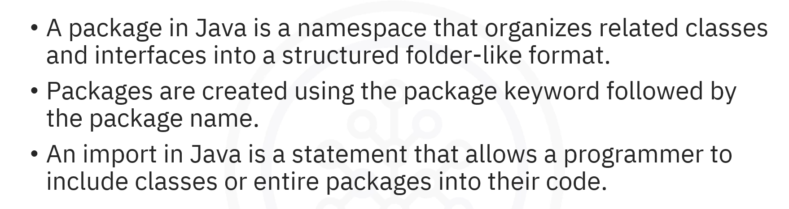 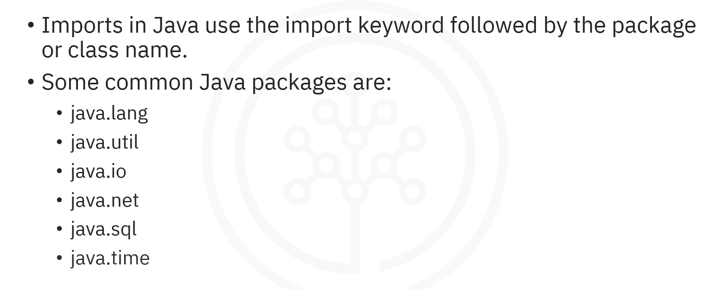

* **A package** is a namespace that organises related classes and interfaces into a structured folder-like format
* **Packages are created** using the `package` keyword followed by the package name
* **Packages provide:** organisation, namespace management, access control, and efficient file management
* **An import** is a statement that allows a programmer to include classes or entire packages into their code
* **Imports are done** using the `import` keyword followed by the package or class name
* **Common Java packages** include `java.lang`, `java.util`, `java.io`, `java.net`, `java.sql`, and `java.time`

***

## What are Packages?


**A package in Java serves as a namespace that organises and groups related classes and interfaces.**

Think of packages as meticulously organised record office cabinets—each cabinet holds related files for a specific department.\
Similarly, packages in Java act as these cabinets, organising related classes and interfaces into specific namespaces.

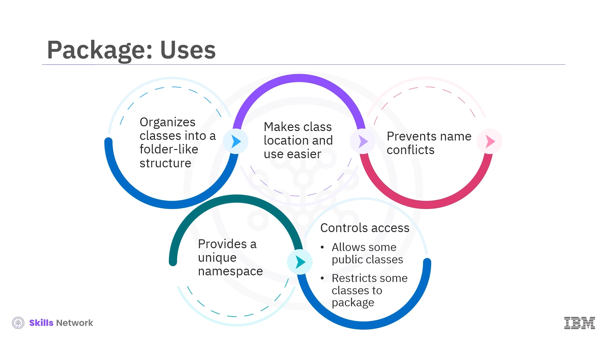

* **Packages help organise classes into a folder-like structure, making them easier to locate and use.**
* They also **prevent name conflicts by providing a unique namespace for each class**, allowing classes with the same name to exist in different packages.
* Additionally, **packages control access by allowing some classes to be public whilst restricting others to package-level visibility.**

### Benefits of Packages

* **Organisation:** Group related classes together
* **Namespace Management:** Prevent naming conflicts
* **Access Control:** Control visibility of classes
* **Project Structure:** Facilitate efficient file management in large-scale applications

***

## Creating Packages

**To create a package in Java, add the `package` keyword at the top of your file, followed by the package name.**

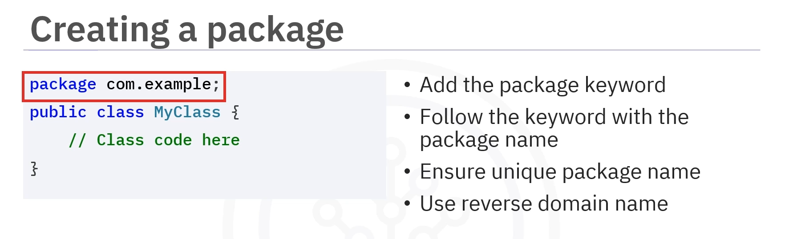

### Syntax

```java
package packageName;
```

### Best Practices

**To ensure uniqueness, use a reverse domain name as the package name.** For example, `com.example.shapes` or `org.mycompany.utilities`.

### Example


```java
package shapes;

public class Circle {
    
    private double radius;
    
    public Circle(double radius) {
    
        this.radius = radius;
    
    }
    
    public double area() {
    
        return Math.PI * radius * radius;
    
    }

}
```

* The package is declared as `shapes`
* A `Circle` class is defined within the package
* A private `radius` attribute stores the circle's radius
* The constructor initialises the radius
* The `area()` method calculates and returns the area

***

## Imports


**An import is a statement in Java that allows users to bring in classes or packages into their current file, making the code cleaner and more readable.**\
**It eliminates the need to type the full package name each time a class is used.**

### Syntax

```java
import packageName.ClassName;
```

### Importing a Single Class

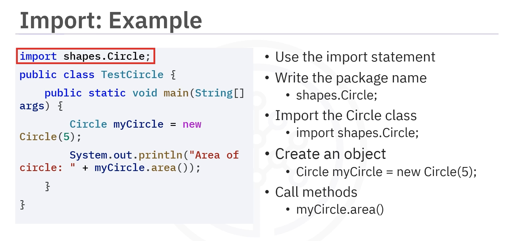

```java
import shapes.Circle;

public class Main {
    
    public static void main(String[] args) {
        
        Circle circle = new Circle(5);
        
        System.out.println("Area: " + circle.area());
    
    }
}
```

### Importing All Classes from a Package

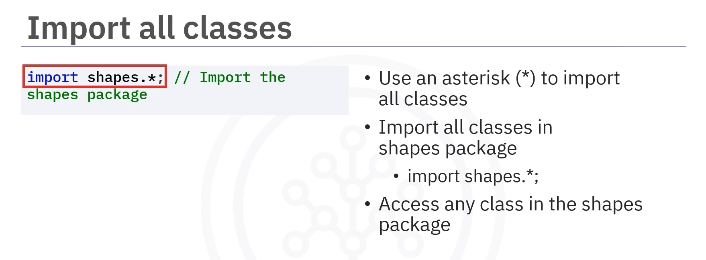

**All classes from a package can be imported by using an wildcard (\*):**

```java
import shapes.*;

public class Main {
    
    public static void main(String[] args) {
    
    Circle circle = new Circle(5);
    
        // Can now use any class from the shapes package
    
    }
}
```

***

## Built-in Java Packages

### `java.lang`

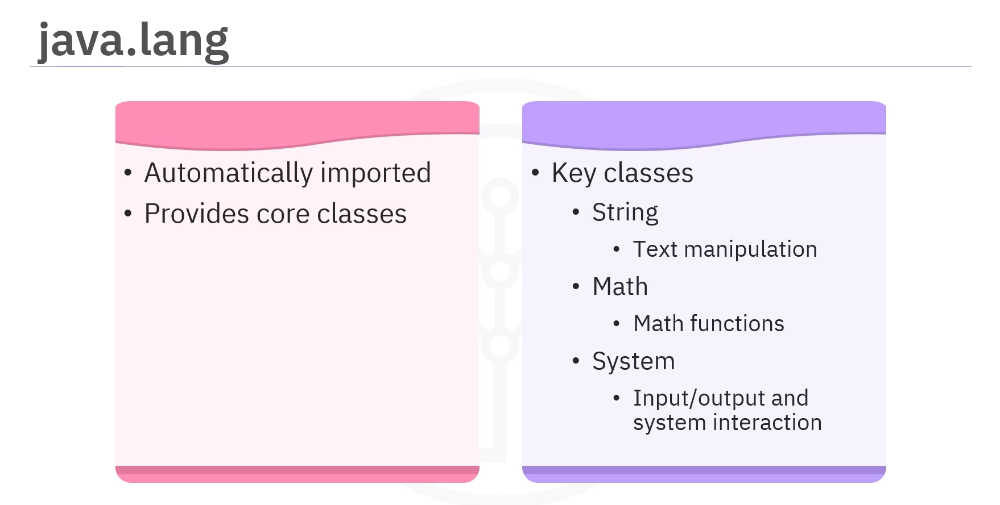

**The `java.lang` package is automatically imported and provides core classes for Java development.**

#### `java.lang` Key classes:

* **`String`** – Text manipulation
* **`Math`** – Mathematical functions
* **`System`** – Input/output and environment interaction

***

### `java.util`

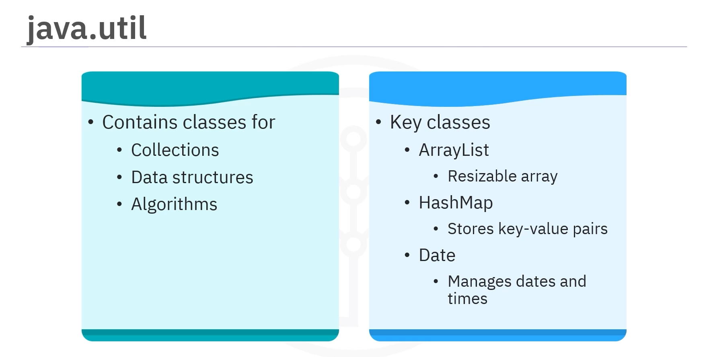

**The `java.util` package contains classes for collections, data structures, and algorithms.**

#### `java.util` Key classes:

* **`ArrayList`** – Resizable arrays
* **`HashMap`** – Key-value pair data storage
* **`Date`** – Managing dates and times

***

### `java.io`


**The `java.io` package enables input and output operations, including file handling and stream processing.**

#### `java.io` Key classes:

* **`File`** – Manages file paths and directories
* **`InputStream`** and **`OutputStream`** – Read and write byte streams
* **`BufferedReader`** – Efficiently reads text from input streams

***

### `java.net`

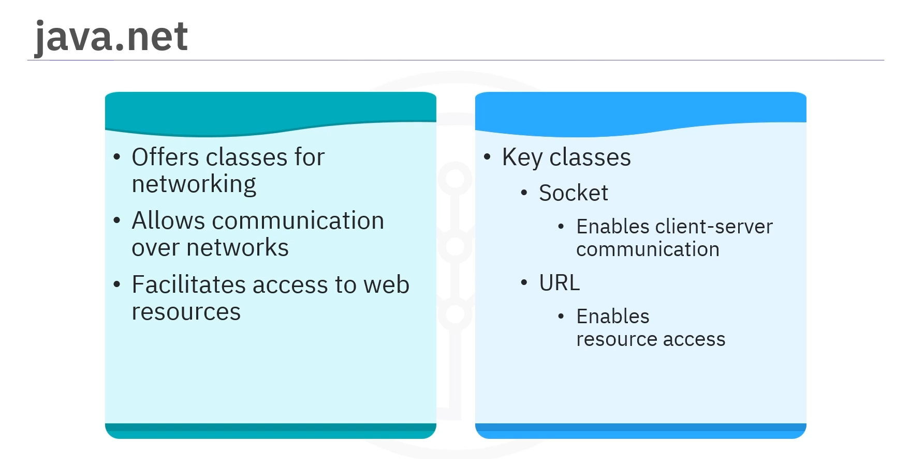

**The `java.net` package offers classes for networking, allowing communication over networks and access to web resources.**

#### `java.net` Key classes:

* **`Socket`** – Used for client-server communication
* **`URL`** – Represents a web address for accessing resources

***

### `java.sql`


**The `java.sql` package facilitates database connectivity and executing Structured Query Language (SQL) queries.**

#### `java.sql` Key classes:

* **`Connection`** – Establishes database connections
* **`Statement`** – Executes SQL commands

***

### `java.time`

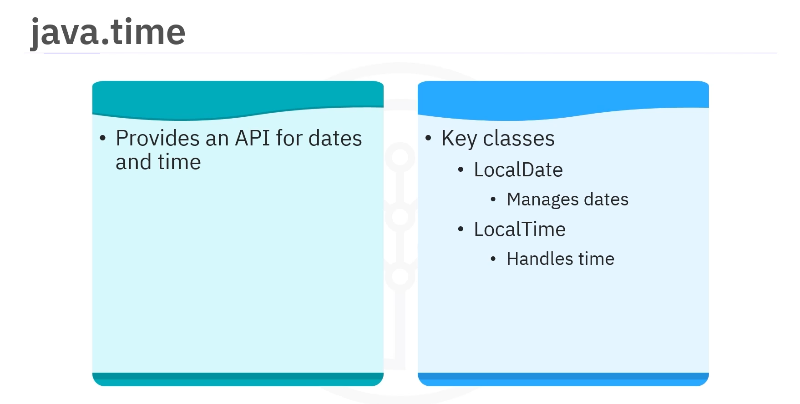

**The `java.time` package provides a modern API for handling dates and times.**

#### `java.time` Key classes:

* **`LocalDate`** – Manages dates without time zones
* **`LocalTime`** – Handles times without dates

***

## Best Practices for Packages and Imports

### Package Management


* **Use a unique naming convention** like your domain name in reverse
* **Group related classes together** logically
* **Keep package names short and clear** to facilitate easy package management

### Import Management

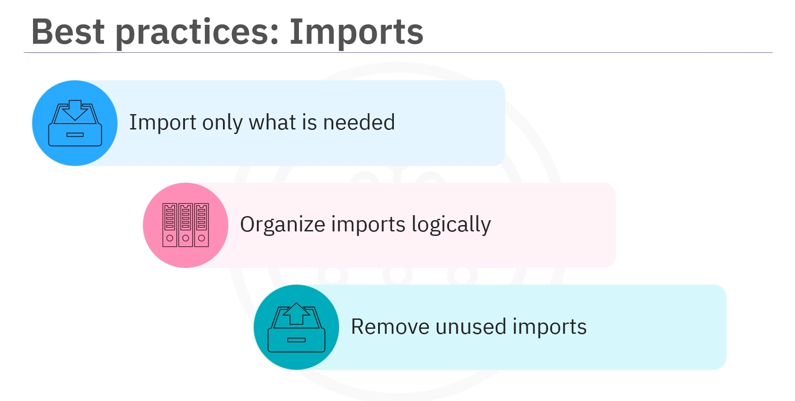

* **Import only what you need** instead of using wildcards
* **Organise imports logically** for better readability
* **Remove unused imports** to keep your code tidy and professional

***

## Lesson Speech

Welcome to this guide on using packages and imports. After this guide, you'll be able to describe packages and imports, explain the package creation and import process, and list important Java packages. Imagine entering a meticulously organised record office. Each department has its own labelled cabinets and related files are neatly stored within each cabinet. **Packages in Java act as these cabinets, organising related classes and interfaces into specific namespaces.** **A package in Java serves as a namespace that organises and groups related classes and interfaces.** **It facilitates efficient file management within a project, simplifying the development and maintenance of large-scale applications.**

**Packages in Java help organise classes into a folder-like structure, making them easier to locate and use.** **They also prevent name conflicts by providing a unique namespace for each class**, allowing classes with the same name to exist in different packages. Additionally, **packages control access by allowing some classes to be public whilst restricting others to package-level visibility.** **To create a package in Java, add the `package` keyword at the top of your file, followed by the package name.** If you wanted to create a package named `com.example`, add the `package` keyword at the top of your file, followed by the package name and a semi-colon. **To ensure uniqueness, use a reverse domain name as the package name.**

**To create a package in Java, first declare it at the top of your Java file using the `package` keyword, followed by the package name**, such as `package shapes`. **Next, define a class within the package**, in this case, a class called `Circle`. **Inside the class, declare a private attribute called the `radius`, which will store the circle's radius.** **The constructor will initialise the `radius` attribute when creating a new `Circle` object.** **Finally, implement the `area()` method to calculate and return the area of the Circle.**

Next, let's explore **imports.** **An import is a statement in Java that allows users to bring in classes or packages into their current file, making the code cleaner and more readable.** **It eliminates the need to type the full package name each time a class is used.** **To import a class in Java, you need to use the `import` statement, followed by the package name, a dot, and then the class name.** For example, you would write `import shapes.Circle` to use the `Circle` class from the shapes package. This tells Java to import the `Circle` class so that you can use it in your code. **Once you've imported it, you can create an object of the `Circle` class and use its methods.**

**You can import all classes from a package by using an asterisk.** **To import all classes in the shapes package, type `import shapes.*` followed by a dot and then an asterisk.** This allows you to use any class in the shapes package without importing them individually. **Java offers a range of built-in packages for various programming tasks.** **The `java.lang` package is automatically imported and provides core classes for Java development.** **Key classes in this package include `String` for text manipulation, `Math` for mathematical functions and `System` for input and output, and environment interaction.**

**Next, the `java.util` package contains classes for collections, data structures, and algorithms.** **Key classes include `ArrayList` for resizable arrays, `HashMap` for data in key-value pairs, and `Date` for managing dates and times.** **The `java.io` package enables input and output operations, including file handling and stream processing.** **Key classes in this package are `File`, which manages file paths and directories, `InputStream` and `OutputStream` for reading and writing byte streams, and `BufferedReader`, which efficiently reads text from input streams.**

**The `java.net` package offers classes for networking, allowing communication over networks, and access to web resources.** **Key classes include `Socket`, which is used for client-server communication, and `URL`, which represents a web address for accessing resources.** **The `java.sql` package facilitates database connectivity and executing Structured Query Language (SQL) queries.** **Key classes in this package are `Connection`, which establishes database connections, and `Statement`, which executes SQL commands.** **Lastly, the `java.time` package provides a modern API for handling dates and times.** **Key classes include `LocalDate`, which manages dates without time zones, and `LocalTime`, which handles times without dates.**

**Keeping your Java projects organised doesn't have to be hard.** **Use a unique naming convention like your domain name in reverse, group related classes together, and keep package names short and clear** to facilitate easy package management. Similarly, **clean and efficient imports are critical in Java coding.** **Import only what you need instead of using wildcards.** **Organise imports logically for better readability, and remove unused imports** to keep your code tidy and professional.

In this guide, you learned that **a package in Java is a namespace that organises related classes and interfaces into a structured folder-like format.** **Packages are created using the `package` keyword followed by the package name.** **An import in Java is a statement that allows a programmer to include classes or entire packages into their code.** **Imports in Java are done using the `import` keyword followed by the package or class name.** **Some common Java packages include `java.lang`, `java.util`, `java.io`, `java.net`, `java.sql`, and `java.time`.**
