# 03-007 Implementing Functions and Methods

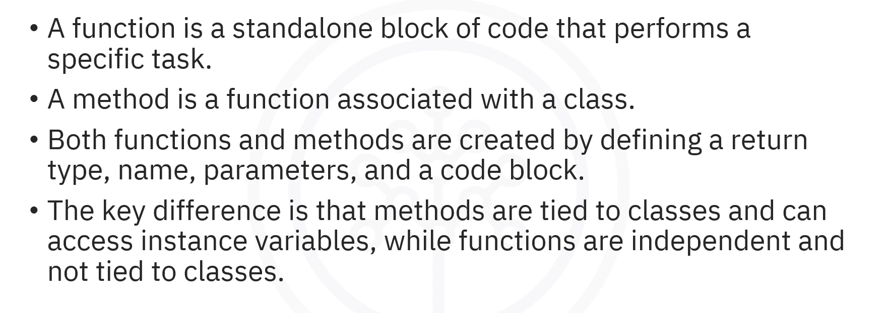


-   **A function** is a standalone block of code that performs a specific task
-   **A method** is a function associated with a class
-   **Function/Method structure** includes: return type, name, parameters, code block, and optional return statement
-   **Parameters** are variable definitions; **arguments** are actual values passed
-   **Return values** are the results provided by the function or method
-   **Method overloading** allows multiple methods with the same name but different parameters
-   **Scope** determines where identifiers are accessible (local, class, static)
-   **Void methods** perform actions without returning values
-   **Methods** are integral to object-oriented programming and can access class state


---

## What are Functions?

**A function is a block of code that performs a specific task, and helps organise, reuse, and improve the readability of code.**  

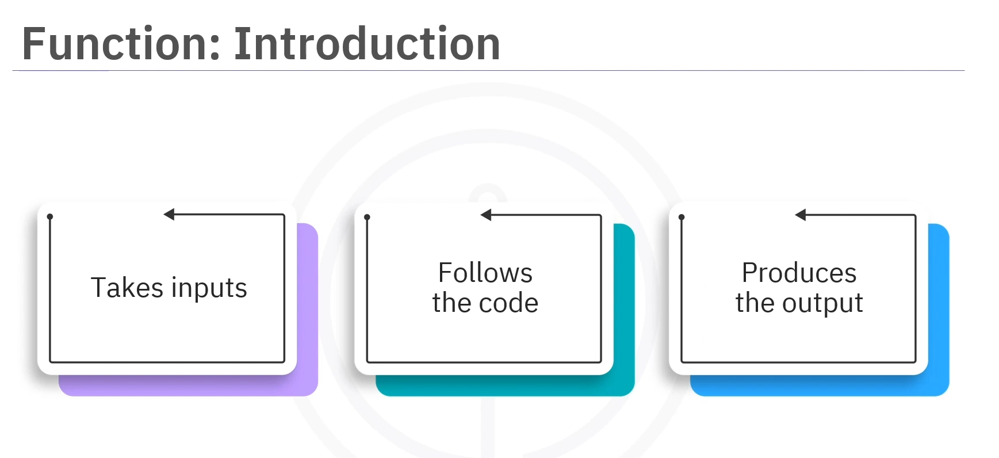
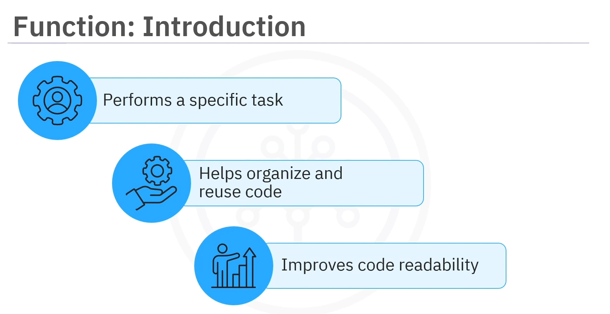

Think of a cookbook with countless recipes—each recipe is like a function. It takes specific ingredients as input, follows the steps outlined in the recipe as code, and produces a dish as the final output.


**In Java, a function is created using a specific structure that includes:**  

-   **Return type** – The type of value the function will return (e.g., `int`, `double`, `String`, or `void`)
-   **Function name** – Describes its purpose
-   **Parameters** – Optional inputs that allow data processing
-   **Code block** – Contains the logic to execute
-   **Return statement** – Optional, provides the function's output

### Syntax

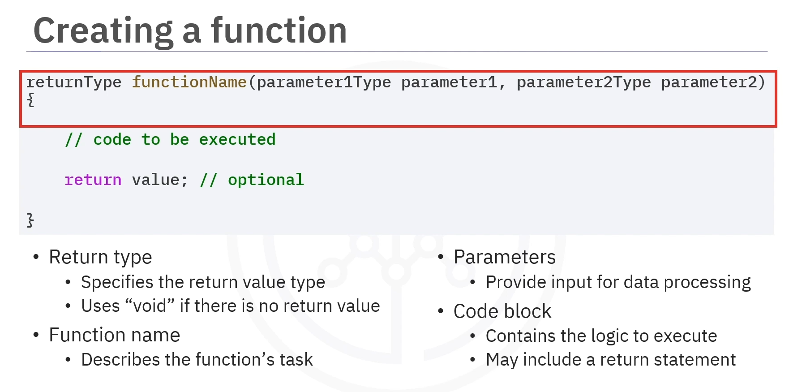

```java
[accessModifier] [static] returnType functionName(param1Type param1, param2Type param 2) {

    // codeblock
    
    return value;   // Optional, if no return, void func
    
}
```

### Example: Simple Function

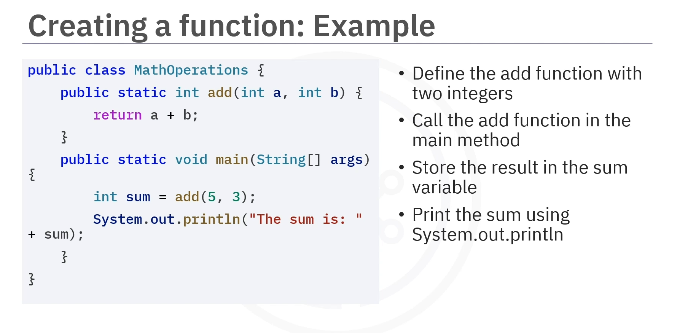

```java
public static int add(int a, int b) {
    
    return a + b;

}

public static void main(String[] args) {
    
    int sum = add(5, 3);
    
    System.out.println("Sum: " + sum);  // Output: Sum: 8

}
```

---

## What are Methods?


**A method is a function that is associated with a class.** **It defines the behaviour or actions that objects of that class can perform.**  

**The process of creating a method is similar to creating a function.**   

It includes defining the return type, method name, input parameters, and the code, with an optional return statement.

### Syntax

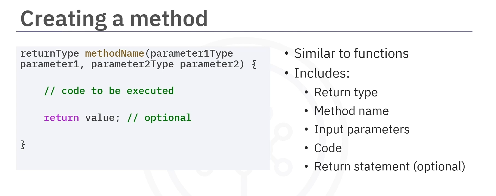


```java
[accessModifier] [static] returnType methodName(param1Type param1, param2Type param2) {

    // code block
    
    return value; // Optional, as in Functions
    
}
```

### Example: Method in a Class


```java
public class Calculator {

    public int multiply(int a, int b) {

        return a * b;
    
    }
}

public class Main {
    
    public static void main(String[] args) {
    
        Calculator calc = new Calculator();
        
        int result = calc.multiply(4, 5);
        
        System.out.println("Result: " + result);  // Output: Result: 20
    
    }

}
```

---

## Parameters and Arguments


*   **A parameter is a variable used to define the input type of a function or method.**  

*   **Arguments are the actual values passed to a function or method when called.**


### Example: Multiple Parameters


```java
public void greet(String name, int age) {

    System.out.println("Hello " + name + ", you are " + age + " years old!");

}

public static void main(String[] args) {

    greet("Alice", 30);  // Output: Hello Alice, you are 30 years old!

}
```

---

## Return Values


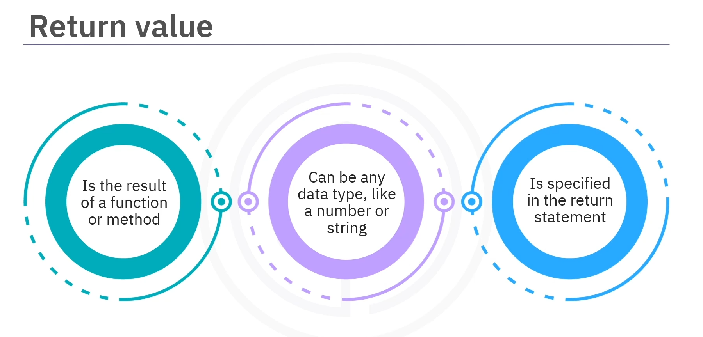

**A return value is the result that a function or method gives back after performing its task.**  

It can be any data type, such as a number or a string, and is **specified in the `return` statement**.

### Example: Calculating Area


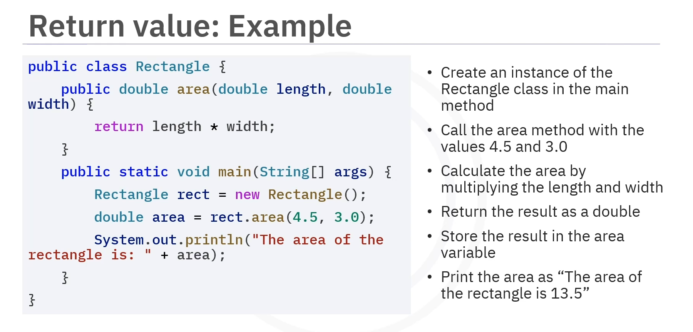

```java
public class Rectangle {

    public double area(double length, double width) {

        return length * width;
    
    }

}

public class Main {

    public static void main(String[] args) {
    
        Rectangle rect = new Rectangle();
        
        double area = rect.area(4.5, 3.0);
        
        System.out.println("Area: " + area);  // Output: Area: 13.5
    
    }
}
```

---

## Method Overloading


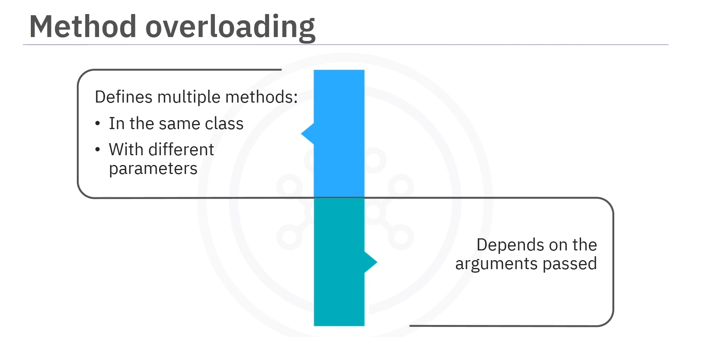

**Method overloading defines multiple methods with the same name in a class but with different parameters.**  

**The correct method is chosen based on the arguments passed when the method is called.**


### Example: Overloaded Methods


```java
public class Display {

    public void show(int num) {

        System.out.println("Number: " + num);
    
    }
    
    
    public void show(String text) {
    
        System.out.println("Text: " + text);
    }
}

public class Main {
    
    public static void main(String[] args) {
    
        Display display = new Display();
        
        display.show(10);              // Calls first show method
        display.show("Hello World");   // Calls second show method
    }
}
```


---

## Scope and Identifiers


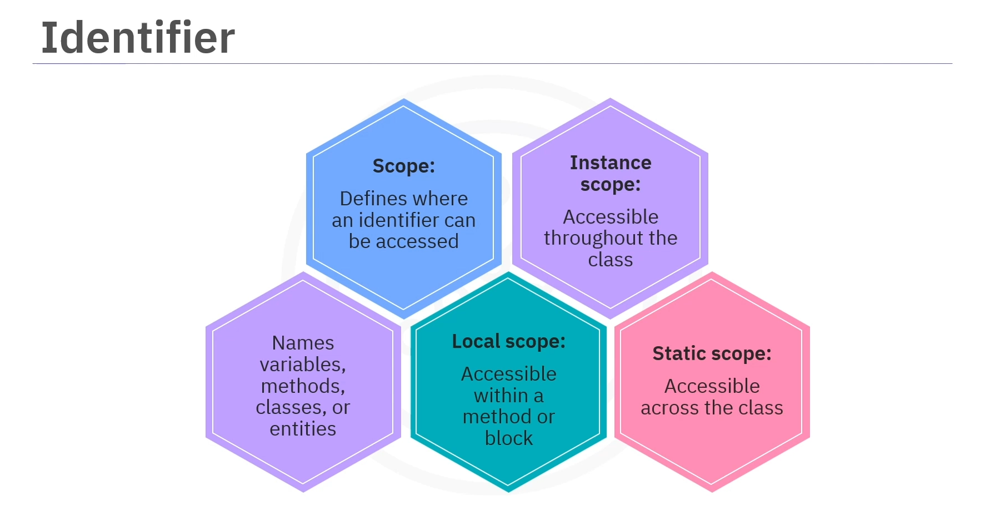

**An identifier in Java is a name given to a variable, method, class, or entity.**   
**The scope of an identifier refers to where in the programme it can be accessed.**

### Types of Scope

| Scope | Description | Example |
|-------|-------------|---------|
| **Local Scope** | Identifiers accessible only within a method or block | Variables inside a method |
| **Class Scope** | Variables declared in a class but outside methods; accessible throughout the class | Instance variables |
| **Static Scope** | Static variables belong to the class and are accessible throughout the class | `static` variables |

---

## Void Methods

**A void method acts without returning a value.** It performs an action but does not return any result.


### Example: Void Method

```java
public void printMessage() {
    
    System.out.println("Hello World");

    }

public static void main(String[] args) {
    
    printMessage();  // Output: Hello World

}
```

---

## Functions vs. Methods

> **Methods are tied to classes and can access instance variables, whereas functions are independent and not tied to any class.**


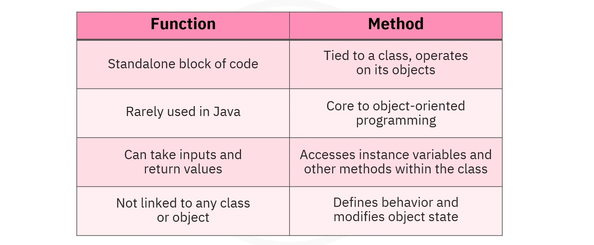

| Aspect | Function | Method |
|--------|----------|--------|
| **Definition** | Standalone block of code | Function associated with a class |
| **Class Association** | Not tied to a class | Integral part of a class |
| **Object Access** | Cannot directly access instance variables | Can access instance variables and other methods |
| **Usage in Java** | Rarely used independently | Central to object-oriented programming |
| **Scope** | Independent scope | Access to class variables and methods |


---

## Lesson Speech

Welcome to this video on implementing functions and methods. After watching this video, you'll be able to describe functions, methods and their classifications. You'll also be able to explain the process of creating functions and methods and differentiate between the two. Imagine a cookbook with countless recipes. Each recipe is like a function. **It takes specific ingredients as input, follows the steps outlined in the recipe as code, and produces a dish as the final output.** **A function is a block of code.** **It performs a specific task, and helps organise, reuse, and improve the readability of code.**

**In Java, a function is created using a specific structure that includes the return type, the function name, and optional parameters, followed by a code block.** **The return type indicates the type of value the function will return, such as `int`, `double`, or `String`.** **If no value is returned, the function is known as `void`.** **The function name describes its purpose, whilst parameters, if any, serve as the function's inputs, allowing data processing.** **The code block contains the logic to execute, and an optional `return` statement provides the function's output.**

Let's consider an instance where a simple function is created to add two numbers. **The `add()` function takes two integers, `a` and `b`, as parameters, and returns their sum.** In the `main` method, the `add()` function is called with the values 5 and 3, and the result is stored in the variable called `sum`. Finally, the sum is printed using `System.out.println()`.

Now let's explore **methods in Java programming.** **To illustrate methods, let's consider an example where a method is created within a class.** **The `multiply()` method belongs to the `Calculator` class.** In the `main` method, an instance of the `Calculator` class is created to call the `multiply()` method. **A method is a function that is associated with a class.** **It defines the behaviour or actions that objects of that class can perform.** **The process of creating a method is similar to creating a function.** **It includes defining the return type, method name, input parameters, and the code, with an optional `return` statement.**

Now let us say **a parameter is a variable used to define the input type of a function or method.** **These statements are the actual values passed to a function or method when called.** Let's consider an example with multiple parameters. In this example, **the `greet()` method takes two inputs**: a `String` for the person's name and an `int` for the person's age. **These inputs define what values the method expects.** When the method is called in the `main` method, it receives the value `Alice` and `30`. **The method then uses these values to print a personalised greeting:** `Hello Alice, you are 30 years old`.

**A return value is the result that a function or method gives back after performing its task.** **It can be any data type, such as a number or a string, and is specified in the `return` statement.** In this example, **the area of a rectangle is calculated.** In the `main` method, an instance of the `Rectangle` class is created, and the `area()` method is called with the values `4.5` and `3.0`. The result is stored in the `area` variable, and the area of the rectangle is printed as `The area of the rectangle is 13.5`.

**Method overloading defines multiple methods with the same name in a class but with different parameters.** **The correct method is chosen based on the arguments passed when the method is called.** Let us consider an instance where the `Display` class has two `show()` methods with different parameter types. **The first `show()` method takes an `int` as a parameter and prints the number, whilst the second takes a `String` and prints the text.** In the `main` method, an instance of the `Display` class is created, and both `show()` methods are called with different arguments, one with the number `10` and the other with the text `Hello World`. **This demonstrates method overloading, where methods share the same name but have different parameter types.**

**An identifier in Java is a name given to a variable, method, class, or entity.** **The scope of an identifier refers to where in the programme it can be accessed.** **In Java, there are different types of scope.** **Local scope**, where identifiers are accessible only within a method or block. **Class scope**, where variables are declared in a class but outside methods are accessible throughout the class. **Static scope**, where static variables belong to the class and are accessible throughout the class.

**A void method acts without returning a value.** For example, **the `printMessage()` method prints `Hello World` but returns nothing.** **In Java, a function is a standalone block of code that performs a specific task and can exist independently**, although they are not commonly used in Java. **Functions can take inputs, perform operations, and return values but are not directly tied to a class or object.**

**On the other hand, methods are functions associated with a class and operate on objects of that class.** **Methods are integral to object-oriented programming as they can access instance variables and other methods within the class, enabling them to interact with and modify the state of the objects.** **Methods play a central role in defining the behaviour of objects in Java.**

In this video, you learned that **a function is a standalone block of code that performs a specific task, whilst a method is a function associated with a class.** **Both functions and methods are created by defining a return type, name, parameters, and a code block.** **The key difference between the two is that methods are tied to classes and can access instance variables, whereas functions are independent and not tied to any class.**
