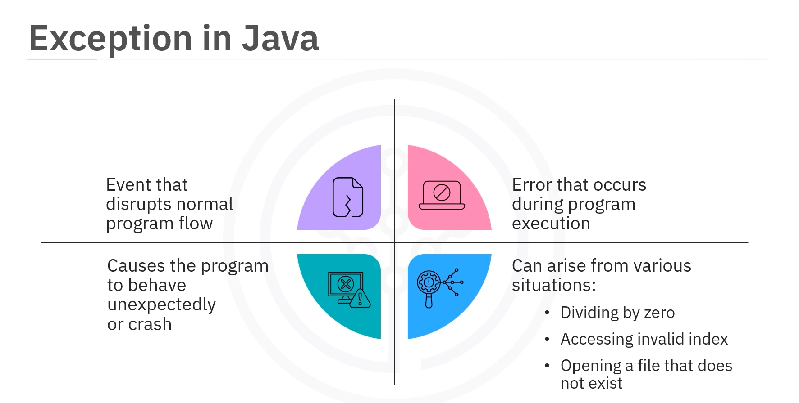
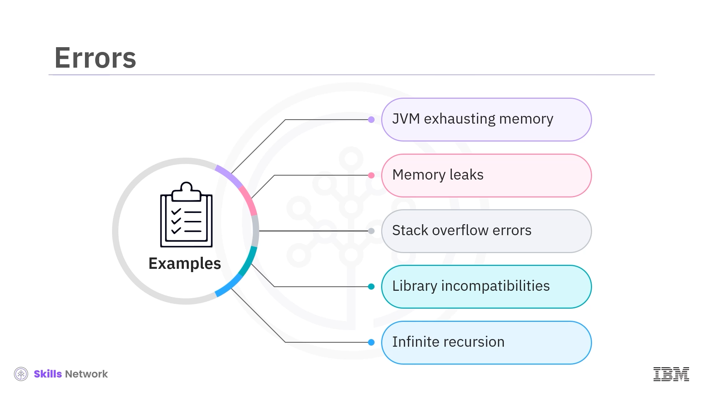
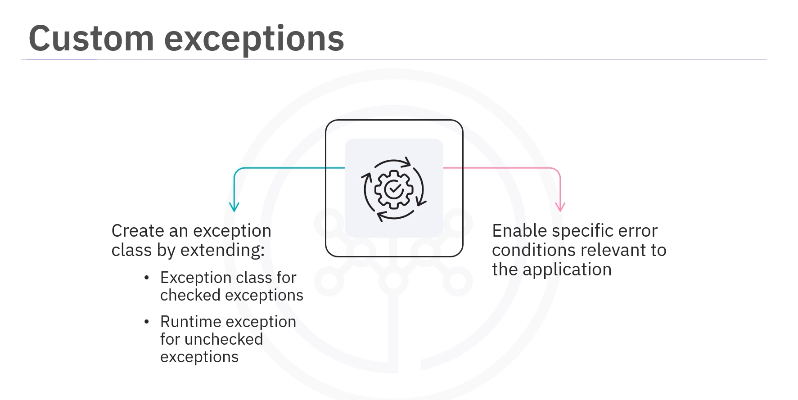
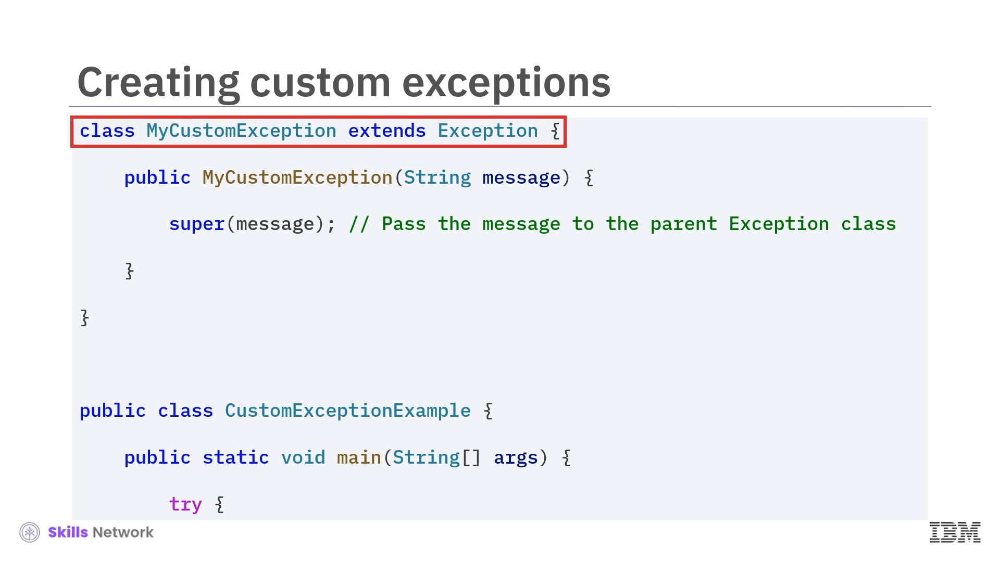
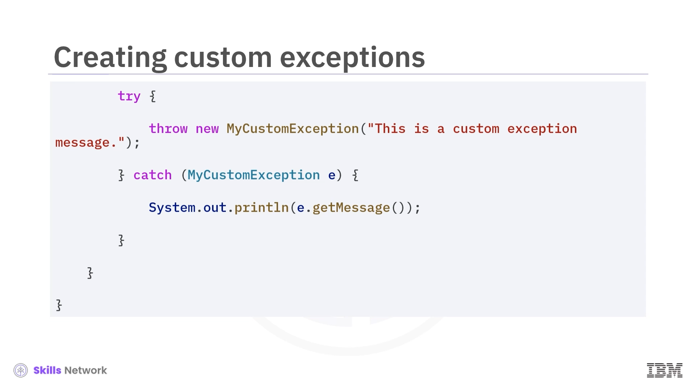
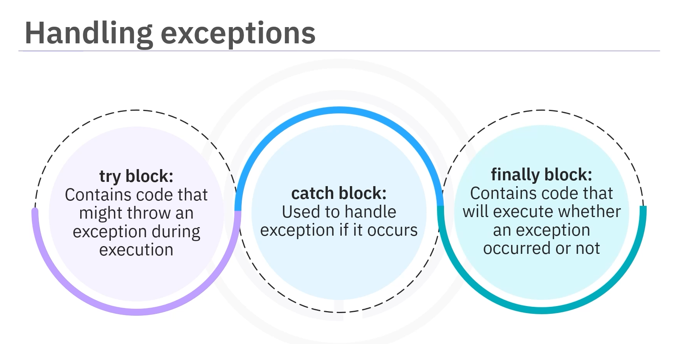

# 04-001 Exceptions/Errors


* **An exception** is an event that disrupts the normal flow of a program
* **Exceptions** provide a way to handle errors gracefully without crashing the program
* **An error** signals a critical issue that a reasonable application should not attempt to catch as it lies outside the programmer's control
* **Checked exceptions** are exceptions that the compiler checks at compile time
* **Unchecked exceptions** are exceptions that are not checked by the compiler at compile time
* **Custom exceptions** can be created by extending the `Exception` class for checked exceptions or `RuntimeException` for unchecked exceptions
* **`try`, `catch`, and `finally` blocks** provide a robust mechanism for handling exceptions

***

**An exception is an event that disrupts the normal flow of a program.**



It is an error that occurs during the execution of a program, which can cause it to behave unexpectedly or crash.

Exceptions can arise from various situations, such as... :

* Trying to divide by zero
* Acessing an invalid index in an array
* Attempting to open a file that does not exist

### The Role of Exceptions in Java

.png>)

**Exceptions in Java provide a way to handle errors gracefully without crashing the program.**

Instead of letting the program terminate abruptly, you can **catch these exceptions** and **take the appropriate actions**, such as displaying error messages or attempting to recover from the error.

### Common Causes of Exceptions

Exceptions can occur for several reasons including:

.png>)

* Invalid user input
* Device malfunction
* Disruption of network connectivity
* Out-of-bounds access
* `null` reference issues
* Type mismatches
* Attempting to open an unavailable file
* Database-related errors
* Arithmetic mistakes

***

## Errors vs. Exceptions

.png>)

* **Errors signify serious conditions that cannot be recovered from.** They are usually related to the environment in which the application is running. These errors typically lie **outside of the programmer's control**, and **attempts to handle them should be avoided**.

.png>)

* **An error catches a critical issue that a reasonable exception should not attempt to catch.**
* **An exception denotes situations that a reasonable application might try to catch.**

### Examples of Errors



* JVM exhausting memory
* Memory leaks
* Stack overflow errors
* Library incompatibilities
* Infinite recursion

***

## Types of Exceptions

* **CHECKED** Exceptions
* **UNCHECKED** Exceptions
* **CUSTOM** Exceptions

***

## Checked Exceptions

**Exceptions that the compiler checks at compile time.**

.png>)

You must handle these exceptions either with a `try-catch` block or declare them in the method signature using the `throws` keyword.

### Examples of Checked Exceptions

.png>)

* **`IOException`** – Occurs when there is an input-output operation failure, such as reading from a file that doesn't exist
* **`SQLException`** – Related to database access errors, such as when executing SQL statements
* **`ClassNotFoundException`** – Thrown when an application tries to load a class by its name but cannot find it

***

## Unchecked Exceptions

.png>)

**Exceptions that are not checked by the compiler at compile time.**

They usually indicate programming errors and can be avoided by writing **correct code**.

### Examples of Unchecked Exceptions

.png>)

* **`NullPointerException`** – Occurs when an application attempts to use a `null` object reference, such as calling a method on a `null` object
* **`ArrayIndexOutOfBoundsException`** – Thrown when trying to access an array with an index that is either negative or greater than or equal to the array's size
* **`ArithmeticException`** – Occurs when an exceptional arithmetic condition occurs, such as dividing by zero
* **`IllegalArgumentException`** – Thrown to indicate that a method has been passed an illegal or inappropriate argument

***

## Custom Exceptions



**Custom exceptions are when you create your own exception classes in Java by extending the `Exception` class for checked exceptions or `RuntimeException` for unchecked exceptions.**

This allows you to define specific error conditions relevant to your application.

### Example: Custom Exception Class



```java
public class MyCustomException extends Exception {

    public MyCustomException(String message) {

        super(message);
    
    }

    }
```

### Using a Custom Exception



```java
public class Main {
    
    public static void main(String[] args) {
        
        // Try - Catch
        try {
            
            throw new MyCustomException("This is a custom error message");
        
        } catch (MyCustomException e) {
        
            System.out.println(e.getMessage());
        
        }
    
    }
}
```

***

## Exception Handling: Try, Catch, and Finally

**Java provides a robust block mechanism for handling exceptions:**

* `try`
* `catch`
* `finally`



### `try` Block

**The `try` block contains code that might throw an exception during execution.**

### `catch` Block

**The `catch` block handles the exception if it occurs.** Multiple `catch` blocks can be used to handle different types of exceptions.

### `finally` Block

**The `finally` block contains code that will execute regardless of whether an exception occurred or not.**\
It is often used for cleanup operations, such as closing files or releasing resources.

### Syntax

```java
try {

    // Code that might throw an exception

} catch (ExceptionType1 e) {
    
    // Handle exception type 1

} catch (ExceptionType2 e) {
    
    // Handle exception type 2

} finally {

    // Cleanup code (always executes)

}
```

### Example: Division by Zero

In this example:

1. The `try` block attempts to divide by zero, which throws an `ArithmeticException`
2. The `catch` block catches this exception and prints an error message
3. The `finally` block executes regardless of whether an exception occurred or not

```java
int numerator = 10;
int denominator = 0;

try {
    
    int result = numerator / denominator;
    System.out.println("Result: " + result);

} catch (ArithmeticException e) {
    
    System.out.println("Error: Cannot divide by zero");

} finally {

    System.out.println("Arithmetic operation attempted");

}
```

***

## Lesson Speech

Welcome to this video that introduces you to exceptions in Java. After watching this video, you'll be able to define exceptions in Java and describe different types of exceptions. You will also be able to explain how to handle exceptions. **Java is a versatile programming language enabling the creation of robust applications.** **One of the key features of Java is its exception handling mechanism.** **An exception is an event that disrupts the normal flow of a program.** **It is an error that occurs during the execution of a program, which can cause it to behave unexpectedly or crash.** Exceptions can arise from various situations, such as trying to divide by zero, accessing an invalid index in an array, or attempting to open a file that does not exist.

Let's understand the role of exceptions in Java. **Exceptions in Java provide a way to handle errors gracefully without crashing the program.** Instead of letting the program terminate abruptly, you can catch these exceptions and take the appropriate actions, such as displaying error messages or attempting to recover from the error. **Exceptions can occur for several reasons including invalid user input, device malfunction, disruption of network connectivity, out-of-bounds access, `null` reference issues, type mismatches, attempting to open an unavailable file, database-related errors, and arithmetic mistakes.** Just like exceptions, you also have something called errors. **Errors signify serious conditions that cannot be recovered from.** They are usually related to the environment in which the application is running. **These errors typically lie outside of the programmer's control, and attempts to handle them should be avoided.**

Examples include Java Virtual Machine (JVM) exhausting memory, memory leaks, stack overflow errors, library incompatibilities, infinite recursion, and more. **It is important to understand the difference between errors and exceptions.** **An error catches a critical issue that a reasonable exception should not attempt to catch.** **On the other hand, an exception denotes situations that a reasonable application might try to catch.** **Exceptions can be of different types.** **Checked exceptions are exceptions that the compiler checks at compile time.** **You must handle these exceptions either with a `try-catch` block or declare them in the method signature using the `throws` keyword.**

Let's look at some examples. **The `IOException` occurs when there is an input-output operation failure**, such as reading from a file that doesn't exist. **The `SQLException` is related to database access errors**, such as when executing SQL statements. **The `ClassNotFoundException` is thrown when an application tries to load a class by its name but cannot find it.** **Unchecked exceptions are exceptions that are not checked by the compiler at compile time.** They usually indicate programming errors and can be avoided by writing correct code. Here are some examples. **The `NullPointerException` occurs when an application attempts to use a `null` object reference**, such as calling a method on a `null` object.

**The `ArrayIndexOutOfBoundsException` is thrown when trying to access an array with an index that is either negative or greater than or equal to the array's size.** **An `ArithmeticException` occurs when an exceptional arithmetic condition occurs**, such as dividing by zero. Finally, **the `IllegalArgumentException` is thrown to indicate that a method has been passed an illegal or inappropriate argument.** **Custom exceptions are when you create your own exception classes in Java by extending the `Exception` class for checked exceptions or `RuntimeException` for unchecked exceptions.** This allows you to define specific error conditions relevant to your application.

**Java provides a robust mechanism for handling exceptions using the `try`, `catch`, and `finally` blocks.** **The `try` block contains code that might throw an exception during execution.** **The `catch` block handles the exception if it occurs.** **Multiple `catch` blocks can be used to handle different types of exceptions.** **The `finally` block contains code that will execute regardless of whether an exception occurred or not.** **It is often used for cleanup operations, such as closing files or releasing resources.**

Let's look at a simple example where we divide two numbers and handle the possibility of division by zero. In this example, you attempt to divide the numerator by the denominator. Since the denominator is zero, it throws an `ArithmeticException`. **The `catch` block catches this exception and prints an error message.** **The `finally` block executes regardless of whether an exception occurred or not**, ensuring that any necessary cleanup can happen. Sometimes you may want to create your own exception types. **You can do this by extending the `Exception` class.** Here's how to create a custom exception. **Create a custom exception class named `MyCustomException` that extends `Exception`.** **The constructor takes a string message and passes it to the superclass's constructor.**

In the `main` method, throw your custom exception and catch it in a `catch` block, printing the custom message. In this video, you learned that **an exception is an event that disrupts the normal flow of a program.** **Exceptions provide a way to handle errors gracefully without crashing the program.** **An error signals a critical issue that a reasonable application should not attempt to catch** as it lies outside the programmer's control. **There are different types of exceptions in Java.** **Checked exceptions are exceptions that the compiler checks at compile time.** **Unchecked exceptions are exceptions that are not checked by the compiler at compile time.**

**You can customise exception classes in Java by extending the `Exception` class for checked exceptions or `RuntimeException` for unchecked exceptions.** Finally, you learned that **Java provides a robust mechanism for handling exceptions using the `try`, `catch`, and `finally` blocks.**
