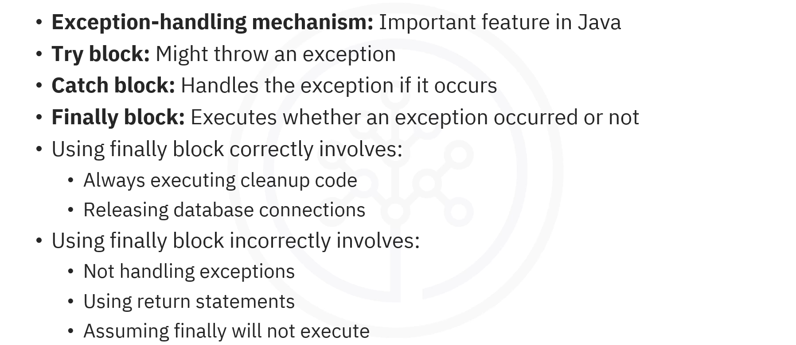

# 04-002 Using finally Blocks



* **The `finally` block** contains code that will execute regardless of whether an exception occurred or not
* **`finally` always executes** after the `try` and `catch` blocks, unless the program crashes or is forcibly terminated
* **Correct usage** involves using `finally` for cleanup code and releasing resources (files, database connections, etc.)
* **Incorrect usage** includes:
* ```
  Not handling exceptions within the `finally` block
  ```
* ```
  Using `return` statements in `finally`, which override previous returns
  ```
* ```
  Assuming the `finally` block won't execute after an exception
  ```
* **Resource management** is the primary purpose of the `finally` block, ensuring resources are always properly released

***

## What is a `finally` Block?

**The `finally` block is a crucial part of exception handling in Java.**\
Contains code that will execute regardless of whether an exception occurred or not.

### Structure of Exception Handling

.png>)

```java
try {
    
    // Code that might throw an exception

} catch (ExceptionType e) {
    
    // Handle the exception

} finally {
    
    // Code that always executes
}
```

***

## Key Characteristics of `finally` Blocks

.png>)

> **The code within the `finally` block always runs after the `try` and `catch` blocks regardless of whether an exception was thrown or caught.**

> **The `finally` block is commonly used for resource management such as closing files or releasing resources, ensuring that these operations are performed no matter what happens in the try-catch structure.**

### `finally` Block Structure


```java
try {

    int result = 10 / 0;  // Causes ArithmeticException

} catch (ArithmeticException e) {

    System.out.println("Caught an exception: division by 0");

} finally {

    System.out.println("Finally block executed");

    }
```

.png>)

***

## Correct Usage of `finally` Blocks

### Purpose

The **primary purpose** of the `finally` block is ...

> **... to ensure that cleanup code runs regardless of whether an exception was thrown or not ...**

> **... preventing, in instance, resource leaks.**

### Example 1: Closing Files

.png>)

```java
try {

    // Attempt to open and read a file
    
    FileReader file = new FileReader("example.txt");
    
    // Read file operations
    
    
} catch (FileNotFoundException e) {

    System.out.println("File not found");
    
} finally {

    
    
    file.close(); // Ensure file is closed safely
}
```

***

### Example 2: Closing Database Connections

.png>)

**The `finally` block ensures the database connection is properly closed, preventing potential memory leaks or locking issues.**

```java
try {

    // Establish a database connection
    Connection connection = DriverManager.getConnection("jdbc:mysql://localhost:3306/db", "user", "password");
    
    // Perform database operations
    
    
} catch (SQLException e) {

    System.out.println("Database error: " + e.getMessage());
    
} finally {

    
    connection.close();   // Ensure database connection is closed
    
}
```

***

## Incorrect Usage of `finally` Blocks

### Mistake 1: Not Handling Exceptions Within `finally`

**If an exception occurs in the `finally` block, it may suppress exceptions thrown in the `try` or `catch` blocks.**

.png>)

```java
try {

    int result = 10 / 0;  // Causes ArithmeticException
    
} catch (ArithmeticException e) {

    System.out.println("Caught an exception: division by 0");
    
} finally {


    int result = 10 / 0;  // Another exception occurs here
    System.out.println("Finally block executed");
}
```

**In this case, if an exception occurs in the `finally` block, it can prevent the original exception from being handled properly, making debugging difficult.**

***

### Mistake 2: Using `return` Statements in `finally`

**Using a `return` statement inside a `finally` block can lead to unexpected behaviour as it overrides any return statements from the `try` or `catch` blocks.**

.png>)

```java
public static int testMEthod() {

    try {
    
        return 1;
        
    } catch (Exception e) {
    
        return 2;
        
    } finally {
    
        return 3;  // This overrides previous return statements
        
    }
}

```

Even though there are returns in both the `try` and `catch` blocks, the `finally` block's `return` statement takes precedence, leading to the output being always 3. This can lead to unexpected outcomes and should be avoided.

***

### Mistake 3: Assuming `finally` Won't Execute After an Exception

**A common misconception is that if an exception occurs, the `finally` block will not execute. This is incorrect.**

.png>)

**The `finally` block will always execute unless the program crashes or is forcibly terminated.**

```java
try {

    int result = 10 / 0;  // Causes ArithmeticException
    
} catch (ArithmeticException e) {

    System.out.println("Caught an exception: division by 0");
}

// If there's no finally block, cleanup must be done manually !
```

**Without a `finally` block, there's no guaranteed cleanup such as closing resources, which can lead to resource leaks.**

***

## Lesson Speech

Welcome to this video about how to use `finally` blocks in Java. After watching this video, you'll be able to describe the `finally` block in Java. You'll also be able to explain its correct and incorrect usage. **One important feature of Java is its exception handling mechanisms, which include the `try`, `catch`, and `finally` blocks.** Here you can see the structure of the exception handling mechanism. **The `try` block contains code that might throw an exception.** **The `catch` block contains code that handles the exception if it occurs.** **The `finally` block contains code that will execute regardless of whether an exception occurred or not.**

**The `finally` block is a crucial part of exception handling in Java.** Let's understand its key characteristics. **The code within the `finally` block always runs after the `try` and `catch` blocks regardless of whether an exception was thrown or caught.** **The `finally` block is commonly used for resource management such as closing files or releasing resources**, ensuring that these operations are performed no matter what happens in the `try-catch` structure. Let's look at a simple example to illustrate how the `finally` block works. The `try` block contains code that tries to divide 10 by 0, which causes an `ArithmeticException`. **The `catch` block catches this specific exception and prints a message.** **Regardless of whether the exception occurred, the `finally` block executes** and prints, "finally block executed".

The output is, "in try block", "caught an exception: division by 0", and "finally block executed". While the `finally` block is a powerful feature for resource management and exception handling, it is important to be aware of its correct and incorrect usage. Let's first look at the correct usage. **The primary purpose of the `finally` block is to ensure that cleanup code runs regardless of whether an exception was thrown or not.** Here's an example. **The `try` block attempts to open and read a file `example.txt`.** If there is a problem such as file not found, the `catch` block prints an error message. **The `finally` block ensures the file is closed safely, preventing resource leaks.** If closing fails, another error message is shown.

**Using the `finally` block to close database connections is another common and correct practice.** Here, the Java program connects to a MySQL database, performs operations, and ensures the connection is properly closed. **The `try` block attempts to establish a database connection.** If there is an error such as wrong credentials or connection failure, **the `catch` block prints an error message.** **The `finally` block ensures the database connection is closed, preventing potential memory leaks or locking issues.**

Next, let's see a few ways in which the `finally` block is used incorrectly. **One common mistake is not handling exceptions that occur within the `finally` block itself.** **If an exception occurs in the `finally` block, it may suppress exceptions thrown in the `try` or `catch` blocks.** In this example, the `try` block tries to divide 10 by 0, which causes an `ArithmeticException`. **The `catch` block catches the error and prints an error message.** **The `finally` block also tries to divide 10 by 0, causing another error.** However, errors in `finally` can override the original exception, making debugging difficult. **In this case, if an exception occurs in the `finally` block, it can prevent the original exception from being handled properly.**

**Another mistake is using a `return` statement inside a `finally` block.** **This can lead to unexpected behaviour as it overrides any return statements from the `try` or `catch` blocks.** Here, the Java program shows how a `finally` block can override return values, which can lead to unexpected behaviour. **The `try` block tries to return 1.** If an exception occurs, the `catch` block would return 2. **Since `finally` always runs, it overrides any previous return statements and returns 3 instead.** Hence, the output is always 3. **In this example, even though there are returns in both the `try` and `catch` blocks, the `finally` block's return statement takes precedence, leading to unexpected outcomes.**

**Beginners might believe if an exception occurs, the `finally` block will not execute. This is incorrect.** **The `finally` block will always execute unless the program crashes or is forcibly terminated.** In this example, the `try` block attempts to divide 10 by 0, causing an `ArithmeticException`. **The `catch` block catches the error and prints a message.** **Since there's no `finally` block, there's no guaranteed cleanup such as closing resources.** Hence, the program continues unless explicitly terminated.

In this video, you learned that **an important feature of Java is exception handling mechanism, which includes the `try`, `catch`, and `finally` blocks.** **The `try` block contains code that might throw an exception.** **The `catch` block contains code that handles the exception if it occurs.** **The `finally` block contains code that will execute regardless of whether an exception occurred or not.** **Using the `finally` block correctly involves always executing cleanup code and releasing database connections.** **Using the `finally` block incorrectly involves not handling exceptions within `finally`, using `return` statements, and assuming that if an exception occurs, the `finally` block will not execute.**
