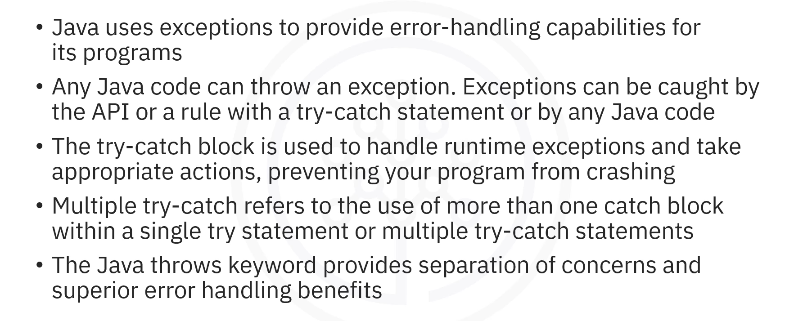
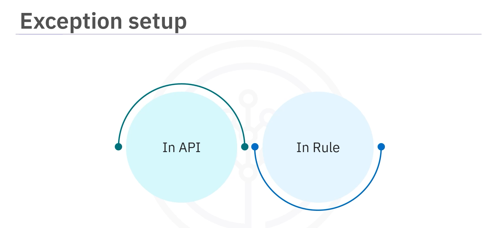
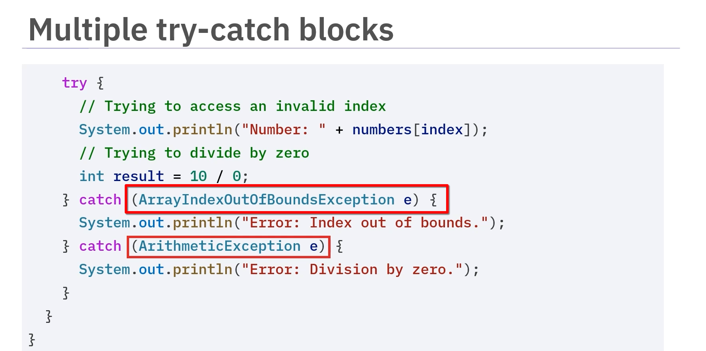
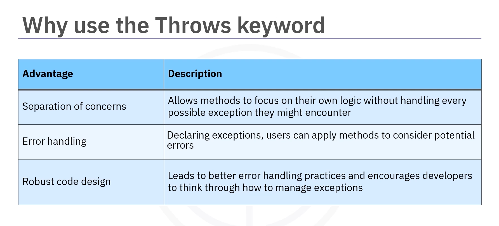
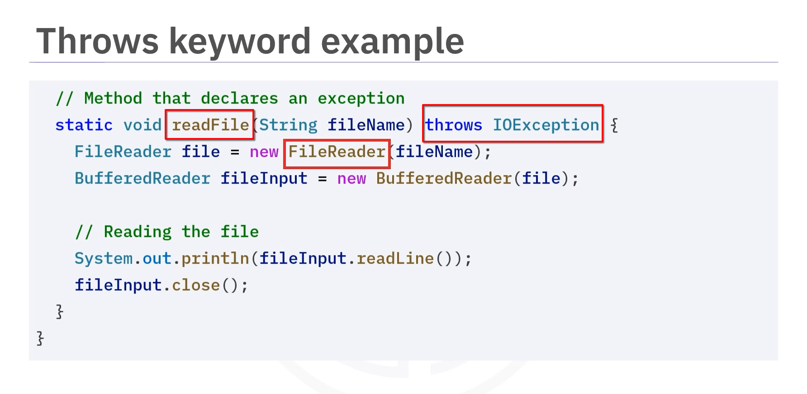

# 04-003 Using Multiple `try-catch` Blocks
---
> PENDING:  Re-write a better guide
---



-   **`try-catch` blocks** are used to handle runtime exceptions and take appropriate actions, preventing the program from crashing

-   **Multiple `try-catch`** refers to using more than one `catch` block within a single `try` statement or multiple `try-catch` statements

-   **Advantages** of multiple `try-catch` include clearer error handling, specific responses to different errors, and better code organisation

-   **User input validation** and **file handling** are common use cases for multiple `try-catch` blocks

-   **The `throws` keyword** indicates that a method can throw one or more exceptions, informing the caller to handle them

-   **`throws` provides separation of concerns** and enables better error-handling practices

---

## What is a `try-catch` Block?




**Java uses exceptions to provide error handling capabilities for its programs.** Before you can catch an exception, the code must throw one. **Any Java code can throw an exception.**

**In Java, a `try-catch` block is used to handle exceptions that occur during the execution of a program.** It helps you catch runtime errors, exceptions, and take appropriate actions, preventing your program from crashing.

### Basic Syntax

```java
try {

    // Code that might throw an exception
    
} catch (ExceptionType e) {

    // Handle the exception
}
```

---

## Multiple `try-catch` Blocks

-   **Multiple `try-catch` refers to the use of more than one `catch` block within a single `try` statement or multiple `try-catch` statements in your code.** 

-   **This allows you to handle different types of exceptions separately, which is useful when you expect different kinds of errors from the same block of code.**

### Example: Two `catch` Blocks

```java

try {

    int[] numbers = {1, 2, 3};
    int result = numbers[5] / 0;  // Can throw multiple exceptions
    
} catch (ArrayIndexOutOfBoundsException e) {

    System.out.println("Array index out of bounds");
    
} catch (ArithmeticException e) {

    System.out.println("Arithmetic error: division by zero");
    
} catch (MoreExceptionTypes e)  {

    // ....

} ...
```

-   **`ArrayIndexOutOfBoundsException`** occurs when trying to access an array with an invalid index
-   **`ArithmeticException`** occurs when there is an illegal arithmetic operation such as dividing by zero

---

## Advantages of Multiple `try-catch` Blocks




**Using multiple `try-catch` blocks in a program offers several advantages:**

### 1. Clearer Error Handling

**Each exception can be handled individually, making debugging the code an easier effort.**

### 2. Specific Responses

**You can specify unique response messages based on the type of error.**

### 3. Code Organisation

**Exception handling helps keep code organised and readable.**

---


## Use Cases for Multiple `try-catch` Blocks

### User Input Validation


**In software applications, user inputs are often unpredictable.**  

Using multiple `try-catch` blocks can help validate inputs effectively.


```java
try {

    String userInput = "abc123";
    
    int number = Integer.parseInt(userInput);  // May throw NumberFormatException

    System.out.println("Number: " + number);
    
    
} catch (NumberFormatException e) {

    System.out.println("Error: Invalid number format");
    
}
```

If the input is not a valid number, a `NumberFormatException` is thrown and handled by the `catch` block.


---


### File Handling

**When working with files, multiple exceptions can arise, such as file not found or issues during reading and writing.**  

Using multiple `try-catch` blocks can assist in handling file errors.


```java
try {

    FileReader file = new FileReader("aNonExistentFile.txt");
    
    // Read file operations
    
    
} catch (FileNotFoundException e) {

    System.out.println("Error: File not found");
    
} catch (IOException e) {

    System.out.println("Error: An I/O error ocurred");
    
}
```

- **`FileNotFoundException`** is caught if the file doesn't exist
- **`IOException`** is caught if there's any I/O issue when reading the file


---

## The `throws` Keyword

**The Java runtime system and many classes from Java packages throw exceptions in some circumstances by using the `throw` statement.**


### Syntax

```java

returnType methodName(params) throws ExceptionType1, ExceptionType2 {

    // Method implementation
}
```

-   **You can use the `throws` keyword in method declaration to indicate that a method can throw one or more exceptions.**

-   **This informs the caller of the method that they need to handle these exceptions either with a `try-catch` block or by declaring them in their own method using `throws`.**


### Advantages of `throws` Keyword



1.  **Separation of Concerns** - Each method can focus on its own logic without handling each possible exception  

2.  **Clear Error Handling Indication** – By declaring exceptions, method users 
can more clearly determine which error-handling methods to implement to manage potential errors  

3.  **Robust Code Design** – Java's robust code design capabilities lead to better error-handling practices, which encourages developers to plan for exception management

---

### Example: Using `throws`



```java
public static void readFile(String filename) throws IOException {

    FileReader file = new FileReader(filename);
    // Read file operations
    
}
```

```java
public static void main(String[] args) {

    try {
    
        readFile("data.txt");
        
    } catch (IOException e) {
    
        System.out.println("Error reading file: " + e.getMessage());
        
    }
}
```

Here:  
1.   **The `readFile` method is defined with the `throws IOException` clause**, indicating it might throw an `IOException` if there's an issue with file reading  

2. **In the `main` method**, we call `readFile` and wrap it in a `try-catch` block to handle the potential `IOException`  

3.  If the specified file does not exist, the `FileReader` will throw an `IOException`, which is then caught by the `catch` block, allowing us to handle the error gracefully


---

## Lesson Speech

Welcome to this video about using multiple `try-catch` in Java. After watching this video about multiple `try-catch` in Java, you'll be able to explain `try-catch` exception handling, explain multiple `try-catch` exception handling, and describe the `throws` keyword. **Java uses exceptions to provide error handling capabilities for its programs.** **Before you can catch an exception, the code must throw one.** **Any Java code can throw an exception.** **A `throw` expression is any kind of expression whose type is assignable to the Java `Throwable` type or subclass.** When an exception is thrown, it can be caught by the API, or a rule with a `try-catch` statement, or by any Java code.

**In Java, a `try-catch` block is used to handle exceptions that occur during the execution of a program.** **It helps you catch runtime errors, exceptions, and take appropriate actions, preventing your program from crashing.** Here's the syntax of a basic `try-catch` statement. **Here, the `try-catch` block contains the code that might throw an exception.** **The `catch` block handles the exception if it occurs.** **Multiple `try-catch` refers to the use of more than one `catch` block within a single `try` statement or multiple `try-catch` statements in your code.** **This allows you to handle different types of exceptions separately, which is useful when you expect different kinds of errors from the same block of code.**

Here's a simple example demonstrating multiple `catch` blocks. **Here we have two `catch` blocks to handle the `ArrayIndexOutOfBoundsException` and `ArithmeticException` exceptions separately.** **The `ArrayIndexOutOfBoundsException` occurs when we try to access an array with an invalid index** and **the `ArithmeticException` occurs when there is an illegal arithmetic operation such as dividing by zero.** **Using multiple `try-catch` blocks in a program offers several advantages.** **You can write code that gracefully handles various exception conditions, leading to more robust and user-friendly programs.**

**Additional benefits of multiple `try-catch` blocks include:** **Clearer Error Handling:** Each exception can be handled individually, making debugging the code an easier effort. **Specific responses:** You can specify unique response messages based on the type of error. **Code Organisation:** Exception handling helps keep code organised and readable.

**In software applications, user inputs are often unpredictable.** **Using multiple `try-catch` blocks can help validate inputs effectively.** Here we attempt to convert user input into an integer. **If the input is not a valid number, a `NumberFormatException` is thrown** and we handle it with a `catch` block. **When working with files, multiple exceptions can arise, such as file not found or issues during reading and writing.** **Using multiple `try-catch` blocks can assist in handling file errors.** Here we attempt to read from a file that doesn't exist. **If the file is not found, a `FileNotFoundException` is caught.** **If there's any I/O issue when reading the file, an `IOException` is caught.**

**The Java runtime system and many classes from Java packages throw exceptions** in some circumstances by using the `throw` statement. Here's the syntax for using `throws`. `returnType methodName(parameter) throws ExceptionType1, ExceptionType2`. **You can use the `throws` keyword in method declaration to indicate that a method can throw one or more exceptions.** **This informs the caller of the method that they need to handle these exceptions either with a `try-catch` block or by declaring them in their own method using `throws`.**

**Using the `throws` keyword provides the following advantages.** **First, the separation of concerns enables each method to focus on its own logic without handling each possible exception.** **By declaring exceptions, method users can more clearly determine which error-handling methods to implement to manage potential errors,** and **Java's robust code design capabilities lead to better error-handling practices, which encourages developers to plan for exception management.** Let's look at a simple example to understand how `throws` work.

Here, **the `readFile` method is defined with the `throws IOException` clause.** **This means that this method might throw an `IOException` if there's an issue with file reading.** **In the `main` method, we call `readFile`.** **Since it can throw an exception, we wrap this call in a `try-catch` block to handle the potential `IOException`.** **If the specified file does not exist, the `FileReader` will throw an `IOException`,** which is then caught by the `catch` block allowing us to handle the error gracefully.

In this video, you learned that **Java uses exceptions to provide error-handling capabilities for its programs.** **Any Java code can throw an exception.** **Exceptions can be caught by the API or a rule with a `try-catch` statement or by any Java code.** **The `try-catch` block is used to handle runtime exceptions and takes appropriate actions, preventing your program from crashing.** **Multiple `try-catch` refers to the use of one or more `catch` blocks within a single `try` statement or multiple `try-catch` statements in your code.** **The Java `throws` keyword provides separation of concerns and superior error-handling benefits.**
