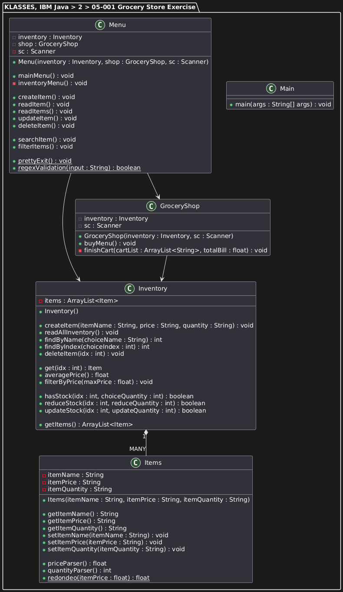
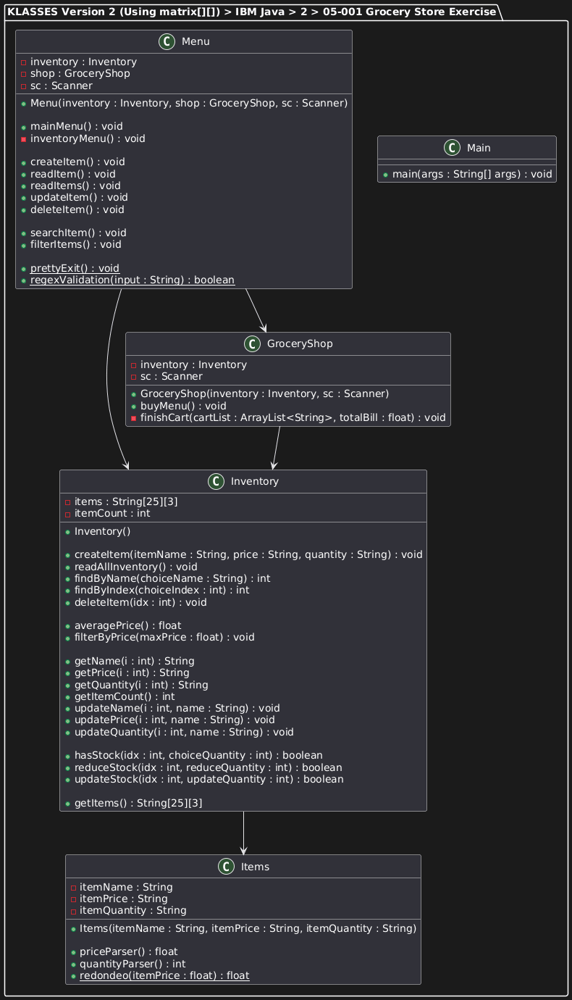

# **05-001 Final Project Overview**
---

## Classes

1. `Items`
2. `Inventory`
3. `GroceryShop`
4. `Menu`
5. `Main`

---

## Implementation Versions

There are **two implementations** for managing the inventory:

### 1.  `ArrayList<>` + Getters/Setters Approach

   -    Each item is represented as an `Items` object stored in an `ArrayList`.  
   -    Standard OOP approach with GETTERs (`getItemName()`, `getItemPrice()`, `getItemQuantity()`), and their corresponding setters.  
   -    Easy to extend and maintain, high flexibility, but slightly heavier in memory.

---

### 2.  Data Matrix (`String[][]`)  Approach

   -    Inventory is stored as a fixed-size 2D array (`items[25][3]`).  
   -    Eliminates `Items` objects and most getters/setters, but ...  
   -    ... Accessing and updating items is performed through `Inventory` methods such as `getName(i)`, `updatePrice(i, newPrice)`, etc.  
   -    Simpler in structure, but less flexible.

---

*2025, November, 20*

---

## Requirements

| Task | Implementation |
| ---- | -------------- |
| Task 1: Store item names | `Inventory.items[][]` or `ArrayList<Items>` |
| Task 2: Store item prices | `Items.priceParser()`, `Inventory.items[][]`, `redondeo()` |
| Task 3: Create and import a `Scanner` object | `Main`, `Menu`, `GroceryShop` |
| Task 4: Infinite menu loops | `Menu.mainMenu()`, `Menu.inventoryMenu()`, `GroceryShop.buyMenu()` |
| Task 5: Inner loop for purchases | `GroceryShop.buyMenu()` |
| Task 6: Get user input for item name | `Inventory.findByName()`, `Inventory.findByIndex()` |
| Task 7: Get item price by index | `Inventory.get()`, `Inventory.getItems()` |
| Task 8: Get item quantity and calculate total | `Inventory.get()`, `Inventory.getItems()`, `GroceryShop.buyMenu()` |
| Task 9: Print total price | `GroceryShop.buyMenu()` |
| Task 10: Implement item search functionality | `Inventory.findByName()`, `Inventory.findByIndex()` |
| Task 11: Calculate average price | `Inventory.averagePrice()` |
| Task 12: Filter items below a certain price | `Inventory.filterByPrice()` |
| Task 13: Apply discounts and calculate final bill | `GroceryShop.finishCart()` |
| Task 14: Inventory management (create/update/delete/reduce stock) | `Inventory` |

---

# Assesment Details

## **Learning Objectives**

After completing this project, you will be able to comfortably work with:

- Basics of Java programming
- Strings and string operations
- Operators and Data Types
- Exceptions
- for Loops and the while Loop
- Conditional statements
- Arrays
- Basic methods and functions

---

## **About the course project**

Welcome to the final project for this course for beginning to learn how to code using Java. In this project, you will apply the knowledge and skills you learned in this course to a simulated scenario.

In this project, you will create a **console application for a grocery shop**, which will calculate the total of grocery items chosen depending on the unit price and quantity. The tasks in this hands-on project correspond to the activities performed by a Java Developer who is creating a stand-alone console application.

It will be comprised of **eight tasks**.

### **Task 1: String array of items**
Create a String array of items you will buy from a grocery shop. It should be a minimum of 10, but not more than 25.

### **Task 2: float array of unit price**
Create a float array of unit price for items, which corresponds to the index positions in the items array. The float array should be the same length as the items array.

### **Task 3: Import and create a Scanner object**
Import and create a scanner object and create an object of scanner object to read from the console.

### **Task 4: Create infinite loop**
Create an infinite loop that runs as long as the user wants the loop to run. The loop should exit when the user inputs Exit (ignoring the case).

### **Task 5: Create inner infinite loop for purchases**
Create an infinite loop that runs as long as the user wants to add items. The loop should exit when the user inputs Complete (ignoring the case).

### **Task 6: Get user input for item name**
Get input for item name from the user and check the array for the item. If the item is in the array, get the index of the item and store the item name.

### **Task 7: Get the item price based on the index position**
Get the item price from the same index position in the array as the item.

### **Task 8: Get the item quantity and find item price**
Calculate each item’s price and add the item prices to the total bill.

### **Task 9: Print the total price**
When all required items are chosen, print the total bill price.

### **Task 10: Implement Item Search Functionality**
Create a method to search for an item in the items array.

### **Task 11: Calculate Average Price**
Create a method to calculate the average price of the items.

### **Task 12: Filter Items Below a Certain Price**
Create a method to filter items below a specified price.

### **Task 13: Total the Bill with Discounts**
Modify your program to apply discounts on total bill based on certain conditions.

### **Task 14: Inventory Management**
Create an inventory management system for tracking available stock of items.

---

## **To summarize**

Read and follow the instructions carefully to complete the project.

---

