# 01-001:   Introduction to OOP in Java

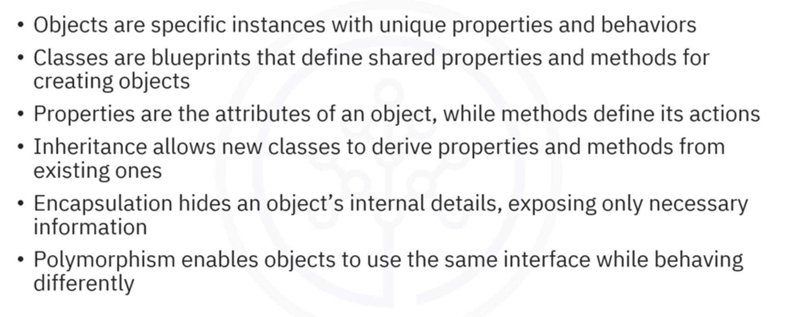

## Introduction

Object-Oriented Programming (OOP) is a fundamental programming paradigm that structures code around the concepts of classes and objects. This guide provides a comprehensive overview of OOP principles, enabling learners to understand how to define classes and objects, describe properties and methods, and comprehend the core concepts of inheritance, encapsulation, and polymorphism.

---

## 1. Classes and Objects

### 1.1 Understanding Objects

An **object** is a specific instance of something in the real world with unique characteristics and the ability to perform actions. Consider a red sports car: this car represents an object with defining characteristics such as colour and speed, and can perform actions such as driving and honking.

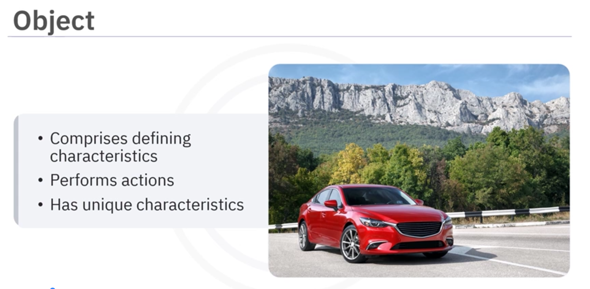

In programming, objects function similarly—each object possesses unique characteristics and can execute specified actions. Objects serve as the fundamental building blocks of object-oriented programmes.

### 1.2 Understanding Classes

A **class** functions as a blueprint or template for creating objects. Rather than representing a specific car, a class defines the general characteristics and actions that all cars should possess. For instance, a Car class establishes that all cars have properties like colour and speed, and capabilities like driving and honking.

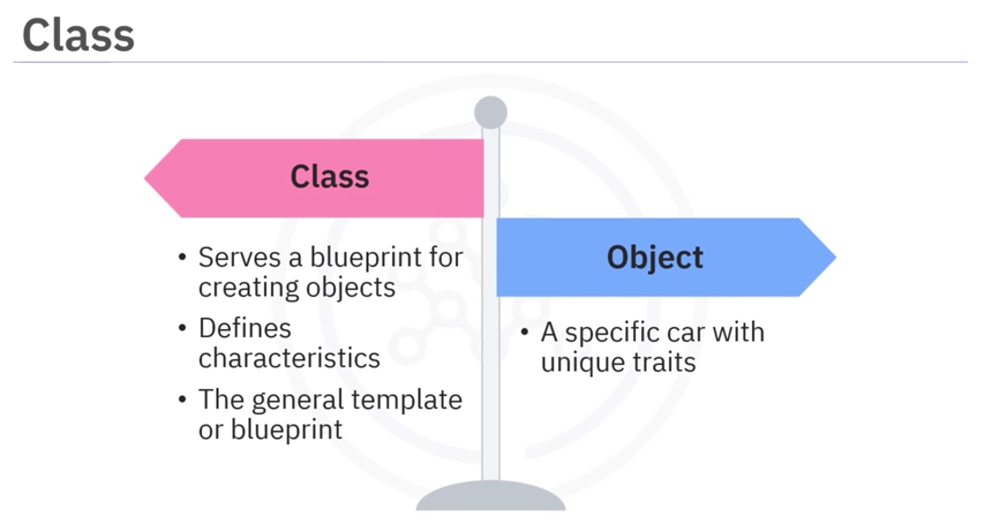

The distinction is crucial: whilst an object is a specific car with unique traits, the class is the generalised template from which all cars are created.

---

## 2. Properties and Methods

### 2.1 Properties (Attributes)

**Properties** are the characteristics or attributes of an object. They represent the data associated with an object and define its state. For example, a car object possesses the following properties:

- **Colour**: red, blue, or black
- **Speed**: fast, medium, or slow
- **Model**: sedan, SUV, or sports car

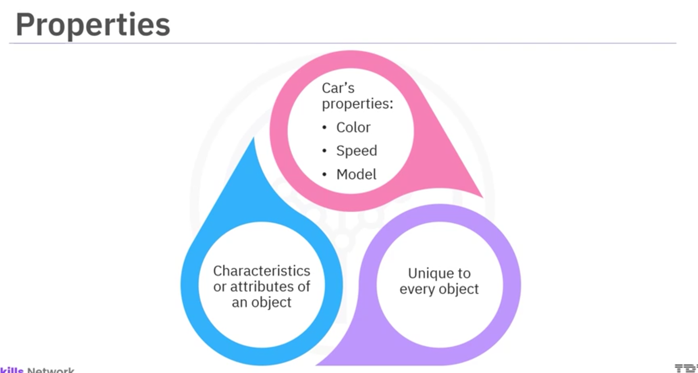

Each car object maintains its unique values for these properties, allowing differentiation between individual instances.

### 2.2 Methods

**Methods** are actions or functions performed by an object. They define what an object can do and describe its behaviour. For a car object, methods might include:

- Driving
- Honking
- Parking

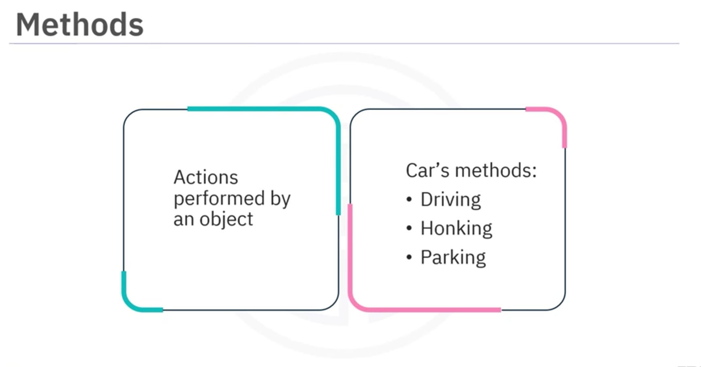

Methods provide functionality to objects by enabling them to execute specific tasks and operations.

---

## 3. Core OOP Principles

### 3.1 Inheritance

**Inheritance** is a mechanism that allows new classes to be created based on existing classes. It establishes a hierarchical relationship between classes, similar to a family tree structure.

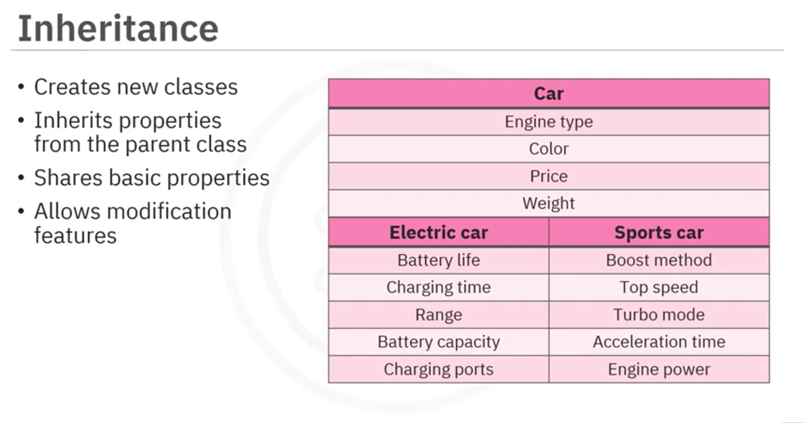

#### Concept
The parent class (or base class) defines common properties and methods, whilst child classes (or subclasses) inherit these features and can add their own unique attributes and behaviours.

#### Example
A Car class serves as the parent class. Subclasses such as ElectricCar and SportsCar can inherit from the Car class:

- **ElectricCar**: Inherits standard car properties and methods, but adds a unique property called battery life
- **SportsCar**: Inherits standard car properties and methods, but adds a unique method called boost, which allows faster acceleration

In this manner, all cars share basic properties and methods from the parent Car class, whilst each subclass introduces features that distinguish it as unique.

### 3.2 Encapsulation

**Encapsulation** refers to bundling an object's data (properties) and the methods that operate on that data into a single unit, typically a class. The principle emphasises hiding an object's internal details and exposing only what is necessary to the outside world.

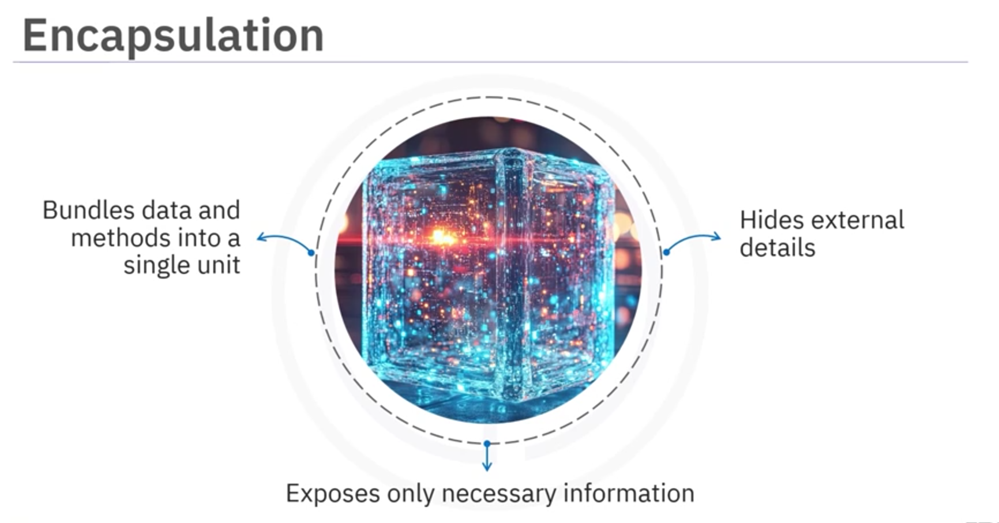

#### Analogy
Consider a television. Users interact with the TV through a remote control, utilising functions such as turning it on or off, changing the channel, and adjusting the volume. However, users need not understand the internal mechanisms—how signals are processed or how the screen displays images. This exemplifies encapsulation: interaction occurs through a controlled interface whilst internal workings remain concealed.

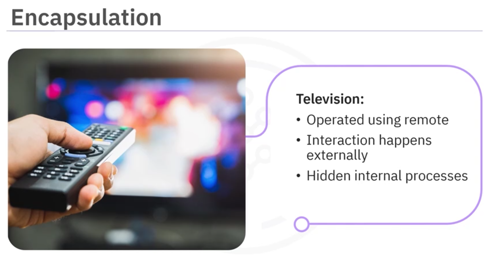

#### Application
Encapsulation protects sensitive information, such as passwords, by defining private properties with controlled access methods. Only authorised interactions are permitted through defined methods.

### 3.3 Polymorphism

**Polymorphism** is the ability for objects to be treated as instances of their parent class, enabling different objects to be accessed through the same interface. This principle allows one method to work with varying types of objects, with each object exhibiting different behaviour based on its type.

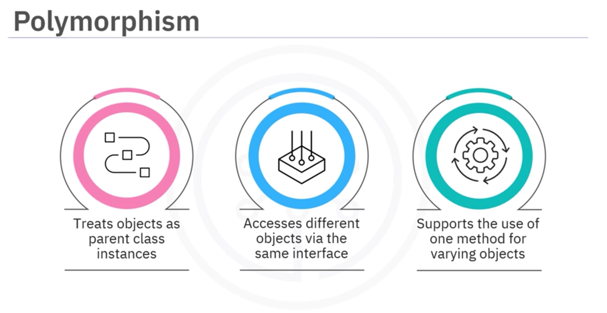

#### Example:
Consider a fly method implemented in different classes:

- **Helicopter**: The fly method utilises rotor blades to lift off
- **Rocket**: The fly method utilises engines to launch into space

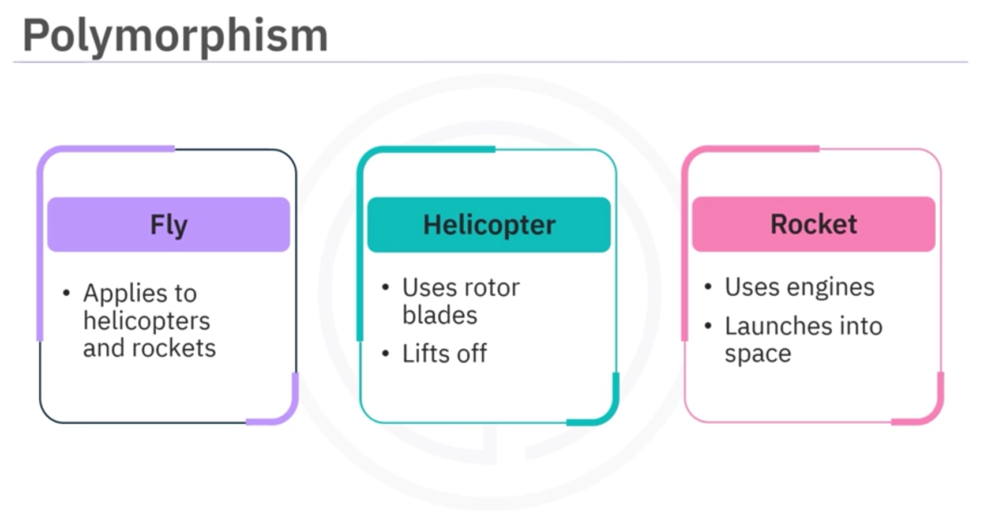

Despite both objects implementing the same method, each behaves differently according to its type. This flexibility allows programmers to write generalised code that functions across multiple object types.

---

## 4. Practical Application: Online Bookstore Case Study

To illustrate OOP principles in a real-world context, consider the design of an online bookstore system.

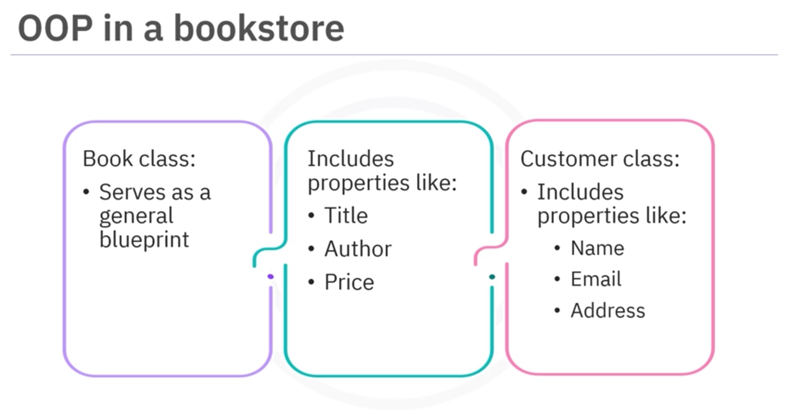

### 4.1 The Book Class

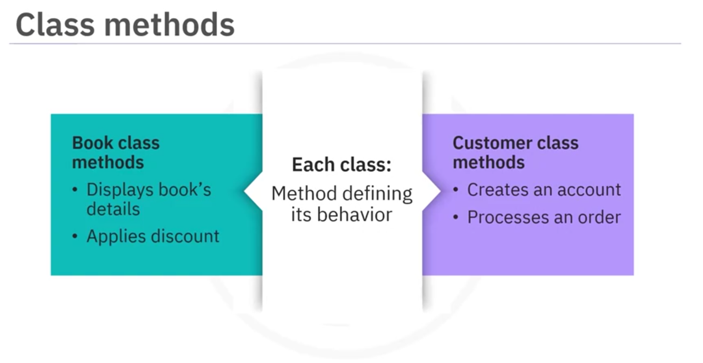

The **Book class** serves as a general blueprint for all books, defining the following properties:

- Title
- Author
- Price

An object such as "The Great Gatsby" represents a specific instance of the Book class, where the title, author, and price are explicitly defined.

#### Methods:
- **displayInfo()**: Presents the book's details to the user
- **applyDiscount()**: Reduces the book's price by a specified percentage

### 4.2 The Customer Class

The **Customer class** defines properties relevant to customers:

- Name
- Email
- Address

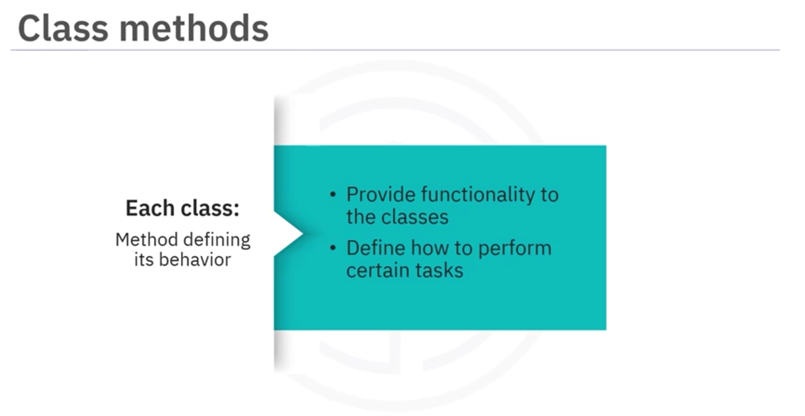

#### Methods:
- **createAccount()**: Allows new customers to establish an account
- **processOrder()**: Facilitates the processing of book orders

### 4.3 Applying OOP Principles

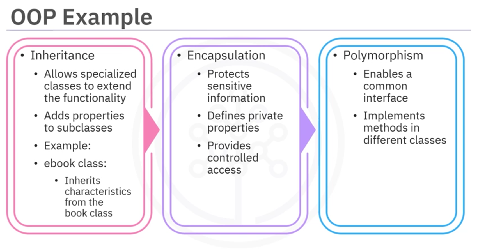

#### Inheritance:
An **eBook class** can inherit from the Book class, extending its functionality by adding properties such as file format, which are specific to digital books.

#### Encapsulation:
Sensitive information, such as customer passwords, is protected through private properties with controlled access methods, ensuring data security.

#### Polymorphism:
A **Payment interface** enables different payment implementations:

- **CreditPayment**: Processes payments via credit card
- **PayPal**: Processes payments via PayPal account

Customers select their preferred payment method, and the system utilises the same interface whilst executing different payment logic based on the chosen method.

---

| Concept | Definition |
|---------|-----------|
| **Objects** | Specific instances with unique properties and behaviours |
| **Classes** | Blueprints that define shared properties and methods for creating objects |
| **Properties** | Attributes or characteristics of an object |
| **Methods** | Actions or functions performed by an object |
| **Inheritance** | Mechanism allowing new classes to derive properties and methods from existing classes |
| **Encapsulation** | Practice of bundling data and methods whilst hiding internal details |
| **Polymorphism** | Ability for objects to share a common interface whilst exhibiting different behaviours |

