# 01-002:   Using Classes and Objects in Java

## Introduction

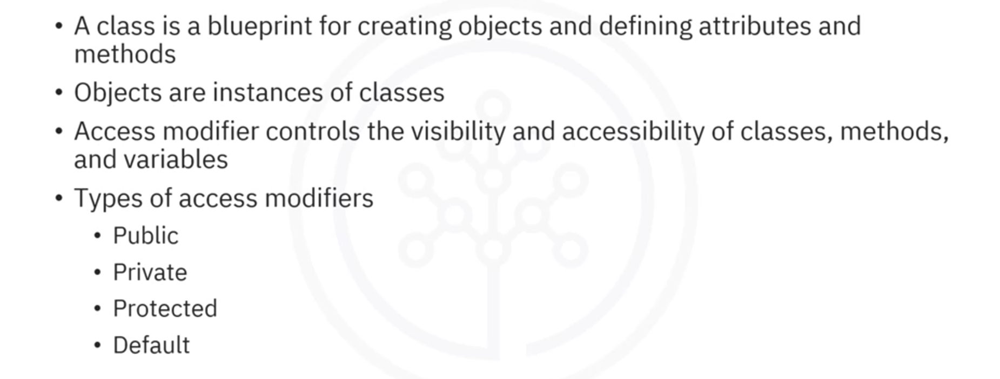
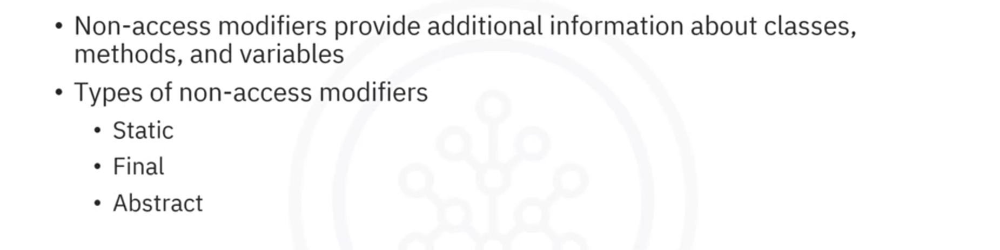

This guide provides a comprehensive exploration of classes and objects in Java, establishing their critical role in object-oriented programming. Upon completing this guide, learners will be able to define classes and objects, explain their functions, and describe both access and non-access modifiers. Understanding these concepts is essential for writing well-structured, maintainable Java applications.

---

## 1. Classes: Blueprints for Objects

### 1.1 Understanding Classes

A **class** in Java serves as a blueprint or template for creating objects. Just as an architect designs a building with specific requirements, a class defines what every object created from it should possess.

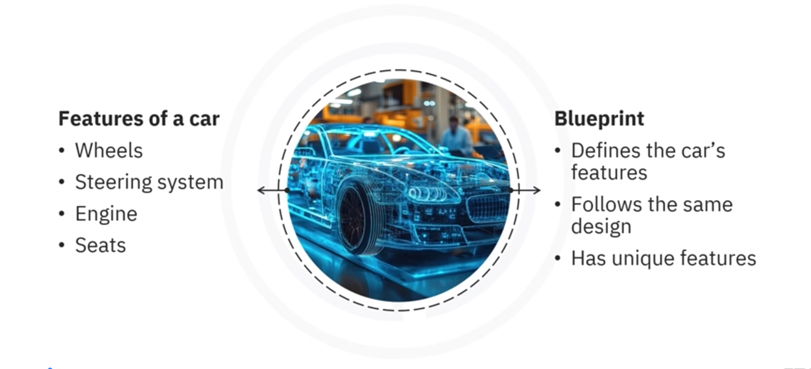

Imagine designing a car. You know it should have wheels, a steering system, an engine, and seats. This blueprint is like a class in Java—it defines what every car should have. From this blueprint, you can design actual cars like a hatchback or sedan. Each car follows the same design but can possess unique features, just like objects created from a class.

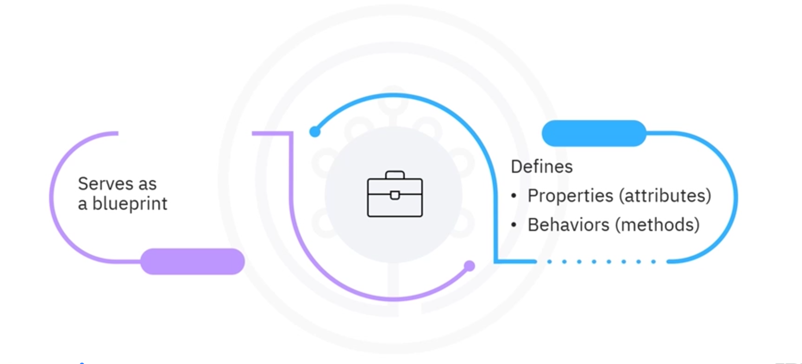

### 1.2 Class Composition

A class defines two fundamental components:

- **Properties (Attributes)**: Characteristics that describe the object's state
- **Behaviours (Methods)**: Actions that the object can perform

#### Example: Car Class

To illustrate class creation, consider developing a model for cars:

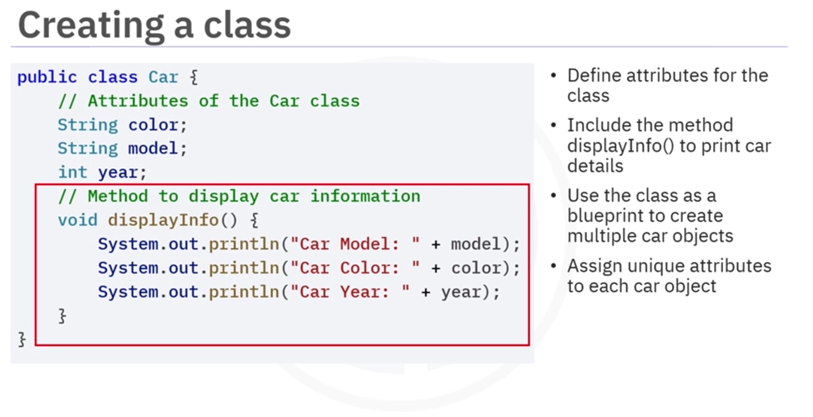

- **Attributes**: colour, model, and year represent a car's properties
- **Class Name**: Car
- **Methods**: displayInfo() is included to print the car's details

Using this class as a blueprint, multiple car objects can be created, each with unique attributes but sharing the same behaviour as defined in the class.

### 1.3 Subclasses and Inheritance

A **subclass** in Java inherits properties and methods from a larger class known as a **superclass**. This mechanism allows the creation of a new class with added or modified features. A subclass is created using the `extends` keyword.

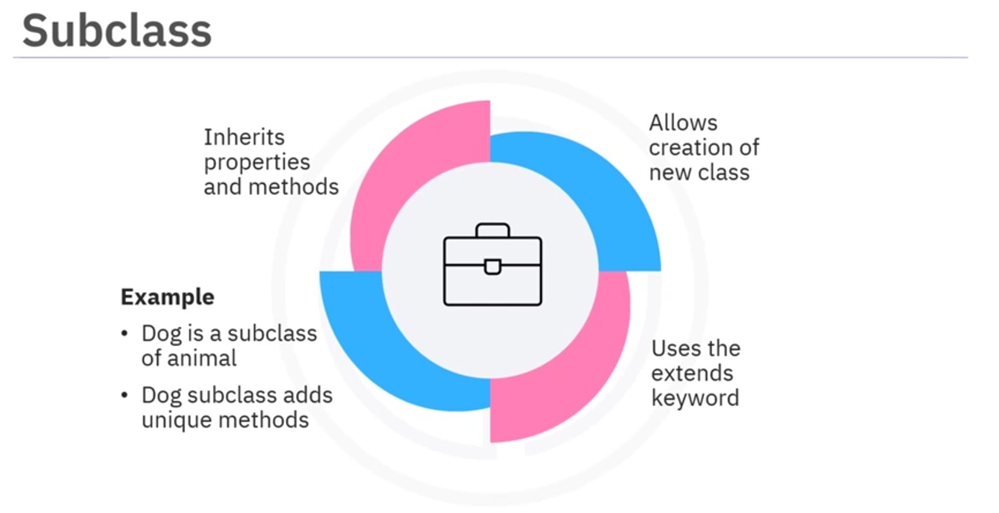

#### Example:
A class describing dogs can inherit from the class describing animals whilst adding its unique methods like barking. This hierarchical relationship enables code reuse and specialisation.

---

## 2. Objects: Instances of Classes

### 2.1 Understanding Objects

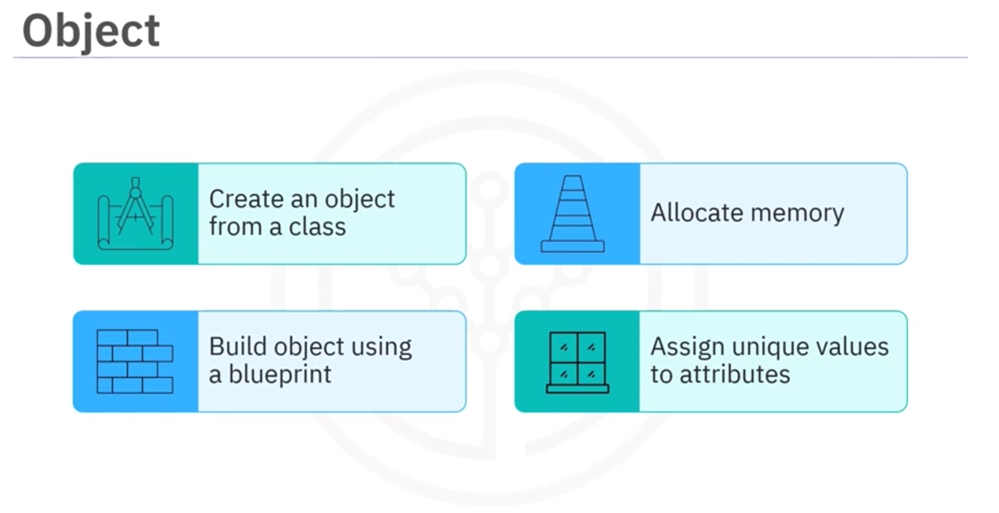

An **object** is an instance of a class created when memory is allocated based on the class definition. Think of an object as a specific car built using the Car blueprint, where each object can have its unique values for the attributes defined in the class.

### 2.2 Creating Objects

Object creation in Java involves four distinct steps:

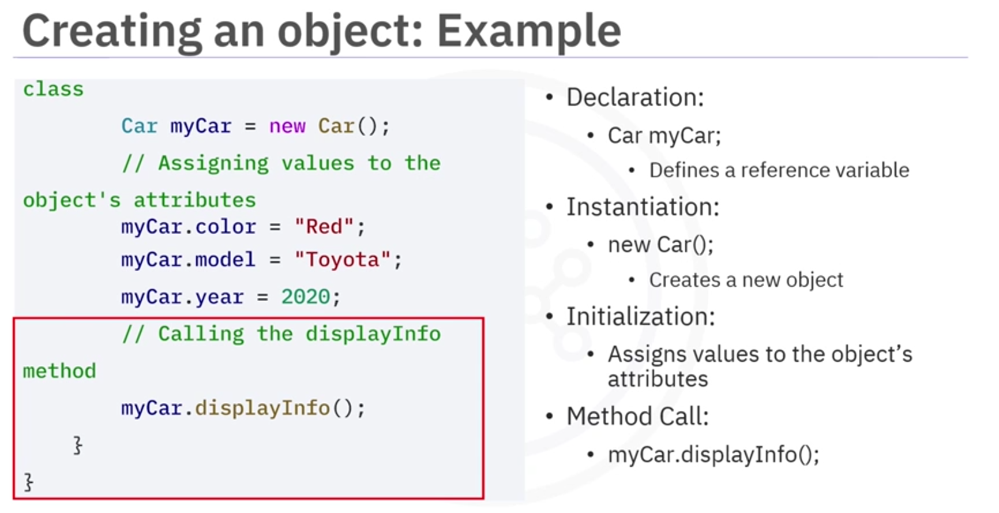

#### Step 1: Declaration
```
Car myCar
```
Defines a reference variable of type Car.

#### Step 2: Instantiation
```
new Car()
```
Creates a new object of the Car class and allocates memory.

#### Step 3: Initialisation
Assigns values to the object's attributes such as colour, model, and year.

#### Step 4: Method Invocation
```
myCar.displayInfo()
```
Calls the displayInfo method to print the car's details.

---

## 3. Access Modifiers

### 3.1 Overview

**Access modifiers** in Java are keywords that control the visibility and accessibility of classes, methods, and variables. They help in encapsulation and define how different parts of a programme interact.

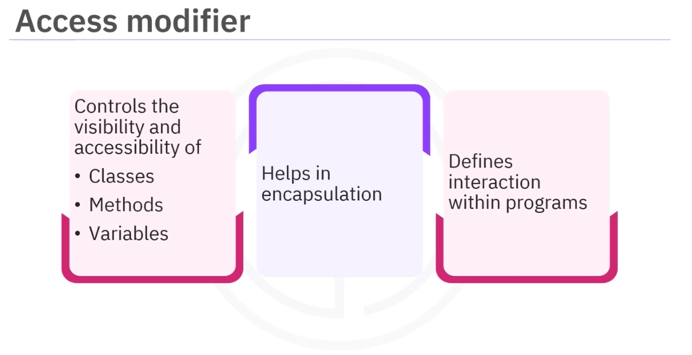

### 3.2 Types of Access Modifiers

#### 3.2.1 Public Modifier

The `public` modifier allows elements such as classes, methods, or variables to be accessible from any other class in any package, making the element globally accessible throughout the programme.

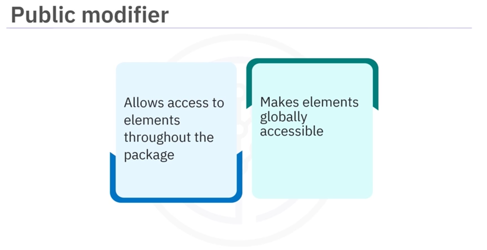

**Example:**

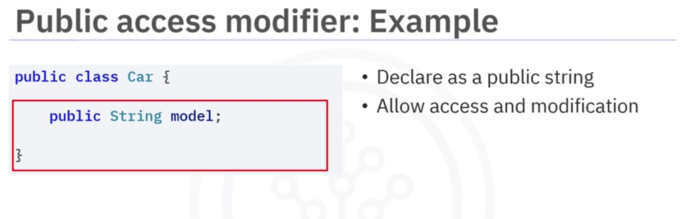

```
public String model
```
Allows the model to be accessed and modified by any other class, regardless of the package it belongs to.

**Application:**
If the car's model needs to be accessible throughout the programme, declare it as public.


#### 3.2.2 Private Modifier

The `private` modifier restricts access to an element, allowing it to be accessed only within the same class where it is declared.

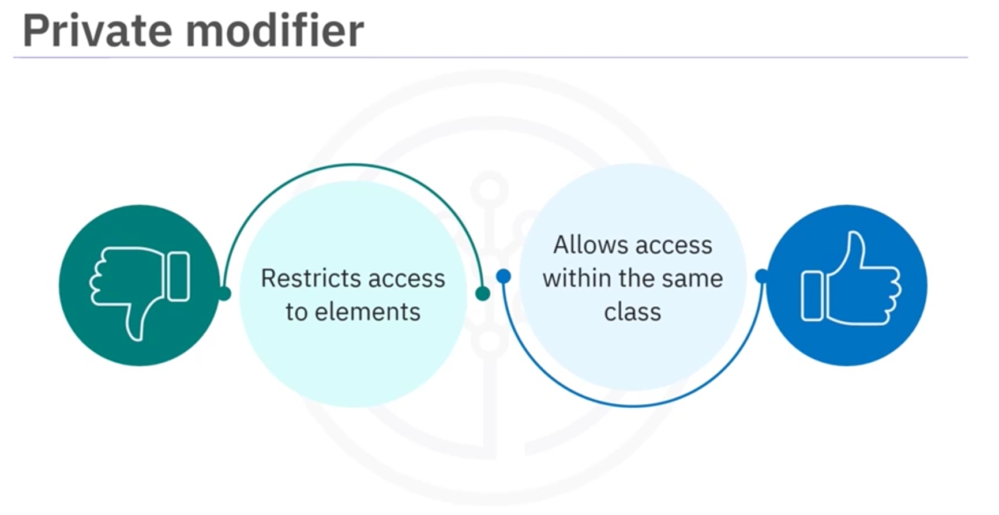

**Example:**
```
private String colour
```
Ensures the colour can only be accessed and modified within the Car class.

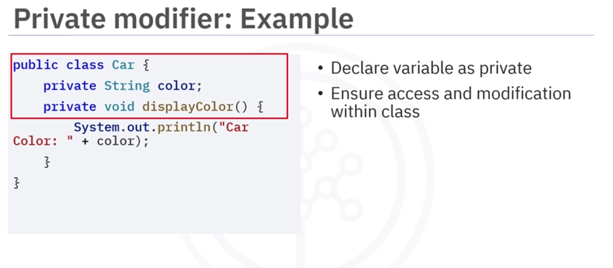


**Application:**
If the variable colour needs to be hidden from other classes, it is declared as private in the Car class. This ensures data security and encapsulation.


#### 3.2.3 Protected Modifier

The `protected` modifier allows access to a class member within the same package and by subclasses even in different packages.

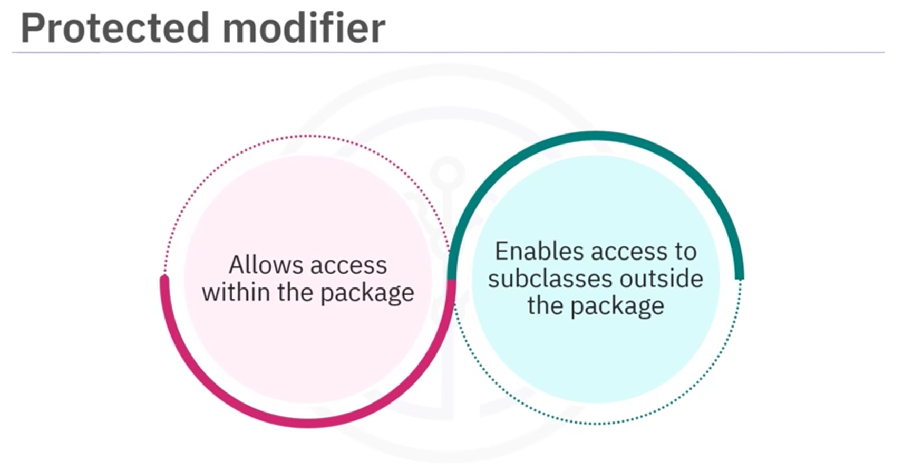

**Example:**
```
protected int year
```
Allows the car's year to be accessible within the same package and by subclasses in other packages.

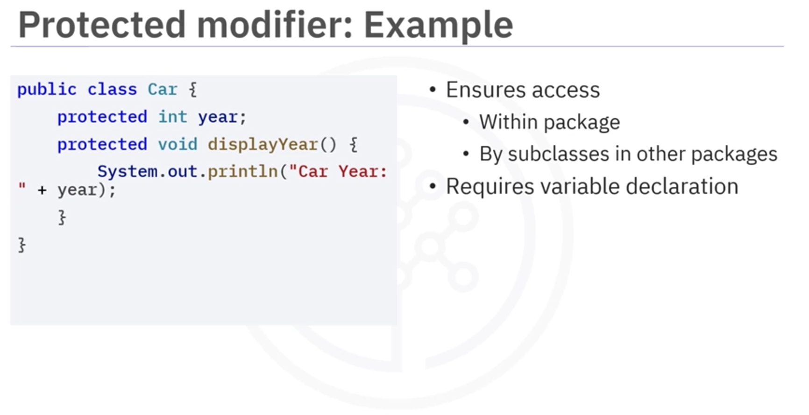

**Application:**
If the car model's year should be accessible within the same package and by subclasses in other packages, declare it as protected.


#### 3.2.4 Default Modifier

The **default** modifier in Java is used when no access modifier is specified. It allows an element to be accessible only within the same package.

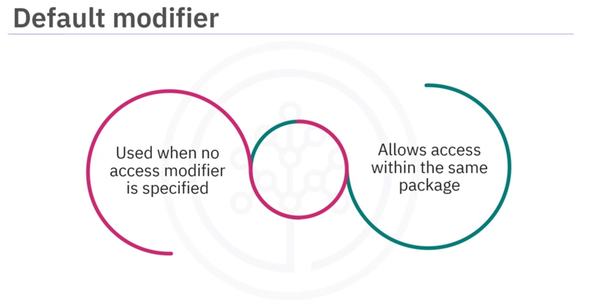

**Example:**
If the car's model should only be accessible within the same package, no access modifier needs to be specified.

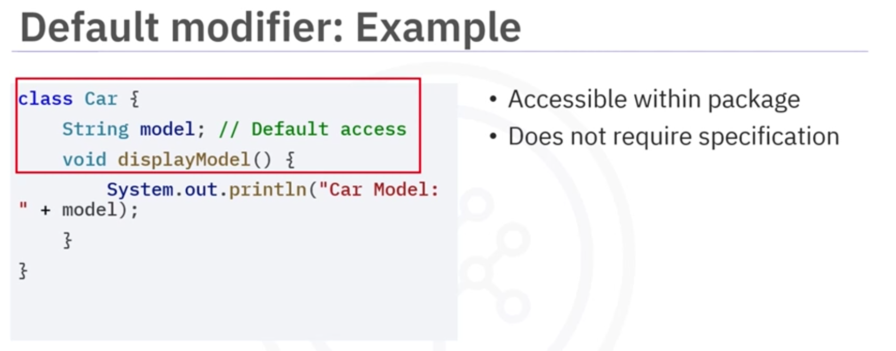

**Application:**
Package-level accessibility is useful when restricting visibility to classes within a specific package.

### 3.3 Access Modifier Summary

| Modifier | Same Class | Same Package | Subclass (Different Package) | Other Packages |
|----------|:----------:|:------------:|:----------------------------:|:---------------:|
| public | ✓ | ✓ | ✓ | ✓ |
| protected | ✓ | ✓ | ✓ | ✗ |
| default | ✓ | ✓ | ✗ | ✗ |
| private | ✓ | ✗ | ✗ | ✗ |

---

## 4. Non-Access Modifiers

### 4.1 Overview

**Non-access modifiers** are keywords that add extra details about elements, influencing their behaviour without affecting access levels. They ensure access levels remain unaffected whilst providing additional functionality and constraints.

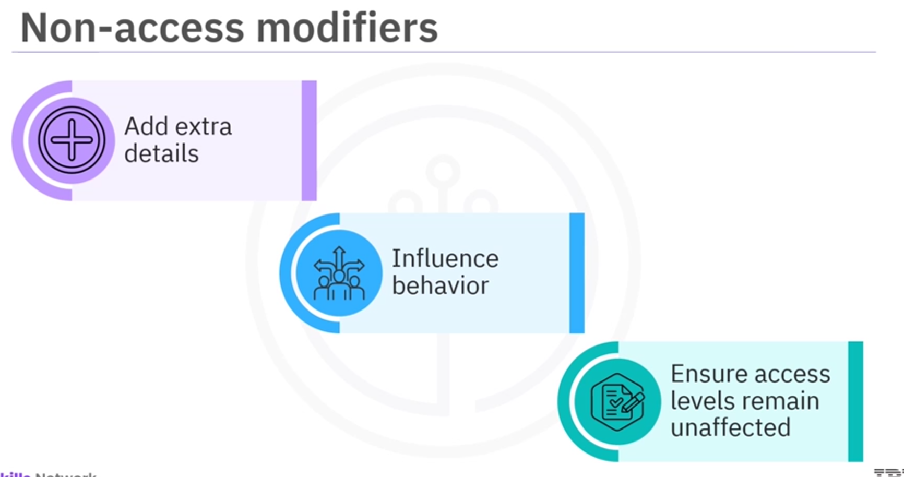

### 4.2 Types of Non-Access Modifiers

#### 4.2.1 Static Modifier

The `static` modifier implies that a member belongs to the class, not to instances, allowing access without creating an object. Static variables are shared across all instances of the class.

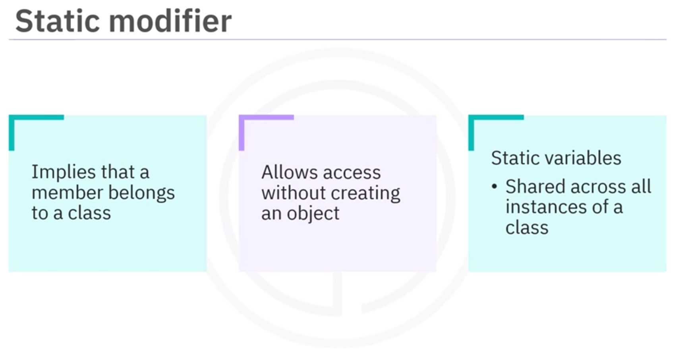

**Example:**
A static modifier can keep track of the total number of cars created. This allows the count to be shared by all cars and enables the total to be displayed without creating a new car object.

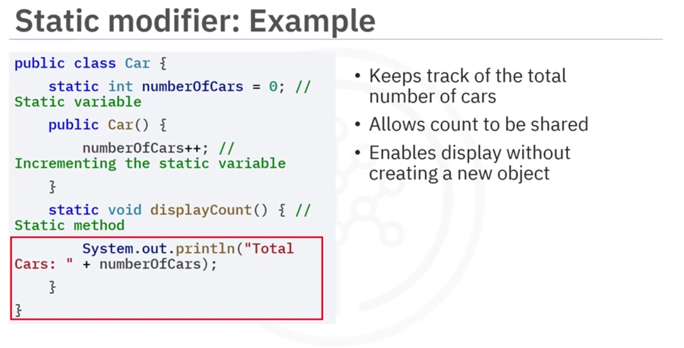

**Application:**
Static members are useful for storing class-level data that should be shared amongst all instances rather than stored individually in each object.


#### 4.2.2 Final Modifier

The `final` modifier ensures that:
- A variable's value cannot be changed
- A method cannot be overridden
- A class cannot be subclassed

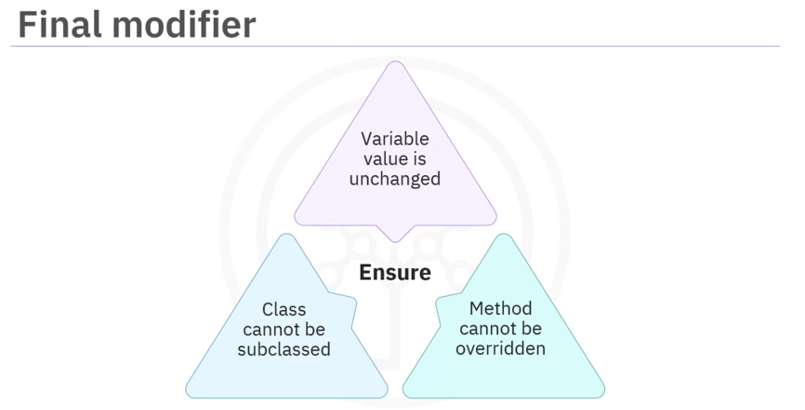

**Example:**
If the variable's value, such as car's maximum speed, should not be changed and the method should not be overridden, the vehicle class should be declared final. This implies that elements cannot be subclassed.

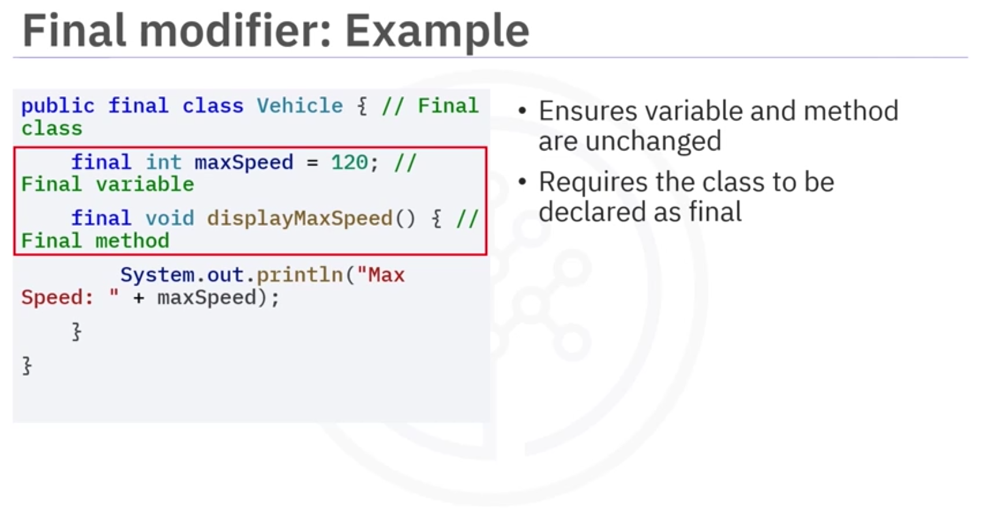

**Application:**
Final modifiers are employed when immutability or preventing extension of a class or method is desired.


#### 4.2.3 Abstract Modifier

The `abstract` modifier is used for classes and methods:

- **Abstract Classes**: Cannot be instantiated and must be extended
- **Abstract Methods**: Must be implemented in subclasses

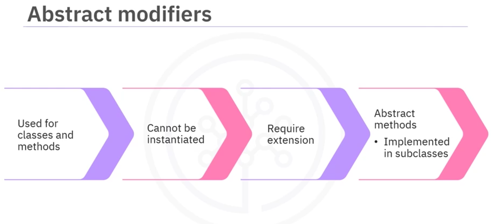

**Example:**
Consider an abstract class named Shape. This class cannot be instantiated and serves as a blueprint for other classes. It has an abstract method named Draw, which must be implemented by any subclass. For instance, the Circle class extends Shape and provides its implementation of the Draw method, printing "DrawingCircle".

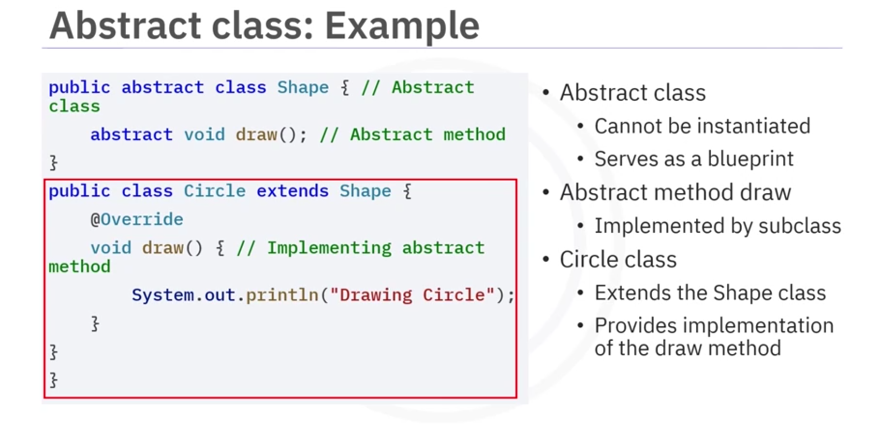

**Application:**
Abstract classes and methods are employed to define a common interface that subclasses must implement, enforcing a contract for derived classes.

### 4.3 Non-Access Modifier Summary

| Modifier | Classes | Methods | Variables |
|----------|:-------:|:-------:|:---------:|
| static | ✗ | ✓ | ✓ |
| final | ✓ | ✓ | ✓ |
| abstract | ✓ | ✓ | ✗ |

---

## 5. Key Concepts Summary

### Classes and Objects

- A **class** is a blueprint for creating objects that define attributes and methods
- An **object** is an instance of a class created based on the class definition

### Access Control

- **Access modifiers** control the visibility and accessibility of classes, methods, and variables
- The four types of access modifiers are: public, private, protected, and default

### Behaviour Modification

- **Non-access modifiers** provide additional information about classes, methods, and variables, influencing their behaviour without affecting visibility
- The types of non-access modifiers are: static, final, and abstract

---
