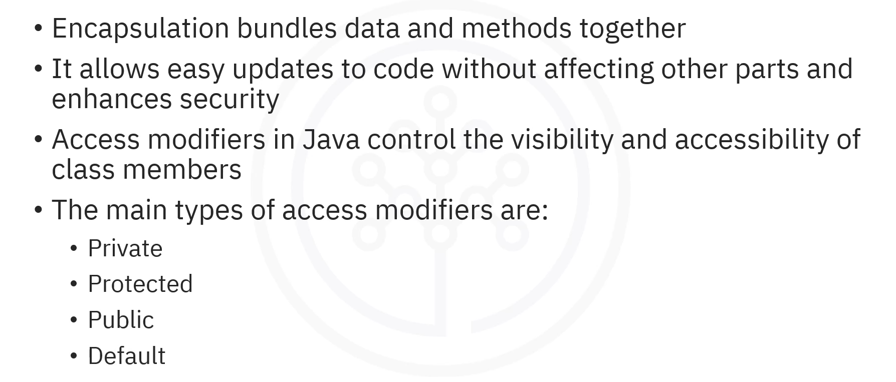
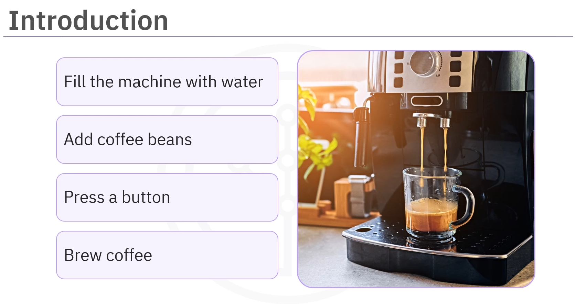
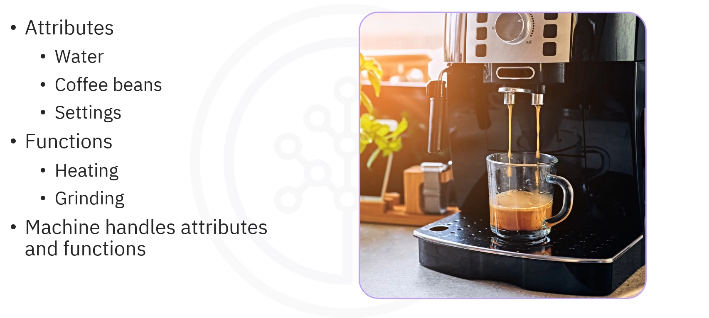
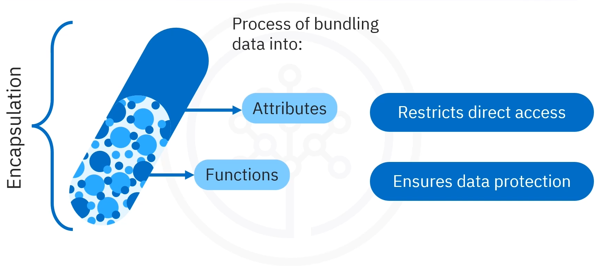
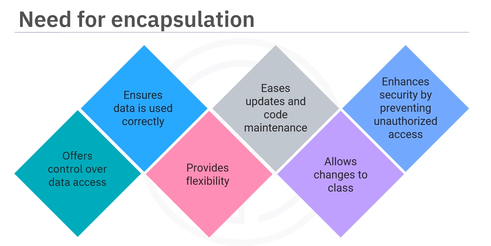
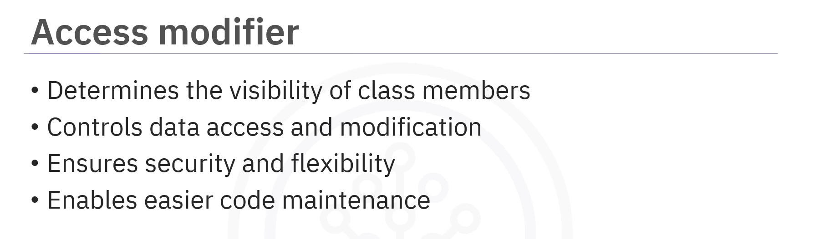
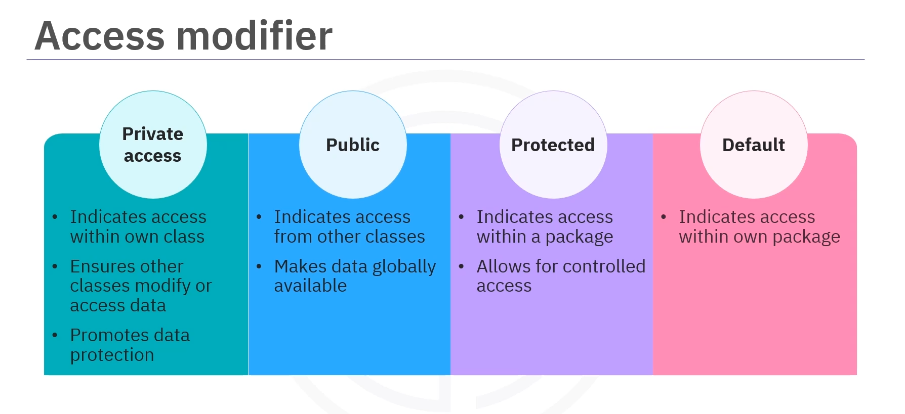
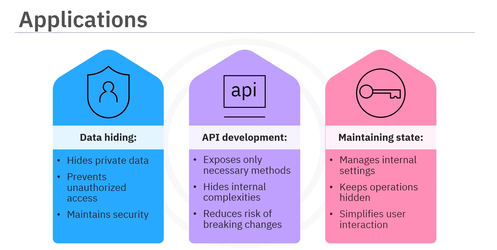
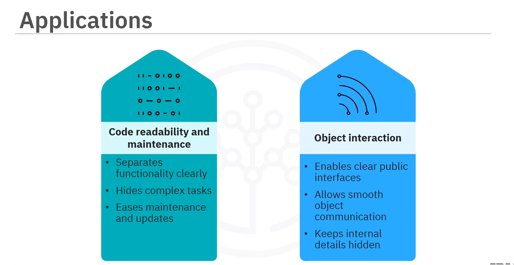

# 01-004:1  Encapsulation in Java



---

## What is Encapsulation?

### Analogy: The Coffee Machine

Imagine you have a coffee machine. You fill it with water, add coffee grounds, press a button, and wait for your coffee to brew. You don't need to know what the machine does internally.
You only press the right buttons and wait for your favorite cup of coffee.



> **That's encapsulation in action!**



#### **Attributes** (Data)
- The water
- Coffee beans
- Settings

#### **Methods** (Functions) 
- The brewing process, such as heating and grinding

#### **User Interaction**
- You interact only with the buttons while the machine handles the details


>**Just like encapsulation hides complexity in programming, the coffee machine hides its internal workings**

---

### Definition

**Encapsulation** is the process of bundling data, known as attributes, and the methods, known as functions, that operate on the data into a single unit or class.  



It also **restricts direct access to some parts of the data**, ensuring it is protected and can only be accessed through specific methods.

---

## Why is Encapsulation Necessary?



Encapsulation offers several key benefits:

#### *Control** 
- Provides control over how data is accessed and modified
- Ensures it is used correctly

#### **Flexibility** 
- Provides Flexibility
- Allows an easy code updating process
- Also, maintaining the code easier by allowing changes to the class without affecting other parts of the code

####  **Security**
- Enhances security by protecting sensitive data and preventing unauthorised access

---

## Access Modifiers in Java

>**Access modifiers are the core of Java encapsulation**




They determine the visibility of class members, such as attributes and methods. 

These modifiers control data access and modification, ensuring security, flexibility, and easier code maintenance.

### The Four Access Modifiers



#### 1. Private (`private`)

- A member can **only be accessed within its class**
- Other classes cannot directly modify or access this data
- Promotes **data protection**

#### 2. Public (`public`)

- A member can be **accessed from any other class**
- Available **globally** within the program

#### 3. Protected (`protected`)

- A member can be **accessed within its package** and by **subclasses**
- Allows for **controlled access by derived classes**

#### 4. Default (No Modifier)

- Used when **no access modifier is specified**
- A member is **accessible only within its package**
- Other classes in different packages **cannot access it**

---

## Example: The Person Class

Here is an example of encapsulation in Java:

```java
public class Person {
    
    // A)   PRIVATE ATTRIBUTES (data hiding)
    private String name;
    private int age;
    
    // B)   THE CONSTRUCTOR (for the data model)
    public Person(String name, int age) {
        this.name = name;
        this.age = age;
    }
    
    // c)   GETTERs
    // 1. Public method to get the name
    public String getName() {
        return this.name;
    }
    // 2. Public method to get the age
    public int getAge() {
        return this.age;
    }
    
    
    // D)   SETTERs
    // 1. Public method to set the name
    public void setName(String name) {
        this.name = name;
    }
    // 2. Public method to set the age
    public void setAge(int age) {
        // 2.1 With a simple data validation
        if (age >= 0) {
            this.age = age
        } else {
            System.out.println("Age cannot be negative!");
        }
    }
}
```

### How the Person Class Encapsulates Data

- **Private attributes** (`name` and `age`): Restrict direct access to the data
- **Constructor**: Initializes these attributes when a new object is created
- **Getter methods** (`getName` and `getAge`): Enable other classes to **read** these values
- **Setter methods** (`setName` and `setAge`): Allow **modification with validation**, ensuring the age is not negative

---

## Using the Person Class

```java
public class Main {

    public static void main (String[] args) {
    
        // A)   CREATING A NEW Person OBJECT
        Person person = new Person("Alice", 30);
        
        // B)   ACCESSING THE NAME USING GETTER
        System.out.println("Name: " + person.getName() );
        // ACCESSING THE AGE
        System.out.println("Age: " + person.getAge() );
        
        // C)   MODIFYING THE PROPERTIES USING SETTERs
        person.setName("Bob");
        person.setAge(25);
        
        // D)   DISPLAYING UPDATED DATA
        System.out.println("Updated Name: " + person.getName() );
        System.out.println("Updated Age:" + person.getAge() );
        
        
        
        // E)   TRYING TO SET A NEGATIVE VALUE
        person.setAge(-20); // Will trigger the data validation error
    }

}
```


### A)  Creating an Object

```java
Person person = new Person("Alice", 30);
```

### B)  Accessing Data Through Getters

```java
System.out.println("Name: " + person.getName());      // Output: Name: Alice
System.out.println("Age: " + person.getAge());        // Output: Age: 30
```

### C) Modifying Data Through Setters

```java
person.setName("Bob");       // Successfully changes name to Bob
person.setAge(25);           // Successfully changes age to 25
```

### E)  Validation Error Trigger

```java
person.setAge(-5);           // Output: Age cannot be negative!
```

When an attempt is made to set a negative age, it triggers an error message, enforcing the rule that age cannot be negative.

---

## Applications of Encapsulation




### 1. Banking Systems

**Context**: Data hiding is critical in applications such as banking, where sensitive information, such as account details, must be protected.

**How Encapsulation Helps**: Encapsulation hides private data, preventing unauthorized access and maintaining security.

### 2. API Development

**Context**: In application programming interfaces or API development, exposing only the necessary methods while hiding the internal complexities is essential.

**How Encapsulation Helps**: This allows developers to provide a simple interface, making the API easier to use and reducing the risk of breaking changes when internal details are modified.

### 3. State Management Systems

**Context**: Maintaining a state is important in systems where objects change frequently.

**How Encapsulation Helps**: Encapsulation allows objects, such as a thermostat, to manage their internal settings while keeping their operations hidden, making it easier for users to interact with the system without needing to understand the internal workings.

### 4. Code Readability and Manteinance

**Context**: Encapsulation improves code readability and maintenance by clearly separating functionality.

**How Encapsulation Helps**: Complex tasks, such as an example with a car engine management, are hidden in a car system, so users can interact with simple methods, such as starting the engine or changing gears without dealing with the inner workings.

### 5. Object Interaction

**Context**: Encapsulation also enables clear public interfaces, allowing different objects to interact smoothly.

**How Encapsulation Helps**: In a game, for instance, a player class can interact with an inventory class, each handling its data while being able to communicate without understanding each other's implementation.

---

