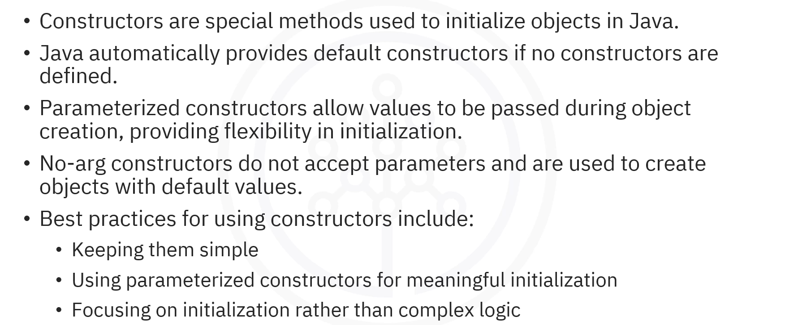
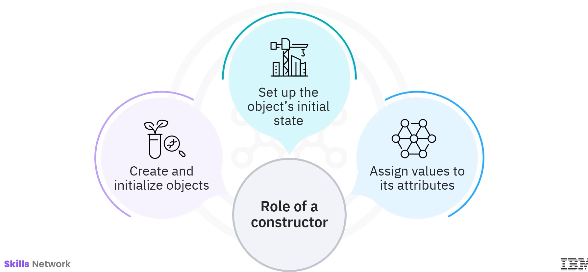
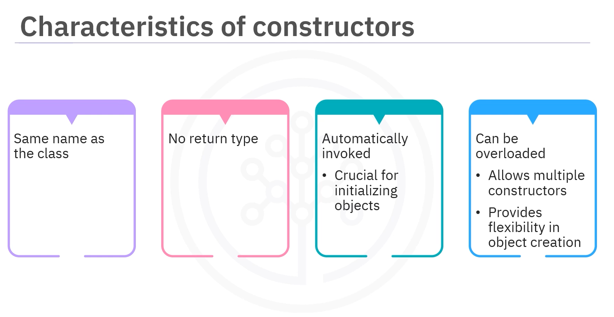
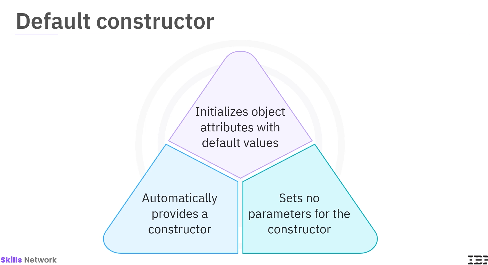
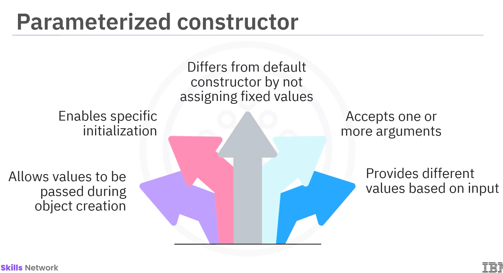
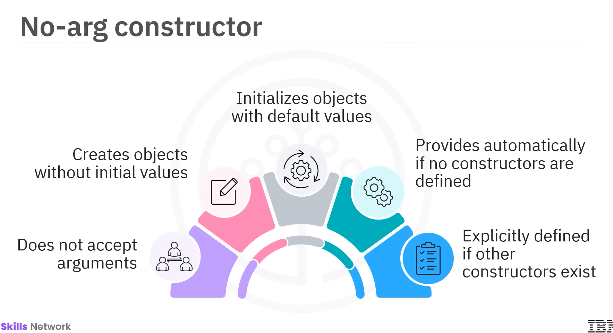
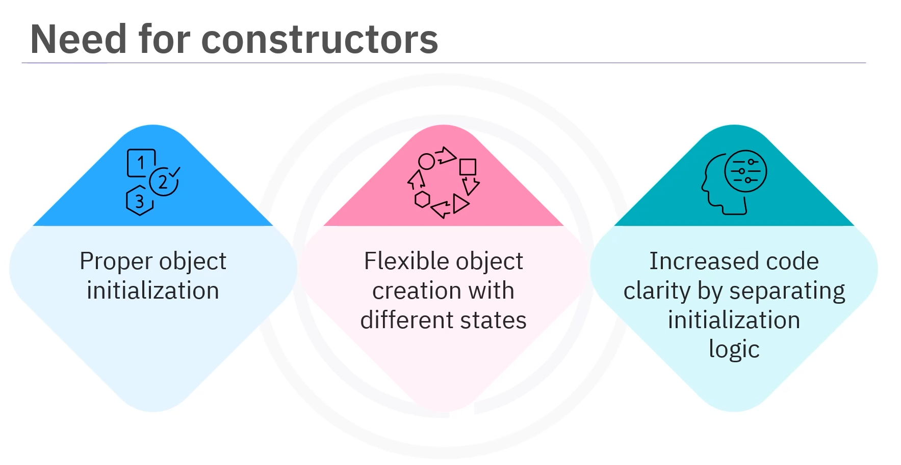
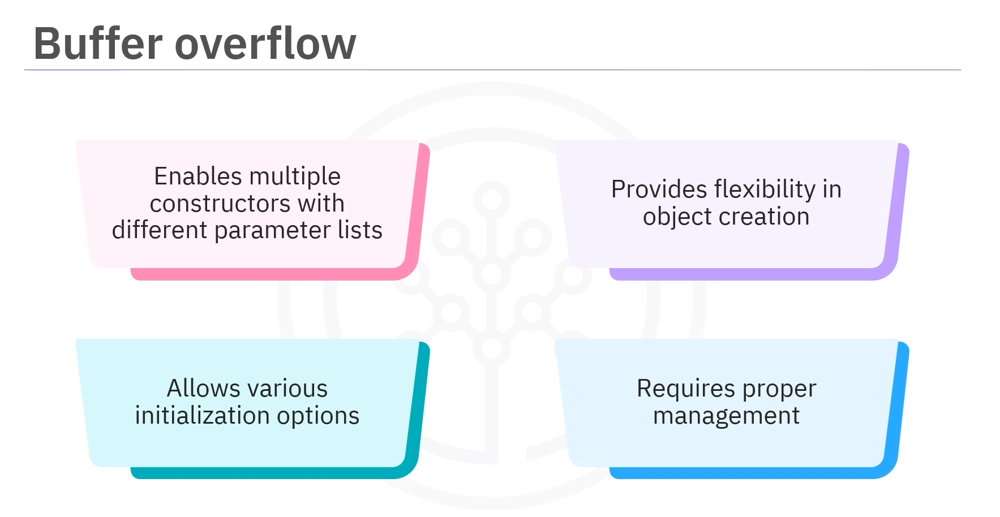
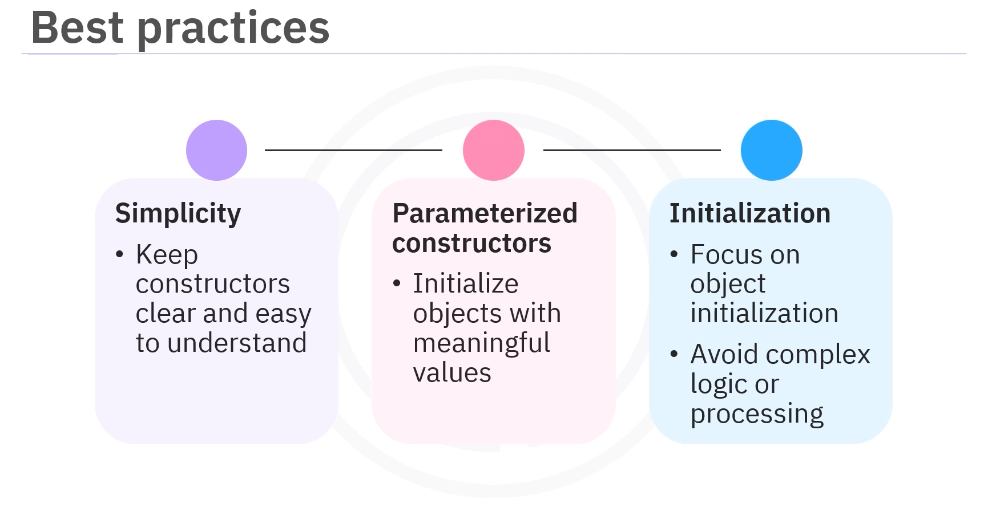

# 01-005:   Java Constructors



---

## What are Constructors?

Imagine building a robot where every part needs to be placed in its position before it can function. This is what a constructor does in Java.



> **Constructors**, a foundational concept of Java, play a crucial role in creating and initializing objects. They automatically set up an object's initial state by assigning values to its attributes when it's created.

---

## Characteristics of Constructors

Constructors have distinct characteristics that set them apart from regular methods:



#### 1. **Same name as the class** 
A constructor shares the same name as the class it belongs to

#### 2. **No return type**
Unlike regular methods, it does not have a return type, not even `void`

#### 3. **Automatic invocation**
Constructors are invoked automatically when an object of the class is created, which implies that they play a crucial role in initializing objects

#### 4. **Overloadable**
Constructors can be overloaded, allowing multiple constructors within the same class with different sets of parameters, providing greater flexibility in object creation

---

## Types of Constructors

Java has three main types of constructors:

### 1. Default Constructor

A **Default constructor** is automatically provided by Java when no constructors are explicitly defined in a class.



#### **Characteristics**
1.  Takes no parameters
2.  Used to initialize the object with default values
3.  Java will create a default constructor that assigns default values to the object's attributes if a class defines no constructor

**Example: Dog Class with Default Constructor**

```java
class Dog {

    String name;
    
    // A)   DEFAULT CONSTUCTOR
    Dog() {
        this.name = "unknown";
    }
    
    void display() {
    
        System.out.println("Dog's name: " + name );
        
    }
}


public class Main {

    public static void main(String[] args) {

        // B)   DEFAULT CLASS INVOKATION
        Dog myDog = new Dog();
    }

}
```

In this example:  
- The default constructor in the Dog class initializes the `name` attribute
- The Name Attribute is set to "unknown" when the Dog object is created


### 2. Parameterised Constructor

A **Parameterised constructor** allows values to be passed to an object at the time of creation, enabling specific initialization of the object's attributes.



#### **Characteristics**
1.  Unlike the default constructor, which assigns fixed default values, a parameterised constructor accepts one or more arguments
2.  Provides flexibility to assign different values based on the input

**Example: Dog Class with Parameterised Constructor**

```java
class Dog {

    String name;
    
    // A)   PARAMETRISED CONSTUCTOR
    Dog(String dogName) {
        
        name = dogName;
    }
    void display() {
    
        System.out.println("Dog's name: " + name );
        
    }
}


public class Main {

    public static void main(String[] args) {

        // B)   PARAMETRISED CLASS INVOKATION
        Dog myDog = new Dog("Pepito");
        
        // C)   THEN, THE OUTPUT
        myDog.display();
    }

}
```
In  this example:  
1. When a Dog object is instantiated with the name "Pepito", the constructor assigns the value "Pepito" to the `name` attribute, ensuring that the object is initialized with the desired value at creation.
2. String paramenter: `dogName`
3. Name attriute:   `Pepito`


### 3. No-Arg Constructor (NoArg Constructor)

A **No-Arg constructor**, also known as a **NoArgument constructor**, is a type of default constructor that does not accept any arguments or parameters.



#### **Characteristics**
1.  Allows the creation of an object **without requiring any initial values** (**DOES NOT ACCEPT ARGS**) to be provided by the user
2.  Useful when you want to **create an object with default or predefined values** for its attributes
3.  Java automatically provides a NoArg constructor if no constructors are explicitly defined in a class
4.  However, if any constructor is defined, whether parameterised or otherwise, the default NoArg constructor **must be explicitly defined** if needed

**Example: Car Class with NoArg Constructor**

```java
class Car {
  
    String model;
    int year;
    
    // A)   NoArg CONSTRUCTOR
    Car() {
        
        model = "Default Model";
        year = 2026; // Default value for int year
    }
    void display() {
        System.out.println("Car Model: " + model + ", Year: " + year);
    }
}

public class Main {

    public static void main(String[] args) {
    
        // B)    NoArg CLASS INVOKATIOn
        Car myCar = new Car();
        
        // C) THEN SHOW DATA
        myCar.display(); // Output: Car Model: Default Model, Year: 2026
        
    }
}
```

When an object of the Car class is created using `new Car()`:
1.  A)  The **NoArg constructor is called automatically**
2.  B)  The default values are assigned to the `model` and `year` attributes
3.  C)  The `display()` method then prints the car's model and year, showing the initialised values.


---

## Why Use Constructors?

Constructors are essential for several reasons:



- **Proper initialisation**: They ensure that objects are initialised properly before use, setting their attributes to desired values

- **Flexibility**: With parameterized constructors, constructors offer flexibility by allowing objects to be created with different initial states based on the passed arguments

- **Code clarity**: They enhance code clarity by **organizing the initialization logic separately from other methods**, making the code more readable and maintainable

- **Multiple creation patterns**: They allow a class to have multiple constructors with different parameter lists, enabling objects to be created in various ways, providing flexibility in object initialization

---

## Constructor Overloading (Buffer Overflow, Constructors Overflow)

> **Constructor overloading allows a class to have multiple constructors with different parameter lists**

**BUT, BE CAREFUL!**: While constructor overloading provides flexibility, excessive constructor overloading without proper checks can lead to buffer overflow issues. Always implement yconstructors carefully and validate input parameters when necessary.



#### MAIN GOAL WITH CONSTRUCTORS!
**Depending on the number of parameters provided during object creation, the appropriate constructor is called to initialize the object.**


**Example: Dog Class with Multiple Constructors**

```java
class Dog {
    String name;
    int age;

    // A)   Default constructor
    Dog() {
        name = "Unknown";
        age = 0;
    }

    // B)   Parameterised constructor with one parameter
    Dog(String dogName) {
        name = dogName;
        age = 0;
    }
    
    // C(   Parameterised constructor with two parameters
    Dog(String dogName, int dogAge) {
        name = dogName;
        age = dogAge;
    }

    void display() {
        System.out.println("Dog's name: " + name + ", Age: " + age);
    }
}

public class Main {
    
    public static void main(String[] args) {
    
        Dog dog1 = new Dog(); // Calls default constructor
        Dog dog2 = new Dog("Charlie"); // Calls first parameterised constructor
        Dog dog3 = new Dog("Max", 5); // Calls second parameterised constructor

        dog1.display(); // Output: Dog's name: Unknown, Age: 0
        dog2.display(); // Output: Dog's name: Charlie, Age: 0
        dog3.display(); // Output: Dog's name: Max, Age: 5
    }
}
```

In this example, the Dog class has three constructors. Depending on the number of parameters provided during object creation, the appropriate constructor is called to initialize the object.

---

## Best Practices for Using Constructors

Following best practices when using constructors is important to ensure clarity, efficiency, and maintainability:



- **Keep constructors simple**: Constructors should be kept simple to make them easy to understand and manage

- **Use parameterized constructors**: Parameterized constructors are preferred to allow object initialization with meaningful values during creation

- **Avoid complex logic**: Constructors should avoid complex logic or calculations, focusing primarily on initialization

- **Maintain code organization**: This approach improves code organization and prevents constructors from becoming unnecessarily complicated

---
