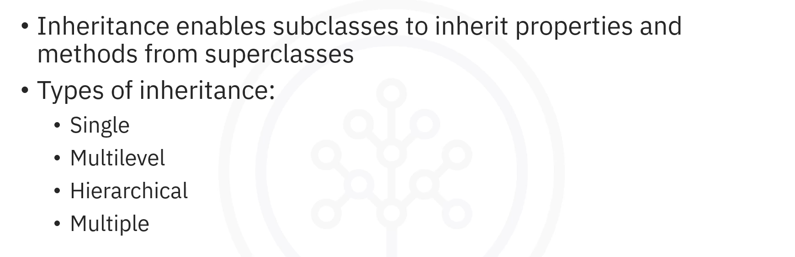
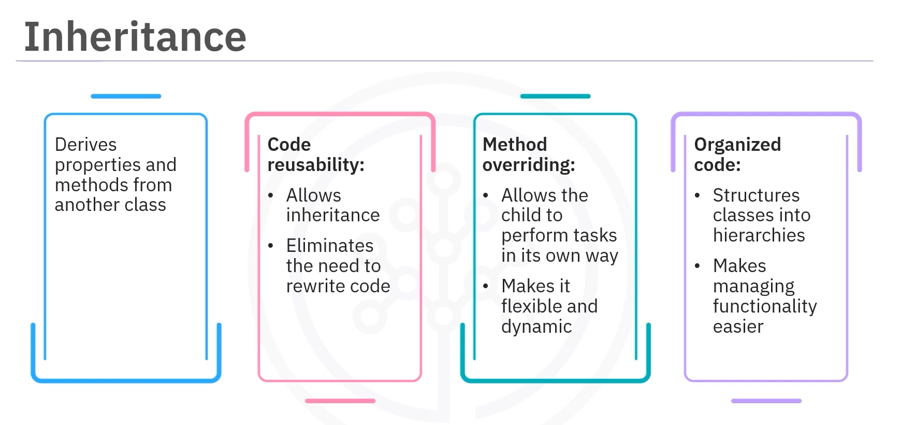
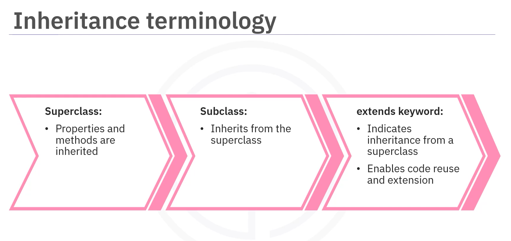
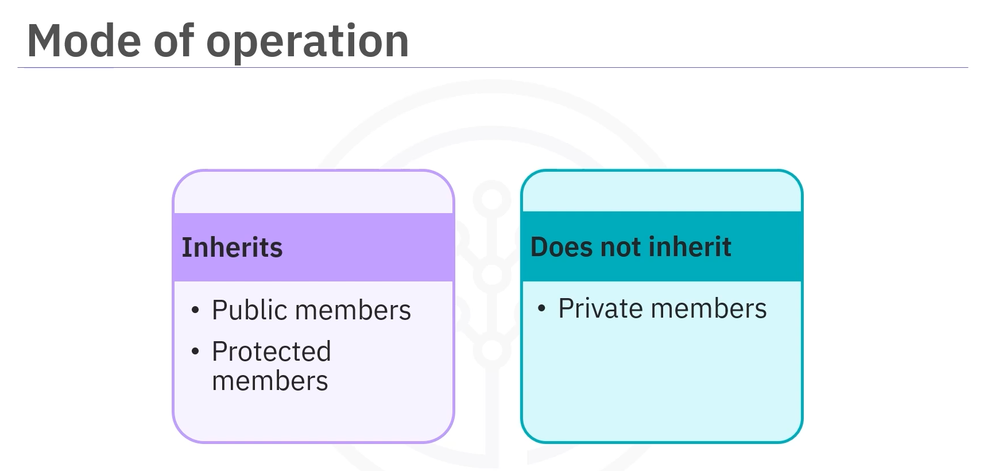
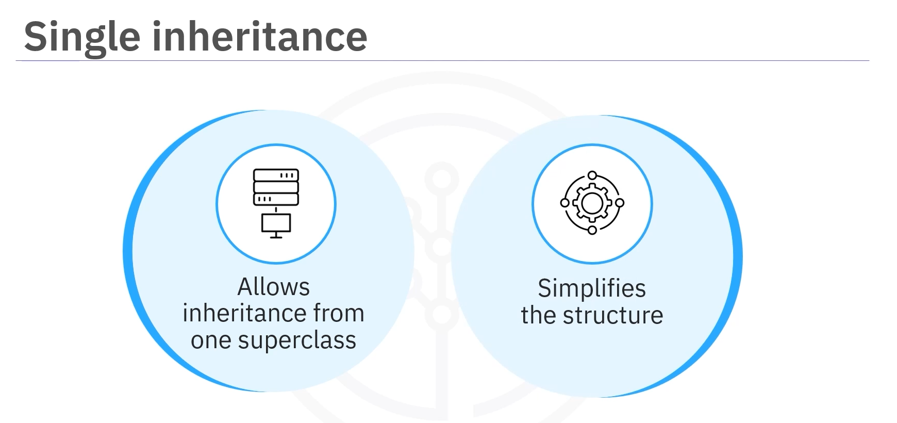
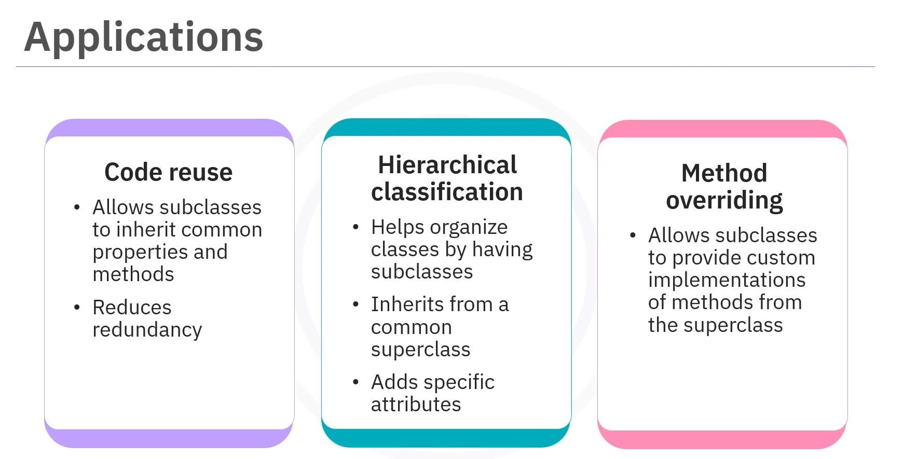
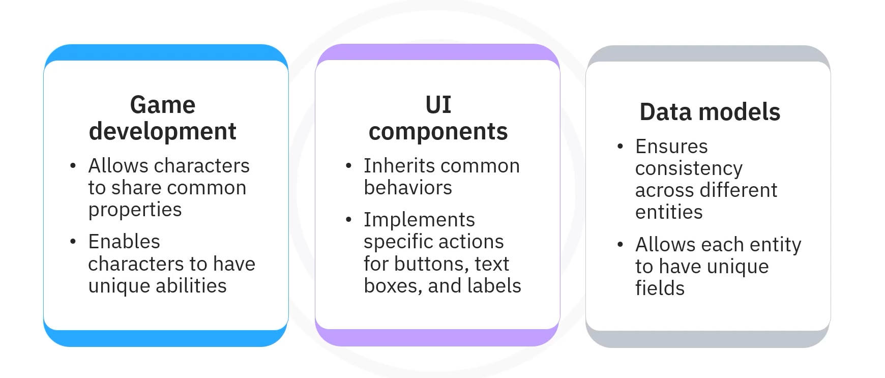

# 02-001:   Inheritance extended




---

## What is Inheritance?

### Analogy: The Smartphone

Picture this. You're out for your morning walk and your phone buzzes. It's a message from your friend. A moment later, you glance at your phone to check your step count, and you've already done 8,000 steps. You then use it to look up nearby cafes and grab a coffee. 


**That's the beauty of a smartphone.** It inherits basic functionalities such as calling and texting from the `Phone` class while offering new features such as sensors, apps, and a touchscreen to offer new functions.

### Definition of Inheritance



> **Inheritance** is a concept in which one class, known as the child, derives properties and methods from another class, the parent. 

#### Benefits of Inheritance

##### **Code Reusability**
Promotes code reusability by allowing the class to inherit methods and properties from another class, eliminating the need to rewrite existing code

##### **Method Overriding**
Allows a subclass to change how a method from its parent class works. This process, known as **method overriding**, allows the child to perform specific tasks in its own way, making its behavior more flexible and dynamic

##### **Organized Code Structure**
Inheritance helps maintain organized code by structuring classes into hierarchies, making it easier to understand and extend functionality

---

## Inheritance Terminology



### Superclass

A **superclass** is a class whose properties and methods are inherited by another class.

### Subclass

A **subclass** (also called a child class) inherits properties and methods from a superclass.

### The `extends` Keyword

The **`extends`** keyword is used to define that a class is inheriting from a superclass, enabling code reuse and extension.

---

## How Inheritance Works in Java



- A subclass inherits all the **public** and **protected** members, such as fields and methods, from the superclass.

- However, it does **not** inherit the **private** members.

### Example: Animal and Dog Classes

#### The Superclass: Animal

```java
// SUPERCLASS
class Animal {
    
    // Property to store the animal's name
    String name;
    
    // Method to indicate the animal is eating
    void eat() {
        System.out.println(name + " is eating");
    }
}
```

1.  The superclass `Animal` has a property `name` to store the animal's name.
2. Also, a method `eat()` that prints a message indicating the animal is eating.

#### The Subclass: Dog

```java
class Dog extends Animal {
    
    // Additional method specific to Dog
    void bark() {
        System.out.println(name + " says wooof!");
    }
}
```

1.  The subclass `Dog` extends the `Animal` class.
2.  Inheriting its properties and methods
3.  It also includes an additional method, `bark()`, that prints a message indicating that the dog is barking.


---


#### Using Inheritance in the Main Program

```java
public class Main {
    
    public static void main(String[] args) {
        
        // Create an instance of Dog
        Dog myDog = new Dog();
        
        // Setting a name
        myDog.name = "Buddy"
        
        // Call the inherited eat() method from Animal
        myDog.eat();
        
        // Call the bark() method defined in Dog
        myDog.bark();
    }
}
```

1.  An instance of `Dog` was created.
2.  A name is set.
3.  Both, the inherited `eat()` method (from the `Animal` superclass) and the new method `bark()` (defined in the `Dog` class) , are invoked.


---

## Types of Inheritance

### 1. Single Inheritance



> Single inheritance allows a class to inherit from just one superclass, simplifying the structure.

```
Animal (Superclass) ---> Dog (Subclass)
```


### 2. Multilevel Inheritance

```java
class Puppy extends Dog {

    void weep() {
    
        System.out.println(name + "is weeping!");
        
    }
}
```
1.  The class `Puppy` inherits from `Dog`, which is a subclass of the superclass `Animal`.


```
Animal (Superclass) --> Dog (Subclass) --> Puppy (Subclass of Dog)
```

> Multilevel inheritance builds on single inheritance by **allowing subclasses to inherit from other subclasses**.


### 3. Hierarchical Inheritance

```java
class Cat extends Animal {

    void meow() {
    
        System.out.println(name + " says meow!");
        
    }
}

```
1.  `Cat` is a new subclass
2. It inherits from `Animal` just like `Dog`.

```
Animal (Superclass) -- Inherits ------> Dog (Subclass)
Animal (Superclass) -- Also Inhertis -> Cat (Subclass)
```


> Hierarchical inheritance **enables multiple subclasses to inherit from a common superclass**, making it efficient for shared functionality.

### 4. Multiple Inheritance


> Multiple inheritance indicates the process of one subclass inheriting properties from multiple superclasses. Multiple inheritance is **not** supported directly in Java due to ambiguity **but can be implemented using **INTERFACES**, offering flexibility in complex systems.


---

## Method Overriding

### What is Method Overriding?

Method overriding **allows a subclass to provide a different implementation of a method that is already defined in the superclass.**

### Example: Overriding the Sound Method

#### The Superclass: Animal

```java
class Animal {
    void sound() {
        System.out.println("Animal makes a sound!");
    }
}

```

#### The Subclass: Dog (Overriding the Sound Method)

```java
class Dog extends Animal {
    
    @Override
    void sound() {
    
        System.out.println("Dog barks!");
    
    }
}
```

1.  The `Dog` subclass overrides the `sound()` method to print `Dog barks` instead of `Animal makes a sound`

2.  Even though `myDog` is declared as an `Animal`, it calls the `sound()` method from the `Dog` class

#### Using the Overridden Method

```java
public class Main {
    
    public static void main(String[] args) {
        
        // 1 Animal Class
        Animal myAnimal = new Animal();
        
        // 2. Upcasting, Class Dog declares a new Dog object as an Animal
        Animal myDog = new Dog();
        
        // 3. Regular sound() method for Animal
        // Output:  Animal makes a sound!
        myAnimal.sound();
        
        // 4. But, for dog, will be overriden:
        // Output:  Dog barks!
        myDog.sound();
    }

}
```

---

## Applications of Inheritance in Java




### 1. Code Reusability

Inheritance facilitates code reuse by allowing subclasses to inherit common properties and methods, reducing redundancy.

### 2. Hierarchical Classification

Hierarchical classification helps organize classes by having subclasses inherit from a common superclass, adding specific attributes.

### 3. Method Overriding

Method overriding allows subclasses to provide custom implementations of methods defined in the superclass.

### 4. Game Development

In game development, inheritance allows characters to share common properties but have unique abilities.

### 5. UI Components

UI components can inherit common behaviors while implementing specific actions for buttons, text boxes, and labels.

### 6. Data Models

Inheritance ensures consistency in data models across different entities while allowing each to have unique fields.

---


