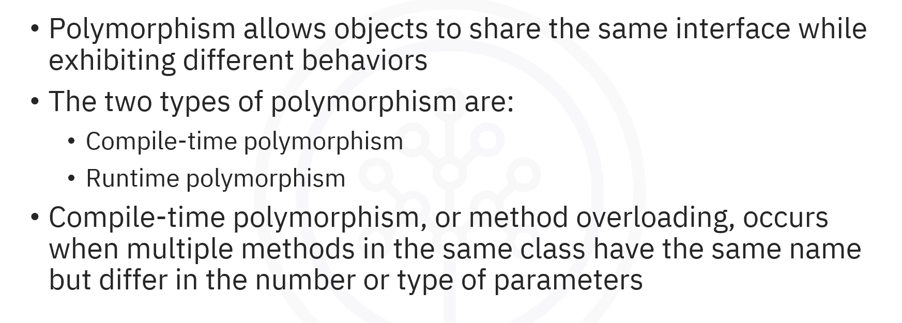
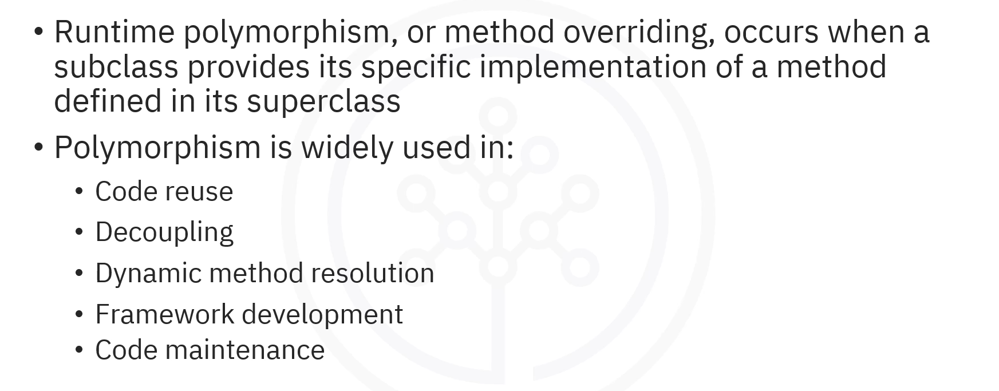
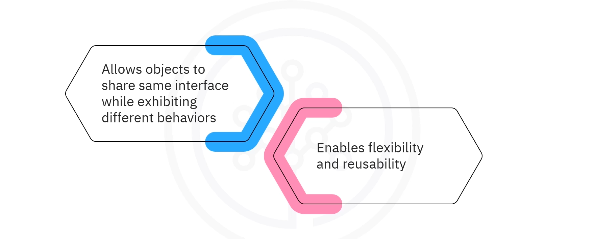
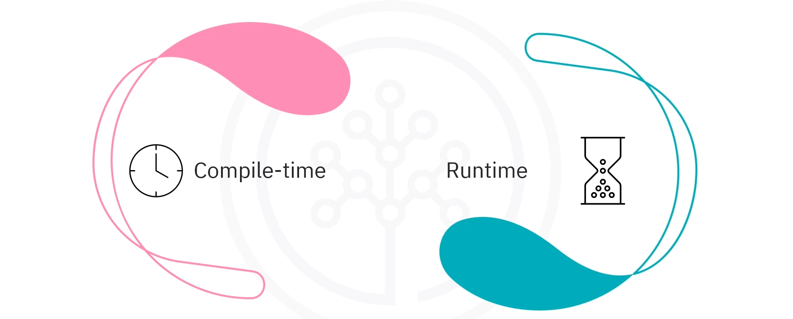
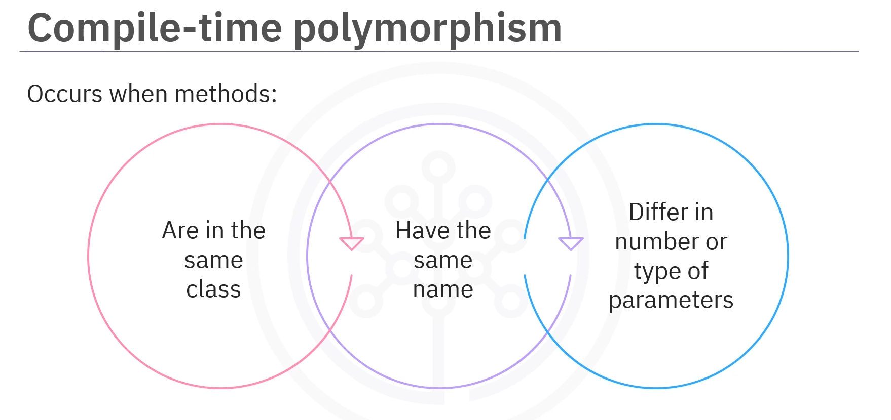
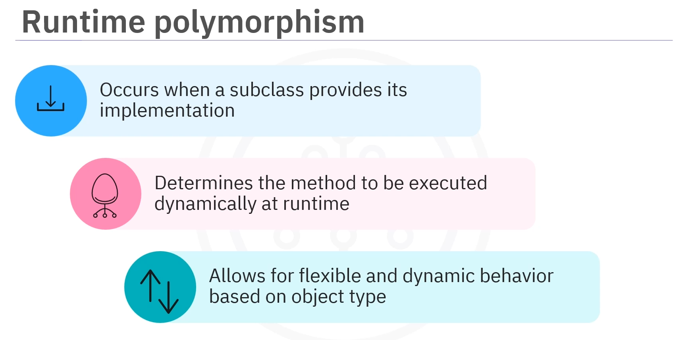
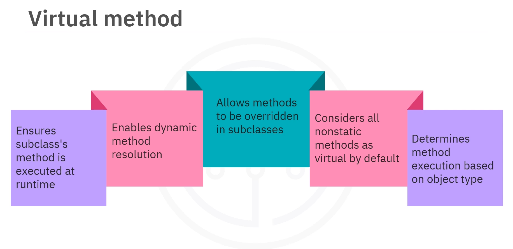
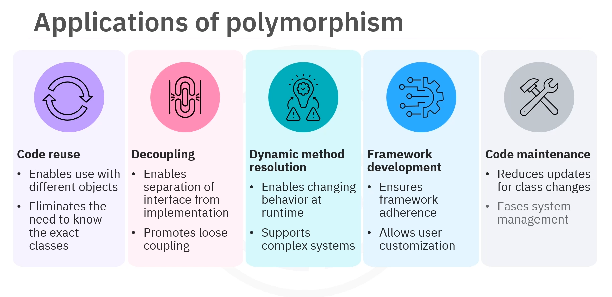

# 02-002:   Polymorphism extended



---

## What is Polymorphism?

### Analogy: The Fingerprint

Have you ever considered how your fingerprint is a unique master key you can carry everywhere? It can unlock your phone, mark your attendance, or even authorize payments. It's just one key, but depending on how and where it's used, it fulfills many roles.


**That's polymorphism in action.**

### Definition of Polymorphism



> **Polymorphism** is a process that allows objects to share the same interface while exhibiting different behaviors based on their specific implementations. 
>It is critical to enable flexibility and reusability in object-oriented programming.

---

## Types of Polymorphism

There are **two types of polymorphism**:



1. **Compile-time polymorphism** (Method Overloading)
2. **Runtime polymorphism** (Method Overriding)

---

## Compile-Time Polymorphism (Method Overloading)

### Definition



**Compile-time polymorphism**, or **method overloading**, occurs when multiple methods belonging to the same class have the same name but differ in the number or type of parameters.  

In this process, **method selection is determined at compile time.**

### Example: Math Operations Class

#### The Math Operations Class

```java
class MathOperations {
    
    // Method 1: Takes two integers and returns their sum
    int add(int a, int b) {
    
        return a + b;
    
    }
    
    // Method 2: Takes three integers and returns their sum
    int add(int a, int b, int c) {
        
        return a + b + c;
    
    }
    
    // Method 3: Takes two double values and returns their sum
    double add(double a, double b) {
    
        return a + b;
    
    }
}
```

The class has three overloaded `add` methods:  
1.  The first takes two integers and returns their sum
2.  The second takes three integers and returns their sum
3.  The third takes two double values and returns their sum

#### Using the Overloaded Methods

In the 
```java
public class Main {
    
    public static void main(String[] args) {
        
        // Create an object of MathOperations
        MathOperations math = new MathOperations();
        
        // Invoke the 1st method with two integers
        int result1 = math.add(5, 10);
        System.out.println("Sum of two integers: " + result1);
        
        // Invoke the 2nd method with three integers
        int result2 = math.add(5, 10, 15);
        System.out.println("Sum of three integers: " + result2);
        
        // Invoke the 3rd method with two doubles
        double result3 = math.add(5.5, 10.5);
        System.out.println("Sum of two doubles: " + result3);
    }
}
```

In the main class:
1. An object of `MathOperations` is created 
2. The `add` method is called with different types and numbers of arguments, such as two integers, three integers, and two double

In this scenario, **method overloading allows the same method name to handle different inputs** and produce appropriate results.

---


## Runtime Polymorphism (Method Overriding)

### Definition



**Runtime polymorphism**, or **method overriding**, occurs when a subclass provides its specific implementation of a method defined in its superclass.  

At runtime, the method to be executed is dynamically determined depending on the actual type of the object, allowing for more flexible and dynamic behavior.

### Example: Animal, Dog, and Cat Classes

#### The Superclass: Animal

```java
class Animal {
    
    void sound() {
    
        System.out.println("Animal makes a sound");
    
    }
}
```

#### The Subclass: Dog (Overriding the sound Method)

```java
class Dog extends Animal {
    
    @Override
    void sound() {
    
        System.out.println("Dog barks!");
    
    }
}
```

#### The Subclass: Cat (Overriding the sound Method)

```java
class Cat extends Animal {
    
    @Override
    void sound() {
    
        System.out.println("Cat meows!");
    
    }
}
```

1.  The 'Animal' superclass is defined with a generic `.sound()` method

2.  The `Dog` and `Cat` classes extend the `Animal` class and override the `sound()` method to provide their specific behavior

3.  The `Dog` class prints `Dog barks` while the `Cat` class prints `Cat meows`.

#### Using Runtime Polymorphism

```java
public class Main {
    
    public static void main(String[] args) {
        
        // Declare an Animal reference
        Animal myAnimal;
        
        // Assign it to a Dog object
        myAnimal = new Dog();
        myAnimal.sound(); // "Dog barks!"
        
        // Assign it to a Cat object
        myAnimal = new Cat();
        myAnimal.sound(); // "Cat meows!"
    }
}
```
So, retaking the full code:  

1.  In the main class, an `Animal` reference is declared
2.  It is assigned first to a `Dog` object and then to a `Cat` object
3.  When the `sound()` method is called, the correct version is executed based on the object type, even though the reference is of type `Animal
4.  This showcases runtime polymorphism, where the method invoked is determined by the object type at runtime, not the reference type.

---

## Virtual Methods

### What are Virtual Methods?



In Java, a **virtual method** is:  
>Any method that can be overridden in a subclass, enabling dynamic method resolution

>By default, **all non-static methods in Java are virtual**. This ensures that if a subclass implements a method from its superclass, its version will be executed at runtime regardless of the reference type.

### Example: Virtual Method Resolution

#### The Superclass: Animal

```java
class Animal {
    
    void sound() {
    
        System.out.println("Animal makes a sound");
    
    }
}
```

#### The Subclass: Dog

```java
class Dog extends Animal {
    
    @Override
    void sound() {
    
        System.out.println("Dog barks!");
    
    }
}
```

The `Dog` class extends the `Animal` class and overrides the `sound()` method.

#### Virtual Method in Action

```java
class Main {
    
    static void main(String[] args) {
    
        // Create an Animal reference assigned to a Dog object
        Animal myAnimal = new Dog();
        
        // Call the sound method
        myAnimal.sound();  // Output: Dog barks
    
    }
}
```

1.  In the main class, an `Animal` reference is created and assigned to a `Dog` object. 

2.  When the `sound()` method is called on the `myAnimal` reference, the overridden version in the `Dog` class is executed, printing `Dog barks`.

3.  Here, the `sound()` method is considered a virtual method because it is overridden in the `Dog` class.

4.  At runtime, the method invoked depends on the actual object type, not the reference type. 

5.  This illustrates how virtual methods allow dynamic method resolution during runtime based on the object's type.

---

## Applications and Use Cases of Polymorphism



### 1. Code Reusability

Polymorphism facilitates code reusability by enabling developers to write generic code that can work with different types of objects, avoiding the need to know their exact class beforehand.

### 2. Decoupling

Polymorphism promotes decoupling by allowing the separation of code that uses an interface from the code that implements it, resulting in loosely coupled systems that are easier to maintain.

### 3. Dynamic Method Resolution

Polymorphism supports dynamic method resolution, making it especially valuable in complex systems where behavior may need to change at runtime.

### 4. Framework Development

Polymorphism plays a key role in framework development, allowing users to implement their functionalities while adhering to the framework's structure.

### 5. Code Maintenance

Polymorphism simplifies code maintenance as changes in class hierarchies or method implementations require fewer updates across the codebase, making the overall system more acceptable and manageable.

---
