# 02-004:   Abstraction

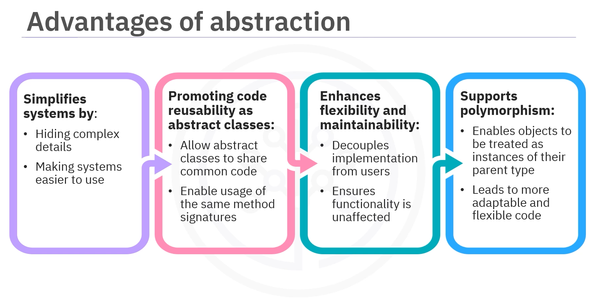

---

## What is Abstraction?

### Analogy: Using an Android App

Imagine using an Android app. You tap on an icon and the app opens and does what you need with just a few clicks. You don't have to worry about how it processes the tap or retrieves data from the cloud.

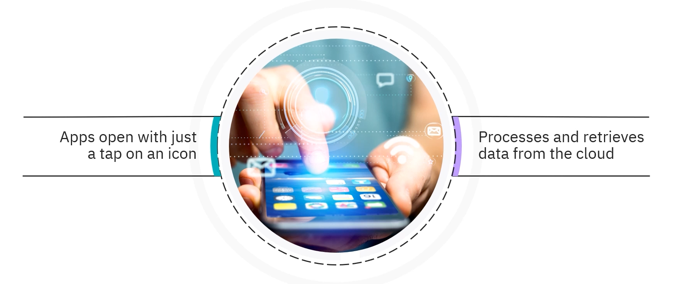

**That's the power of abstraction.**

### Definition of Abstraction

> **Abstraction simplifies complex systems by hiding unnecessary details and exposing only the essential features**.

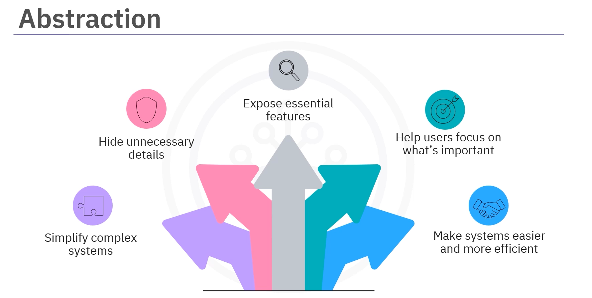

This helps users or developers focus on what's important without getting overwhelmed by the intricate workings behind the scenes.  

It makes interacting with or building systems easier and more efficient.

### How Abstraction is Achieved in Java

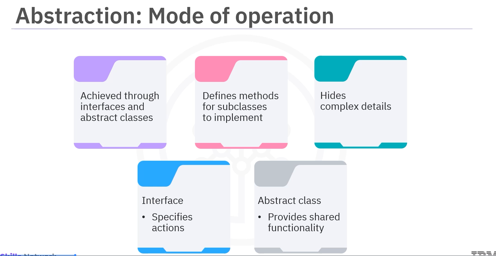

>In Java, abstraction is achieved through **INTERFACES** and **ABSTRACT CLASSES**. 

These tools allow you to define methods that subclasses must implement while hiding the complex details of how those methods work.  

Interfaces specify what actions and objects should perform, while abstract classes can provide partial implementations or shared functionality.


---

## Interfaces in Java

### What is an Interface?

> An **interface** in Java is **a reference type that defines a contract for classes to follow**. 

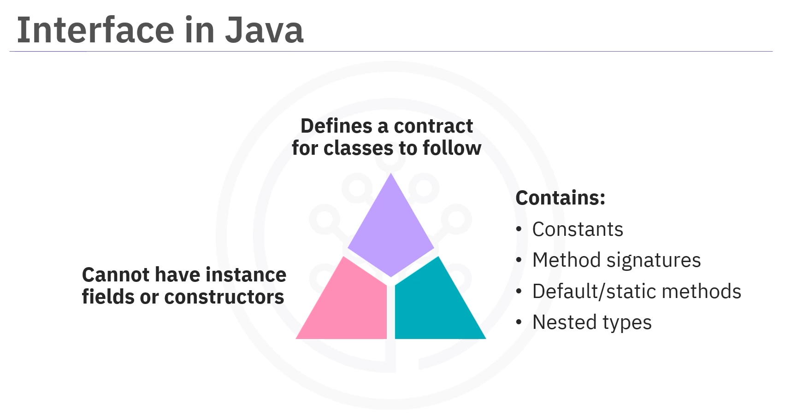

It can contain:  
-   Constraints
-   Method signatures
-   Default methods
-   Static methods
-   Nested types

But ... **cannot have instance fields or constructors**.


### Characteristics of Interfaces

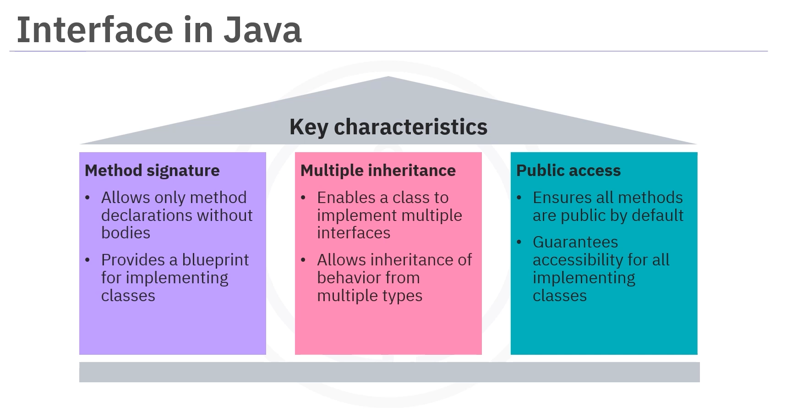

#### **Abstract Methods by Default**
The methods in an interface are abstract by default and don't have a body. They must be implemented by classes that choose to implement the interface.

#### **Method Signatures**
Interfaces in Java define only method signatures without bodies, providing a blueprint for classes to implement.

#### **Multiple Inheritance**
Interfaces support multiple inheritance, allowing a class to implement multiple interfaces and inherit behaviors from various types.

#### **Public Methods**
All methods in an interface are `public` by default, ensuring accessibility to any class that implements the interface.

These characteristics make interfaces a powerful tool for abstraction and flexibility in Java.


---

### Example: Animal Interface

#### The Interface: Animal

```java
// 1.   Defining an Interface
interface Animal {
    
    // 2. Method Signature
    void sound();

}
```

#### The Class: Dog (Implementing the Interface)

```java
// 3. Implementing the Interface in Dog Class
class Dog implements Animal {

    public void sound() {
        
        System.out.println("Bark");
    
    }
}
```

#### The (other) Class: Cat (Implementing the Interface)

```java
// 4. Implementing the Interface in Cat Class
class Cat implements Animal {

    public void sound() {
     
        return "Meow";
    
    }
}
```

#### Using the Interface in the Main Class

```java
public class Main {

    public static void main(String[] args) {
        
        // 5.   Create instances of Dog and Cat
        Animal dog = new Dog();
        Animal cat = new Cat();
        
        // 6. Invokethe sound method on each
        dog.sound());  // Output: Woof
        cat.sound());  // Output: Meow
    }
}
```

Here:  
1.  An interface named `Animal` is defined with the method `sound()`.

2.  The `Dog` and `Cat` classes implement the `Animal` interface and provide their versions of the `sound()` method.

3.  In the `Main` class, instances of `Dog` and `Cat` are created, and the `sound()` method is called on each to demonstrate polymorphism.

This allows the same method name `sound()` to behave in two different ways, depending on the object type, showing how different classes can provide unique implementations of the same method.


---

### Use Cases for Interfaces

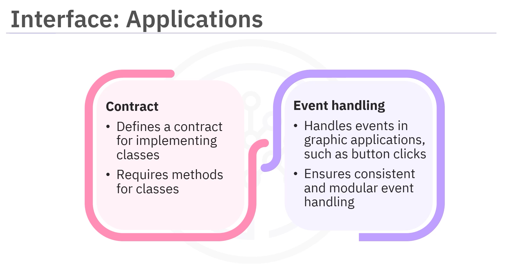

#### 1. Defining Contracts

Interfaces define a contract that implementing classes must follow.  
For example, an interface for payment requires a `payment process` method for classes such as `CreditCardPayment` or `PayPalPayment`.

#### 2. Event Handling in GUI Applications

Interfaces are also used in graphic applications to handle events, such as defining actions for button clicks and ensuring consistent and modular event handling.

---

## Abstract Classes in Java

### What is an Abstract Class?

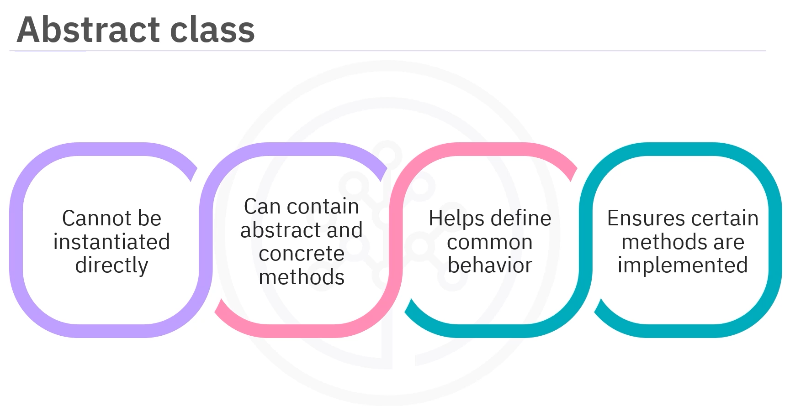

- An **abstract class** in Java cannot be instantiated directly. 

- It can contain abstract methods that must be implemented by subclasses and concrete methods that can be used or overridden by subclasses 

- Abstract classes help define common behavior across related classes while ensuring that the subclasses implement certain methods.


### Key Characteristics of Abstract Classes

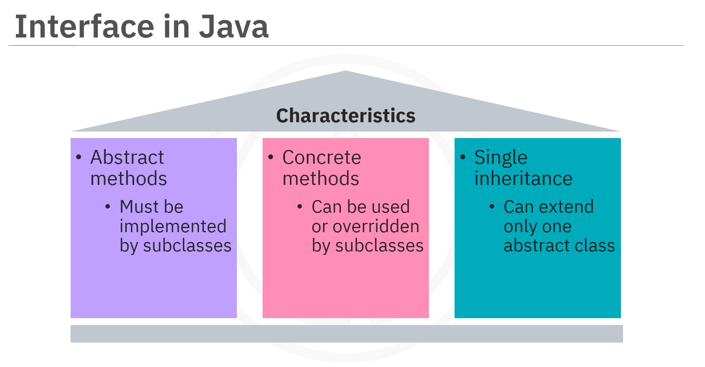

#### **Abstract Methods**
Can contain abstract methods that must be implemented by subclasses

#### **Concrete Methods**
Can contain concrete methods that can be used or overridden

#### **Single Inheritance**
Support single inheritance where a class can extend only one abstract class


---


### Example: Shape Abstract Class

#### The Abstract Class: Shape

```java
// 1.   Defining an Abstract class
abstract class Shape {
    
    // 2.1  Abstract method (must be implemented by subclasses)
    abstract void draw();
    
    // 2.2  Concrete method (can be used or overridden)
    void display() {
        
        System.out.println("This is a shape");
    
    }
}
```

#### The Concrete SubClass: Circle (Extending the Abstract Class)

```java
// 3.   Concrete Subclass
class Circle extends Shape {

    void draw() {
    
        System.out.println("Drawing Circle");
    
    }
}
```

#### Using the Abstract Class in the Main Class

```java
public class Main {
    
    public static void main(String[] args) {
        
        // 4.   Create an instance of Circle using a Shape reference type
        Shape shape = new Circle();
        
        // 5.   Invoking the abstract method (implemented in Circle)
        shape.draw();  // Output: Drawing Circle
        
        // 6.   Invoking the concrete method (inherited from Shape)
        shape.display();  // Output: Displaying shape
    
    }

}
```

In this example... :

1.  An abstract class `Shape` is defined with an abstract method `draw()` and a concrete method `display()`.

2.  The `Circle` class extends the `Shape` class and implements the `draw()` method.

3.  In the main class, an instance of `Circle` is created using a `Shape` reference type, demonstrating how the abstract class and its concrete and abstract methods work together.


This shows how a subclass can implement the abstract method while still inheriting the concrete behavior from the abstract class.

---

### Use Cases for Abstract Classes

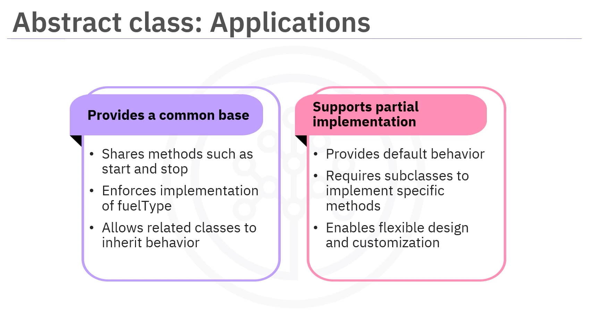

#### 1. Shared Behavior Across Related Classes

Abstract classes **provide a common base for related classes**.  

For example, if there are different types of vehicles, such as cars and trucks, an abstract class known as `Vehicle` can be created with shared methods such as `Start()` and `Stop()` while enforcing that each vehicle must implement its own version of `FuelType()`.

#### 2. Partial Implementation

Abstract classes are used for partial implementation when the default behavior is provided, but subclasses are still required to implement specific methods.**  

This approach allows for flexible designs that share common functionality while enabling customization in subclasses.

---

## Interfaces vs. Abstract Classes


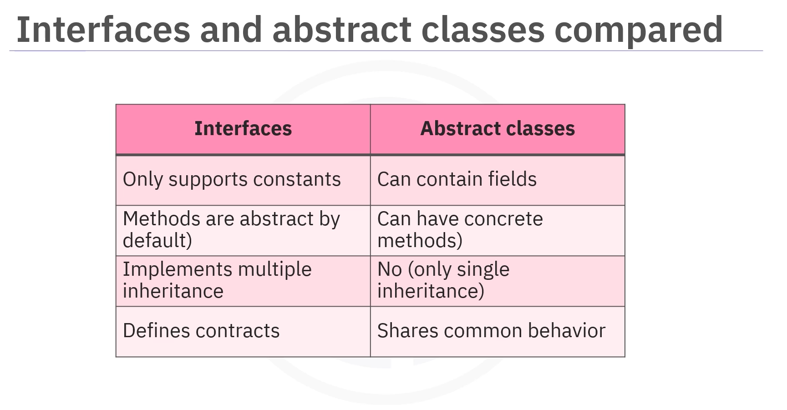

| Feature | Interface | Abstract Class |
|---------|-----------|----------------|
| **Method Implementation** | Cannot contain method implementations (only abstract methods) | Can contain both abstract and concrete methods |
| **Fields** | Restricted to containing constants | Can contain instance fields and variables |
| **Inheritance Model** | Supports multiple inheritance (a class can implement multiple interfaces) | Supports single inheritance (a class can extend only one abstract class) |
| **Constructors** | Cannot have constructors | Can have constructors |
| **Access Modifiers** | All methods are `public` by default | Can have various access modifiers (`public`, `protected`, `private`) |
| **Purpose** | Define contracts and specify what methods must be implemented | Provide a common base with shared behavior and enforce necessary implementations |

### When to Use Each

- **Use Interfaces**: When you want to define a contract that multiple unrelated classes can follow, and you need multiple inheritance of type.
- **Use Abstract Classes**: When you have a group of related classes that need to share code and data, or when you want to define non-public members.

---

## Benefits of Abstraction


### 1. Simplifies Complex Systems

Abstraction simplifies systems by hiding complex details, making them easier to understand and use.

### 2. Promotes Code Reusability

Abstraction promotes code reusability as abstract classes allow common code to be shared, and interfaces enable different classes to use the same method signatures.

### 3. Enhances Flexibility and Maintainability

Abstraction enhances flexibility and maintainability as changes to the implementation do not affect users as long as the interface remains consistent.

### 4. Supports Polymorphism

Abstraction supports polymorphism, allowing objects to be treated as instances of their parent type, which leads to a more flexible and adaptable code.

---
