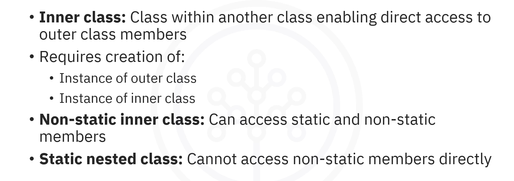
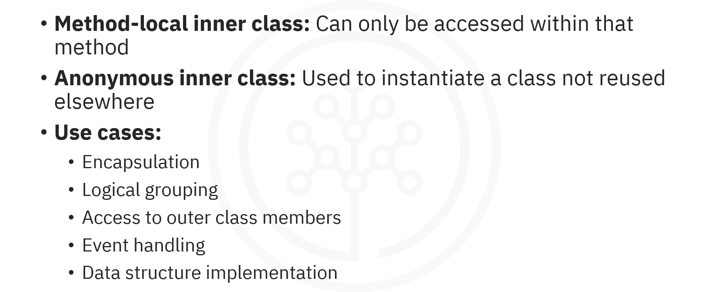
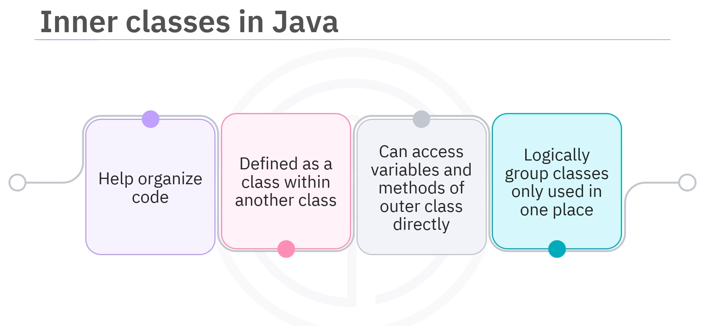
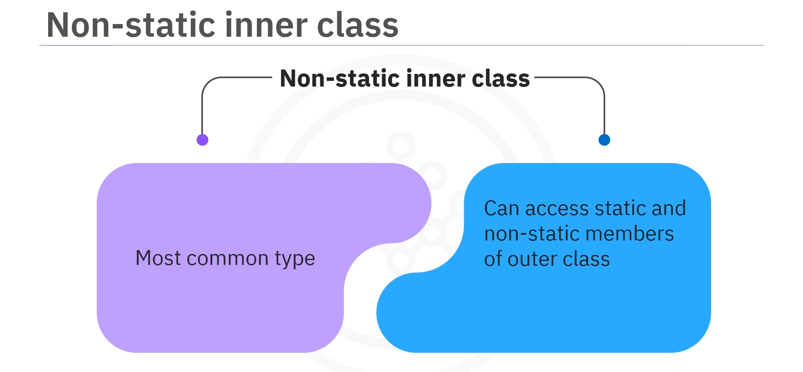
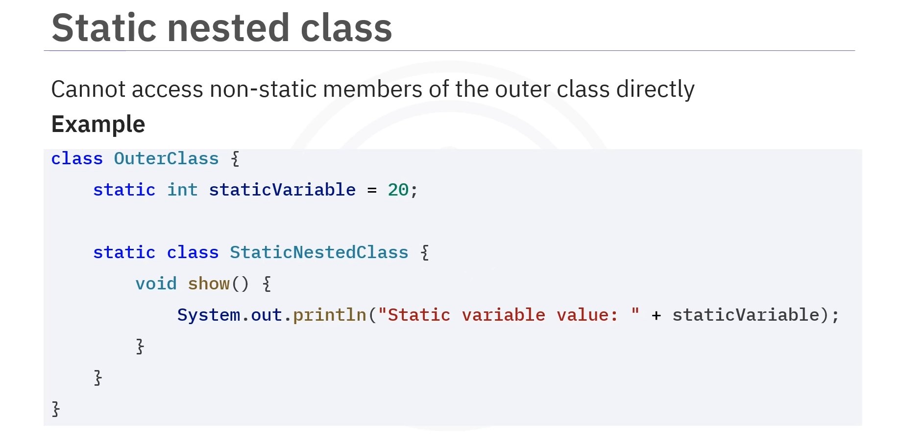
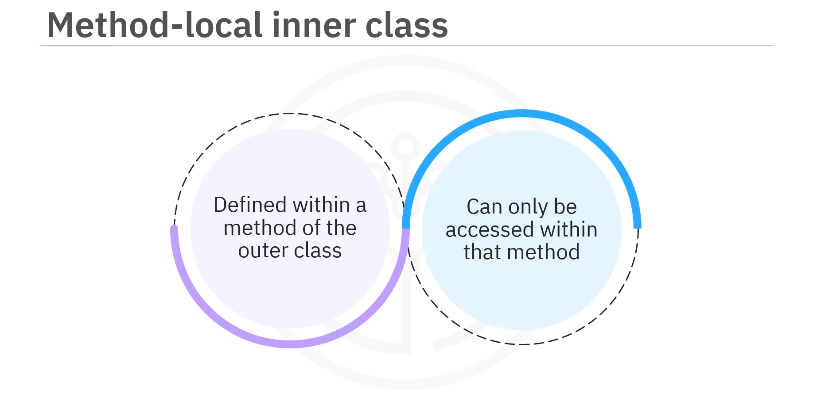
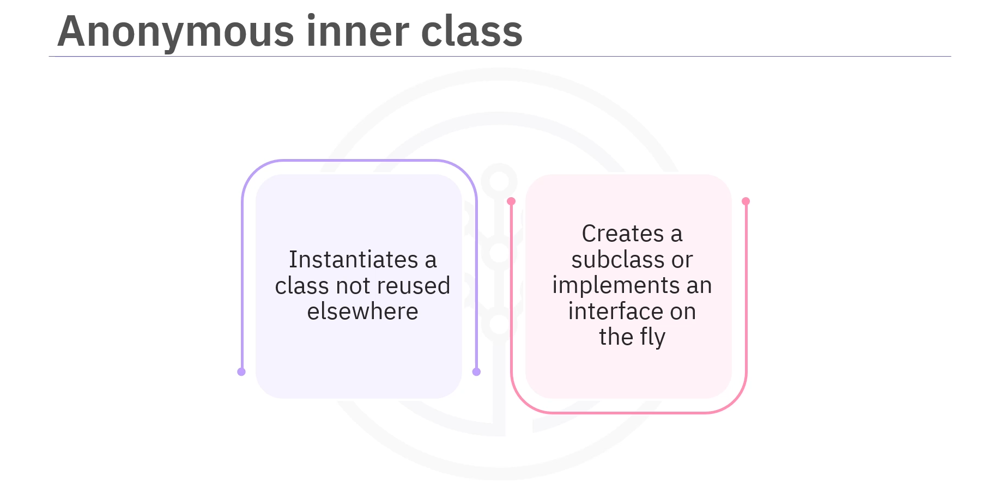
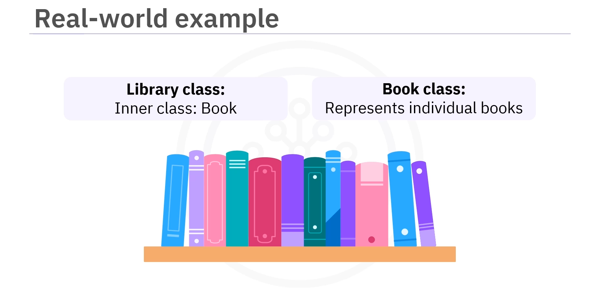
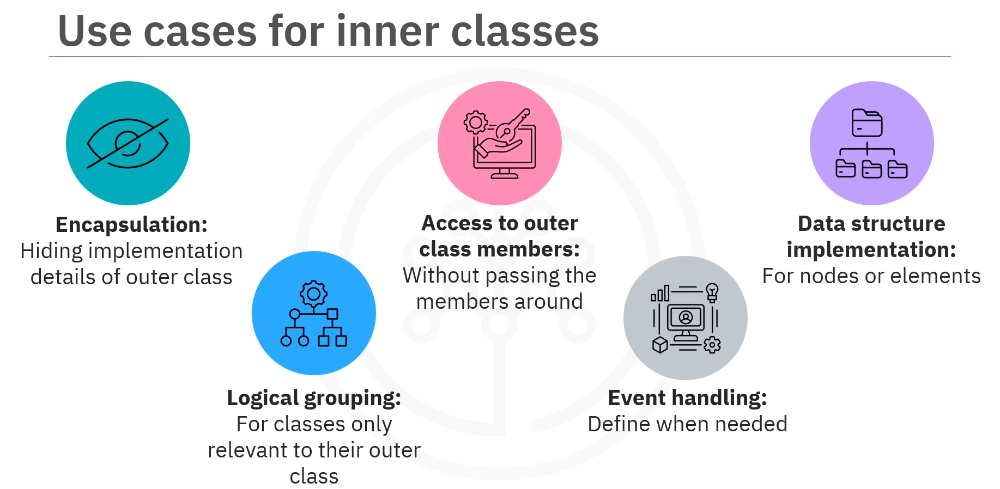

# 02-005:   Inner Classes



---

## What are Inner Classes?

### Definition of Inner Classes

> An **inner class** is...  **a class defined within another class in Java**. 

This allows the inner class to access the members or variables and methods of the outer class directly.

### Benefits of Inner Classes



Inner classes logically group classes that are only used in one place, making your code more readable and maintainable.

---

### Simple Example: OuterClass and InnerClass

```java
class OuterClass {
    
    // 1. Outer class initialisation
    int outerVariable = 10;
    
    // 2. Inner class definition
    class InnerClass {
    
        void display() {
            
            // 2.1  Accessing outer class variable directly
            System.out.println("Outer variable value: " + outerVariable);
        }
    }
}
```

In this example...:  

1.  The `OuterClass` contains a variable `outerVariable` with a value of 10

2.  The `InnerClass` is defined inside the `OuterClass` and has a method `display()`.

3.  This method can access the `outerVariable` directly.

---

## How to Use Inner Classes

### Creating an Instance of an Inner Class

To use an inner class:  
1.  First, need to create an instance of the outer class
2.  Then, can create an instance of the inner class

```java
public class Main {
    
    public static void main(String[] args) {
        
        // 1.   Create an instance of the OuterClass
        OuterClass outerObject = new OuterClass();
        
        // 2.   Create an instance of the InnerClass (using the outer class) instance
        OuterClass.InnerClass innerObject = outerObject.new InnerClass();
        
        
        // 3. Invoke the .display() method from the inner class
        innerObject.display();
    }
}
```

1.  An instance of the `OuterClass` is created

2.  Using the `OuterClass` instance, an instance of the `InnerClass` is created

3.  The `InnerClass` method prints the `OuterClass` variable. 

So, when you run the code, you will see the outer variable value is 10.

---

## Types of Inner Classes

Java has several types of inner classes, each with specific characteristics and use cases.

1.  Non-Static Inner Class
2.  Static Nested Class
3.  Method-Local Inner Class
4.  Anonymous Inner Class

---

## 1. Non-Static Inner Class



### Definition

The **non-static inner class** is the **most common type of inner class**.  

It can access both static and non-static members of the outer class.

### Characteristics

- Can access both static and non-static members of the outer class
- Requires an instance of the outer class to be created
- Has direct access to all members of the outer class

### Example: Non-Static Inner Class

```java
class OuterClass {
    
    static int staticVariable = 20;
    int nonStaticVariable = 30;
    
    class InnerClass {
        
        void display() {
            System.out.println("Static variable: " + staticVariable);
            System.out.println("Non-static variable: " + nonStaticVariable);

        }
    }
}
```

This non-static inner class can access both the `staticVariable` and `nonStaticVariable` from the outer class directly.

---

## 2. Static Nested Class



### Definition

The **static nested class** is defined using the keyword `static`.  

**Unlike non-static inner classes, static nested classes cannot access non-static members** of the outer class directly.

### Characteristics

- Defined with the `static` keyword
- Cannot access non-static members of the outer class
- Can access static members of the outer class
- No need to create an instance of the outer class to use the static nested class

### Example: Static Nested Class

```java
class OuterClass {
    
    static int staticVariable = 20;
    
    static class StaticNestedClass {
        
        void show() {
        
            System.out.println("Static variable value: " + staticVariable);
        
        }
    }
}

public class Main {
    
    public static void main(String[] args) {
        
        // No need to create an instance of OuterClass
        // Create an instance of the static nested class directly
        OuterClass.StaticNestedClass nestedObject = new OuterClass.StaticNestedClass();
        
        // Call the show method
        nestedObject.show();  // Output: Static variable: 20
    }
}
```

1.  A static nested variable **belongs to the class, not any instance**. 

2.  A nested class marked as `static` can access the outer class's static members such as static variables directly.

3.  When using the nested class, there is no need to create an instance of the outer class.

4.  Create an instance of the static nested class directly using `OuterClass.StaticNestedClass`. 

5.  Invoke its `show()` method, which prints the static variable's value.

---

## 3. Method-Local Inner Class



### Definition

The **method-local inner class** is defined within a method of the outer class. They **can only be accessed within that method**.

### Characteristics

- Defined inside a method
- Can only be used within that method
- Has access to the method's local variables (if they are `final` or effectively `final`)
- Cannot be accessed from outside the method

### Example: Method-Local Inner Class

```java
class OuterClass {
    
    void myMethod() {
        
        // Method-local inner class definition
        class MethodLocalInner {
        
            void display() {
            
                System.out.println("Inside Method Local Inner Class");
            
            }
        }
        
        // Create an instance of the method-local inner class
        MethodLocalInner inner = new MethodLocalInner();
        
        // Call the display method
        inner.display();
    
    }
}


public class Main {
    
    public static void main(String[] args) {
        
        OuterClass outerObject = new OuterClass();
        
        outerObject.myMethod();  // Output: Inside Method Local Inner Class
    
    }
}
```

1.  The method-local inner class can only be used within `myMethod()`.

2.  When `myMethod()` runs, it creates an instance of `MethodLocalInner` and calls its `display()` method, printing "Inside Method Local Inner Class" to the console.

---

## 4. Anonymous Inner Class



### Definition

The **anonymous inner class** type:

1.  **Does not have a name**
2.  It is used to instantiate a class that may not be reused elsewhere. 

It's often used when you need to create a subclass or implement an interface on the fly.

### Characteristics

- Has **no name**
- Used for **one-time implementations**
- Often used to **implement interfaces or extend classes**
- Defined and instantiated in a **single expression**


### Example: Anonymous Inner Class with Interface

```java
// 1.   Define a simple interface
interface Greeting {
    
    void greet();

    }

public class Main {
    
    public static void main(String[] args) {
        
        // 2.   Create an anonymous inner class
        Greeting greeting = new Greeting() {
            
            // // 3.  Overriging the greet() method from the interface
            public void greet() {
            
                System.out.println("Hello from Anonymous Inner Class!");
            
            }
        
        };
        
        // 3.   Invoke the greet method
        greeting.greet();  // Output: Hello from Anonymous Inner Class!
    }
}
```

1.  The `Greeting` interface has a single method `greet()` that must be implemented.

2.  Instead of creating a separate class to implement `Greeting`, an anonymous inner class is created directly within the `main()` method.

3.  It provides an implementation of the `greet()` method, which prints a message. 

4.  The `greet()` method is called on the `greeting` object printing the message "Hello from Anonymous Inner Class!"

---

## Practical Example: Library with Books



### Complete Example

Here is an example to illustrate the use of inner classes in Java.  

In this scenario, you will see a `Library` class that contains an inner class called `Book`.   

The `Book` class will represent individual books in the library.

#### The Library Class with Book Inner Class

```java
class Library {

    // 1.   Inits
    private String libraryName;
    
    // 2.   Constructors
    public Library(String name){
        
        this.libraryName = name;
    }
    
    
    // 3. Inner Class representing a Book
    class Book {
        
        // 3.1 Inits
        private String title;
        private String author;
        
        // 3.2 Constructors
        public Book(String title, String author){
            
            this.title = title;
            this.author = author;
        
        }
        
        // 3.3  Methods
        public void displayBookInfo(){
        
            System.out.println("\nLibrary:  " + libraryName);
            System.out.println("\n  Book Title:   " + title);
            System.out.println("\n  Book Author:  " + author);
        }
            
    }
}

// 4. The main 
public class Main {
    
    public static void main(String[] args) {
        
        // 4.1  Create an instance of Library
        Library myLibrary = new Library("City Library");
        
        // 4.2  Create an instance of Book using the Library instance
        Library.Book myBook = myLibrary.new Book("1984", "George Orwell");
        
        // 4.3  Invoke the displayBookInfo method
        myBook.displayBookInfo();
    }
}
```

1.  The `Library` class is the outer class that represents a library. It has a variable `libraryName` to store the library's name. 

2.  The `Book` class is defined inside the `Library` class. Each `Book` object has its own `title` and `author`. This inner class can access the outer class variable `libraryName`.

3.  The `displayBookInfo()` method in the `Book` inner class prints out the library's name along with the book's title and author.

4.  In the main method, you will create an instance of `Library` and then create an instance of `Book` using that library instance.

Finally, we call the method to display the book information. When you run the code, you get what you set:
```plaintext
Library:  City Library
Book Title:   1984
Book Author:  George Orwell
```
---

## Benefits and Use Cases of Inner Classes



### 1. Encapsulation and Code Organization

By using inner classes, you can **encapsulate or hide the implementation details of your outer class**.  
This keeps your code clean and organised.

### 2. Logical Grouping

If you have classes that are only relevant in context to their outer class, making them inner classes helps in grouping logically.

### 3. Direct Access to Outer Class Members

If an inner class needs access to members of the outer class, it can do so without needing to pass those members around.

### 4. Event Handling in GUI Applications

In graphical user interface applications, anonymous inner classes are often used for handling events. Instead of creating separate classes for event listeners, you can define them right where you need them.

### 5. Implementation of Data Structures

When implementing complex data structures such as trees or linked lists, inner classes can be used for nodes or elements.

---
