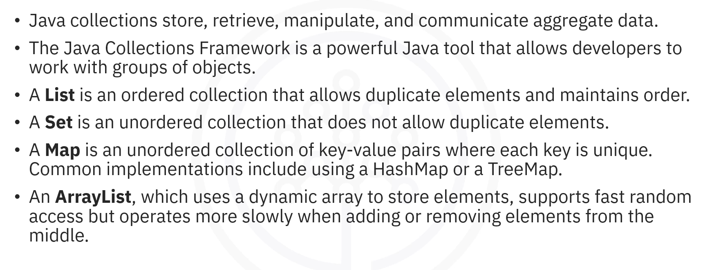
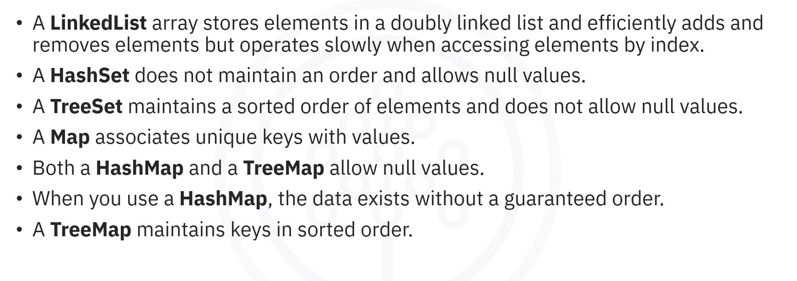
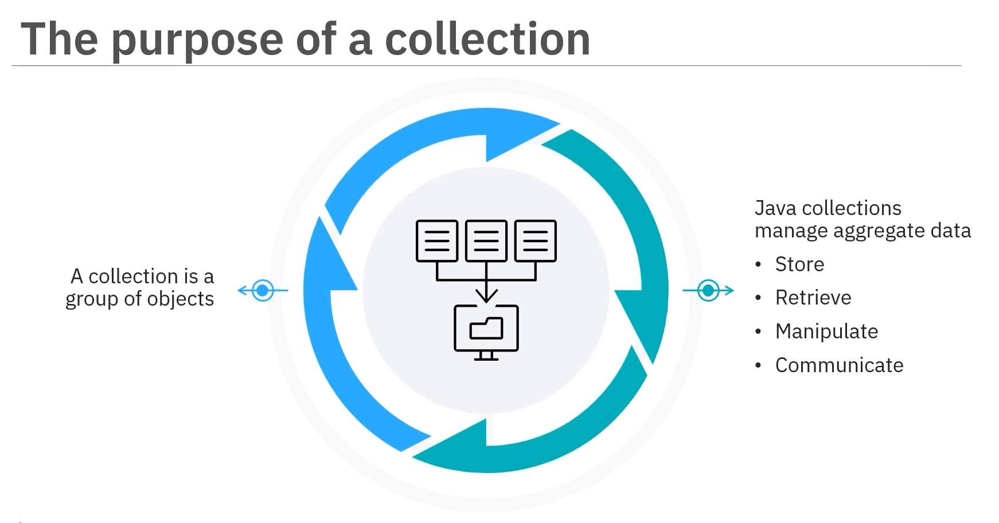
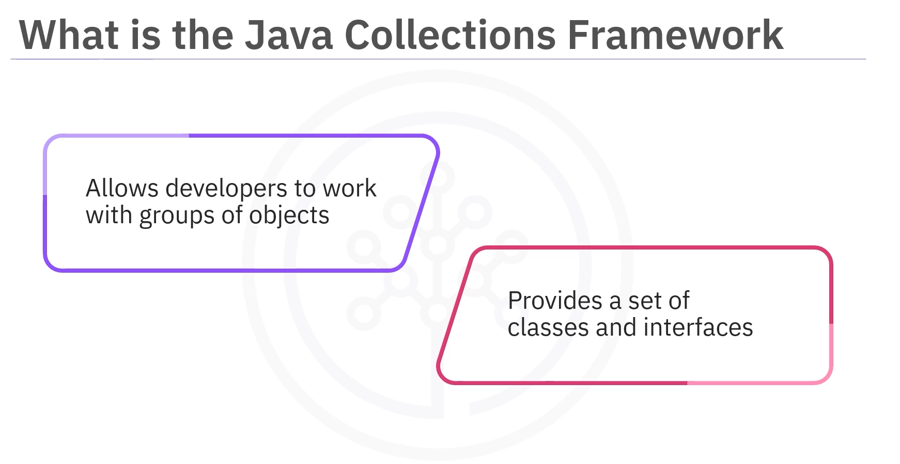
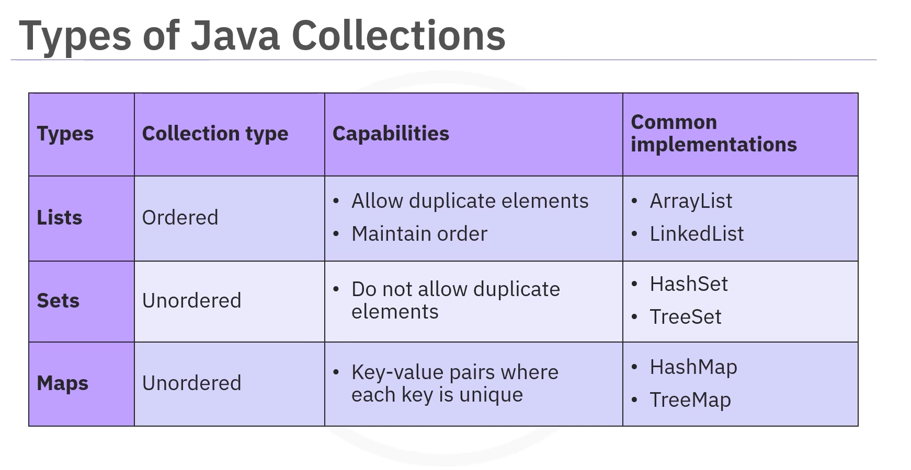
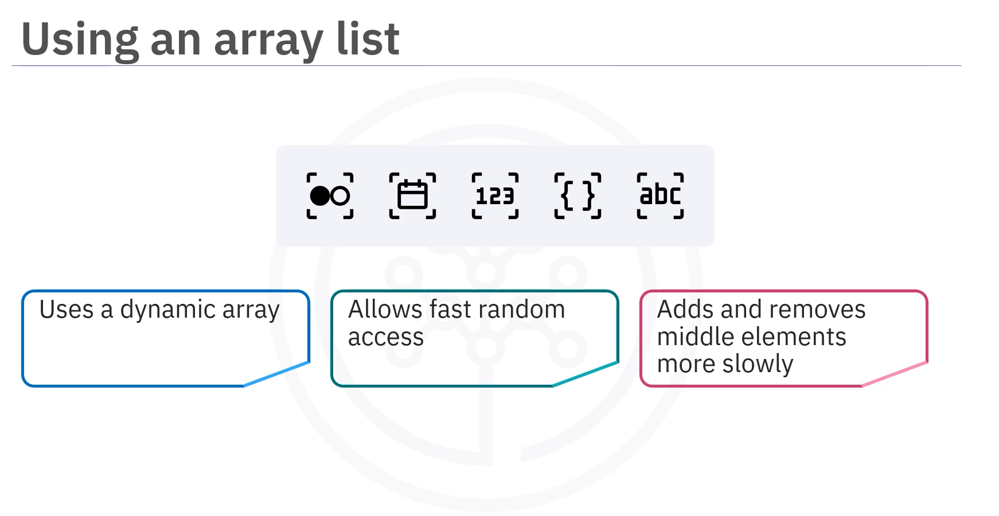
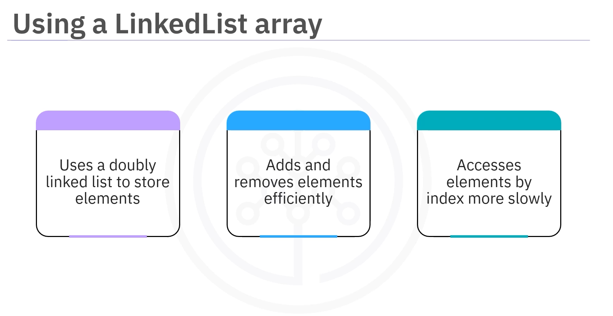
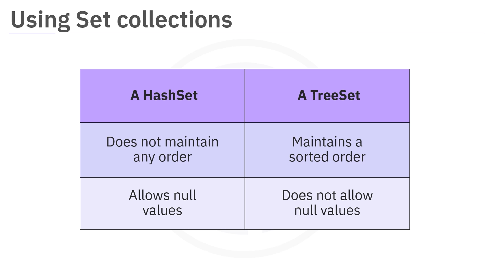
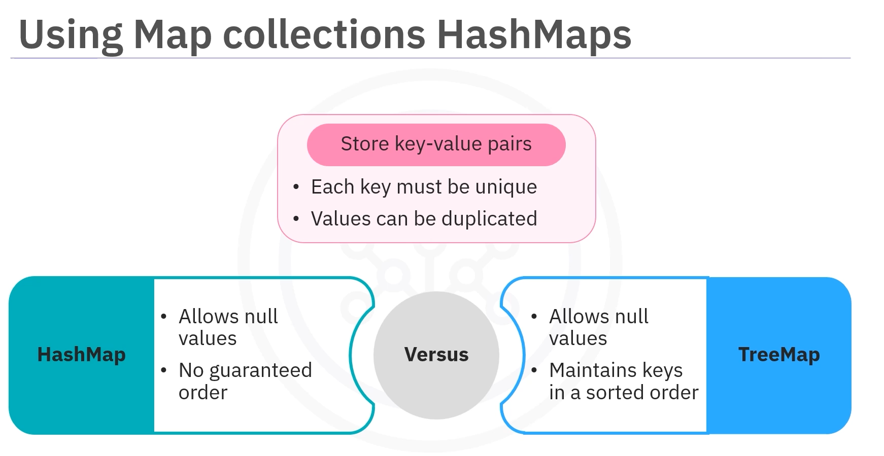

# 03-001:   Collections Framework Introduction




---

## What is a Collection?

A **collection** is simply **a group of objects**.



In Java, collections store, retrieve, manipulate, and communicate aggregate data.

---

## Java Collections Framework

### Definition

The **Java Collections Framework** (JCF) is a powerful Java tool that allows developers to:work with groups of objects.  

The JCF provides a set of classes and interfaces to handle data collections based on developers' needs.



The Java Collections Framework, the root interface for all collection types, contains several types of collections with each collection designed for specific use cases.

---

## Types of Collections

1.  **Lists**
2.  **Sets**
3.  **Maps**



| Types | Collection type | Capabilities | Common implementations |
|-------|-----------------|--------------|------------------------|
| Lists | Ordered | Allow duplicate elements<br>Maintain order | ArrayList<br>LinkedList |
| Sets | Unordered | Do not allow duplicate elements | HashSet<br>TreeSet |
| Maps | Unordered | Key-value pairs where each key is unique | HashMap<br>TreeMap |


The Java Collections Framework includes three primary types of collections:

### 1. Lists

A **List** is an **ordered** collection that allows duplicate elements and maintains order.



**Common implementations include:**
- 1.1   `ArrayList`
- 1.2   `LinkedList`


***

#### 1.1    ArrayList

-       An `ArrayList` uses a dynamic array to store elements. 
-   `ArrayList` **allows fast, random access** but accesses the elements **more slowly when adding or removing elements from the middle**.


#### Example

```java
import java.util.ArrayList;
import java.util.List;

public class ListExample {
    
    // 1. Uses a main PUBLIC class to hold the list code
    public static void main(String[] args) {
        
        
        // 2.   INIT
        // Uses a List <String> fruits to create an ArrayList:
        //  NEW ARRAY LIST OF LIST OF STRINGS!
        List<String> fruits = new ArrayList<>();
        
        
        
        // 3. METHODS
        // ADDING ELEMENTS .add()
        fruits.add("Apple");
        fruits.add("Banana");
        fruits.add("Cherry");
        
        // DISPLAYING THE LIST
        System.out.println("Fruits: " + fruits);
        
        
        // GETTING A ELEMENT WITH .get() 
        String firstFruit = fruits.get(0);
        System.out.println("First fruit: " + firstFruit);
    }
}
```

-   1.  `public class ListExample` holds all of the list code.

-   2.  `List<String> fruits = new ArrayList<>();` creates an `ArrayList` named `fruits` which can store strings.

-   3.  `fruits.add("Apple");`, `fruits.add("Banana");`, `fruits.add("Cherry");` adds the fruits apple, banana, and cherry to the list.

-   4.  `System.out.println("Fruits: " + fruits);` prints the entire list.

-   5.  `String firstFruit = fruits.get(0);` locates the fruit at the beginning of the list, index zero, which would be apple based on our earlier code.

- 6.    `System.out.println("First fruit: " + firstFruit);` stores the fruit name in a variable called `firstFruit` and then prints a message showing what the first fruit is.

***


#### 1.2  LinkedList

-   A `LinkedList` **uses a doubly linked list to store elements**.  

-   This collection type **efficiently adds and removes elements.**

-   **BUT ... operates slowly when accessing elements by index**!  



##### Example

```java
// 0. IMPORT
import java.util.LinkedList;

// 1.   USES A PUBLIC CLASS TO HOLD ALL
public class LinkedListExample {
    
    public static void main(String[] args) {
        
        // 2. INIT
        // Uses a LinkedList <String> varName to create the list:
        LinkedList<String> animals = new LinkedList<>();
        
        
        // 3. METHODS
        animals.add("Dog");
        animals.add("Cat");
        animals.add("Elephant");
        
        System.out.println("Animals: " + animals);
    }
}
```

- 1.    `public class LinkedListExample` holds all of the list code.

- 2.    `LinkedList<String> animals = new LinkedList<>();` creates a `LinkedList` called `animals` which can store strings.

- 3.    `animals.add("Dog");`, `animals.add("Cat");`, `animals.add("Elephant");` adds the animals named dog, cat, and elephant to the list.

- 4.    `System.out.println("Animals: " + animals);` prints the entire list of animals.


----


### 2. Sets

A **Set** is an **unordered** collection that **does NOT allow duplicate elements**.

**The Java Collections Framework includes two common types of Sets::**
- 2.1   `HashSet`
- 2.2   `TreeSet`



| HashSet | TreeSet |
|---------|---------|
| Does not maintain any order | Maintains a sorted order |
| Allows null values | Does not allow null values |

***

#### 2.1 HashSet

A `HashSet` does not maintain any order and allows `null` values.

- **DOES NOT ALLOW DUPLICATES**
- **ALLOW NULL VALUES**


##### Code Example: HashSet with Colors

```java
// 0.   IMPORT
import java.util.HashSet;

// 1. PUBLIC CLASS SETS ALL
public class HashSetExample {
    
    public static void main(String[] args) {
        
        // 2. INIT
        // HashSet<Type> varName = new HashSet<>();
        HashSet<String> colors = new HashSet<>();
        
        
        // 3. METHODS
        colors.add("Red");
        colors.add("Green");
        colors.add("Blue");
        colors.add("Red");
        
        System.out.println("Colors: " + colors);
    }
}
```
- 1.    `public class HashSetExample` holds all of the set code.

- 2.    `HashSet<String> colors = new HashSet<>();` creates a `HashSet` named `colors` which can store unique strings.

- 3.    `colors.add("Red");`, `colors.add("Green");`, `colors.add("Blue");`, and again `colors.add("Red");` adds the colors red, green, blue, and attempts to add red again, **which won't create a duplicate entry (since Sets don't allow duplicates)**.

- 4.    `System.out.println("Colors: " + colors);` prints the set of unique colors.

---

### 2.2 TreeSet

A `TreeSet` **maintains a sorted order** of elements and **does not allow `null` values**.

Implementation is the same as with HashList:

`TreeSet<Type> varName = new TreeSet<>(); 


---

### 3. Maps

A **Map** is an unordered collection of key-value pairs where each key is unique.

A **Map** collection associates unique keys with values.



**Common implementations include:**
- 3.1   `HashMap`
- 3.2   `TreeMap`

---


#### 3.1 HashMap

`HashMap` allows `null` values. The data exists **without a guaranteed order**


##### Example

```java
// 0. IMPORTS
import java.util.HashMap;

// 1. PUBLIC class HOLDING ALL
public class HashMapExample {
    
    public static void main(String[] args) {
        
        // 2. INIT
        // HashMap<Type1, Type2,...> varName = new HashMap<>();
        HashMap<String, Integer> ageMap = new HashMap<>();
        
        // 3. METHODS
        // .put() -> THE PROPER ADDING METHOD WITH MAPS
        ageMap.put("Alice", 30);
        ageMap.put("Bob", 25);
        ageMap.put("Charlie", 35);
        
        System.out.println("Age Map: " + ageMap);
        
        int aliceAge = ageMap.get("Alice");
        System.out.println("Alice's Age: " + aliceAge);
    }
}
```

- 1.    `HashMap<String, Integer> ageMap = new HashMap<>();` creates a `HashMap` called `ageMap` which stores names stored as strings as keys and ages stored as integers as values.  

- 2.    `ageMap.put("Alice", 30);`, `ageMap.put("Bob", 25);`, `ageMap.put("Charlie", 35);` adds three name-age pairs to the map.


- 3.    `System.out.println("Age Map: " + ageMap);` prints the entire map.

- 4.    `int aliceAge = ageMap.get("Alice");` retrieves a specific value by its key.

- 5.    `System.out.println("Alice's Age: " + aliceAge);` demonstrates how to access and display a specific value from the map.


---

#### 3.2 TreeMap

`TreeMap`, on the other hand, **maintains keys in sorted order**.

`TreeMap` also allows `null` values.

Implementation is the same as with HashList:  

`TreeMap<Type1, Type2, ...> varName = new TreeMap<>(); 

---
