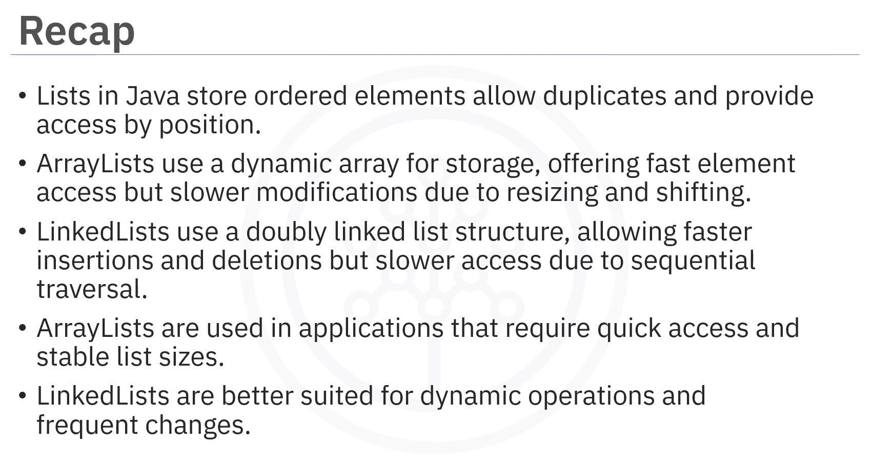
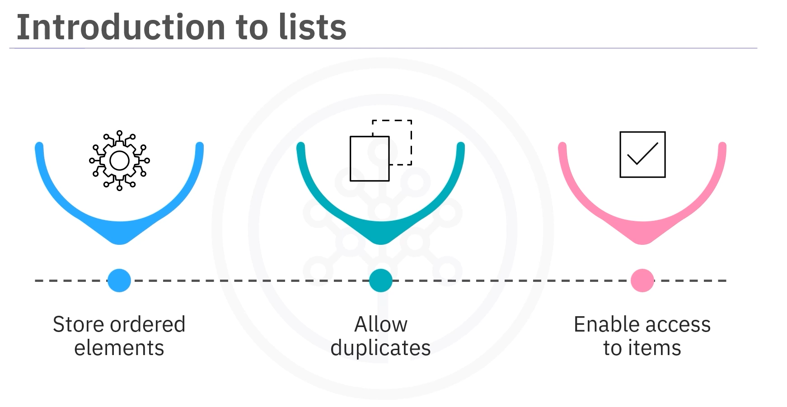
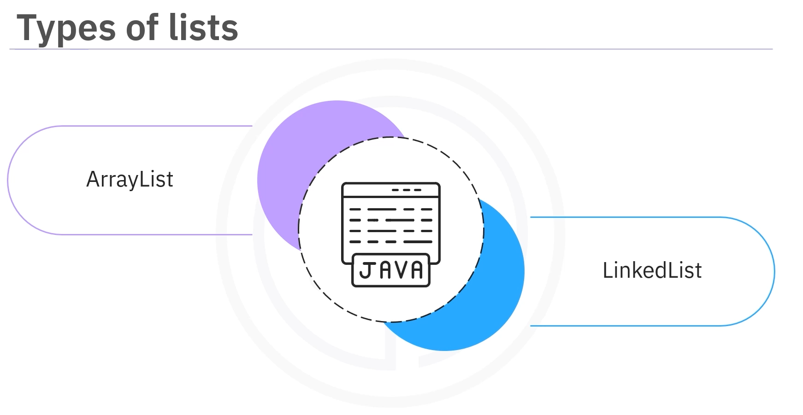
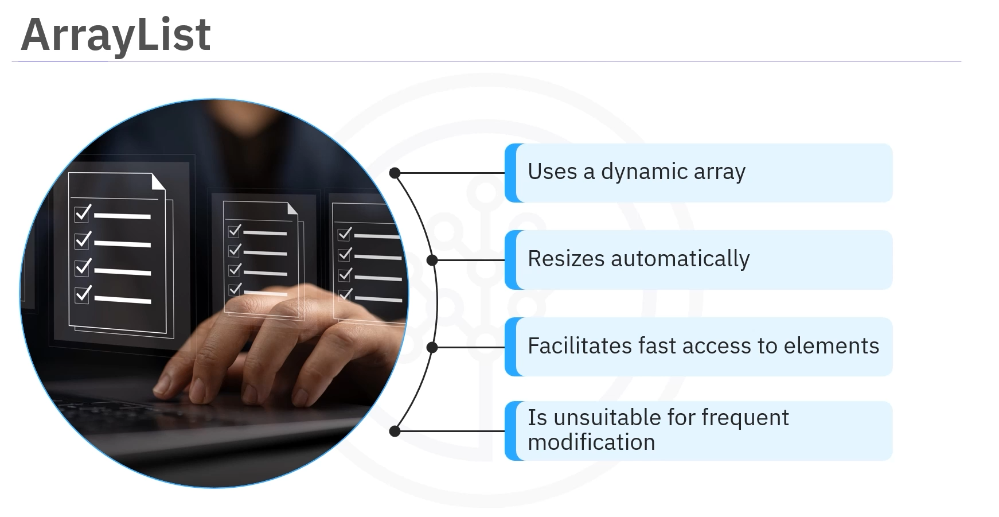
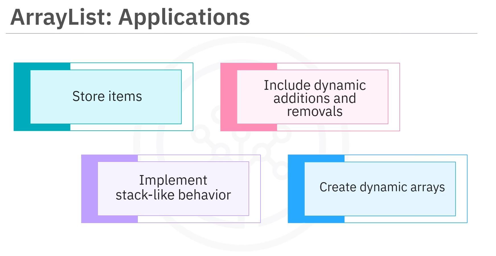
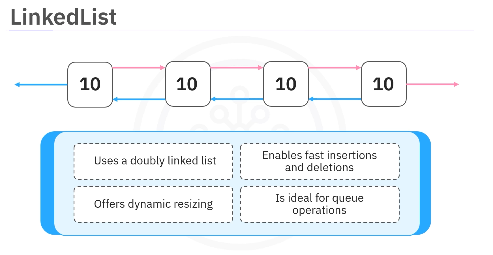
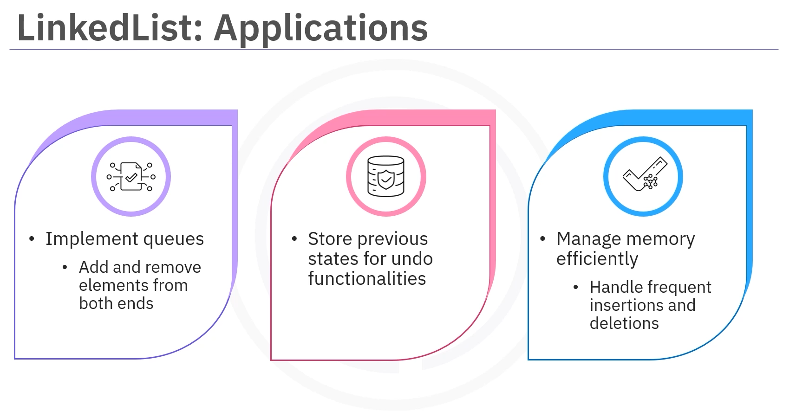
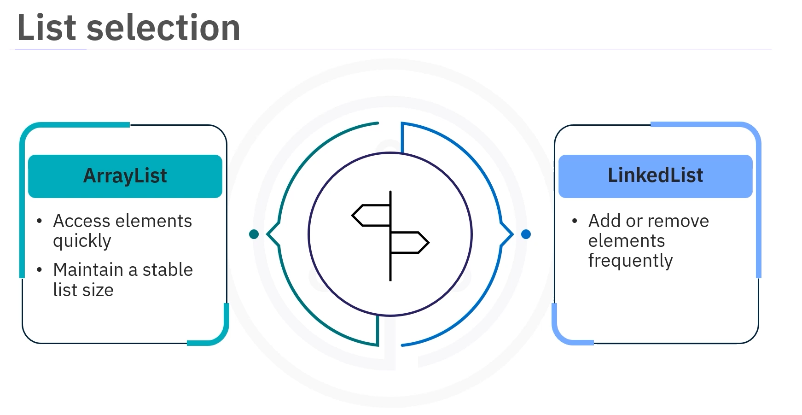
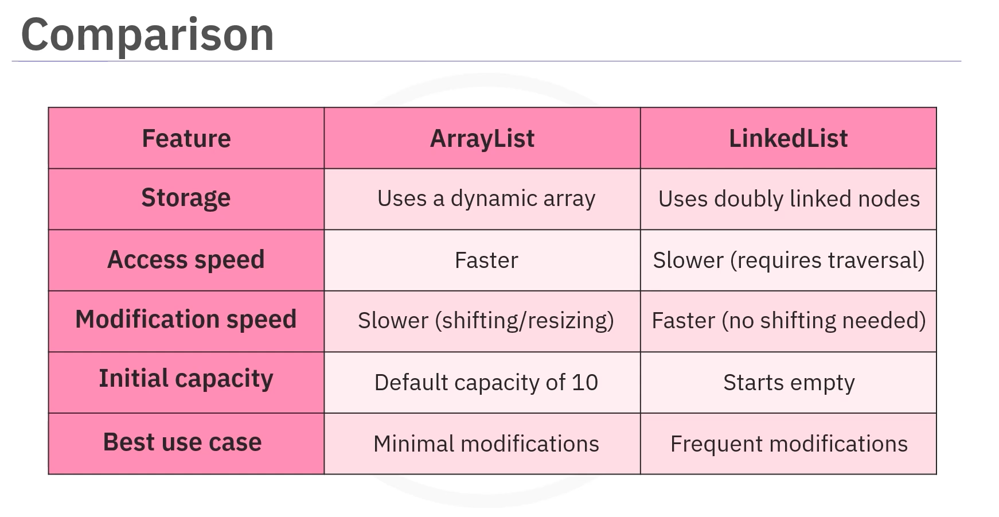

# 03-002:   ArrayList / LinkedList



---

## What is a List?

A **list** in Java is like a line of numbered boxes.

Lists in Java have the following characteristics:



- Store ordered elements
- Allow duplicates
- Enable access to items by their position


Lists in Java are classified as `ArrayList` and `LinkedList`.



---

## ArrayList

### What is an ArrayList?

An `ArrayList` class in Java uses a dynamic array to store elements, automatically resizing when needed.

### Characteristics of ArrayList



- Uses a dynamic array to store elements in contiguous memory
- Makes it **efficient for quick access**
- Starts with a **default capacity of 10** and grows as needed
- **Adding or removing elements is slower due to resizing or shifting**
- **Ideal for** scenarios with **minimal modification**

### Use Cases for ArrayList

> `ArrayList` is suitable for scenarios where fast access to elements by an index is required. However, these lists are unsuitable for frequent modification.



`ArrayLists` are ideal for:  

-   Storing items such as shopping or contact lists
-   Implementing stack-like behavior with dynamic additions and removals
-   Creating dynamic arrays that grow as needed

### Operations with ArrayList

The `ArrayList` class can be imported from `java.util` using the `import` statement.

The following basic operations can be performed on an `ArrayList`:  

- **Create and name** the `ArrayList`
- **Add** elements to the list using the `add()` method
- **Retrieve** elements by their index using the `get()` method
- **Remove** elements using the `remove()` method
- **Print** the list using the `System.out.println()` method

### Example: ArrayList Operations

```java
import java.util.ArrayList;

public class ArrayListExample {
    
    public static void main(String[] args) {
        
        // 2.   INIT ArrayList
        ArrayList<String> fruits = new ArrayList<>();
        
        // 3. METHODS
        // .add() elements
        fruits.add("Apple");
        fruits.add("Banana");
        fruits.add("Cherry");
        
        // .get() Retrieve elements by index
        String firstFruit = fruits.get(0);
        System.out.println("First fruit: " + firstFruit);
        
        // .remove()    Remove an element
        fruits.remove(1);
        
        // Print the list
        System.out.println("Fruits: " + fruits);
    }
}
```

---

## LinkedList

### What is a LinkedList?

A `LinkedList` uses a doubly linked list to store elements. Each element is a node linked to the next and previous nodes.

### Characteristics of LinkedList




- Uses a doubly linked list where each element is a node linked to the next and previous nodes
- Offers dynamic resizing
- Has faster insertions and deletions than `ArrayList`
- Allows faster additions and deletions without shifting
- Makes accessing elements slower due to traversal
- Starts empty and is better suited for frequent modification
- Ideal for queue operations

### Use Cases for LinkedList

`LinkedLists` are ideal for:



- Implementing queues and enabling additions and removals from both ends
- Storing previous states for undo functionality
- Efficiently handling frequent insertions and deletions

### Operations with LinkedList

The process of creating a `LinkedList` is similar to `ArrayList`.

The following operations can be performed on a `LinkedList`:

- **Import** the `LinkedList` class from `java.util`
- **Create and name** the `LinkedList`
- **Add** elements using the `add()` method
- **Retrieve** elements using the `get()` method
- **Remove** elements using the `remove()` method
- **Print** the output

### Example: LinkedList Operations

```java
import java.util.LinkedList;

public class LinkedListExample {
    
    public static void main(String[] args) {
        
        // 2. INIT  Create a LinkedList
        LinkedList<String> animals = new LinkedList<>();
        
        // 3. METHODS
        // .add() elements
        animals.add("Dog");
        animals.add("Cat");
        animals.add("Elephant");
        
        // .get() Retrieve elements by index
        String firstAnimal = animals.get(0);
        System.out.println("First animal: " + firstAnimal);
        
        // .remove() an element
        animals.remove(1);
        
        // Print the list
        System.out.println("Animals: " + animals);
    }
}
```

---

## ArrayList vs. LinkedList



### When to Use ArrayList

Use `ArrayList` for:  

- **Fast access to elements** when the list size doesn't change frequently
- Scenarios requiring **quick access to elements by index**
- Applications with **minimal modification**

**Performance characteristics:**

- **Fast random access by index**
- **Slower modifications (add/remove)** due to resizing and shifting
- **More memory efficient for static lists**

### When to Use LinkedList

Use `LinkedList` when:

- Elements **need to be added or removed frequently**
- Implementing **data structures such as stacks or queues**
- **Dynamic operations and frequent changes are required**

**Performance characteristics:**

- **Slower access due to sequential traversal**
- **Faster additions and deletions** without shifting
- Better for **frequent modifications**



| Feature | ArrayList | LinkedList |
|---------|-----------|------------|
| **Storage** | Dynamic array in contiguous memory | Doubly linked list with nodes |
| **Access Speed** | Fast (O(1)) | Slow (O(n)) |
| **Insertion/Deletion** | Slow (O(n)) | Fast (O(1)) |
| **Memory** | More contiguous | Scattered with pointers |
| **Default Capacity** | Starts with capacity of 10 | Starts empty |
| **Best For** | Quick access, stable size | Frequent modifications, queues/stacks |

---
