# 03-004:   HandSet / TreeSet

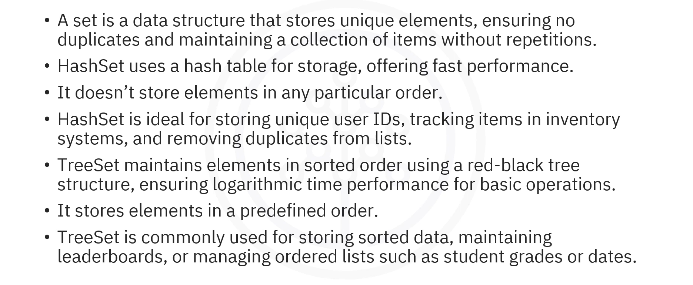

---

## What is a Set?

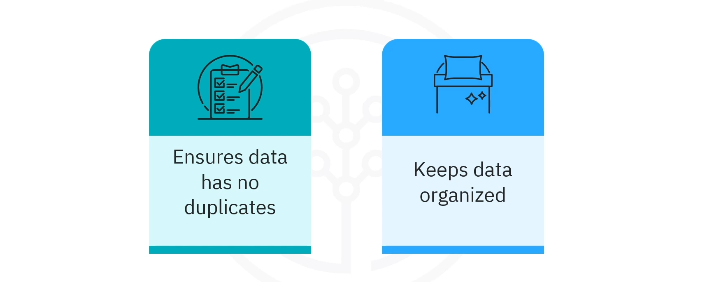

A **set** is a collection type or data structure that stores **unique elements**, **ensuring no duplicates**. Its primary purpose is to maintain a **unique collection of items**.

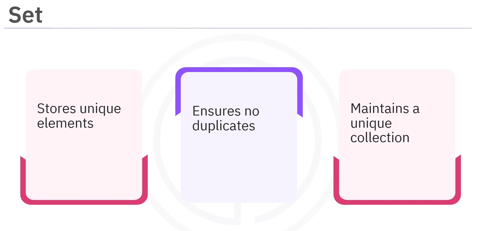

---

## HashSet

`HashSet` uses a hash table for storage, offering fast performance with constant time complexity for basic operations such as `add()`, `remove()`, and `contains()`.

### Characteristics of HashSet

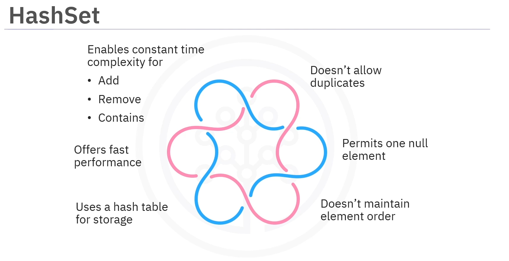

- Uses a hash table for storage
- Does **not allow duplicate** elements
- Permits **only one `null`** element
- Does **not maintain any specific order** of elements
- Offers **fast performance (O(1) for basic operations**)

### Use Cases for HashSet

`HashSet`s are ideal for:

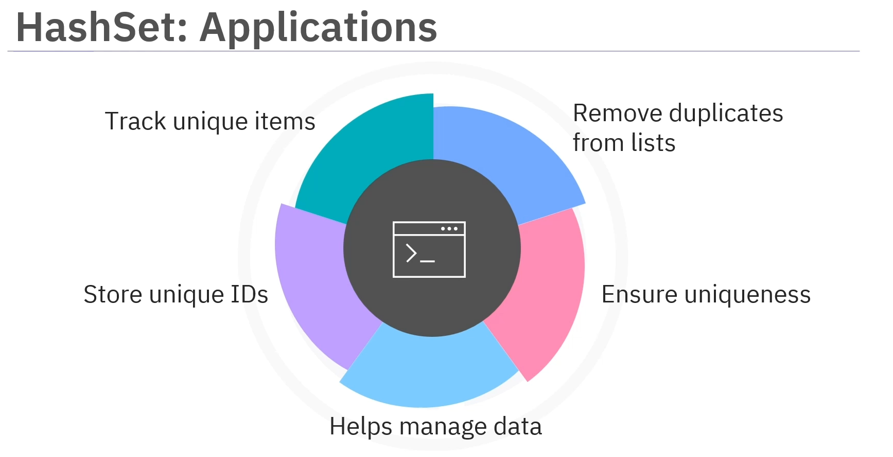

- Storing unique user IDs in an application
- Tracking unique items in inventory systems
- Removing duplicates from a list of items
- Ensuring that each element in the set is unique
- Managing data without duplicates

### Example: HashSet with Fruits

In this example, the `HashSet` class is imported from `java.util` to create a set called `Fruits`, which stores unique fruit names.

```java
import java.util.HashSet;

public class HashSetExample {
    
    public static void main(String[] args) {
        
        // 1. INITS
        // Create a HashSet to store fruit names
        HashSet<String> fruits = new HashSet<>();
        
        // 2. METHODS
        // .add() fruits to the set
        fruits.add("Apple");
        fruits.add("Banana");
        fruits.add("Cherry");
        // DUPLICATES ARE IGNORED
        fruits.add("Banana");
        
        // Display the HashSet
        System.out.println("Fruits: " + fruits);
        
        // .contains() Check if an element exists in the set
        if (fruits.contains("Apple")) {
            System.out.println("Apple is present in the set");
        }
        
        // .remove()    Remove cherry from the set
        fruits.remove("Cherry");
        
        // Display the updated set
        System.out.println("Updated Fruits: " + fruits);
    }
}
```

- 1. `.add()`:  Duplicate entries such as banana are automatically ignored

- 2.    The elements in the set are displayed in no particular order

- 3. `.contains()`: The presence of apple in the set is checked, and an appropriate message is printed if it exists

- 4. `.remove()`:    Cherry is removed from the set, and the updated set is displayed

---

## TreeSet

`TreeSet` is another implementation of the set interface that uses a red-black tree structure.  


Unlike `HashSet`, `TreeSet` maintains a sorted order of elements based on their natural ordering or a specified comparator.

### Characteristics of TreeSet

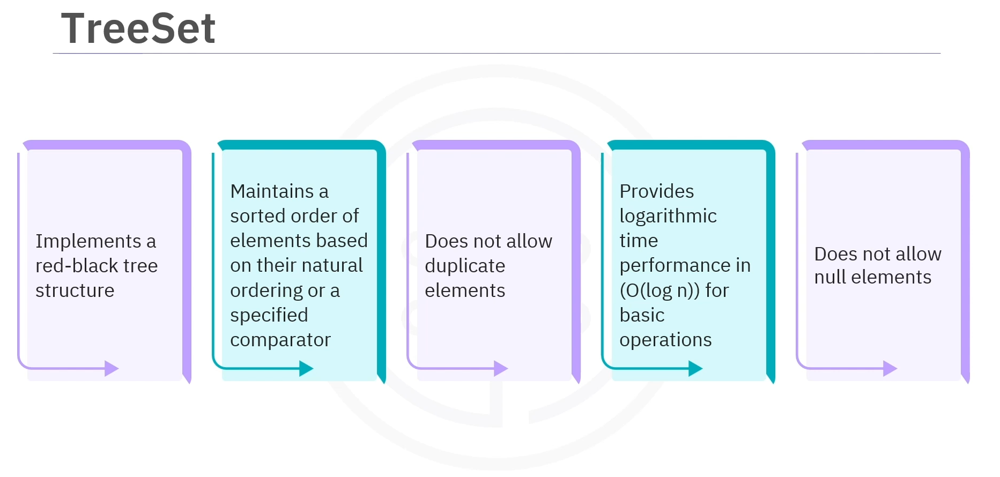

- Uses a **red-black tree** structure (self-balancing binary search trees)
- Does **not allow duplicate** elements
- Maintains elements in **sorted order**
- Provides **logarithmic time performance (O(log n)) for basic operations**
- Does **not allow `null`** elements

### Use Cases for TreeSet

`TreeSet` is ideal for:

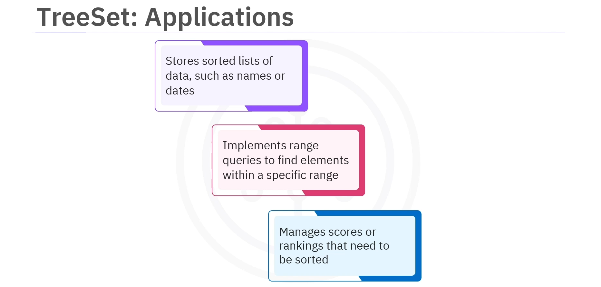

- Storing **sorted data lists**, such as names or dates
- **Efficiently performing range queries** to find elements within a specific range
- Managing scores or rankings that require **automatic sorting**

### Example: TreeSet with Numbers

To understand `TreeSet`s, let's look at an example where integers are stored as elements of a `TreeSet`.

```java
import java.util.TreeSet;

public class TreeSetExample {
    
    public static void main(String[] args) {
        
        // 1. INITS
        // Create a TreeSet to store integer elements
        TreeSet<Integer> numbers = new TreeSet<>();
        
        // 2. METHODS
        // .add()   numbers to the TreeSet
        numbers.add(5);
        numbers.add(3);
        numbers.add(8);
        numbers.add(1);
        // DUPLICATES, AS FOR ANY SET, ARE IGNORED
        numbers.add(3);
        
        // Display the set (elements in ascending order)
        System.out.println("Numbers in the TreeSet: " + numbers);
        
        // .contains()  Check if number 5 exists in the set
        if (numbers.contains(5)) {
            System.out.println("5 is present in the set");
        }
        
        // .remove()    8 from the set
        numbers.remove(8);
        
        // Display the updated set
        System.out.println("After removal: " + numbers);
    }
}
```

- 1. `.add()`:   Even though number 3 is added twice, it appears only once since duplicates are not allowed

- 2.    The contents of the `TreeSet` are printed, showing the elements in ascending order

- 3. `.contains()`: A check is performed to determine if the number 5 exists in the set, and a message is printed if it does

- 4. `.remove()`:   The number 8 is removed from the set, and the updated set is displayed

---

## HashSet vs. TreeSet

While `HashSet` and `TreeSet` are both implementations of the same set interface, they differ in key features.

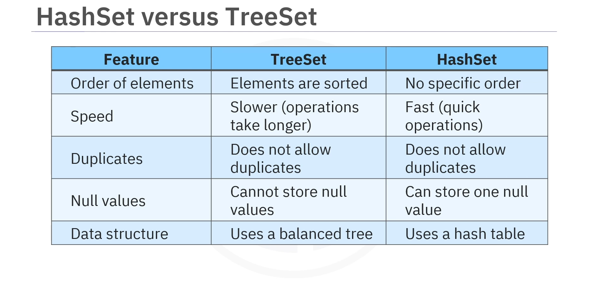

| Feature | HashSet | TreeSet |
|---------|---------|---------|
| **Storage Structure** | Hash table | Red-black tree |
| **Order** | No specific order | Sorted order |
| **Time Complexity** | O(1) for basic operations | O(log n) for basic operations |
| **Null Elements** | Allows one `null` | Does not allow `null` |
| **Duplicates** | Does not allow | Does not allow |
| **Performance** | Faster | Slower |
| **Best For** | Speed and unique items | Sorted data and ranges |

### HashSet Characteristics

- Does not maintain any specific order for its elements
- Offers fast operations
- Makes it ideal for scenarios where speed is a priority
- Can store one `null` value
- Uses a hash table for its underlying data structure

### TreeSet Characteristics

- Stores its elements in a sorted order
- Generally performs slower due to its use of balanced tree structure
- Results in longer operation times
- Does not allow duplicates
- Cannot store `null` values

---

## Decision Criteria

### By ORDER OF ELEMENTS

#### Use TreeSet When:

> **Elements must be sorted in a specific order**

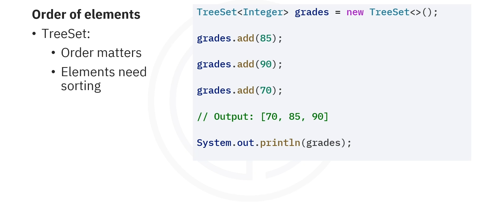

A `TreeSet` automatically sorts a list of students' grades when sorting them and displays them in ascending order.


#### Use HashSet When:

>**The order of elements does not matter**

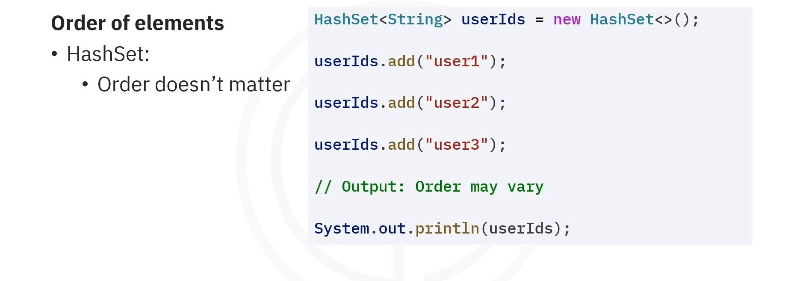

A `HashSet` would be more suitable for storing unique user IDs without concern for their order.


### By PERFORMANCE

#### HashSet Performance

`HashSet`s offer **faster performance when adding, removing, or searching for elements**.

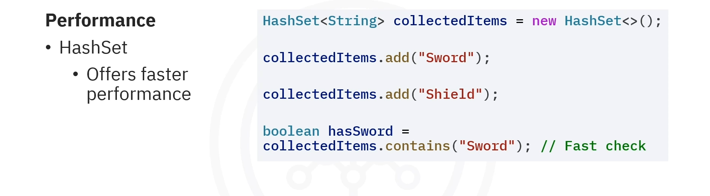

In a game, if there is a need to check if a player has collected a unique item quickly, `HashSet` would be the best choice.

### TreeSet Performance

`TreeSet`s are suitable when slower operations can be tolerated, but sorting the elements is necessary.

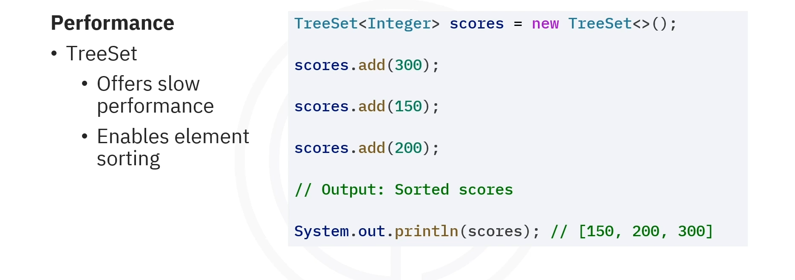

When maintaining a leaderboard that requires sorted scores, a `TreeSet` would be ideal even if it's slightly slower.


---

## Duplicate Handling

Both, `HashSet`s and `TreeSet`s, **avoid duplicates and can be used in any application that requires the elimination of duplicates**.

---
