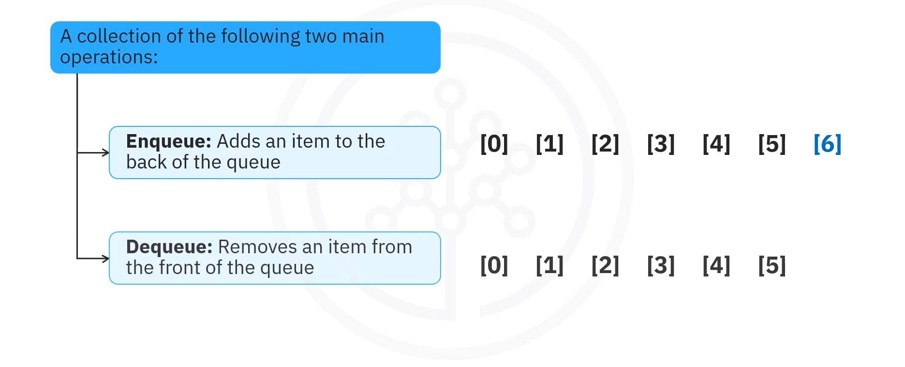
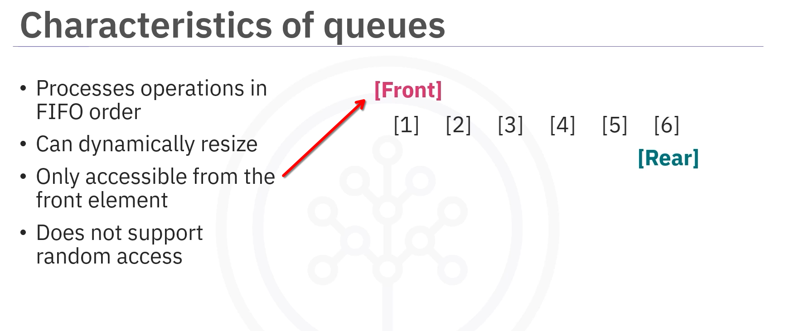
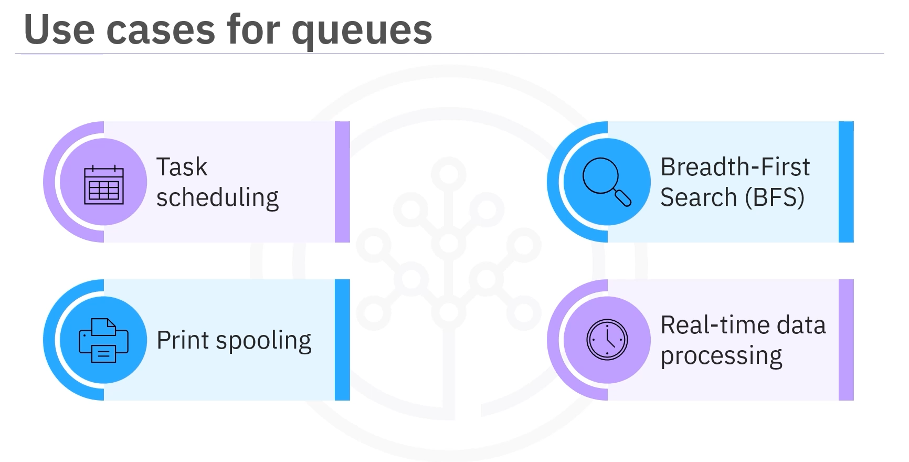

# 03-005:   Queues

---

## What is a Queue?

A **queue** is a collection of elements that offers two main operations:

1. **Enqueue**:  Adds an item to the back of the queue
2. **Dequeue**:  Removes an item from the front of the queue



Queues are an essential data structure in programming that complies with the **(FIFO)** principle. 

FIFO, **Firs-In-Firt-Out**, the first element added to the queue will be the first one removed.

---

## Characteristics of a Queue

Queues have the following characteristics:



#### **FIFO Ordering**
The first element added to the queue will be the first one removed

#### **Dynamic Resizing**
Elements can be added or removed, and queues can grow or shrink

#### **Limited Access**
Can only access the front element. You cannot access elements randomly

#### **Part of Java Collections Framework** 
The queue interface is part of the Java Collections framework

---

## Queue Operations

### Enqueue Operation .offer()

**Enqueue** adds an item to the back of the queue.  
In Java, this is commonly done using the `offer()` method.

### Dequeue Operation .poll()

**Dequeue** removes an item from the front of the queue.  
In Java, this is commonly done using the `poll()` method.

### Showing the front element WITHOUT removing it .peek()

**Peeking** returns the front element without removing it.
It's commonly done using the `.peek()` method.


---

## Use Cases for Queues

Queues can manage various scenarios:



### 1. Task Scheduling in Operating Systems

Queues manage tasks in order of arrival for execution in operating systems.

### 2. Print Spooling

Print jobs are placed in a queue and processed in order.

### 3. Breadth-First Search (BFS)

In graph algorithms, breadth-first search (BFS) uses queues to explore nodes layer by layer.

### 4. Real-Time Data Processing

Queues handle data streams in applications like chat servers or stock trading platforms for real-time data processing.

---

## Example 1: Basic Queue Operations

The queue interface is part of the Java Collections framework in Java. This code implements a queue for managing a list of items.

```java
// 1. IMPORTS
import java.util.LinkedList;
import java.util.Queue;

public class QueueExample {
    
    public static void main(String[] args) {
        
        // 2. INITS
        // Create a Queue using LinkedList to store strings
        Queue<String> queue = new LinkedList<>();
        
        
        // 3. METHODS
        
        // Enqueue .offer() Operations
        // add items to the back of the queue
        queue.offer("Apple");
        queue.offer("Banana");
        queue.offer("Cherry");
        
        // Print the current state of the queue
        System.out.println("Queue: " + queue);
        
        // Dequeue .poll() operations
        // remove the first item from the front
        String firstItem = queue.poll();
        System.out.println("Removed: " + firstItem);
        
        // Print the queue after dequeue
        System.out.println("Queue after dequeue: " + queue);
    }
}
```

- 0.    `public class QueueExample` holds all of the queue code.

- 1.    The code imports `LinkedList` and `Queue` from the `java.util` package.

- 2.    `Queue<String> queue = new LinkedList<>();` uses `LinkedList` to create a queue named `queue`, which can store strings.

- 3.    `queue.offer("Apple");`, `queue.offer("Banana");`, `queue.offer("Cherry");` performs enqueue operations to add the fruits named apple, banana, and cherry to the queue.

- 4.    `System.out.println("Queue: " + queue);` prints the current state of the queue.

- 5.    `String firstItem = queue.poll();` performs a dequeue operation to remove the first item.

- 6.    `System.out.println("Removed: " + firstItem);` displays the removed item.

- 7.    `System.out.println("Queue after dequeue: " + queue);` prints the queue's state after removing an item.

---

## Example 2: Customer Service Line

Examine a real-life example of a queue implemented for a customer service line. Imagine a customer service center where customers wait in line to be served. The first customer to arrive is the first one to be helped, following the first-in-first-out principle.

You can model the scenario using a queue in Java:

```java
// 1. IMPORTS
import java.util.LinkedList;
import java.util.Queue;

public class CustomerServiceQueue {
    
    public static void main(String[] args) {
        
        // 2. INITS
        // Create a queue to hold customers' names
        Queue<String> customerQueue = new LinkedList<>();
        
        
        // 3. METHODS
        
        // .offer() adds customers to the queue
        customerQueue.offer("Customer 1");
        customerQueue.offer("Customer 2");
        customerQueue.offer("Customer 3");
        
        
        // Display the current state of the customer queue
        System.out.println("Current Customer Queue: " + customerQueue);
        
        
        // .poll() serves the first customer
        String servedCustomer = customerQueue.poll();
        System.out.println("Serving: " + servedCustomer);
        
        
        // Display the queue after serving one customer
        System.out.println("Customer Queue after serving one: " + customerQueue);
        
        
        // .poll() serves the next customer
        servedCustomer = customerQueue.poll();
        System.out.println("Serving: " + servedCustomer);
        
        
        // Display the final state of the customer queue
        System.out.println("Final Customer Queue: " + customerQueue);
    }
}
```

- 1.    The code imports `LinkedList` and `Queue` from the `java.util` package.

- 2.    `Queue<String> customerQueue = new LinkedList<>();` creates a queue called `customerQueue` using `LinkedList`, which will hold customers' names as they arrive.

- 3.    `customerQueue.offer("Customer1");`, `customerQueue.offer("Customer2");`, `customerQueue.offer("Customer3");`  
perform enqueue operations to add customers to the queue. This simulates customers arriving at the service counter.

- 4.    `System.out.println("Current Customer Queue: " + customerQueue);` displays the current state of the customer queue and shows which customers are still waiting.

- 5.    `String servedCustomer = customerQueue.poll();` uses the `poll()` method to retrieve and remove the first customer in line, which simulates serving the customer.

- 6.    `System.out.println("Serving: " + servedCustomer);` displays which customer is being served.

- 7.    `System.out.println("Customer Queue after serving one: " + customerQueue);` displays who remains after serving one customer.

- 8.    The code again uses the `poll()` method to remove and retrieve the next customer in line.

- 9.    `System.out.println("Final Customer Queue: " + customerQueue);` displays the final customer queue, which displays the remaining customer.

---

## Queue Methods

### Common Queue Methods

| Method | Description |
|--------|-------------|
| `offer(Class object)` | Adds an element to the back of the queue |
| `poll()` | Removes and returns the front element |
| `peek()` | Returns the front element without removing it |
| `isEmpty()` | Checks if the queue is empty |
| `size()` | Returns the number of elements in the queue |

---
