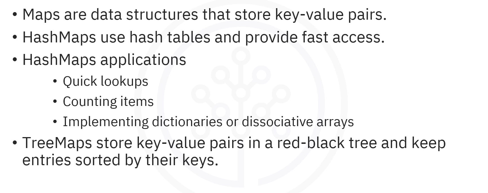
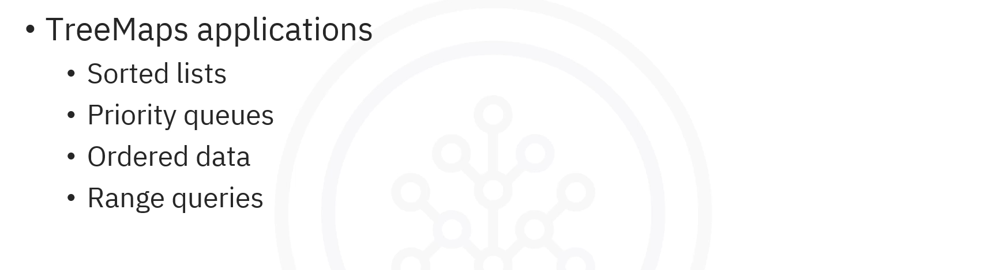
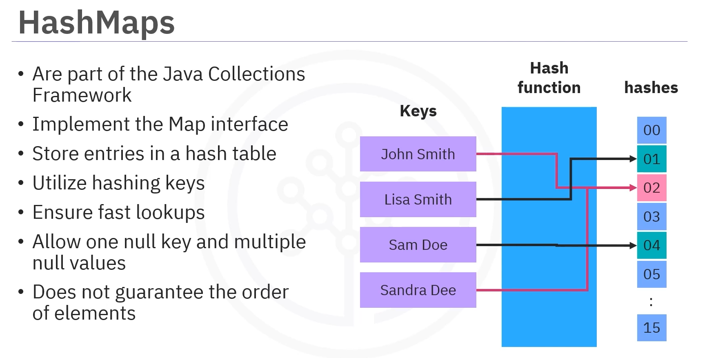
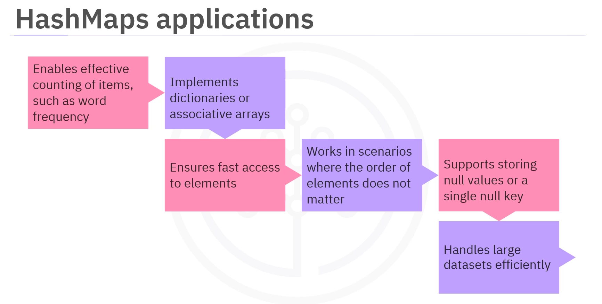
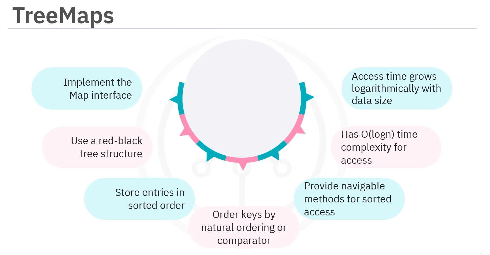
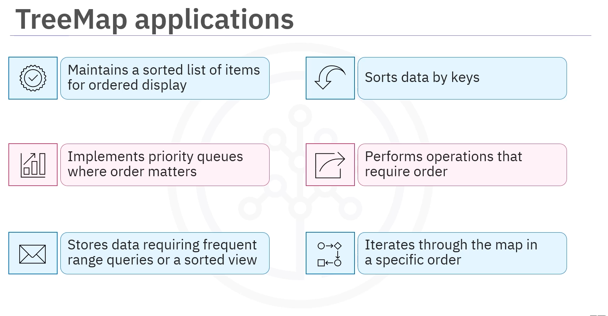
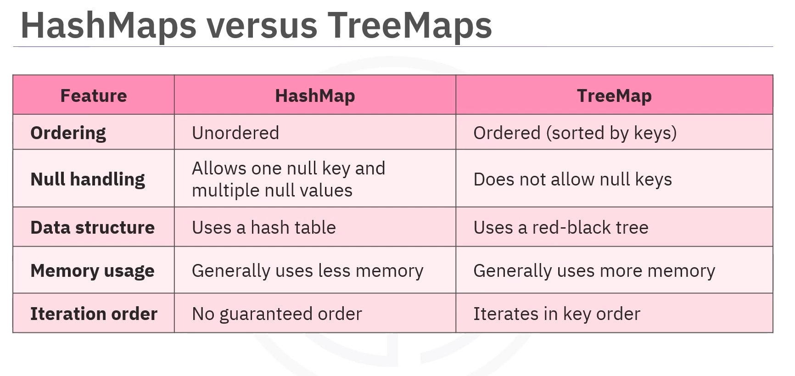

# 03-006: Maps, HashMaps, TreeMaps





---

## Introduction to Maps

Imagine a digital address book with several nicknames or alternate names pointing to the same phone number. Similarly, multiple keys can reference the same value in a map, allowing flexible and efficient data organization.

**Maps** are data structures that store key-value pairs.

Maps are commonly classified as:  

1.  `HashMap`
2.  `TreeMap`

---

## 1.   HashMap

`HashMap`s are part of the Java Collections Framework. They implement the map interface and store entries in a hash table.

Utilizing hashing keys to create an index ensures fast lookups with an average time complexity of **O(1)**, meaning the time to retrieve a value is nearly constant regardless of the number of entries.

### Characteristics of HashMap



|                   | HashMap                                          |
| ----------------- | ------------------------------------------------ |
| Storage Structure | Uses a hash table                                |
| Time Complexity   | O(1) for basic operations (avg)                  |
| Null Values       | Allows one `null` key and multiple `null` values |
| Order             | Order of entries is not guaranteed               |
| Memory            | Generally uses less memory                       |


### Use Cases for HashMap



`HashMap`s are well-suited for:

- Storing and accessing data quickly
- Counting items, such as word frequency
- Implementing dictionaries or associative arrays
- Scenarios requiring fast access to elements where the order of elements does not matter
- Storing `null` values or a single `null` key
- Handling large datasets with performance requirements


### Example 1: Word Frequency Counter

Here is an example of how `HashMap`s are used to count word frequencies in a large text document, where quick access to the count of each word is needed:

```java
// 1. IMPROTS
import java.util.HashMap;

public class WordFrequencyCounter {
    
    public static void main(String[] args) {
        
        // 2. INITS
        // Create a HashMap to store word frequencies
        HashMap<String, Integer> wordFrequency = new HashMap<>();
        
        
        // 3. METHODS
        // Add words and their frequencies
        wordFrequency.put("Java", 5);
        wordFrequency.put("Python", 3);
        wordFrequency.put("JavaScript", 7);
        // A .put() over an existing Key will UPDATE its value
        wordFrequency.put("Java", 6);
        
        // .get()  and display frequencies
        System.out.println("Word Frequencies:");
        for (String word : wordFrequency.keySet()) {
            System.out.println(word + ": " + wordFrequency.get(word));
        }
        
        // .containsKey() Check if a word exists
        if (wordFrequency.containsKey("Python")) {
            System.out.println("Python frequency: " + wordFrequency.get("Python"));
        }
        
        // .remove()    Remove a word
        wordFrequency.remove("JavaScript");
        System.out.println("\nAfter removing 'JavaScript':");
        System.out.println("Remaining words: " + wordFrequency);
    }
}
```

### Example 2: Word Counter with String methods
```java
...
    HashMap<String, Integer> wordCount = new HashMap<>();
    
    String text = "apple banana apple orange banana apple";
    
    String[] words = text.split(" ");
    
    
    for ( String word : words ) {
    
        wordCount.put(word, wordCount.getOrDefault(word, 0) +1 );
        
    }
    
    
```

### HashMap Operations

The process of HashMap creation:

1. **Import**:      `HashMap` class is imported from `java.util`

2. **Create**:      The `HashMap` is created with keys and values, where keys are hashed to create an index for fast lookups

3. **Add Entries**: Entries can be added using the `put()` method

4. **Retrieve Values**: Values can be retrieved using the `get()` method

5. **Iterate Keys**:    Keys can be iterated using the `keySet()` method to print each key along with its value

6. **Check Existence**:     A specific key's existence can be checked using the `containsKey()` method

7. **Remove Entries**:      Entries can be removed using the `remove()` method


---

## TreeMap

-   `TreeMap` is another implementation of the `Map` interface that uses a red-black tree structure ensuring that entries are stored in a sorted order based on their keys.

-   The keys are ordered by their natural ordering or a specified comparator. 

-   `TreeMap`s are navigable, providing methods to access elements in sorted order.

-   The average time complexity of accessing items in a `TreeMap` is **O(log** *n* **)**, where `n` indicates the number of operations. This means that as the size of the dataset increases, the time to access an element grows logarithmically.

### Characteristics of TreeMap



|                   | **TreeMap**                                      |
| ----------------- | ------------------------------------------------ |
| Storage Structure | Uses a red-black tree structure                  |
| Time Complexity   | **O(log** *n* **)** for basic operations         |
| Null Keys         | Does **NOT** allow `null` keys                   |
| Order             | Stored in **sorted order by their keys**         |
| Memory            | Generally **uses more memory**                   |
| Iteration         | **Allows iteration** through the map i**n sorted order** |


### TreeMap Operations

Creating a `TreeMap` is similar to creating a `HashMap`:

1. **Import**:      `java.util.TreeMap` is imported

2. **Create**:      The `TreeMap` is created with string keys and integer values

3. **Add Entries**: Entries can be added using the `put()` method

4. **Retrieve Values**: Values can be retrieved using the `get()` method

5. **Iterate Keys**:    Keys can be iterated using the `keySet()` method, 
allowing each key and its corresponding value to be printed

6. **Check Existence**: The method `containsKey()` can be used to check if a specific key exists

7. **Remove Entries**:  The `remove()` method may be used to remove any entry

### Use Cases for TreeMap



`TreeMap`s are ideal for:

- Maintaining a **sorted list of items**, such as displaying information in order
- Implementing **priority queues where order matters**
- Storing data requiring **frequent range queries or a sorted view
- Ensuring **keys sort the data**
- Performing **operations that require order**, such as finding the smallest or largest key
- Allowing **iteration through the map in a specific order**

### Example: Leaderboard Implementation

Here's an example of how `TreeMap`s implement a leaderboard where scores must be displayed in descending order:

```java
// 1. IMPORTS
import java.util.TreeMap;
import java.util.Collections;

public class LeaderboardExample {
    
    public static void main(String[] args) {
        
        // 2. INITS
        // Create a TreeMap to store player names and scores
        // Using a comparator to sort in descending order
        TreeMap<Integer, String> leaderboard = new TreeMap<>(Collections.reverseOrder());
        
        
        // 3. METHODS
        // .put()   Add players and their scores
        leaderboard.put(100, "Alice");
        leaderboard.put(85, "Bob");
        leaderboard.put(95, "Charlie");
        leaderboard.put(78, "Diana");
        
        // .keySet()    Display the leaderboard (automatically sorted in descending order)
        System.out.println("Leaderboard (Highest to Lowest):");
        for (Integer score : leaderboard.keySet()) {
            System.out.println(leaderboard.get(score) + ": " + score);
        }
        
        // .containsKey() if a score exists
        if (leaderboard.containsKey(95)) {
            System.out.println("\nFound score 95 for: " + leaderboard.get(95));
        }
        
        // .remove() a score
        leaderboard.remove(78);
        System.out.println("\nAfter removing lowest score:");
        for (Integer score : leaderboard.keySet()) {
            System.out.println(leaderboard.get(score) + ": " + score);
        }
    }
}
```

---

## HashMap vs. TreeMap



|         | **HashMap** | **TreeMap** |
|---------|-------------|-------------|
| **Storage Structure** | Hash table | Red/black tree type |
| **Time Complexity** | **O(1)** for basic operations | **O(log** *n* **)** for basic operations |
| **Order** | **Unordered**; no guaranteed iteration order | **Sorted order by keys** |
| **Null Keys** | **Allows one `null` key** | Does not allow `null` keys** |
| **Null Values** | Allows **multiple `null` values** | Allows **multiple `null` values** |
| **Memory Usage** | Generally uses **less memory** | Generally uses **more memory** |
| **Use Case** | Fast lookups, unordered data | Sorted data, range queries |

### HashMap Characteristics REcap

- Stores key-value pairs using a hash table
- Unordered
- Allows one `null` key and multiple `null` values
- Generally uses less memory
- Does not guarantee any specific iteration order

### TreeMap Characteristics Recap

- Stores key-value pairs using a red-black tree structure
- Ensures that entries are always sorted by their keys
- Does not allow `null` keys
- Generally uses more memory
- Iterates in key order making them suitable for scenarios where ordering is required

---

## Decision Criteria

### Use HashMap When...

- **Fast Access is Priority**:  You need quick lookups and O(1) time complexity is important
- **Order Doesn't Matter**: The order of elements is not important for your application
- **Null Keys Needed**: You need to store a `null` key
- **Memory Efficiency**:    You want to minimize memory usage

- Use Cases:    Implementing a cache, counting occurrences, or implementing a lookup table.

### Use TreeMap When...

- **Sorted Order is Required**: You need data to be automatically sorted by keys
- **Range Queries**:     You need to perform operations on a range of keys
- **Priority Queues**:  You need to implement a priority queue based on keys
- **Ordered Iteration**:    You need to iterate through the map in key order

- Use Cases:    Maintaining a leaderboard, storing events by timestamp, or implementing a dictionary with sorted keywords.

---

## Common Methods

### HashMap and TreeMap Methods

| Method | Description |
|--------|-------------|
| `put(K key, V value)` | Adds or updates a key-value pair |
| `get(Object key)` | Retrieves the value associated with a key |
| `remove(Object key)` | Removes a key-value pair |
| `containsKey(Object key)` | Checks if a key exists in the map |
| `keySet()` | Returns a set of all keys |
| `values()` | Returns a collection of all values |
| `entrySet()` | Returns a set of all key-value pairs |
| `isEmpty()` | Checks if the map is empty |
| `size()` | Returns the number of entries in the map |

---
