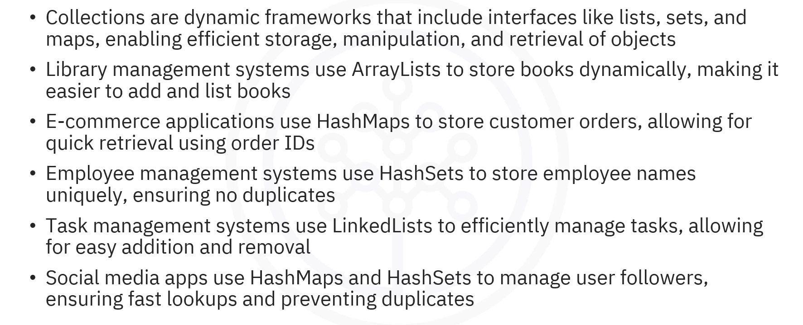
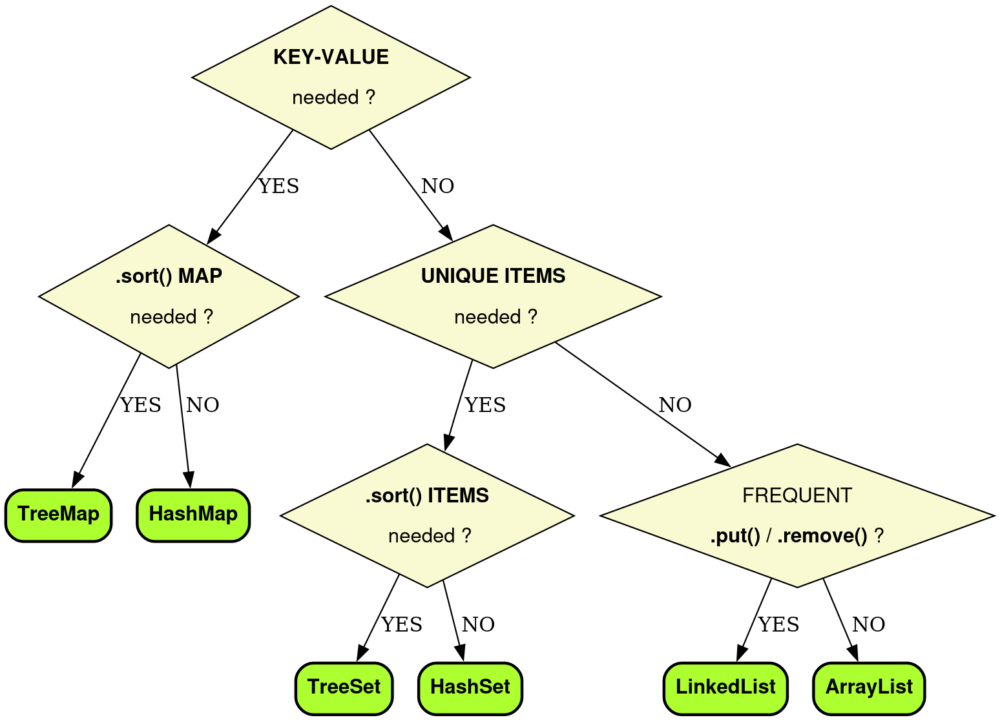

# 03-008:   Decision Criteria for Choosing Collections and Recap

---

## Decision Flowchart

| Scenario | Type |
|----------|------|
| **Need key-value pairs?** | Map (HashMap or TreeMap) |
| **Need uniqueness?** | Set (HashSet or TreeSet) |
| **Need order?** | TreeSet or TreeMap |
| **Need speed?** | HashSet or HashMap |
| **Need position-based access?** | ArrayList |
| **Need frequently modify the collection?** | LinkedList |

**Use `ArrayList` When:**
- You need ordered data with fast random access
- Primary operation is reading/accessing by index
- Additions/removals happen mainly at the end

**Use `LinkedList` When:**
- You need frequent insertions/deletions
- You're implementing queue or deque operations
- You add/remove from both ends frequently

**Use `HashSet` When:**
- You need unique items with maximum speed
- Order doesn't matter
- You frequently check if an item exists

**Use `TreeSet` When:**
- You need unique items in sorted order
- You need to iterate in order
- You perform range queries

**Use `HashMap` When:**
- You need fast key-value lookups
- Order of entries doesn't matter
- You're building a dictionary, cache, or lookup table

**Use `TreeMap` When:**
- You need key-value pairs in sorted order
- You need range queries by key
- Order of entries is important

| Need | Best Choice | Why? |
|------|-------------|-----|
| **Dynamic array with fast access by index** | `ArrayList` | O(1) random access, automatic resizing |
| **Frequent insertions/deletions at both ends** | `LinkedList` | O(1) add/remove at both ends |
| **Unique items, unordered** | `HashSet` | O(1) operations, prevents duplicates |
| **Unique items, sorted order** | `TreeSet` | Automatic sorting, O(log n) operations |
| **Fast key-value lookups** | `HashMap` | O(1) average lookup, unordered |
| **Key-value pairs in sorted order** | `TreeMap` | Sorted by keys, O(log n) operations |

---

## Recap:   What Are Collections?

**Collections** are frameworks used to store and manipulate groups of objects dynamically.  

They include interfaces such as `List`, `Set`, and `Map`, and provide methods for adding, removing, searching, and sorting data.

Collections help keep data organized, allowing users to retrieve the right information when needed quickly.

---

## Collections Framework Overview

The Java Collections Framework is divided into three main categories:

### 1. **Lists** (Ordered, allows duplicates)
- `ArrayList`:      Dynamic array, fast access
- `LinkedList`:     Doubly linked list, efficient insertions/deletions

### 2. **Sets** (Unordered, no duplicates)
- `HashSet`:        Hash table, fast lookups
- `TreeSet`:        Sorted tree structure, maintained order

### 3. **Maps** (Key-value pairs, unique keys)
- `HashMap`:        Hash table, fast lookups
- `TreeMap`:        Sorted by keys, ordered access

---

## Collection Selection Guide

### ArrayList (List Interface)

> Use `ArrayList` when you frequently access elements by their position rather than searching.

**When to Use:**
- You need to store an ordered collection of items
- You need fast random access by index (get element at position 5, 10, 20, etc.)
- You add/remove items mainly at the end of the collection
- The list size changes frequently but you don't care about the growth overhead
- You can tolerate slower insertions/deletions in the middle

**Performance:**
- Access: O(1) ✅ Fast
- Insertion/Deletion at end: O(1) ✅ Fast
- Insertion/Deletion in middle: O(n) ❌ Slow
- Search: O(n) - Linear search

**Real-World Examples:**
- **Library Management System** - Stores books dynamically, allows sorting, easy retrieval by position
- **Shopping Cart** - List of products, accessed and displayed in order
- **Search Results** - Maintains order of search results for quick access by position

---

### LinkedList (List Interface)

> Use `LinkedList` when insertions and deletions are more frequent than random access.

**When to Use:**
- You frequently add or remove items from the beginning or end
- You need to implement stack or queue data structures
- You perform many insertions and deletions (not just at the end)
- Order matters and you iterate through the list sequentially
- Random access by index is not a priority

**Performance:**
- Access: O(n) ❌ Slow
- Insertion/Deletion at ends: O(1) ✅ Fast
- Insertion/Deletion in middle: O(n) but more efficient than ArrayList
- Search: O(n) - Linear search

**Real-World Examples:**
- **Task Management Systems** - Tasks are added to the end and removed as completed; frequently manages queue of work
- **Undo/Redo Functionality** - Perfect for maintaining history where you add/remove from both ends
- **Browser History** - Back/forward operations work efficiently

---

### HashSet (Set Interface)

> Use `HashSet` when you need speed and uniqueness, and don't care about order.

**When to Use:**
- You need to store unique items (no duplicates allowed)
- You need very fast lookups to check if an item exists
- Order of items doesn't matter
- You need to eliminate duplicates from a collection
- You're implementing a membership system or inventory tracking

**Performance:**
- Add: O(1) ✅ Very Fast
- Remove: O(1) ✅ Very Fast
- Contains: O(1) ✅ Very Fast
- Maintains no order

**Real-World Examples:**
- **Employee Management System** - Stores unique employee names, ensures no duplicate entries in records
- **Inventory Tracking** - Tracks unique product SKUs, quickly checks if an item exists in stock
- **User Registration System** - Maintains set of registered usernames with fast duplicate detection
- **Visited Pages** - Web crawler tracks visited URLs to avoid processing duplicates

---

### TreeSet (Set Interface)

> Use `TreeSet` when you need both uniqueness AND sorted order.

**When to Use:**
- You need unique items AND they must be sorted
- You need to perform range queries (find items between values)
- You need fast access to minimum/maximum values
- Order of elements is important for your application
- You can tolerate slightly slower operations (O(log n) vs O(1))

**Performance:**
- Add: O(log n) ✅ Fast
- Remove: O(log n) ✅ Fast
- Contains: O(log n) ✅ Fast
- Maintains sorted order automatically

**Real-World Examples:**
- **Leaderboard/Rankings** - Automatically maintains scores in sorted order, easy to find top players
- **Event Scheduling** - Keeps events sorted by time, enables range queries ("all events next week")
- **Customer Service Queue** - Sorts customers by priority while maintaining uniqueness
- **Grade Book** - Maintains student grades in sorted order for analysis

---

### HashMap (Map Interface)

> Use `HashMap` when you need lightning-fast lookups by key and order is irrelevant.

**When to Use:**
- You need to associate keys with values for fast lookup
- You need O(1) average lookup time by key
- Order of entries doesn't matter
- You have unique keys
- You can store one `null` key if needed
- You need a quick reference system (like a dictionary)

**Performance:**
- Get by key: O(1) ✅ Very Fast
- Put: O(1) ✅ Very Fast
- Remove: O(1) ✅ Very Fast
- No guaranteed order

**Real-World Examples:**
- **E-Commerce System** - Maps order IDs to customer names for quick order lookup
- **Cache System** - Maps URLs to cached web pages for instant retrieval
- **Student Records** - Maps student IDs to complete student information
- **Configuration Settings** - Maps setting names to their values
- **Word Frequency Counter** - Maps words to occurrence counts

---

### TreeMap (Map Interface)

> Use `TreeMap` when you need sorted key-value pairs and can accept slightly slower operations.

**When to Use:**
- You need key-value pairs that are automatically sorted by key
- You need to perform range queries on keys
- You need to iterate through entries in sorted order
- Order of entries is important
- You need to find entries with keys between certain ranges
- You can tolerate O(log n) instead of O(1) operations

**Performance:**
- Get by key: O(log n) ✅ Fast
- Put: O(log n) ✅ Fast
- Remove: O(log n) ✅ Fast
- Maintains sorted order by keys

**Real-World Examples:**
- **Leaderboard with Details** - Maps player names to scores, maintains sorted order
- **Time-Based Event Log** - Maps timestamps to events, allows range queries for date ranges
- **Stock Price History** - Maps dates to prices, enables queries like "all prices between date X and Y"
- **Dictionary Application** - Maps words to definitions, maintains alphabetical order
- **Bank Account Transactions** - Maps transaction dates to amounts

---

## Real-World Application Scenarios
## Real-World Application Scenarios

| Scenario | Problem | Data Structure | Why | Operations |
|----------|---------|-----------------|-----|------------|
| **Social Media: Followers** | Manage followers, no duplicates, fast lookup | `HashMap<String, HashSet<String>>` | O(1) lookup + HashSet prevents dupes | Add follower, check if follower, display all |
| **Library Management** | Store books, dynamic add/remove, retrieve by position | `ArrayList<Book>` | O(1) random access, dynamic resizing | Add book, remove, display, search by index |
| **E-Commerce Orders** | Store orders by ID, quick customer lookup | `HashMap<Integer, String>` | O(1) lookup by order ID | Add order, retrieve customer, remove, display |
| **Employee Management** | Unique names, prevent duplicates | `HashSet<String>` | O(1) operations, ensures uniqueness | Add employee, check exists, remove, display |
| **Task Queue** | Add to end, complete from front, efficient | `LinkedList<Task>` | O(1) add/remove at ends | Add task, complete, display pending |

---

