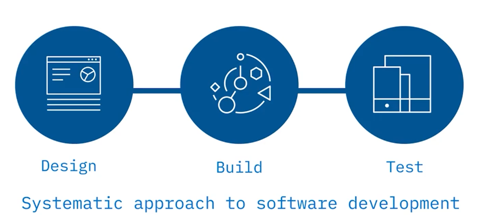
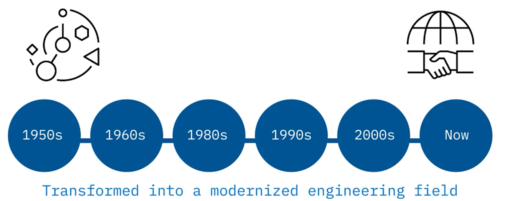
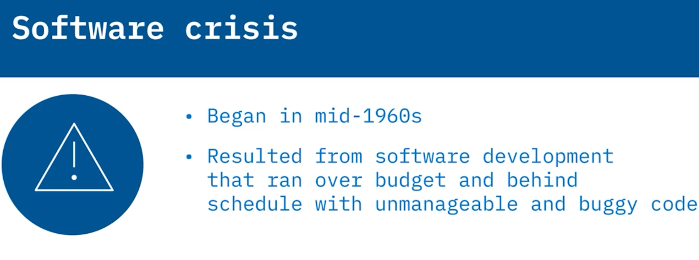
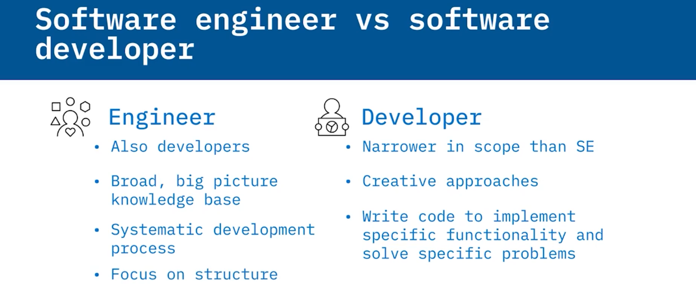
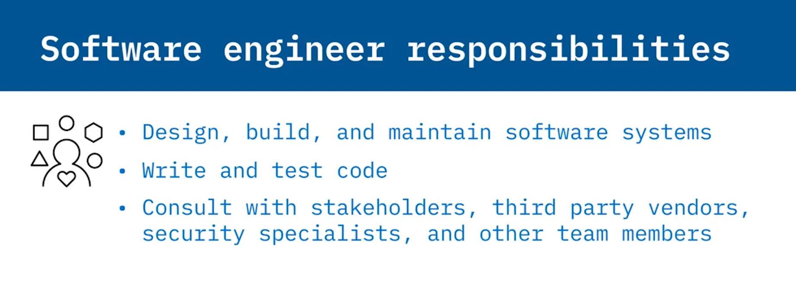

# 01-003: SDLC Software Engineering Introduction

## Theory

**Software Engineering** is the application of scientific principles to the design and creation of software, employing a systematic approach to collect and analyse business requirements in order to design, build, and test software applications.

### Historical Context

The discipline emerged in the 1960s, evolving from ad hoc programming towards formal and standardised methods.  

The **software crisis** (mid-1960s to mid-1980s) highlighted the inefficiencies in early development processes—projects frequently exceeded budgets, missed schedules, and produced unmaintainable, buggy code. Solutions that worked for small systems failed to scale to large, complex projects.

### Modern Solutions

The resolution involved two key developments: transforming ad hoc coding into an established engineering discipline and the rise of **Computer-Aided Software Engineering (CASE)** tools.

Today, the **Software Development Lifecycle (SDLC)** guides the development process to ensure high-quality software.

### Software Engineer vs. Software Developer

Whilst the terms are often used interchangeably, distinct differences exist:

- **Software Engineers** possess broader knowledge, take a systematic big-picture approach, and design entire systems
- **Software Developers** have a narrower scope, may employ more creative approaches, and implement specific functionality within systems
- Engineers typically work on larger-scale projects focused on broad structure; developers solve immediate problems

### Key Responsibilities

Software engineers are tasked with designing, building, and maintaining software systems.   

Their responsibilities encompass writing and testing code, consulting with stakeholders (clients, third-party vendors, security specialists, and team members), and applying a measured scientific approach to development.  

### SDLC 

The adoption of a **measured scientific approach** to software development has influenced the way software is created and designed.  

Today, the development process is typically guided by the **Software Development Lifecycle, or SDLC**.  

The SDLC **identifies the steps needed** to develop **high-quality software**. Later in this module, we will discuss the SDLC, the traits of high-quality software, and roles common in the field of software engineering.

***

## Real-Life Example

The importance of software engineering in a practical context:

#### Example: Developing a Mobile Banking App

#### Context 
*A bank wants to create a mobile application that allows customers to manage their accounts, transfer money, and pay bills.*

#### Relevance to Software Engineering

* **Systematic Approach**: The software engineering team begins by gathering business requirements through consultations with stakeholders, including bank employees and customers. This ensures that the app meets user needs and complies with financial regulations.

* **Design and Development**: The team uses a systematic approach to design the application architecture, ensuring it is scalable and secured. They apply software engineering principles to create a robust system that can handle a large number of users simultaneously.

* **Testing and Maintenance**: After developing the application, the team conducts rigorous testing to identify and fix bugs. They also implement a plan for ongoing maintenance and updates, ensuring the app remains functional and secure over time.

##### Connexion to Software Engineering Responsibilities

1.  Designing, Building, and Maintaining: The software engineers are responsible for the entire lifecycle of the application, from initial design to ongoing maintenance.

2. Consulting with Stakeholders: They work closely with various stakeholders, including security specialists to ensure the app is secure and meets compliance standards.

---

## Lesson Speech

Welcome to What is **Software Engineering**?  
After watching this video, you will be able to **define Software Engineering, list the Responsibilities of a Software Engineer**, and **compare and contrast Software Developers and Software Engineers**.

**Software Engineering** is the **application of scientific principles** to the design and creation of software. The field uses a **systematic approach** to collect and analyse business requirements in order to design, build, and test software applications to satisfy those business requirements.

When computing began in the late 1950s, software engineering was a relatively undefined discipline, but over time it transformed into a **modernised engineering field**. The software engineering field became a discipline in the **1960s** and evolved as new technologies were developed and the approach to software development became more **scientific**.

Trends in software engineering transformed from **ad hoc programming** towards **more formal and standardised methods**.

Initially, the creation of software **lacked a formal development process**. As the world widely adopted computers, software became **increasingly integral** to more aspects of life. The inefficiencies in the software development process made it difficult to meet the rapidly increasing demand for computing resources and complex software.

This led to what is known as the **software crisis**, which began in the **mid-1960s** and lasted until the **mid-1980s**. During this period, software development **often ran over budget, behind schedule**, and consisted of **unmanageable, buggy code**. By the time older software solutions came to fruition, newer, better, and faster technologies had already been developed, causing software engineers to have to **refactor their code** or **completely redesign their system**. Often software development solutions that worked for **small software systems** did not **scale to large, complex projects**.

Now, some of these issues still exist today, although to a much lesser extent, due to the **consistent application of engineering principles** to the software development process. Computing resources have become **more widely available**, and **standardised methodologies** for software development allow for **large, complex solutions** that scale.

The solution to the software crisis involved **transforming unorganised coding efforts** into an **established engineering discipline**. The mid-1980s also saw a **rise in the growth of computer-aided software engineering, or CASE**, which also helped to relieve the software crisis. **CASE tools** can be divided into **six categories**: business analysis and modelling, development tools such as debugging environments, verification and validation tools, configuration management, metrics and measurement, and project management.

Now, the term **software engineer** is often used interchangeably with **software developer**, but there are **subtle differences**. Software engineers are also developers, but the term software developer is usually deemed **narrower in scope** than that of a software engineer.

A **software engineer's knowledge** is usually **broader**. **Software engineers** take a **systematic big-picture approach** in their thinking to software development, whereas developers may have **more creative approaches**. And both software engineers and software developers have **specialised knowledge**, but **software engineers** use that knowledge to **build entire systems**, whereas **software developers** use their knowledge to **write code** to implement **specific functionality** within a system.

**Software engineers** are often employed on **larger-scale projects**, and they are focused on the **broad structure** rather than solving an immediate problem. **Software engineers** are tasked with **designing, building, and maintaining software systems**. Their responsibilities include **writing and testing code** and **consulting with stakeholders** such as clients, third-party software vendors, security specialists, and other team members.

The adoption of a **measured scientific approach** to software development has influenced the way software is created and designed.

Today, the development process is typically guided by the **Software Development Lifecycle, or SDLC**. The SDLC **identifies the steps needed** to develop **high-quality software**. Later in this module, we will discuss the SDLC, the traits of high-quality software, and roles common in the field of software engineering.

In this video, you learned that **Software engineering** is the **systematic approach** to design and development of software. **Responsibilities** of a software engineer include **designing, building, and maintaining** software systems, **writing and testing code**, and **consulting with stakeholders**, third-party vendors, security specialists, and other team members. And finally, **software engineers** build systems whilst **software developers** implement specific functionalities.
