# Tecnología sin Barreras: Accesibilidad Web

## 1. Introducción y Contexto Normativo

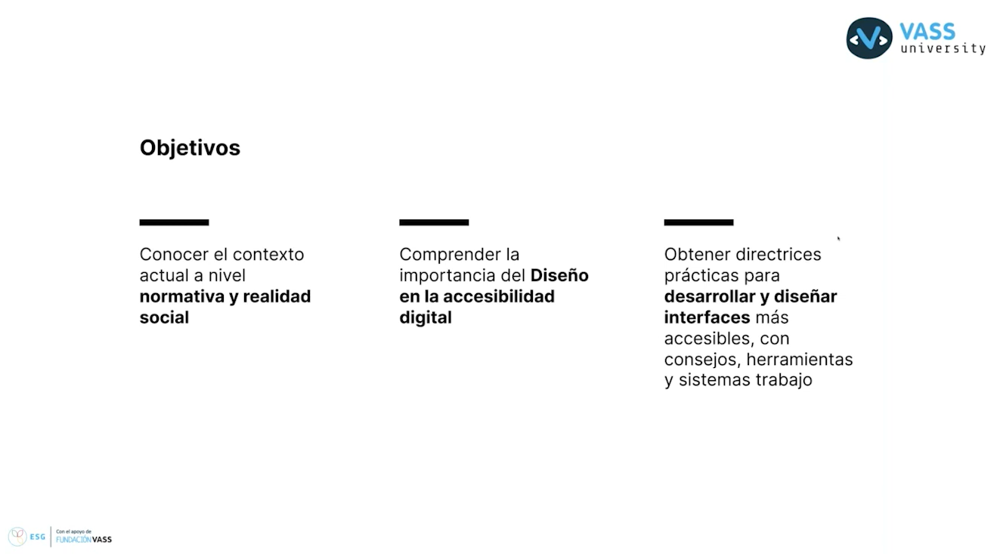

### Objetivos

* Conocer el contexto actual a nivel normativa y realidad social
* Comprender la importancia del Diseño en la accesibilidad digital
* Obtener directrices prácticas para desarrollar y diseñar interfaces más accesibles, con consejos, herramientas y sistemas trabajo

> La **accesibilidad web** no es una característica opcional ni un lujo, sino la práctica de garantizar que **todas las personas**, independientemente de sus capacidades o de las condiciones en las que accedan, puedan **percibir, entender, navegar e interactuar** con la web. Se trata de eliminar barreras en el entorno digital.

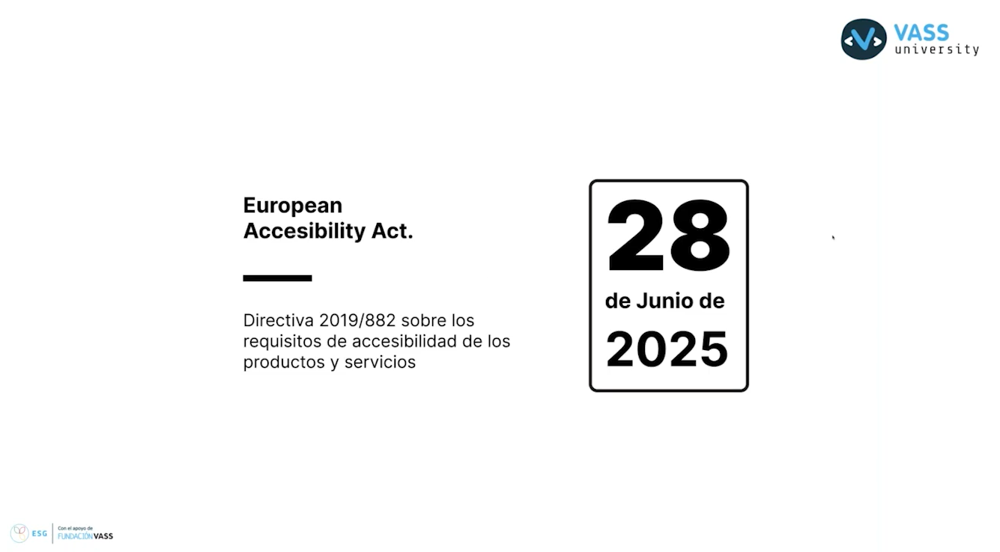

- **European Accesibility Act.**

- **Directiva 2019/882** sobre los **requisitos de accesibilidad de los productos y servicios**, de 28 de Junio de 2025

- Existe un marco legal que está marcando un antes y un después: la **Directiva Europea de Accesibilidad**.

- **Fecha clave:** 21 de junio de 2025
- **A partir de esa fecha:** todos los nuevos productos y servicios digitales (webs y aplicaciones) que salgan al mercado deberán cumplir con los requisitos de accesibilidad

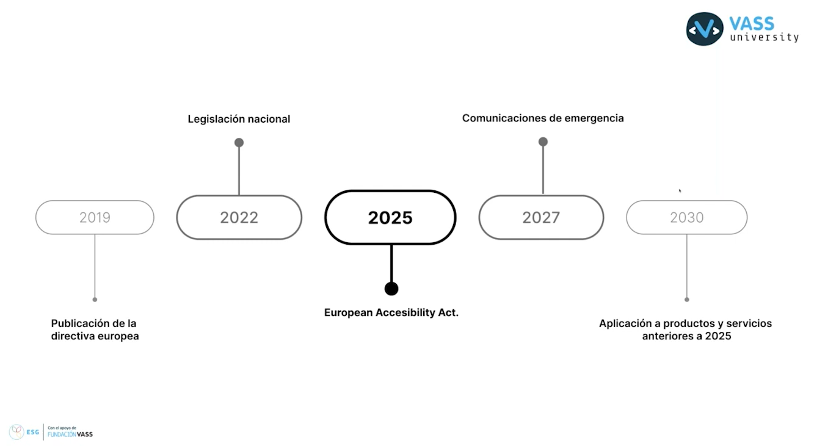

* 2019: Publicación de la directiva europea
* 2022: Legislación nacional
* 2025: European Accesibility Act.
* 2027: Comunicaciones de emergencia
* 2030: Aplicación a productos y servicios anteriores a 2025

Esta línea temporal resume el recorrido normativo:  

- **Origen (2019):** la directiva europea se publicó dando margen a los países miembros para adaptarla a su legislación nacional (proceso de **transposición**)

- **Alcance inicial:** se aplica a nuevos desarrollos

- **Alcance futuro:** se extenderá a productos existentes y a otros ámbitos como llamadas de emergencia o terminales de autoservicio

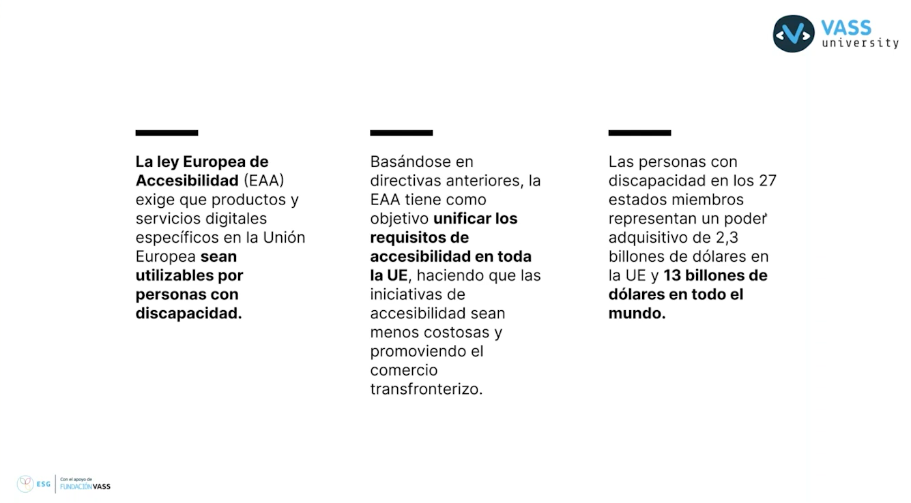

* La ley Europea de Accesibilidad (EAA) exige que productos y servicios digitales específicos en la Unión Europea sean utilizables por personas con discapacidad.

* Basándose en directivas anteriores, la EAA tiene como objetivo unificar los requisitos de accesibilidad en toda la UE, haciendo que las iniciativas de accesibilidad sean menos costosas y promoviendo el comercio transfronterizo.

* Las personas con discapacidad en los 27 estados miembros representan un poder adquisitivo de 2,3 billones de dólares en la UE y 13 billones de dólares en todo el mundo.

Más allá de la obligación legal, estos datos ya apuntan a la dimensión de **oportunidad de negocio** que se desarrollará en el siguiente bloque:

- **UE (27 estados miembros):** 2,3 billones de dólares de poder adquisitivo
- **Mundial:** 13 billones de dólares de mercado potencial

---

### Web Content Accessibility Guidelines (WCAG) 2.1
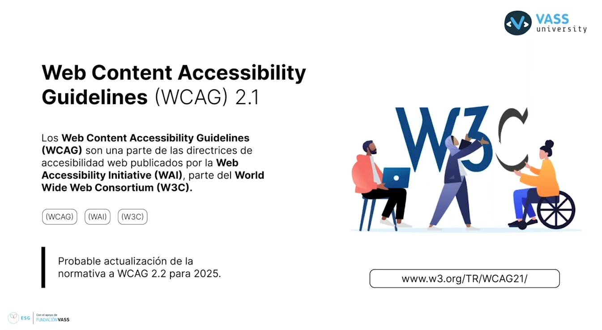

Los Web Content Accessibility Guidelines (WCAG) son una parte de las directrices de accesibilidad web publicados por la Web Accessibility Initiative (WAI), parte del World Wide Web Consortium (W3C).

Probable actualización de la normativa a WCAG 2.2 para 2025.

Para cumplir con la ley, los equipos técnicos se basan en este estándar internacional, con **tres niveles de conformidad**:

| Nivel | Descripción |
|---|---|
| **A** | El más básico |
| **AA** | El exigido por la directiva europea para la mayoría de los casos — **el objetivo a cumplir** |
| **AAA** | El más alto y exigente, busca la máxima accesibilidad posible |

---

## 2. El Valor de la Accesibilidad: Un Beneficio Universal

### ¿Por qué es **necesario** un sistema de diseño accesible?
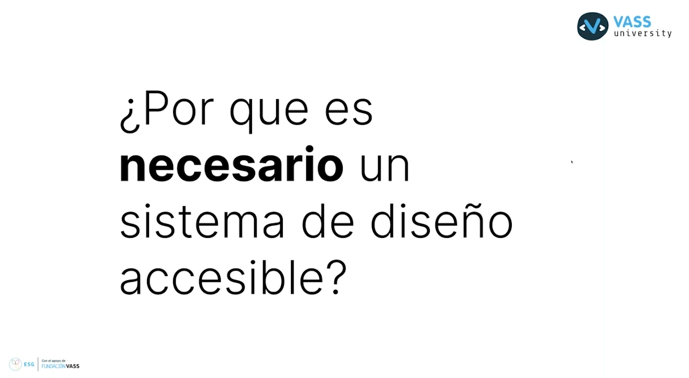
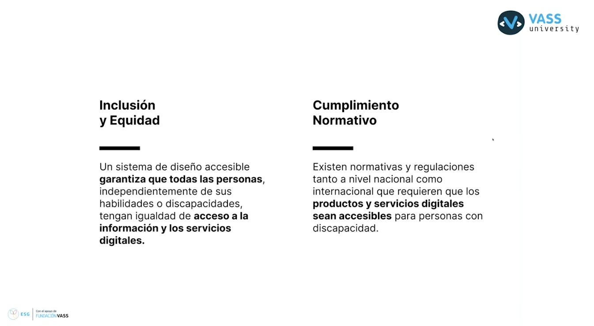

* **Inclusión y Equidad**
  * Un sistema de diseño accesible **garantiza que todas las personas, independientemente de sus habilidades o discapacidades, tengan igualdad de acceso a la información y los servicios digitales.**

* **Cumplimiento Normativo**
  * Existen normativas y regulaciones tanto a nivel nacional como internacional que requieren que los **productos y servicios digitales sean accesibles** para personas con discapacidad.

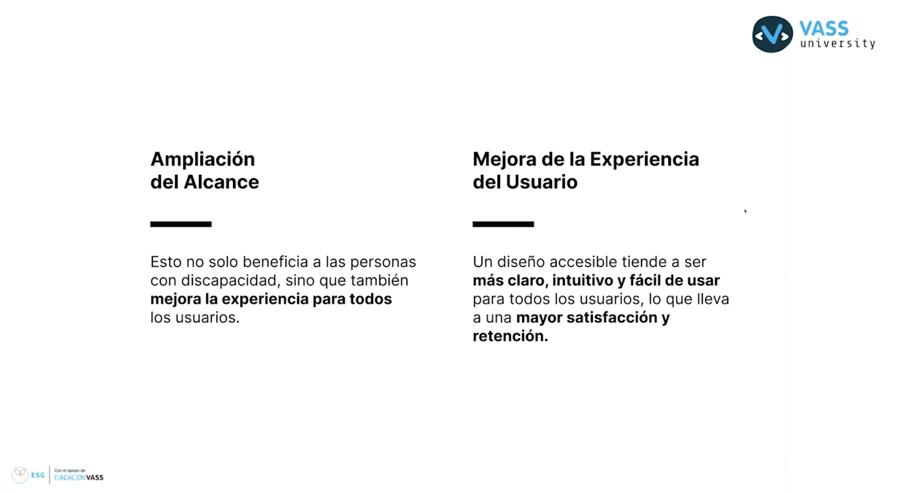

* **Ampliación del Alcance**
  * Esto no solo beneficia a las personas con discapacidad, sino que también **mejora la experiencia para todos los usuarios.**

* **Mejora de la Experiencia del Usuario**
  * Un diseño accesible tiende a ser **más claro, intuitivo y fácil de usar** para todos los usuarios, lo que lleva a una **mayor satisfacción y retención**.

  
La accesibilidad no es solo una obligación: es también una **oportunidad** y una **responsabilidad**.

- Se estima que alrededor del **16% de la población mundial** vive con algún tipo de discapacidad
- Excluirles es una barrera social que un sistema de diseño accesible ayuda a eliminar desde su base

Es el efecto **win-win** de la accesibilidad: diseñar pensando en ella mejora la experiencia de cualquier usuario.

- Los **subtítulos** ayudan a personas sordas, pero también a quien ve un vídeo en un entorno ruidoso
- El **modo oscuro** ayuda a personas con sensibilidad a la luz, pero también a quien navega de noche para no forzar la vista

---

## 5. Metodología de Trabajo: Caso de Éxito (PIBANK)

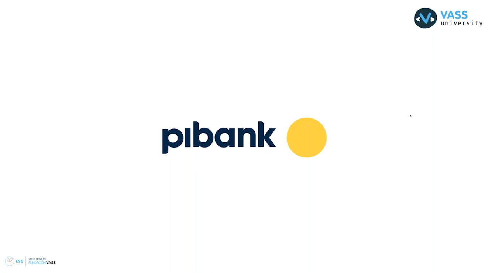
- CASO REAL: pibank

En este proyecto de banca digital, tras un desarrollo inicial, se implementó un **sistema de diseño con Design Tokens en Figma** para llevar a la práctica todo lo anterior.

### Identidad visual elegida con accesibilidad en mediante

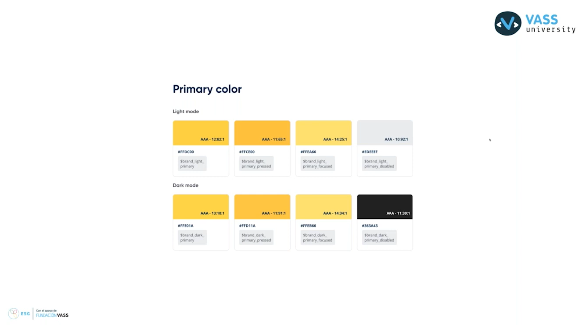

### Primary colours

- Light mode
  * #FFDC00 - $brand_light_primary - AAA - 12:82:1
  * #FFCE00 - $brand_light_primary_pressed - AAA - 11:65:1
  * #FFEA66 - $brand_light_primary_focused - AAA - 14:25:1
  * #EDEEEF - $brand_light_primary_disabled - AAA - 10:92:1

- Dark mode
  * #FFE01A - $brand_dark_primary - AAA - 13:18:1
  * #FFD11A - $brand_dark_primary_pressed - AAA - 11:91:1
  * #FFEB66 - $brand_dark_primary_focused - AAA - 14:34:1
  * #363A43 - $brand_dark_primary_disabled - AAA - 11:39:1

Se crearon modos claro y oscuro con contrastes que cumplían el **nivel AAA**, definidos como **Design Tokens**: los "átomos" del diseño (colores, tipografías, espaciados).

> Definiéndolos de forma accesible desde el principio, cumpliendo estos ratios de contraste, se garantiza que **todos los componentes** que se construyan a partir de ellos también lo sean.

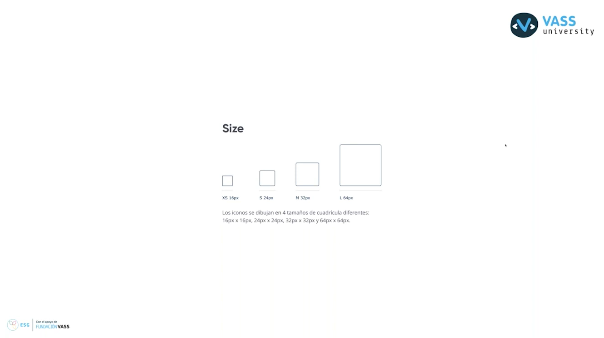

### Size

- XS `16px`
- S `24px`
- M `32px`
- L `64px`

- Los iconos se dibujan en 4 tamaños de cuadrícula diferentes: 16px x 16px, 24px x 24px, 32px x 32px y 64px x 64px.

Se definió también una **jerarquía tipográfica** y estos tamaños de iconografía, que permittían:

- Hacer **zoom hasta 4x** sin romper el diseño
- Aplicar el mismo criterio a todos los componentes de forma coherente en diferentes países y aplicaciones

---

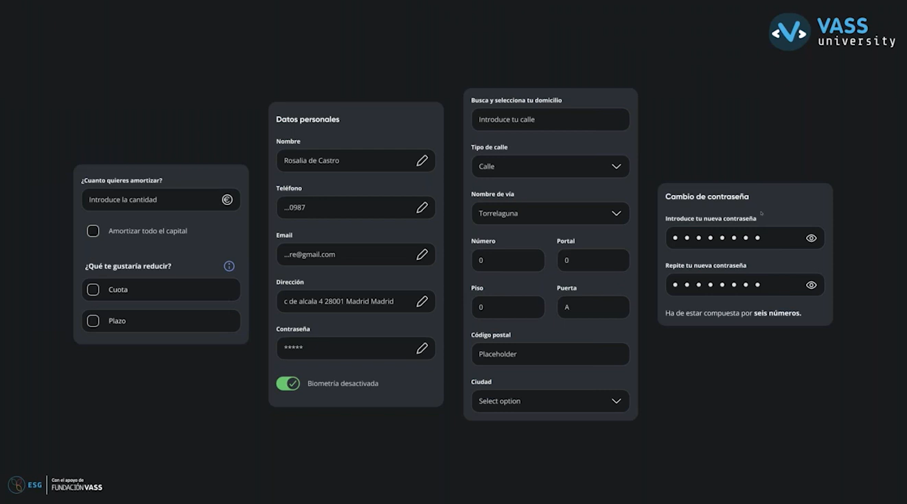

Este es el resultado en pantallas reales: formularios donde:

- Cada campo lleva **su etiqueta asociada**
- Los textos de ayuda son **claros**
- La estructura es **predecible**

Aplicando ya en la práctica los principios de formularios bien etiquetados.

---

## Accesibilidad a nivel de código

### Librerías Front

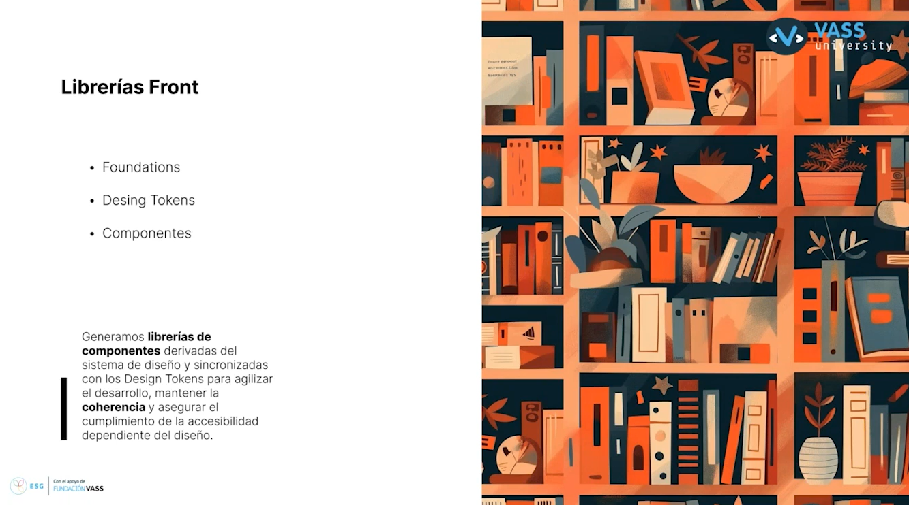

* Foundations
* Desing Tokens
* Componentes

Generamos librerías de componentes derivadas del sistema de diseño y sincronizadas con los Design Tokens para agilizar el desarrollo, mantener la coherencia y asegurar el cumplimiento de la accesibilidad dependiente del diseño.

> Estos tokens se plasman en código, creando **librerías de componentes reutilizables**, asegurando la coherencia y la accesibilidad en todas las aplicaciones de una misma marca o proyecto.

---

## 3. Usuarios y sus Necesidades: La Diversidad Funcional

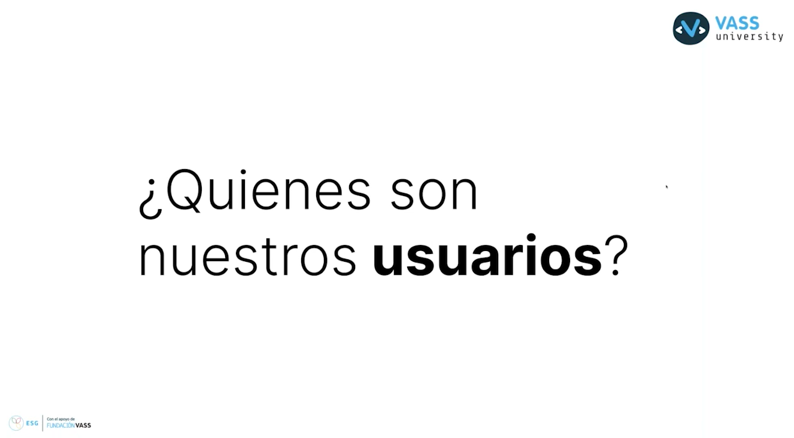

> ¿Quienes son nuestros usuarios?

Para diseñar bien, hay que conocer a los usuarios. El webinar identifica **cuatro grandes grupos**:

1. Discapacidad visual
2. Discapacidad auditiva
3. Discapacidad cognitiva
4. Discapacidad motora

---

### Discapacidad Visual

Usuarios con dificultades para ver o que son ciegos.  

> Ejemplo:  María, que utiliza un lector de pantalla para navegar por sitios web.

Es un espectro muy amplio:

- **Baja visión:** necesita alto contraste, posibilidad de hacer zoom y tipografías claras
- **Ceguera:**  depende de lectores de pantalla, por lo que el código debe ser **semántico** y las imágenes deben llevar **texto alternativo**
- **Daltonismo (percepción del color):** la información nunca debe transmitirse solo a través del color

---

### Discapacidad Visual y Auditiva

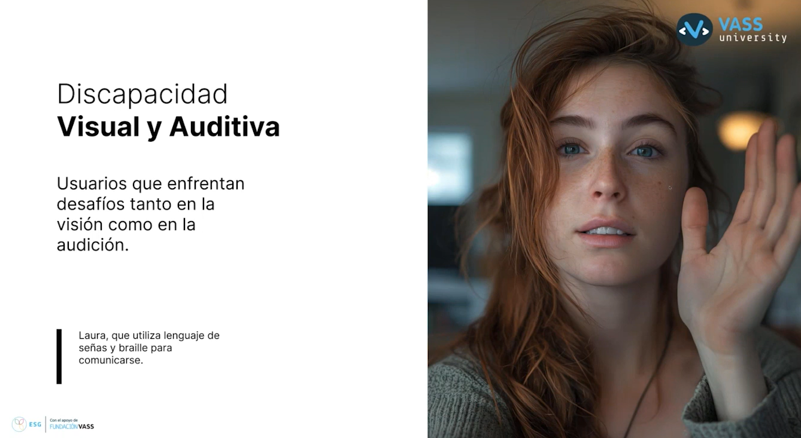

Usuarios que enfrentan desafíos tanto en la visión como en la audición.  

> Ejemplo:  Laura, que utiliza lenguaje de señas y braille para comunicarse.

- **Discapacidad auditiva:** personas con sordera parcial o total, dependen de **subtítulos y transcripciones** en contenido multimedia
- **Casos combinados**  requieren además soportes como el **lenguaje de señas** y el **braille**

---

### Discapacidad Cognitiva

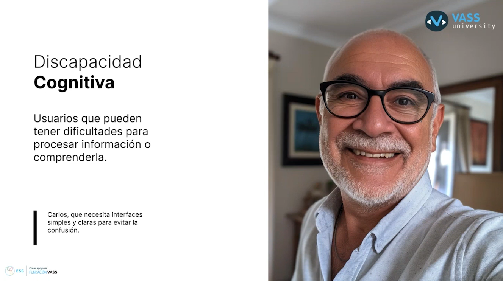

Usuarios que pueden tener dificultades para procesar información o comprenderla.

> Ejemplo:  Carlos, que necesita interfaces simples y claras para evitar la confusión.

Este grupo incluye a:

- Personas con dificultades de **aprendizaje, memoria o atención**
- Personas mayores que pueden sentirse **abrumadas por la tecnología**

Las interfaces deben ser **simples, intuitivas, claras y predecibles**.

---

### Discapacidad Motora

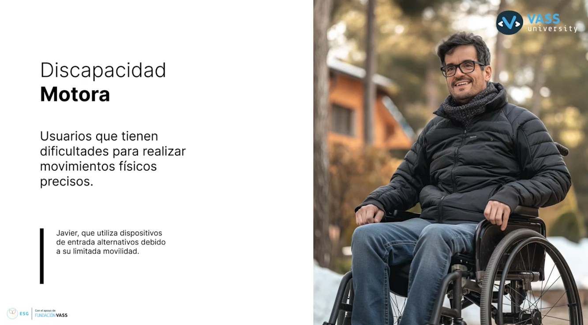

Usuarios que tienen dificultades para realizar movimientos físicos precisos.

> Ejemplo:  Javier, que utiliza dispositivos de entrada alternativos debido a su limitada movilidad.

Dificultades para usar el ratón o realizar movimientos precisos, debidas a condiciones como:

- Parálisis
- Temblores
- Lesiones temporales (ej. un brazo escayolado)

Necesitan poder navegar **solo con el teclado** o con dispositivos adaptados: punteros, soplidos, seguimiento ocular.

---

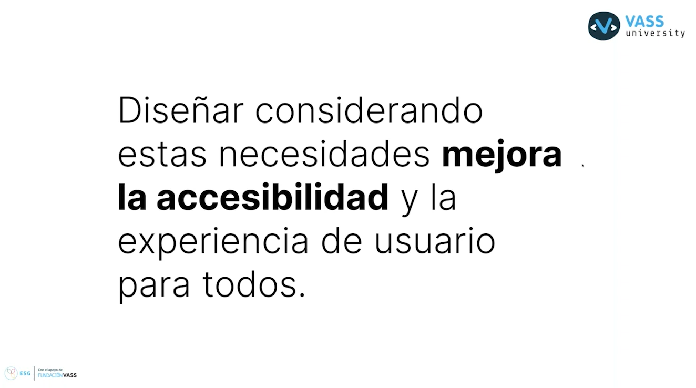

Por todo ello ... es MUY importante tener en cuenta que :

- **Diseñar considerando estas necesidades*** ... **mejora la accesibilidad y la experiencia de usuario para todos**.

---

## 4. Conceptos Fundamentales: Inclusividad, Usabilidad y Accesibilidad

### ¿Qué es la Inclusividad en Entornos digitales?

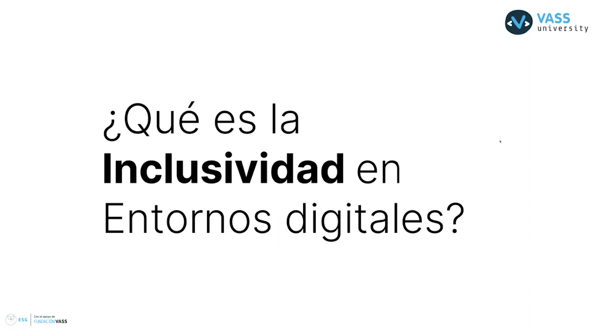

Para entender la accesibilidad hay que diferenciarla de conceptos relacionados, como si de las **capas de una cebolla** se tratara. La **inclusividad** es la capa externa.

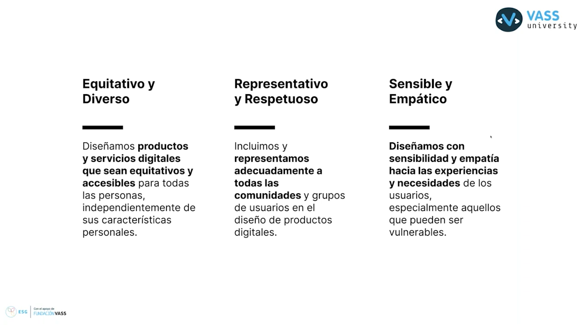

El diseño, en su capa de inclusividad, debe ser:  

* **Equitativo y Diverso = Sin crear barreras para nadie**: Diseñamos **productos y servicios digitales que sean equitativos y accesibles** para todas las personas, independientemente de sus características personales.

* **Representativo y Respetuoso = Con todos los grupos de usuarios**: Incluimos y **representamos adecuadamente a todas las comunidades y grupos** de usuarios en el diseño de productos digitales.

* **Sensible y Empático = con las necesidades de los más vulnerables**: **Diseñamos con sensibilidad y empatía** hacia las experiencias y necesidades de los usuarios, especialmente aquellos que pueden ser vulnerables.

---

### ¿Qué es la Usabilidad en Entornos digitales?

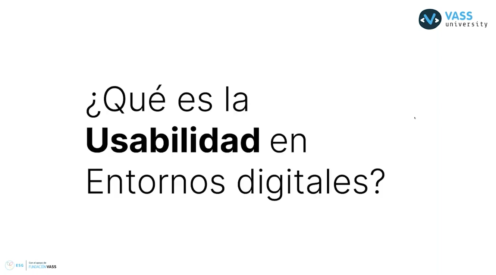

La **usabilidad** es la capa intermedia de ese mismo modelo.

> Busca que la interacción sea **eficiente, efectiva y satisfactoria**: una web usable es fácil de aprender y de usar.

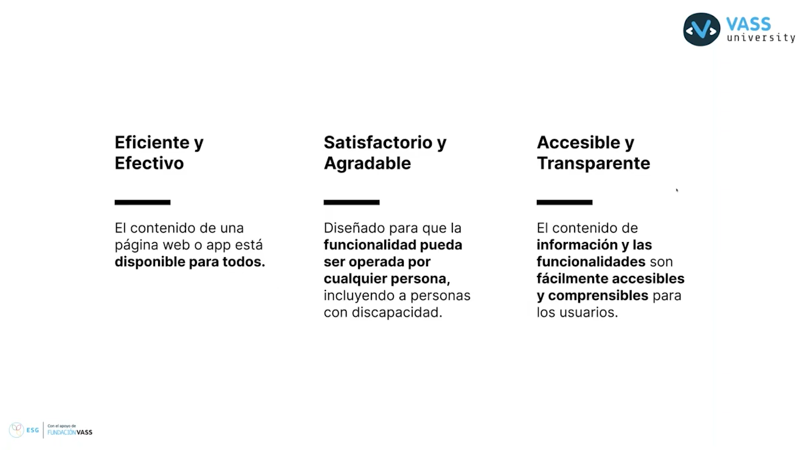

* **Eficiente y Efectivo:** El contenido de una página web o app está **disponible para todos**.

* **Satisfactorio y Agradable:** Diseñado para que la **funcionalidad pueda ser operada por cualquier persona**, incluyendo a personas con discapacidad.

* **Accesible y Transparente:** El contenido de **información y las funcionalidades son fácilmente accesibles y comprensibles** para los usuarios.

---

### ¿Qué es la Accesibilidad en entornos digitales?
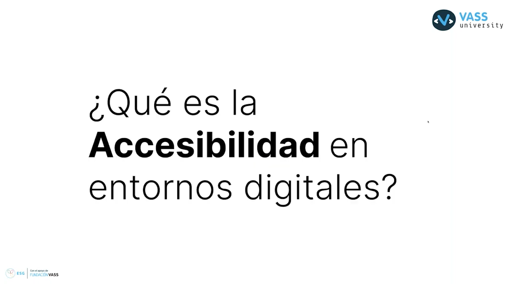

Y la **accesibilidad** es la capa interna y fundamental, la base sobre la que se sostienen la usabilidad y la inclusividad.

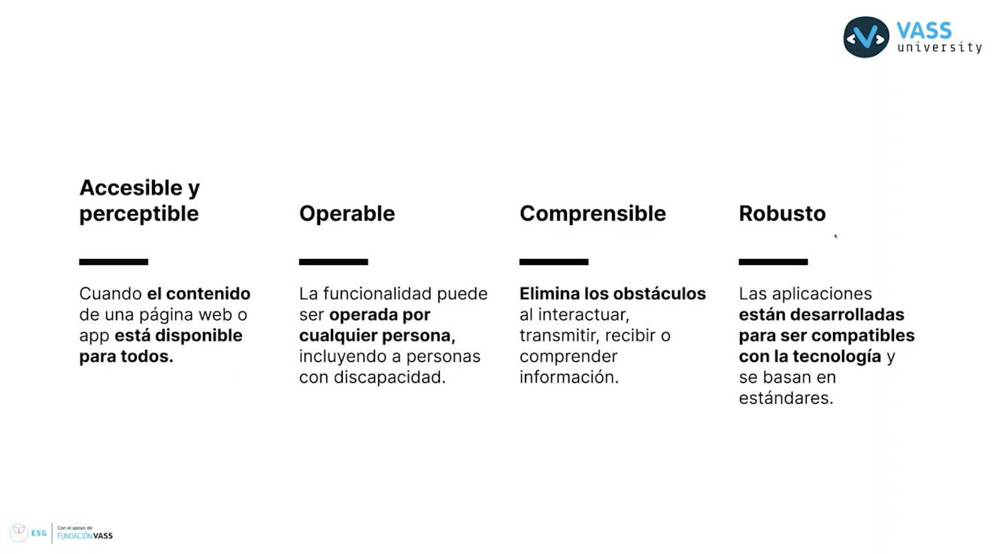

* **Accesible y perceptible:** Cuando el contenido de una página web o app está disponible para todos.
* **Operable:** La funcionalidad puede ser operada por cualquier persona, incluyendo a personas con discapacidad.
* **Comprensible:** Elimina los obstáculos al interactuar, transmitir, recibir o comprender información.
* **Robusto:** Las aplicaciones están desarrolladas para ser compatibles con la tecnología y se basan en estándares.

Se basa en los **cuatro principios POUR** de las WCAG, aplicables tanto en diseño como en código:

-   **Perceptible:** la información y los componentes deben poder ser percibidos por todos (visualmente o mediante lectores de pantalla)
-   **Operable:** deben poder utilizarse independientemente del dispositivo de entrada
-   **Comprensible:** deben ser fáciles de entender, buscando simplicidad e intuición
-   **Robusto:** el contenido debe ser interpretado de forma fiable por una amplia variedad de agentes de usuario, incluyendo tecnologías de asistencia y navegadores antiguos, algo que se logra usando **código estándar**

---

### A11Y -  ACCESSIBILITY !
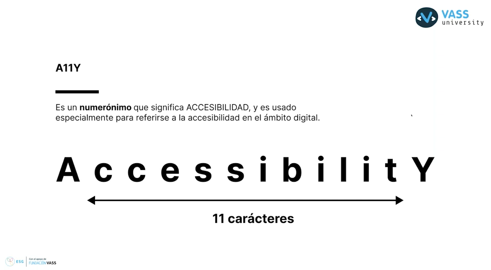

* **A11Y:**   La abreviatura estándar usada en la industria para referirse a la accesibilidad digitalEs un numerónimo que significa ACCESIBILIDAD, y es usado especialmente para referirse a la accesibilidad en el ámbito digital (Representa la palabra *Accessibility* con 11 caracteres entre la letra 'A' y la 'Y')

---

## 5. Metodología de Trabajo: La Clave del Éxito

### ¿Cómo ser más eficientes en el proceso?

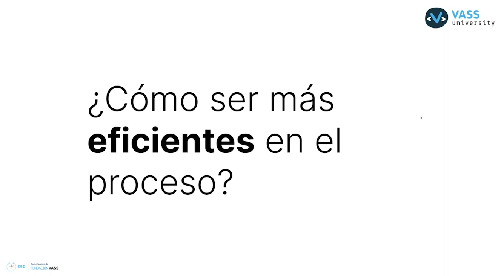

> La accesibilidad **no es una tarea final**, sino una filosofía que debe impregnar todo el ciclo de vida del producto.

#### Modelo erróneo
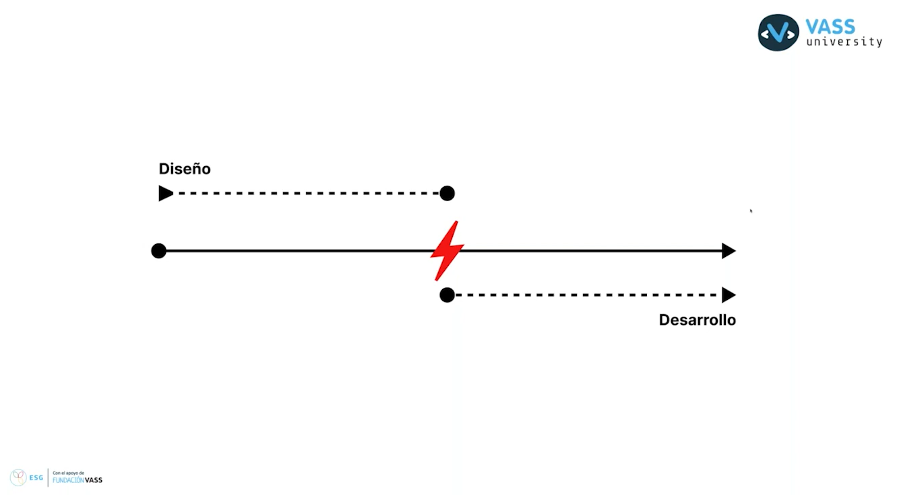

* **Diseño y Desarrollo:** Representa la separación entre los flujos de diseño y desarrollo con un punto de fricción o conflicto en el proceso.

* Es el **error tradicional del handoff**: el equipo de diseño crea unas pantallas y se las "lanza" al equipo de desarrollo.

> Esto genera malentendidos, retrabajos y productos de baja calidad, incluyendo la accesibilidad.

#### Modelo acertado
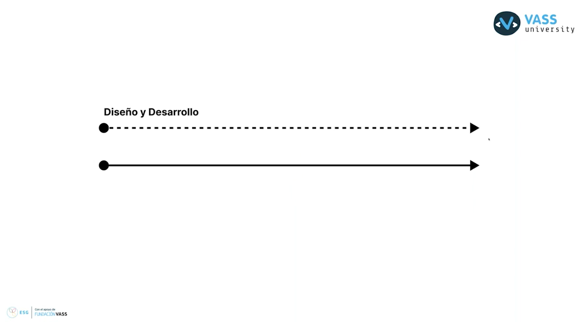

* **Diseño y Desarrollo:** Muestra la integración de ambas líneas de forma paralela y conjunta.

Frente a ese modelo, el **enfoque colaborativo** (átomo a átomo) hace que diseño y desarrollo trabajen de la mano desde el minuto cero, apoyándose en un **sistema de diseño**.

---

## Herramientas: Figma Dev Mode
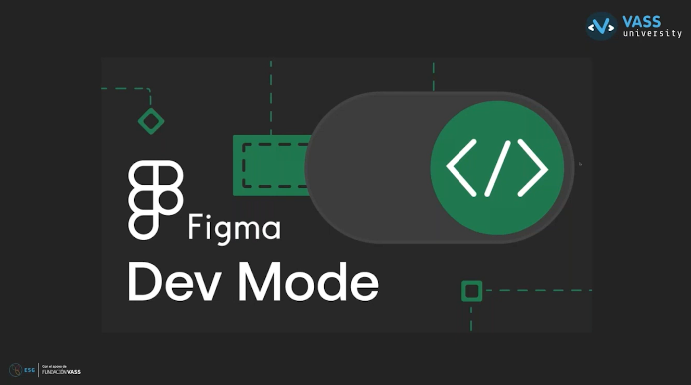

* **Figma Dev Mode:** Herramienta enfocada en conectar el diseño con el entorno de desarrollo.

Es una de las herramientas que materializa ese modelo colaborativo, facilitando que desarrollo consulte directamente las especificaciones (medidas, tokens, estados) desde el propio archivo de diseño.

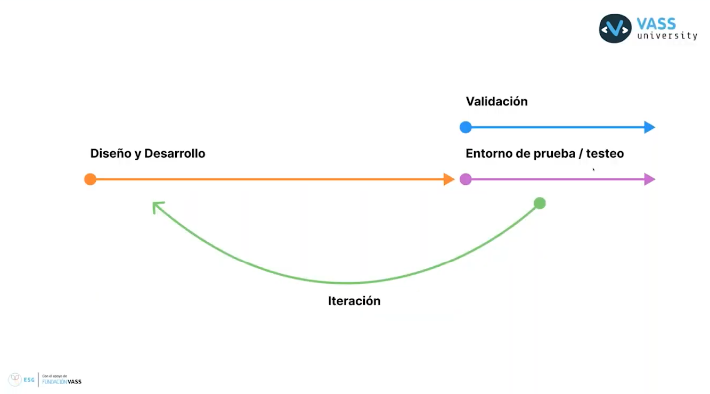

* **Diseño y Desarrollo:** Fase inicial del flujo de trabajo unificado.
* **Entorno de prueba / testeo y Validación:** Fases orientadas a la comprobación del producto.
* **Iteración:** Bucle de retroalimentación que permite regresar el proceso hacia el diseño y desarrollo.

Es el ciclo completo del enfoque atómico visto en el caso de éxito de banca digital:

**Diseño y Desarrollo** → **Testeo y Validación** → **Iteración** (vuelta al inicio)

---

## 6. Guía Práctica: Principales Errores y Cómo Solucionarlos

### ¿Cuales son los errores más comunes?

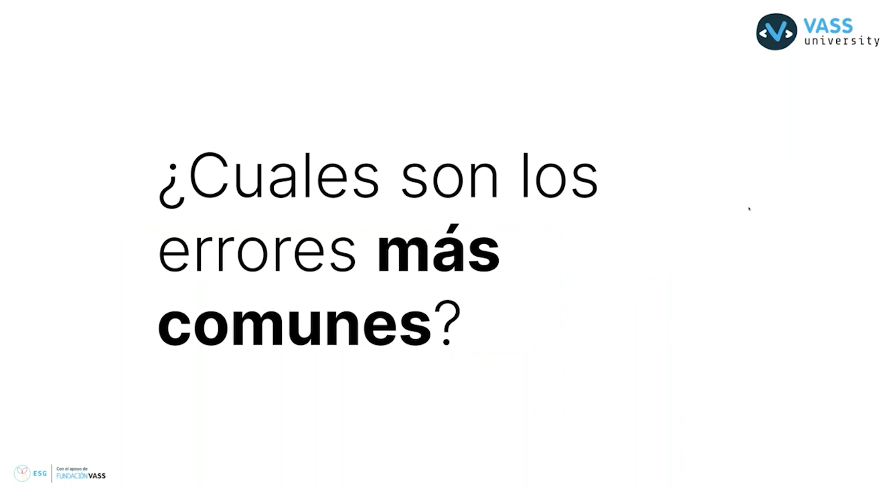

> Una vez corregidos, **mejoran exponencialmente** la accesibilidad de un sitio web.

#### Texto de Bajo Contraste
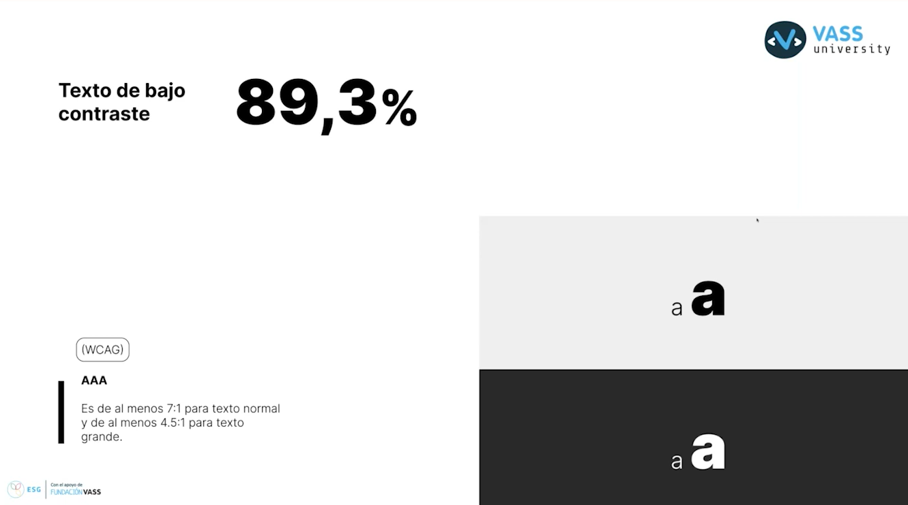

* **Texto de bajo contraste:** 89,3%
* **WCAG AAA:** Es de al menos 7:1 para texto normal y de al menos 4.5:1 para texto grande.

Es el error **más frecuente**.

- **Ratio mínimo WCAG AA:** 4.5:1 para texto normal
- **Ratio WCAG AAA:** al menos 7:1 para texto normal, 4.5:1 para texto grande
- **Solución:** asegurar que el texto y los elementos interactivos cumplen ese ratio con el fondo

---

#### Texto alternativo de imagen faltante

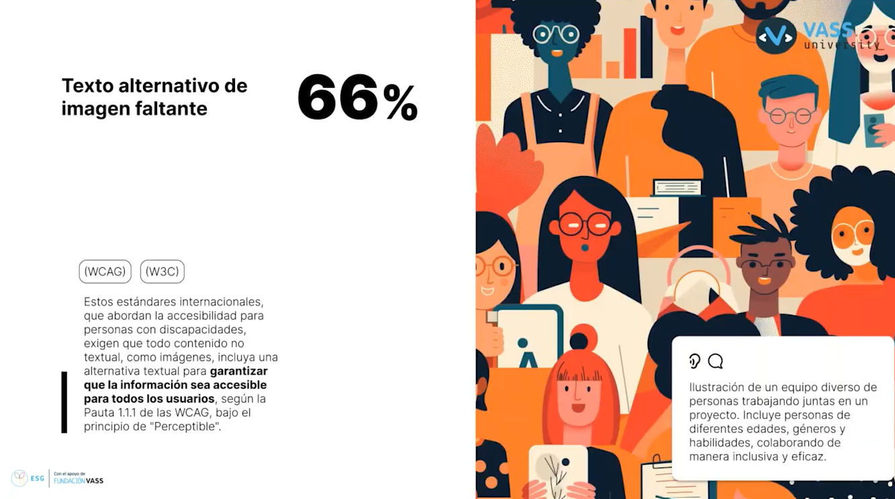

* **Texto alternativo de imagen faltante:** 66%
* **WCAG / W3C:** Estos estándares internacionales, que abordan la accesibilidad para personas con discapacidades, exigen que todo contenido no textual, como imágenes, incluya una alternativa textual para garantizar que la información sea accesible para todos los usuarios, según la Pauta 1.1.1 de las WCAG, bajo el principio de "Perceptible".

- **Referencia normativa:** Pauta 1.1.1 de las WCAG, principio "Perceptible"
- **Solución:** incluir el atributo `alt` en todas las imágenes (``), describiendo la función o el contenido de la imagen, para que los lectores de pantalla puedan transmitir esa información a personas ciegas

---

#### Link vacíos

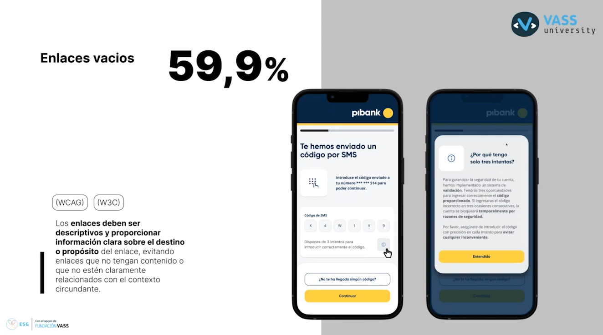

* **Enlaces vacíos:** 59,9%
* **WCAG / W3C:** Los enlaces deben ser descriptivos y proporcionar información clara sobre el destino o propósito del enlace, evitando enlaces que no tengan contenido o que no estén claramente relacionados con el contexto circundante.

- **Solución:** los enlaces y botones deben tener un texto descriptivo ("Leer más sobre..." en lugar de un simple "Click aquí")
- Si usan iconos, estos deben llevar una **etiqueta textual asociada** para los lectores de pantalla

---

### Falta de etiquetas de entrada a formulario

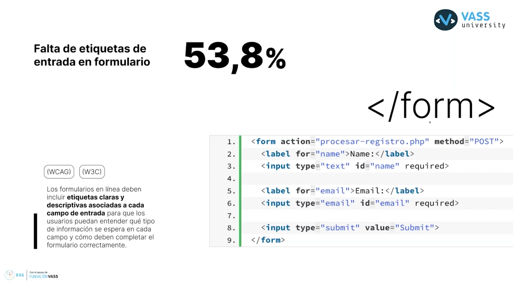

* **Falta de etiquetas de entrada en formulario:** 53,8%
* **WCAG / W3C:** Los formularios en línea deben incluir etiquetas claras y descriptivas asociadas a cada campo de entrada para que los usuarios puedan entender qué tipo de información se espera en cada campo y cómo deben completar el formulario correctamente.

- **Solución:** cada campo de formulario debe tener una etiqueta (`<label>`) asociada semánticamente mediante el atributo `for`, que coincida con el `id` del campo
- Esto es **crucial** para que los lectores de pantalla sepan qué información deben introducir — como ya se veía aplicado en las pantallas del caso de éxito bancario (Diapositiva 11)

---

#### Botonves vacíos

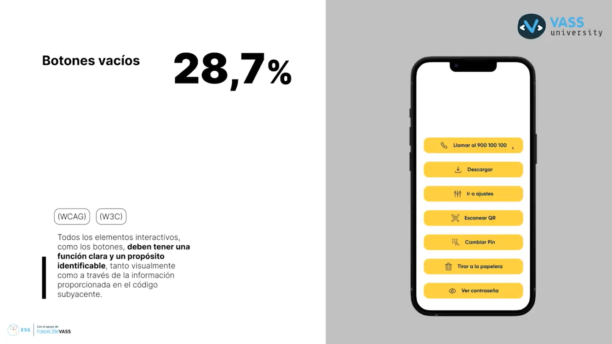

* **Botones vacíos:** 28,7%
* **WCAG / W3C:** Todos los elementos interactivos, como los botones, deben tener una función clara y un propósito identificable, tanto visualmente como a través de la información proporcionada en el código subyacente.

Es la misma lógica que los enlaces vacíos: un botón sin texto ni etiqueta accesible impide que las tecnologías de asistencia comuniquen su función.

---

### Falta el idioma del documento

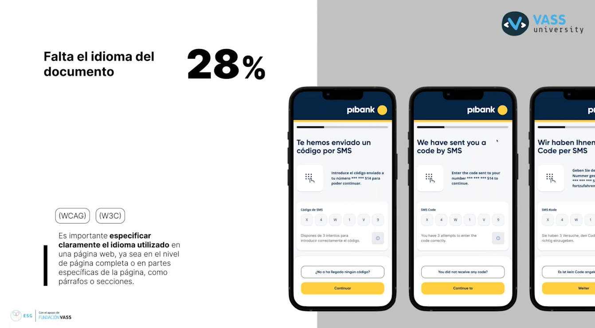

* **Falta el idioma del documento:** 28%
* **WCAG / W3C:** Es importante especificar claramente el idioma utilizado en una página web, ya sea en el nivel de página completa o en partes específicas de la página, como párrafos o secciones.

- **Solución:** declarar el idioma principal de la página en la etiqueta `<html>` (ej. `<html lang="es">`)
- **Por qué importa:** es vital para que los lectores de pantalla apliquen la pronunciación correcta y los traductores automáticos funcionen bien

---

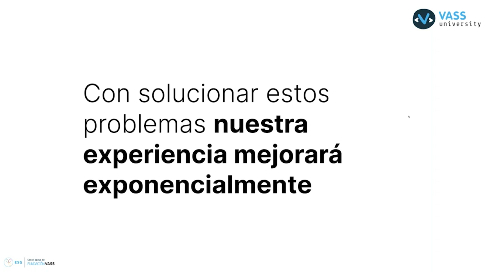

Con solucionar estos problemas **la experiencia mejorará exponencialmente**.

Corregir estos **seis puntos** resuelve la mayoría de los problemas de accesibilidad detectados en auditorías reales:

  1. Contraste
  2. Texto alternativo
  3. Enlaces vacíos
  4. Formularios sin etiquetar
  5. Botones vacíos
  6. Idioma del documento

---

## 7. Herramientas y Recursos para el Día a Día

> Bloque de herramientas para perfiles de diseño, trabajadas principalmente en **Figma**.

### ¿Cómo puede un diseñador mejorar en accesibilidad?

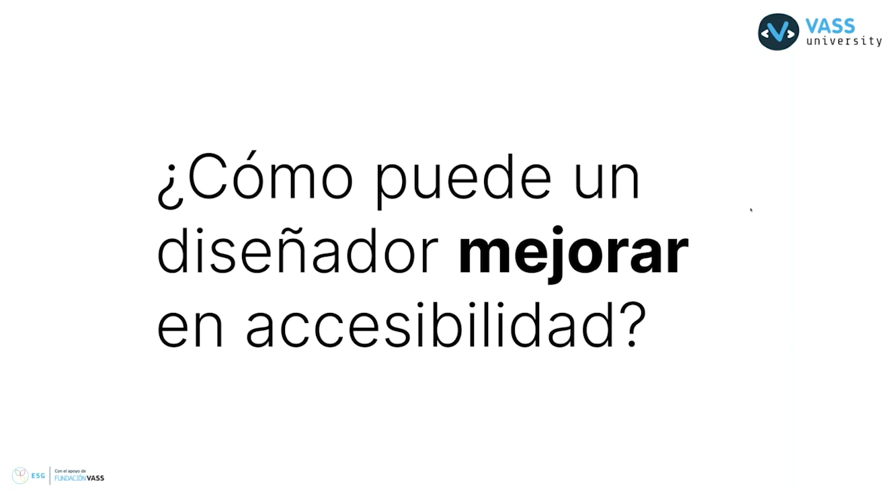

#### Usuarios en el centro de todo

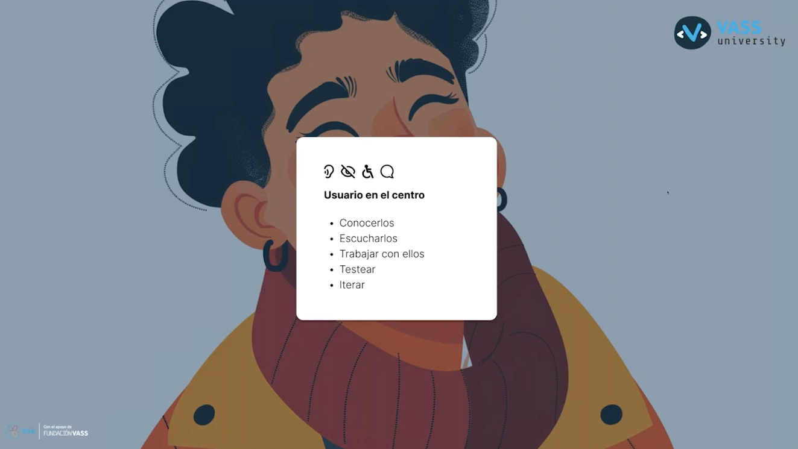

Antes de las herramientas concretas, el punto de partida para un diseñador es el mismo enfoque centrado en el usuario visto en la sección de diversidad funcional:

* **Usuario en el centro:**

  - **Conocerlos** → **Escucharlos** → **Trabajar con ellos** → **Testear** → **Iterar**

---

### FIGMA PLUGINS

####  Stark - Contrast & Accessibility Tools
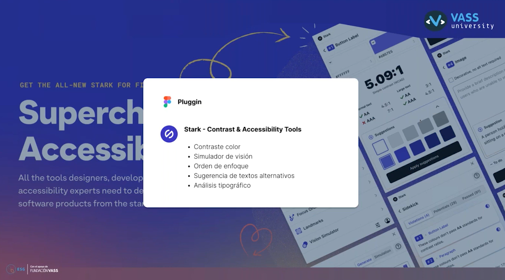

* **Stark - Contrast & Accessibility Tools:**
  * Contraste color
  * Simulador de visión
  * Orden de enfoque
  * Sugerencia de textos alternativos
  * Análisis tipográfico

**Stark** es un plugin muy completo que:

  - Calcula el **contraste de color**
  - Simula diferentes tipos de visión (daltonismo, baja visión)
  - Comprueba el **orden de enfoque**
  - Sugiere **textos alternativos**

---

#### Adee Comprehensive Accessibility Tool

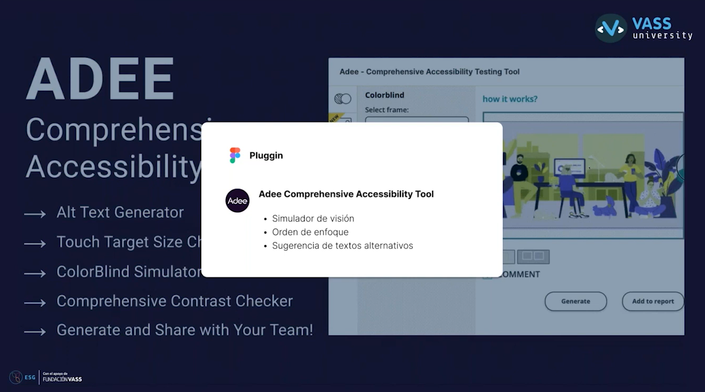

* **Adee Comprehensive Accessibility Tool:**
  * Simulador de visión
  * Orden de enfoque
  * Sugerencia de textos alternativos

Es una alternativa a Stark dentro del ecosistema de plugins de Figma orientados a accesibilidad, con funciones equivalentes de **simulación de visión**, **orden de foco** y **sugerencias de texto alternativo**.

---

#### Adee - Accessibility Tools, Contrast Check & Code Generator

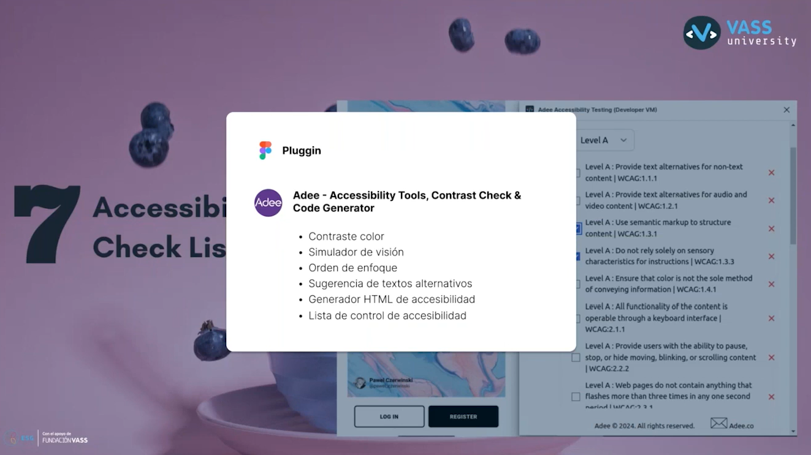

* **Adee - Accessibility Tools, Contrast Check & Code Generator:**
  * Contraste color
  * Simulador de visión
  * Orden de enfoque
  * Sugerencia de textos alternativos
  * Generador HTML de accesibilidad
  * Lista de control de accesibilidad

Esta versión más completa de Adee añade dos capacidades extra:

- **Generador de HTML accesible**
- **Checklist de accesibilidad integrada**

Funcionalidad equivalente a la que ofrecen otros plugins especializados como los de verificación de contraste, orden de foco y anotaciones de accesibilidad, que permiten comunicar requisitos directamente al equipo de desarrollo desde el propio diseño.

---

### Buenas prácticas

#### ¿Cómo puede un desarrollador web mejorar la accesibilidad?

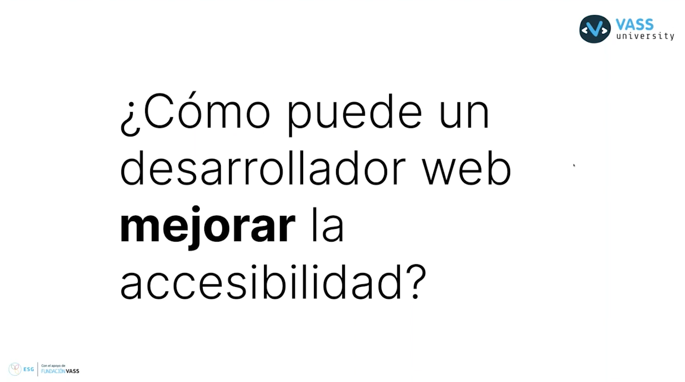
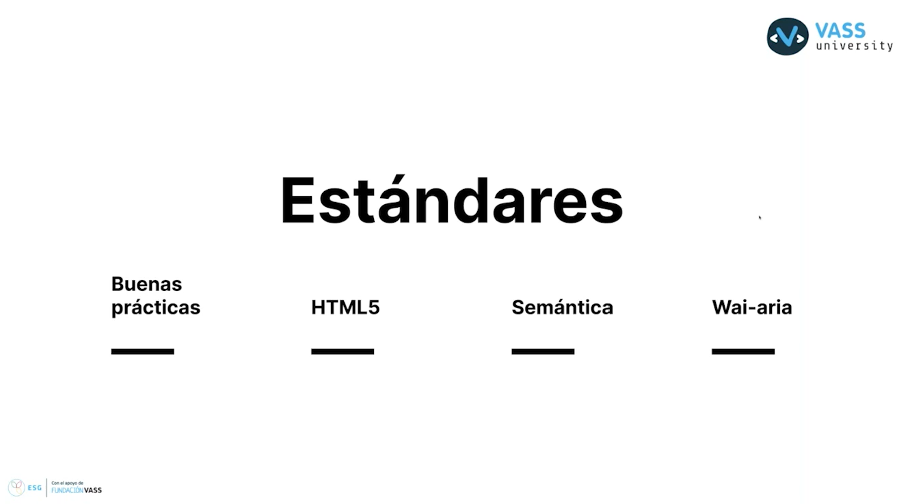

* **Estándares:**
  * Buenas prácticas
  * HTML5
  * Semántica
  * Wai-aria

Usar la etiqueta correcta para cada propósito (`<header>`, `<nav>`, `<main>`, `<article>`, `<button>`, etc.) ya resuelve el **80%** de los problemas de accesibilidad.

> El HTML bien hecho es accesible por naturaleza.

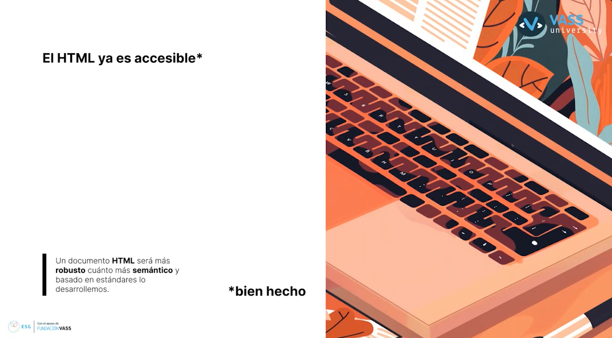

* **El HTML\* ya es accesible** (*bien hecho)
* Un documento HTML será más robusto cuánto más semántico y basado en estándares lo desarrollemos.

- El HTML nativo, bien estructurado, ya cumple gran parte de los requisitos de accesibilidad sin necesidad de añadidos, **y esa semántica correcta es la base del principio *"Robusto"* de POUR.**

---

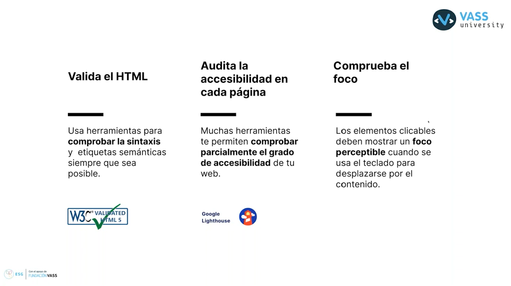

* **Validar el HTML:** Usa herramientas para comprobar la sintaxis y etiquetas semánticas siempre que sea posible
  
  - **Validador del W3C:** herramienta fundamental para verificar que el código HTML es correcto y no tiene errores de sintaxis o estructura

* **Audita la accesibilidad en cada página:** Muchas herramientas te permiten comprobar parcialmente el grado de accesibilidad de tu web.

* **Comprueba el foco:** Los elementos clicables deben mostrar un foco perceptible cuando se usa el teclado para desplazarse por el contenido.
  - **Foco visible:** todos los elementos interactivos deben tener un estado de foco visible (un borde, un cambio de color), asegurando que se puede navegar por toda la página usando **solo la tecla Tabulador**

---

### Algunas herramientas má

#### Lighthouse ( Google Chrome extension)

**Lighthouse**, la extensión de Chrome de Google, audita automáticamente la página y ofrece informes detallados sobre rendimiento, buenas prácticas y accesibilidad, señalando errores concretos y cómo solucionarlos.

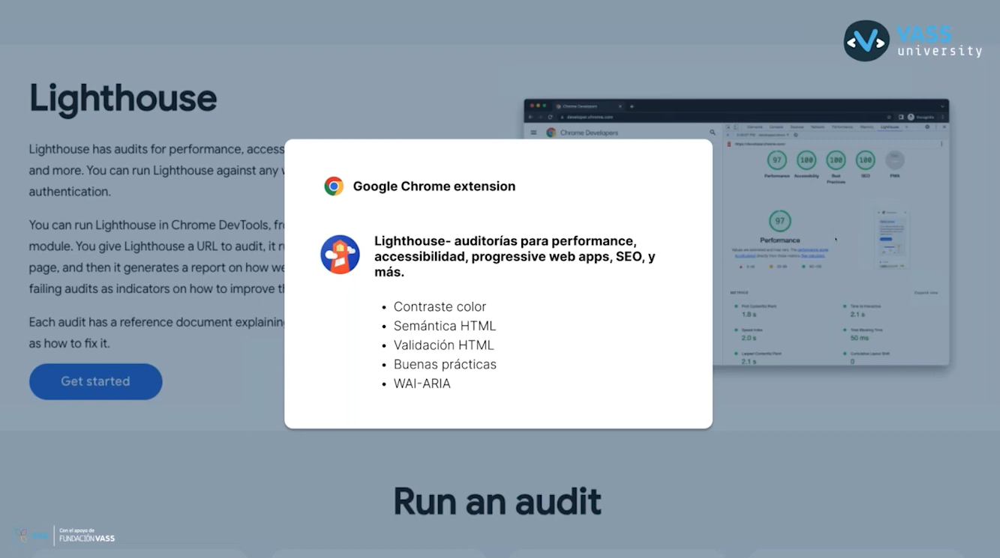

* **Lighthouse - auditorías para performance, accesibilidad, progressive web apps, SEO, y más:**
  * Contraste color
  * Semántica HTML
  * Validación HTML
  * Buenas prácticas
  * WAI-ARIA

---

#### MAGENTA A11Y

**Magenta** es un recurso web que detalla los requisitos de accesibilidad para cada componente HTML y ofrece tutoriales sobre cómo testear.

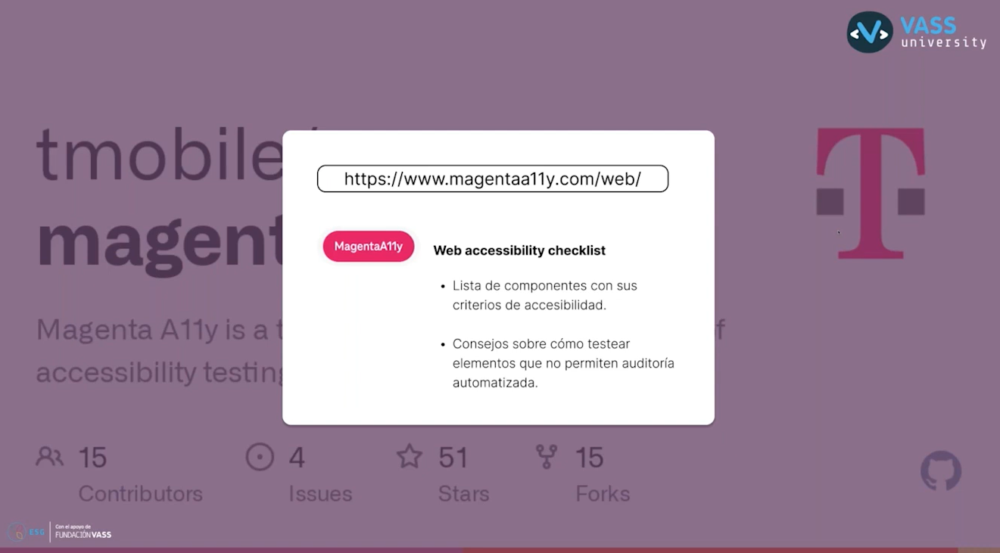

* **Magenta A11y (Web accessibility checklist):**
  * Lista de componentes con sus criterios de accesibilidad.
  * Consejos sobre cómo testear elementos que no permiten auditoría automatizada.

Se complementa con el **testeo manual**, imprescindible:

- Probar la web solo con el **teclado**
- Usar un **lector de pantalla** (como NVDA o VoiceOver)

> Son las pruebas más fiables.

---

#### WAI-ARIA ( especificación )

Se usa para añadir semántica adicional cuando el HTML nativo no es suficiente, especialmente en aplicaciones dinámicas con JavaScript.

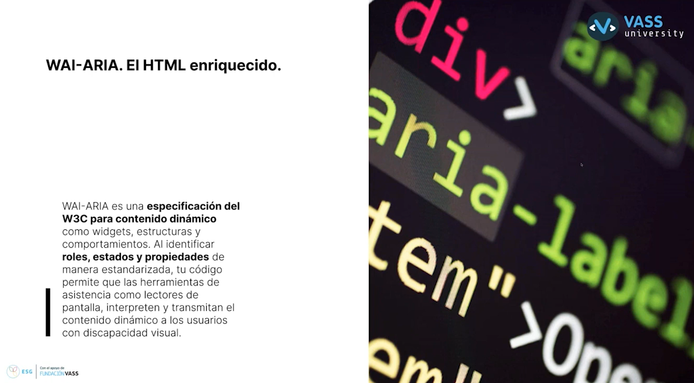

* **WAI-ARIA. El HTML enriquecido**:

  - WAI-ARIA es una **especificación del W3C para contenido dinámico** como widgets, estructuras y comportamientos.
  - Al identificar roles, estados y propiedades de manera estandarizada, tu código permite que las herramientas de asistencia como lectores de pantalla, interpreten y transmitan el contenido dinámico a los usuarios con discapacidad visual.

> Un mal uso de ARIA puede ser **peor que no usarlo**, ya que anula el comportamiento nativo del HTML.

---

## 8. Conclusiones Finales

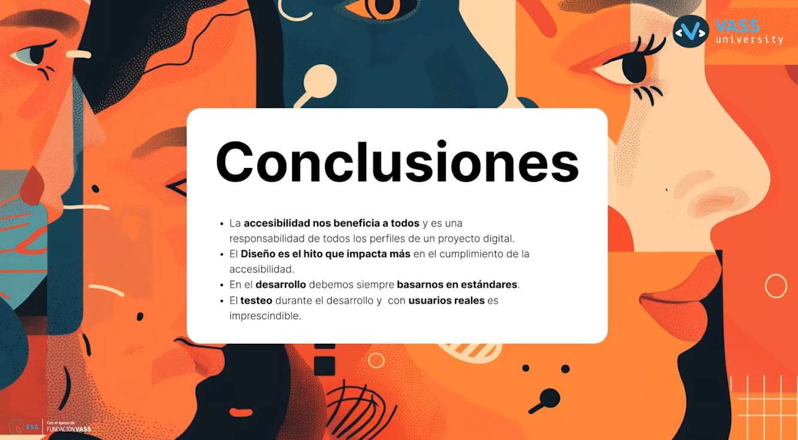

* **Conclusiones**

  * La **accesibilidad nos beneficia a todos** y es una responsabilidad de todos los perfiles de un proyecto digital.
  * El **Diseño** es el hito que **impacta más** en el cumplimiento de la accesibilidad.
  * En el **desarrollo** debemos siempre **basarnos en estándares**.
  * El **testeo** durante el desarrollo y con **usuarios reales** es **imprescindible**.

- **Beneficia a todos:** mejora la vida de las personas con discapacidad y la experiencia de cualquier usuario en situaciones cotidianas

- **Es responsabilidad de todos los perfiles:** desde la definición del proyecto hasta el desarrollo y el testing — no es tarea exclusiva de los desarrolladores

- **El diseño es el punto de partida:** la accesibilidad debe planificarse desde el primer boceto, no esperar a que "el desarrollo la arregle"

- **Los estándares son la mejor guía:** WCAG, HTML semántico correcto y herramientas de validación son el camino más corto y seguro

- **Testear con usuarios reales es fundamental:** ninguna herramienta automática puede sustituir la experiencia y el feedback de una persona que utiliza tecnologías de apoyo a diario
