# 03-024: Three Practical Approaches to Task Management

One of the most common questions that I get asked is how to properly manage tasks on a day-to-day basis, and this can come from the perspective of a developer, an employee, an entrepreneur, or simply a lifelong learner.

---

All of us have a wide-ranging set of tasks that we have to get accomplished on a daily basis, and being able to properly manage those can be quite challenging. So, what we're going to walk through in this guide are a number of potential solutions for how to build out a task management system.

The reason why I'm going to give you multiple options is because it's been my experience that I might go with one approach for a few months or even a few years, and it works well. But I'm continually adapting it because everything in our lives changes, and we ourselves change and adapt. Therefore, it makes sense that the way we manage our day-to-day tasks should also adapt over time.

Now, the very first thing we're going to do is talk about the **primary goal** of being able to manage tasks.

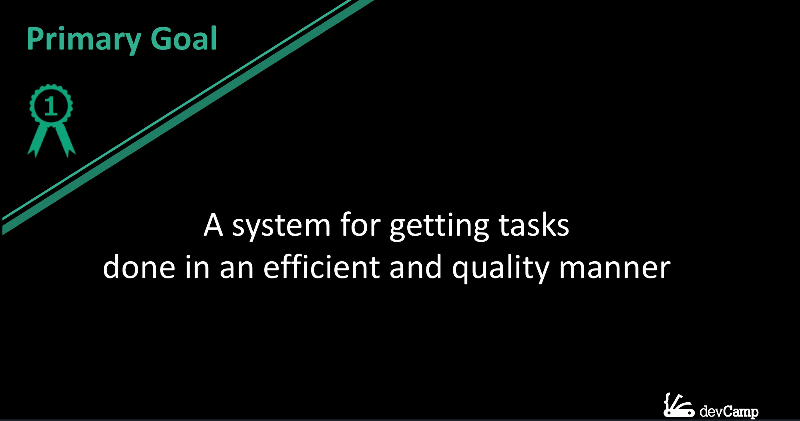

And then we're going to walk into the formal definition and see what this represents, and that's going to help lead the way for what our system is going to look like.

So, the primary goal for task management or building this type of system is that it is a system for getting tasks done in an **efficient** and **quality** manner. I picked out the wording for this in a very intentional way, and it's because there are three components that we can analyze here.

First, **tasks have to get done**. That may seem like a common-sense kind of approach; however, how many tasks do you have that have simply been sitting in your inbox to get done for a long period of time, and you've procrastinated through them, and they simply haven't gotten done? I know that that is something that I'm definitely guilty of. So, the very first item on the agenda with any task management system is that it helps you achieve this first goal of going from start all the way through finish on a task.

Now, some of these tasks might be very simple. It may be as easy as clearing out your inbox, or it could be a task that is actually something that lasts for six months, such as building out an entire web application. So, the task size can vary, but the goal is always the same: you should be able to take it from start all the way through finish.

Now, we have two other components here. The next is that we want to do things in an **efficient** manner. This means that we limit the amount of wasted time and resources, and our system should help us achieve that goal. And then lastly, these items should be done in a **quality** manner. So, with these three components—completion, efficiency, and quality—if you can build your system to help you achieve each one of these goals, then you're going to be in very good shape, regardless of what the tasks are. Those are three components that you always want to get done.

Now, I'm going to go into the definition from Wikipedia, not to bore you, but instead to help give us a framework for what a task management system really should contain.

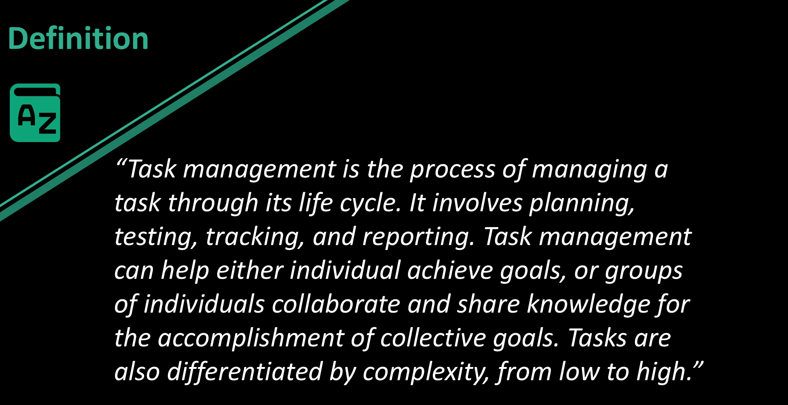

So, it says that "Task management is a process of managing a task through its lifecycle. It involves planning, testing, tracking, and reporting. Task management can help either individuals achieve goals or groups of individuals collaborate and share knowledge for the accomplishment of collective goals. Tasks are also differentiated by complexity from low to high."

Now, I want to highlight a few key words here:

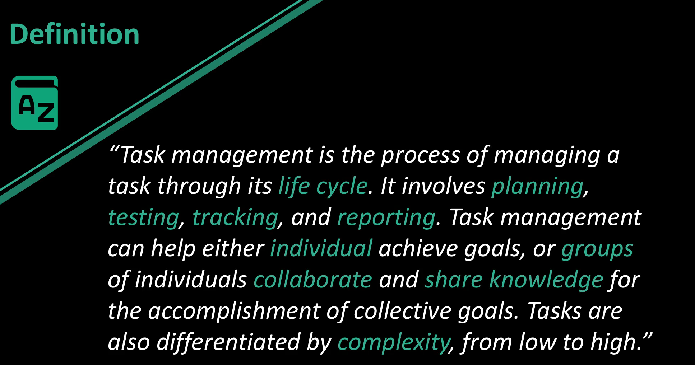

And those are **lifecycle**, **planning**, **testing**, **tracking**, **reporting**, **individual goals**, **group goals**, **collaboration**, **sharing knowledge**, and **complexity**. The reason why I picked out these words is because they go into all of the different elements that a task management system should really contain.

Now, a few of those are optional. So, if you do not work with a team, then collaboration and sharing knowledge may not be a big priority, and so whatever system you use won't have to have those components. But in general, each one of these keywords is necessary in order to build out a fully functional task management system. So, now that we've taken a high-level view of task management, let's talk about some of the pros and cons.

So, in the **pro** category:

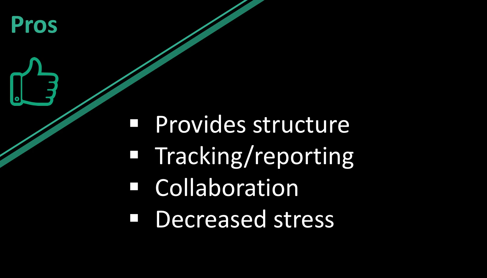

A properly structured task management system is great because it helps to provide structure and organization. It allows you to perform tracking and reporting. It allows for collaboration, and one of my favorite pros is that it **decreases stress**. Research shows that one of the top causes for stress and anxiety in individuals is uncertainty.

And so, if you as an individual have a high level of uncertainty about the tasks that you're working on, that is going to be a very significant cause of stress in your life. So, what a task management system should do—one of the top goals—is to provide a level of structure and also to decrease uncertainty. So, whenever you have been able to properly outline and structure your goals on a daily basis, that should give you a level of certainty because it tells you exactly what you want to get done on a day-in, day-out basis.

Now that we've talked about the pros, let's mention a few of the **cons**.


One is that there is **additional setup time**. There is no way around this. If you want to properly implement a task management system, you're going to have to dedicate and allocate the time needed in order to build it properly and then also to maintain it. I personally spend anywhere between 10 and 30 minutes a day working through and planning out my activities. And this is very common in pretty much every task management system I've ever implemented. So, you are going to have to have that time sliced out of your day. Now, also, there can be a **learning curve**. So, depending on the type of system that you want to implement, there are various things that you're going to have to learn in order to build it out properly.

I do not think that either of these cons detract enough to say that you shouldn't have some form of task management system. And what we're going to do is go through three options, and these are three systems that I have personally used throughout the last few years, and each one of them has proven to be very effective.

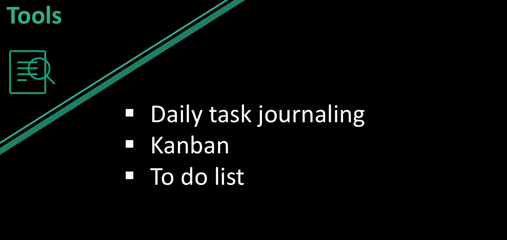

The three that we're going to talk about are going to be **daily task journaling**, **Kanban**, and then a **traditional to-do list**. In the first case study, we're going to go with daily task journaling, and the example that I'm going to use is from a company called [Best Self Co](https://bestself.co/). I've used their service for a while, and it is a system where they print and structure an entire journal. This small book, and they send you a new one every 12 weeks. It is a paid service, but each one of the components that are included can be something that, if you do not want to pay the money but you still want to implement daily task journaling as your system, then you can do all of this yourself completely for free.

I'm simply going to walk through their structure because there were a number of benefits, and I got quite a bit out of it when I was going through their system. Every daily task journaling system is a little bit different, and so what I want to do is include some of the more popular elements, and then you can always pick and choose which one of these items you can include into your own daily routine.

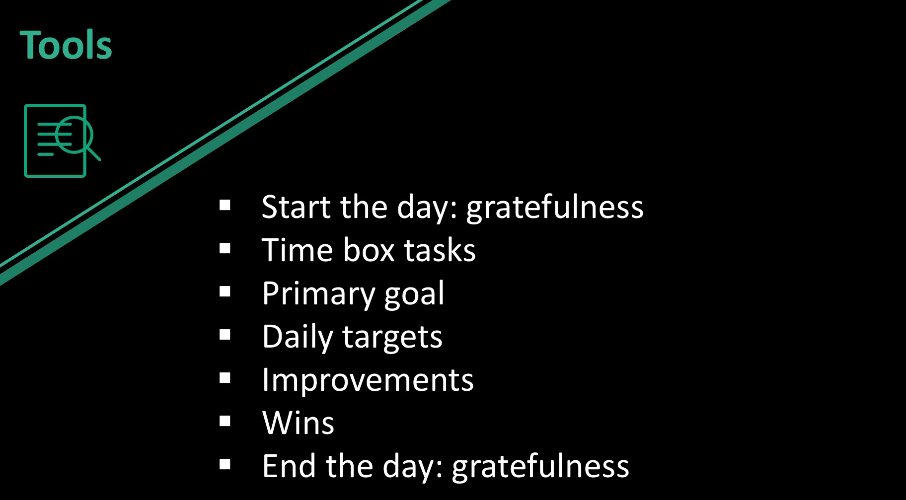

What they had is that you always start off the day listing off what you're grateful for. Now, this is not something that they invented. In fact, I've heard a number of popular entrepreneurs, such as **Arianna Huffington**, who does this exact thing every day when she wakes up. She lists off three things that she's grateful for before she has opened her phone to look at emails, before she's done anything else. In her description of the process, she said that it allowed her to start her day with the right mindset instead of diving right into any tasks that could potentially increase stress and anxiety.

It instead allowed her to start with the mindset of being happy and being able to be thankful for the best parts of her life. And then, if you look down at the very end of the list, you also do the same task. So, at the very end of the day, you list off three things that you are grateful for. Research has shown that by doing this at the end of the day, it actually helps to decrease anxiety and stress and promote better sleep.

So, inside of that list, we have a number of other elements, such as **time boxing tasks**, **setting a primary goal**, **setting up the daily targets**, **talking about at the end of the day what kind of improvements you could have made to that day**, and this is one of my favorite components about the daily task journaling. You don't simply treat your to-do list as something that you either achieved or you didn't achieve. So, if you had 10 items on the to-do list and you only got through seven of them, instead of treating that like a failure—because then you're going to personally feel like a failure—this approach looks at the list and analyzes any improvements that you could have made.

Imagine that you were in a sports team, and your team just lost. You don't treat the entire season as a loss. At the very end of the game, you get with the coach, and you walk through how you could have improved that day. And the thing that I love about this is that I've seen many times in my own personal life where I didn't take this kind of approach, where I didn't look and see how I could improve what I did that day. And the issue that I ran into was that each day that I didn't do that, that I didn't try to walk through and analyze how I could improve, those issues carried on.

So, in other words, if I procrastinated, for example, and I didn't complete a number of tasks because I simply didn't feel like doing them, instead of analyzing that and seeing how I could improve at the end of the day, that same procrastination kind of attitude was prolonged, and it went into the next day and the day after that. And I don't know, maybe it's just my own personal experience, but I think that there are other people out there who experience the same exact thought patterns. And just as important as looking over your day and seeing how you could have done better is also looking over your day and seeing what your **big wins** are.

So, this is something where you can brag a little bit to yourself on the things that you were happy with. And so, the way that the journal actually looks—and this is a verbatim screenshot or a picture of my journal when I was going through it:


On the left-hand side there, you can see that all of my tasks for the day were time-boxed, and it went from 6:00 a.m. all the way through 9:00 p.m. So, right there, I listed out every single task that I had to do, and this includes your entire life. So, if you are in school or if you are working in a job, you don't simply list the elements that are related to your school or work; instead, you list everything out.

As you notice, I included my workout, I included my general tasks, I included lunch, and all of those elements. And as you can see, every moment of the day is spoken for, and that is something that is very important because one thing that I've experienced is that if I have a portion of my day that I have not allocated for some task, then when I get to that time, there can be some confusion, or it can even lead to procrastination or me not spending my time in an effective manner.

Now, one process that I found incredibly effective was the **notes section** on the right-hand side there. As you can see, that lined up with a number on the tasks side. They have a task on the left-hand side, and then they have some notes on the right-hand side. I started to notice a trend where I would work through various projects, and then when it came to the next day, it would take me a little while to pick up where I left off. So, say it was a code project; I may have had a fantastic day the day before building out a feature, but I didn't know where to start on the next feature. And so, what I used the notes section for is I simply gave myself a few keywords there.

As you can see at the very top, I was building out the Daily Smarty web application, and on this particular day, on the 24th of 2017, the next feature that I knew I was going to have to build out was the Twitter authentication system for Daily Smarty. What that was enabling me to do was, when I started to write out the tasks for my very next day, I instantly knew where I needed to start. So, when I woke up the next morning and I started working on that Daily Smarty application, I didn't have to go through and look at the code that I pushed up the last day and look at where and then try to decide where I was going to start.

Instead, I simply was able to look at those few little notes I wrote down, and I instantly knew where to start on the new application. And so, that is something that's very helpful. And I've seen that help not just myself but other developers that I've worked with. Being able to help yourself out because, as much as you may think at the time that you're going to understand exactly where you left off and you're going to be able to just start the next day running, if you don't give yourself that information and give yourself some hints on where to start off, then you're going to end up wasting time simply going back and trying to figure out what you need to do for that next day. So, make sure that what you're trying to achieve is specific and that you're also helping yourself out as you go through and complete the tasks.

Now, on the bottom on the left-hand side and the right-hand side, you can see that that is where you list off what you're grateful for, both when you wake up and when you go to bed. Moving to the top right-hand side, every day has an overarching **main goal** for the day. So, you try to pick out your one top item that simply needs to get done. Something that is very popular in the goal-setting community is making sure that you properly prioritize your goals. So, if you're working for a company and you have one feature that you need to build that day, make sure that that is your top goal, and also make sure that you start that day by attacking the most important item. So, make sure that you're prioritizing not just your goals but also your time in a way that reflects that.

Now, moving down a little bit, you can see that the other item is the **target list**. So, you have your goal; you can think of that as your strategy—it's what you want to get done that day. Now, your targets—this can be a tactical approach. So, this can be a set of to-do items that could list out the steps that are needed in order to achieve that goal. And the book gives a few little hints, such as right there in the parentheses, where it says, "What will make today a win for you?"

That is very important. There are many times when I haven't been good with setting up a task management system where I didn't properly establish what a win for me that day meant, and so I could have had an incredibly successful day by most standards, but because I didn't establish that in my mind and I didn't write down what a win looked like for that day, when the end of the day came, I would be a little uncertain and therefore stressed and anxious on if I was good that day or not. And so, that is important to list that out. So, at the very end of the day, you can look at it and see if it was a good day or a day that you need to improve on.

Moving down the page, you can see the next group of content lists out the **lessons that you learned** that day. So, say that you procrastinated on a task; don't simply say, "Oh, I procrastinated on this task." List out why that occurred. Imagine that you are coaching somebody else, so imagine that you have a student, and you are trying to help them be as efficient and productive as possible. And you saw that they procrastinated that day; walk through the causes of the procrastination. Was it a topic that was intimidating for you? Was it something you needed more information on? Analyze the cause of it, and then that can help lead you to improving on it.

So, in lessons learned, don't simply say, "Oh, I was bad at x, y, and z this day." Instead, say, "I struggled with these tasks for this reason, and this is how I think I could improve on that tomorrow."

Moving down to the very last item, this is the fun one: this is the set of **wins for the day**. Make sure that you always list out the best parts of your day and how you were successful. Because that's going to help give you confidence, and it also gives you a nice log where you can look back and see all of the wins that you had. So, any time that you built out a feature successfully or you understood a topic that you're studying, this is where you should list that in your daily journal. And that's my approach for using daily task journaling.

If you are someone who really enjoys working with pen and paper, this can be a great option for you. One item that you may note is that this is not the most collaborative approach. So, if you're working with a team on projects, this by itself is not going to be the best option for you. This is something that is more focused on helping you as an individual.

Now, we're going to move on to a task manager system that you can use as an individual or in a group in collaborative settings. And that is a **Kanban** approach. A Kanban is a project management methodology that's been used for several decades and has become incredibly popular in a number of different industries, and so we're going to walk through a few variations of that.

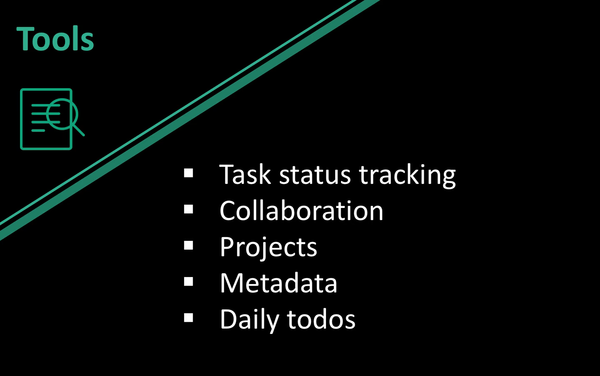

We're going to see how we can use it for daily status tracking, for collaboration, how we can use it for projects both for yourself and for groups, and also how you can leverage this kind of tool for adding metadata and other kinds of associated content and helpful items like that into your daily workflow.

---


For this walkthrough we're going to jump into the browser and we're going to work with the [Trello](https://trello.com/?aceid=&adposition=1t1&adgroup=45883604321&campaign=817711909&creative=230348617886&device=c&keyword=trello&matchtype=e&network=g&placement=&ds_kids=p20478354863&gclid=EAIaIQobChMI9q3L_a2h2QIVD3R-Ch1U7wwFEAAYASAAEgJd0vD_BwE&gclsrc=aw.ds) software.

And so Trello is a free tool to use, they have paid options. If you're working on a small enough team then it is free and especially if you're just using it for your own purposes then it's completely free and you can see a very different approach here compared with the daily task journalling. 


And in addition to that we're going to go through three examples. I have a number of Kanban boards that I work with individuals on and also that I work with just for my own personal use. And so I'm going to show you the approach because it is different for each one of these boards. 

The first one I'm going to show you is the traditional Kanban approach and so what Kanban is, is it gives you the ability to track states of a specific project. So on the top of each one of these cards here is something that's called in progress so this is a state. Then Need Quizzes, Need Projects, and then each one of them have a state that they are in. 


And so the way I've set this up is this is sequential and if you're wondering what this is for, this is a process that I use with the curriculum team for Bottega. This is how we track to see if a entire course is done and also how we can track and then have reporting on the status of each one of our projects. Take for example our introduction to programming with python. Right here we can see that it needs quizzes and so that can tell someone on the curriculum team who's been tasked with writing the quizzes that if they're looking for something to do then right here they can come to the course and then start and add that. After they've added all the quizzes they can click on this and then drag this task over to the next card. 


So in this case every one of our courses has projects and so with that in mind we know that when the quizzes have been added it's on to our task where we need to start adding projects. 

Obviously, this is very specific to my and my team's use case. But if you imagine any kind of project that you are working on it probably has various states of being in progress too. All the way down to having a quality assurance team looking at it and you'll have a custom set of states and processes and you can simply take each one of these tasks on a journey. 

Now, this is a full project management solution. So this goes even beyond a daily task management. This is going into a tool that you could use if you're working with a large team of people where everyone can get reporting they can track the status of each item and then they can collaborate and be able to assign tasks to other people. 

Now I'm going to go to a another board that functions very differently. 

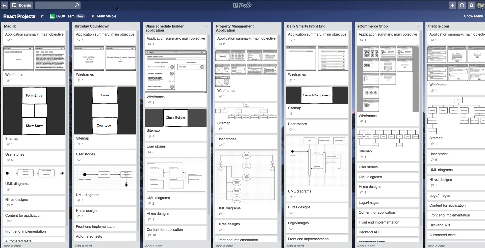

So this is a specific course board and it has a number of different collaborators. I have worked on each one of these cards. And then we also have designers and engineers that have also contributed in one spot or another. So we are not treating this like a traditional Kanban board.

If you look back at the course one that we had here here 


we set up essentially we sent a journey. So we set up each one of these cards to be a state. And then you would take a task and then drag it to the very next state. 

Here:  


what I've done is I've treated each card as its own project and so the goal of this is not to take one of the tasks and then move it over to another board because this is a one project and this is a completely different project. And so here I'm treating it very different than the first example. But what I wanted to show you here was the ability to add quite a bit of metadata. So this is incredibly helpful for having a dashboard where you can look at a project and get all of the information you need all in one spot. 

So this is fantastic for collaboration and also tracking the progress of each one of these projects. So for example I have to add to this property management application a uml diagram. And so before there was no little diagram here but if you click on this it will actually pop up the diagram that I added. 

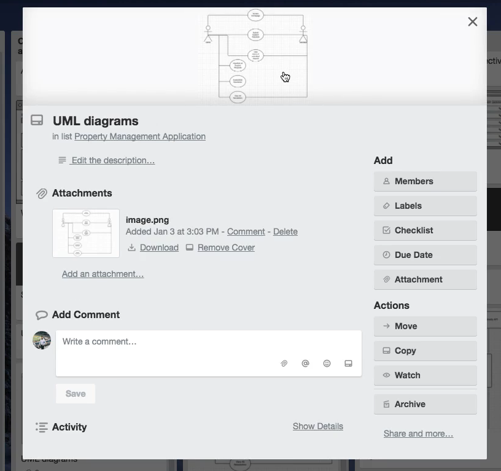

So in the beginning this was completely blank it didn't have the image. But now after I finish that uml diagram I was able to upload it and now everyone on the entire team can come to this dashboard and they can all see what the diagram looks like and then they can work on it from there.

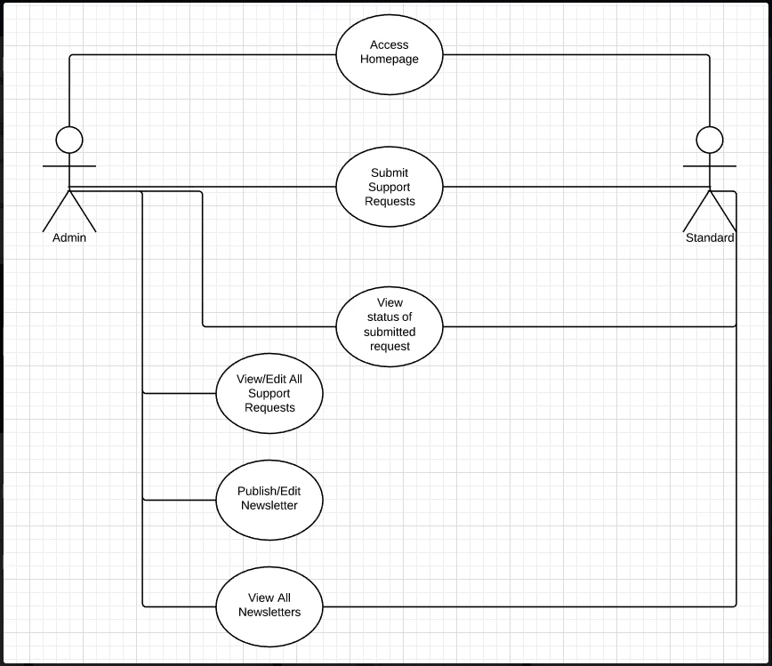

So for example if I come down to one of these other projects like this e-commerce shop right here 


I worked on this with a number of designers and engineers where it started with listing out the goal for the system, which is just a short sentence right here. 

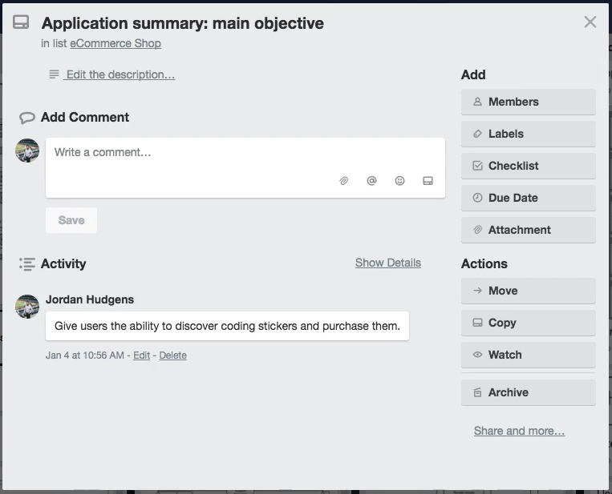

Then from there I created wire frames and then site maps that showed the high level behavior of the system 

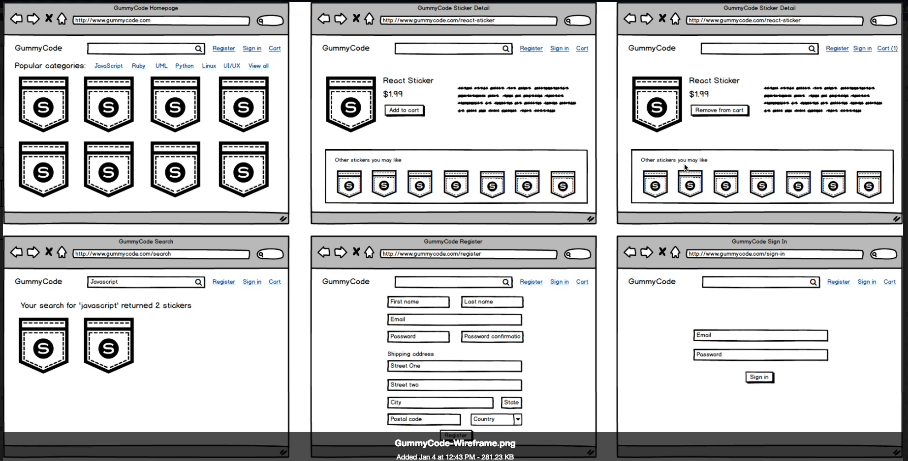

and as I was doing this the other members of the team were able to see this and we didn't even have to talk on the phone or have meetings they simply were able to see everything that I added. And then they were able to go and perform their own tasks. 

So for example the designer was able to go and create a full design for the entire system. 

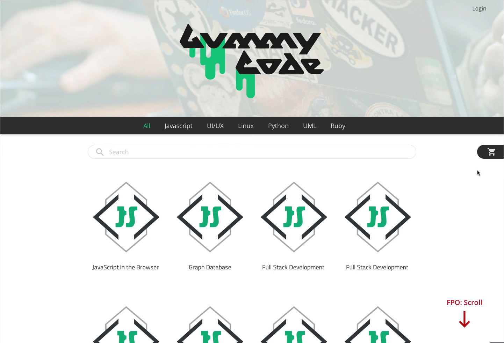

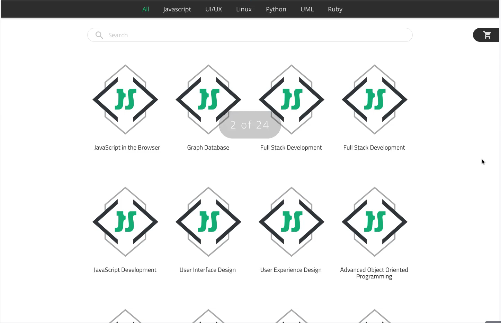

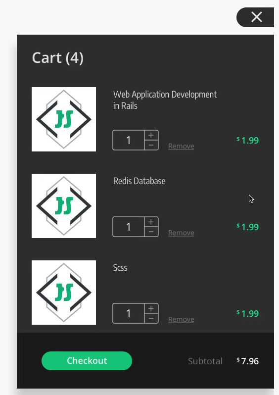

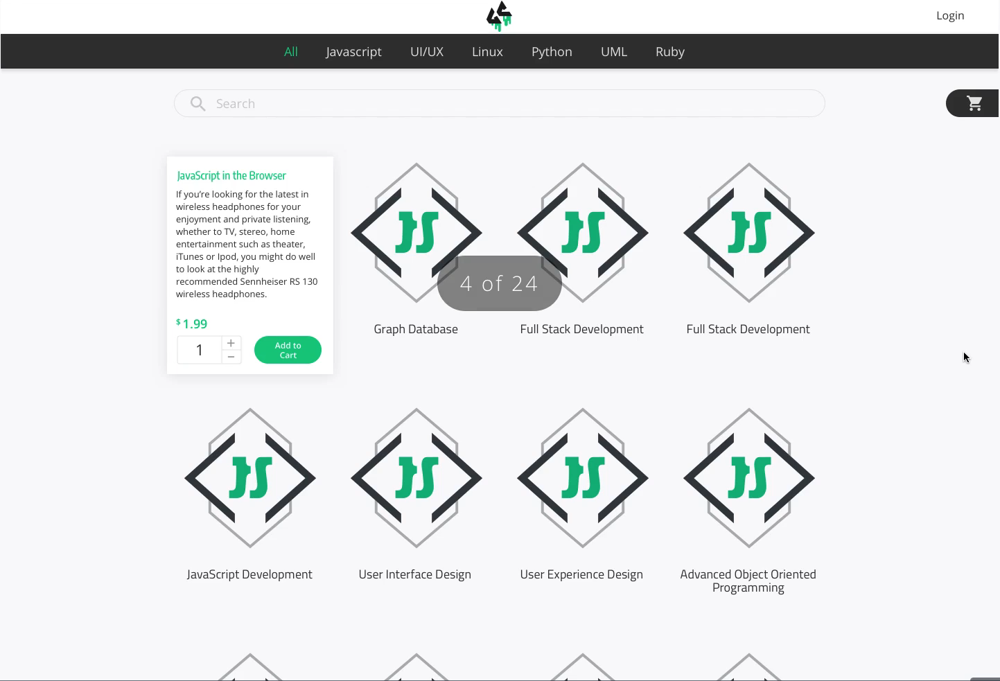

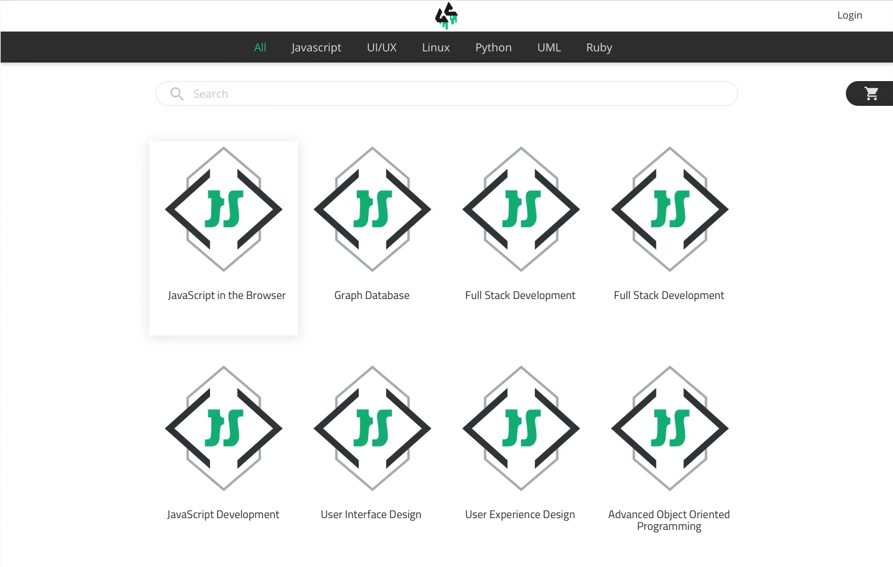

And all he had to do was track each one of the items that I was adding and then that gave him an idea on exactly how he needed to structure his own tasks. And then when he was done as you can see right here this was done by our designer Nate Lords. And he simply pasted in the link so that I and the development team were able to come to it and see the completed design.

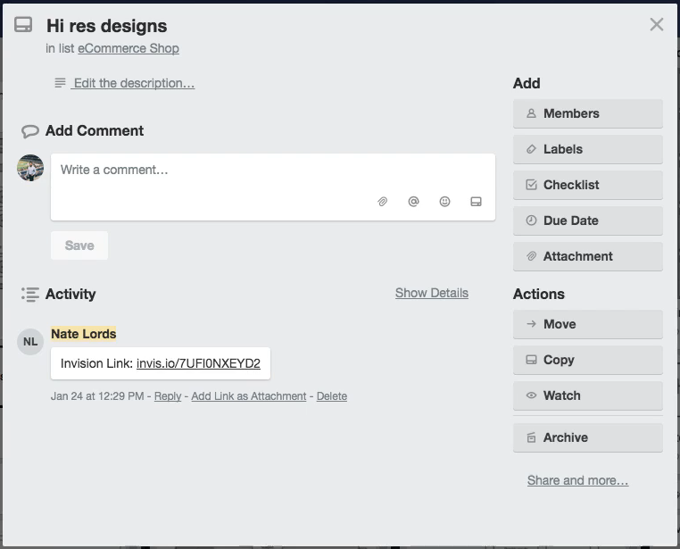

And so we did that for each one of these projects and it proved to be incredibly efficient for us. 

The last Trello example I'm going to show you is my daily Trello. 

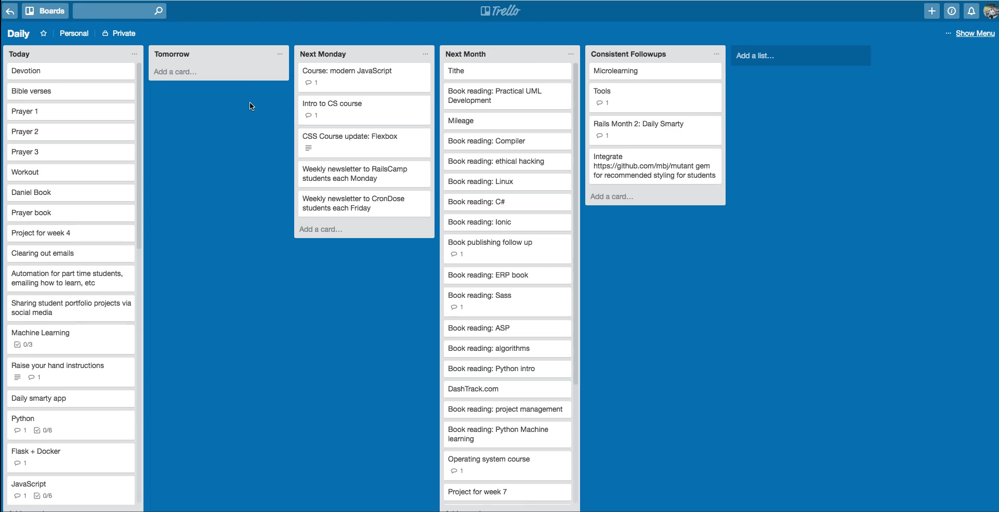

So right here I've set up a Kanban board and this is just for myself to work on as you can see you can also have them where they're private versus having team collaboration. And here I've set up the way that I like to manage my tasks. And so I have everything that I want to get done on a daily basis. Now this is a very long list, some of these are projects where I oversee other people and so the task may simply be to call them or send him an email or simply check on the status of a particular item. 

And just like we saw with the last task board you able to add any metadata that you want. So for this task you can click on it and this has all of the content that I need to add to a page of devcamp 

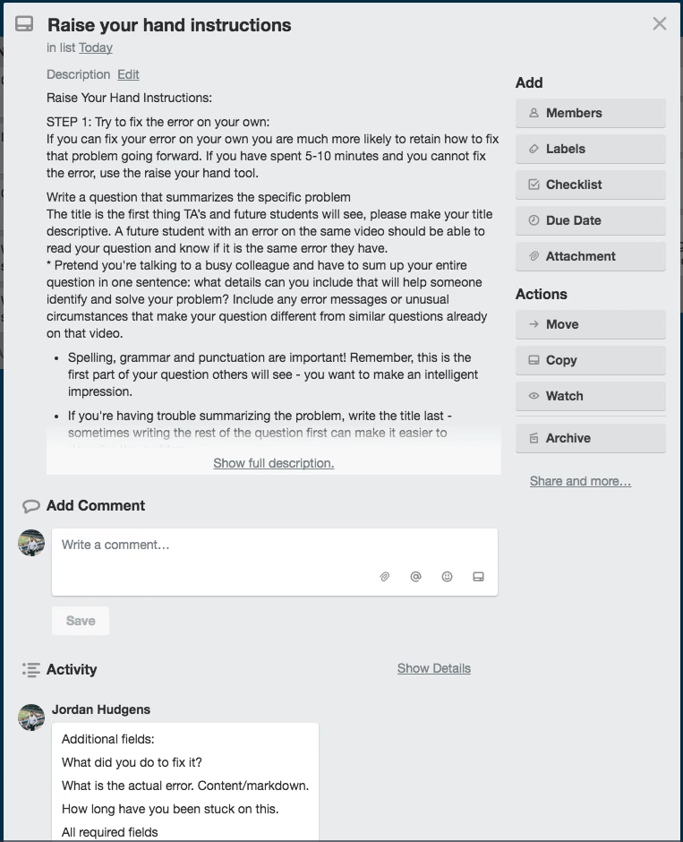

which is just a really nice easy way of keeping all of the details for something I need to work on in one location.

So this is an effective way of doing it. And then what I do is as soon as I'm done with one of these tasks those am done writing the python curriculum and everything I wanted to do on this task for the day I simply come to this tomorrow task and I simply drag it over to this card. And by the end of the day I should have each one of these cards moved over and this entire channel of Today here should be empty. And then what my process is is I simply change the name.

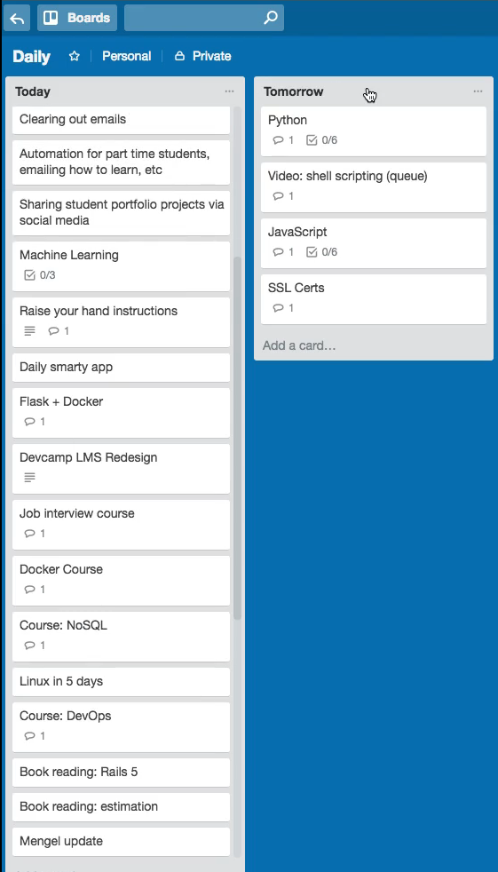

So this would be today and then I change this channel to be tomorrow and then the next day I simply repeat it and I dragged each one of these cards over to the other channel. I also as you can see have other ones set up because there are tasks that I perform on a daily basis. But then there are also tasks that I perform on a weekly basis. So I had this channel set up for these all all the items that I want to do starting the following week and then I also have tasks that should only be performed monthly and so they are right here. And then I also have a final item which is this set of items that I just have here for consistent follow ups. 

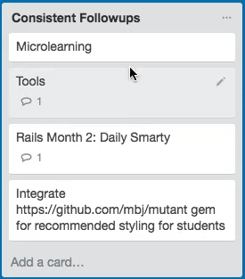

It's just here essentially so that I will not forget about them and so I'll continually look over here to make sure that I am performing each one of these tasks. 

So we're almost done we have completed two of the three walkthrough's and so switch back here and now we're going to look at the third option which is the to do list. 

Now this one is probably one of the most basic options that are out there but because of that it has the lowest learning curve. So if you think back to the daily tracking journal when you did that you needed to learn a number of options you needed to learn a number of different things you needed to learn the process you needed to build out your own system. And it takes not a lot of time but it does take some time to learn.

And the next option in working with Kanban boards and working with tools like Trello that takes quite a bit longer especially if you've never used a tool like that before. But with this type of system there is pretty much no learning curve is a basic to do list and that may seem like it's not the most effective approach but as I'm going to show you it actually can be quite helpful when done properly and it is very flexible. 

And in order to walk through it and open up a text editor. And as you can see right here I have a list of 12 tasks 


and if you're curious on which of these three systems that we've walked through which one I'm personally using I'm actually using all three in some form or another right now because I've found that the combination of those three is a way that allows me to be as efficient as possible. 

I'm continually changing and evolving myself so that is going to adapt. Now if you're curious if I'm being truthful you can come down even to number 12 here and you can see my task is video for daily task management so I'm actually doing this as we speak. So it's going to be really nice. At the end of this I'm going to be able to put a little x here and that is going to be crossed off. 

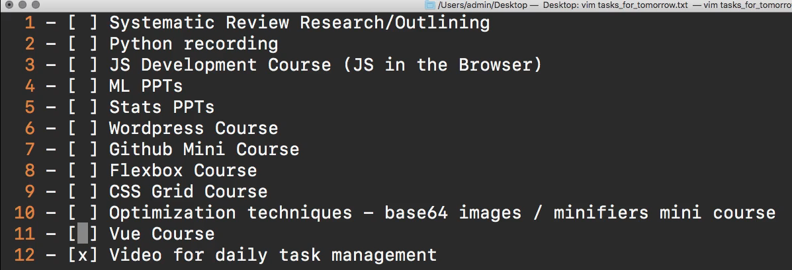

Now if these symbols look weird to you it's because I'm using a language here called markdown that is completely optional. If you are not a developer and you don't want to use tools like markdown you can have a list that looks exactly like this 

```html
1.
2.
3.
```

and that is perfectly fine.

Now you also can time box these and that's is something that I do quite often so I might do something like say from 8 a.m. to 10:00 a.m. I'm going to perform this task. 


So that is a way where I can be a little bit more structured with it. I don't have them right here 


because one I already have that my journal and so I'm not a fan of wasting time. So there's no need for me to put the Times right here. I'm simply keeping this list so that I don't have to always go back directly to the Journal and I can simply mark items off right here. 

Now the other reason why I like using markdown is because of something I'm going to show you it's a way that you can leverage a tool like a to do list and actually make it collaborative. So if I save this I can copy this and to put it on the web so that markdown language I'm going to show you the reason why I'm using it here in a second if I paste this and I can just say mytask and I'm using GitHub's gist engine right here so I can say mytask.md


You notice here this is just what I had in the text editor and if I create public gist what that's going to do is see how it actually converted this into a To Do List automatically? 

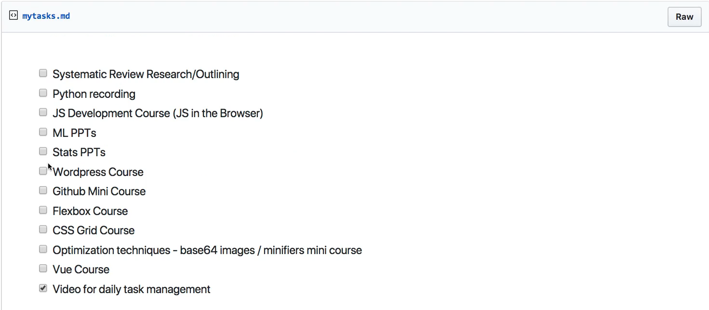

so I can share this link with anyone else on the team I'm working with and they can see exactly what I am working on and also what the status is so I can come here and say okay this is done for the day and so's this and so is this item and then they can track that. 

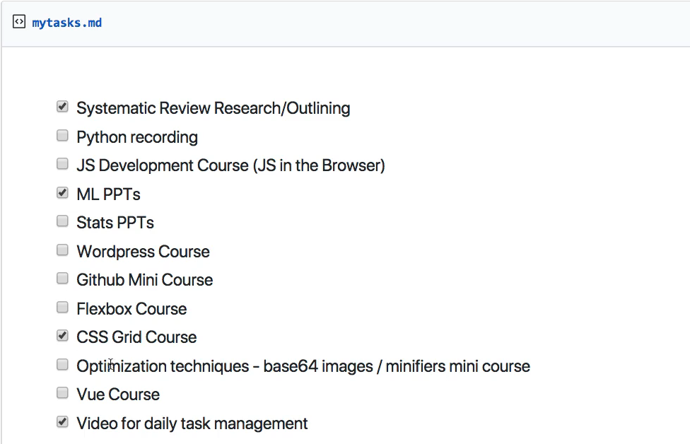

And so if you don't want to use a tool like Trello you simply want to use something that is dead simple to implement then this is a another option. 

So in review we've walked through three different systems that you can utilize. Daily tasks journalling, we walk through Kanban boards, and just walked through the dead simple to do list kind of system. My recommendation is for you is to try out all of them and see which one allows you to be the most efficient to decrease stress and anxiety and help you organize your goals and achieve them on a daily basis.
