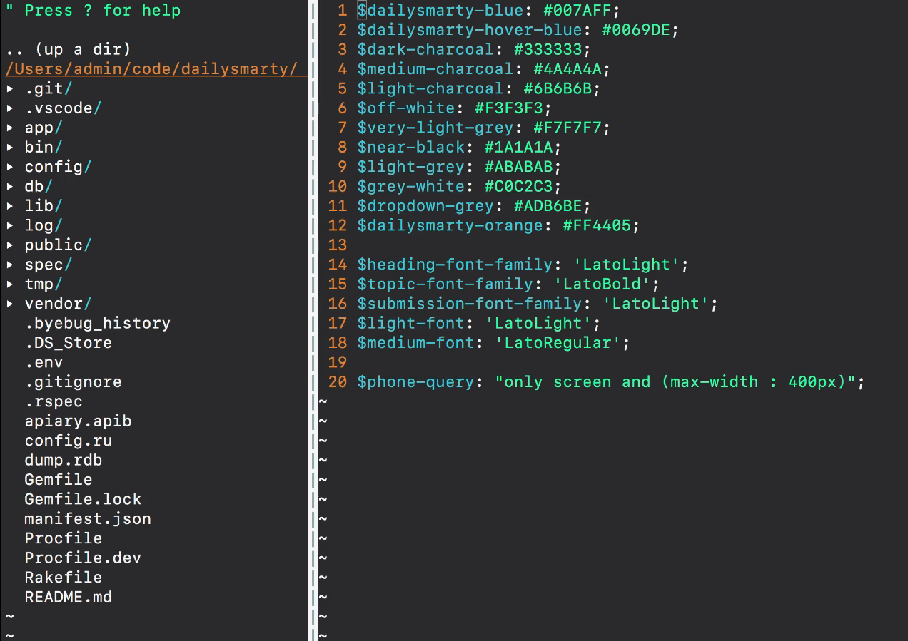

# MODULE 01 - 081: Creating an effective UI Style guide

***

This is going to be a really fun and practical guide because we're going to talk about building a style guide.  

**Jesse Cook:** This is where it's important to be detail-oriented.   

I think this is right in line with keeping your room clean and keeping copious notes of your design.  

**JH:** Haha.  

**JC:** The important thing here, again, is communication.   

The communication process is critical to make sure that these designs are going to be realized the way that you want them from the developers and vice versa.   

You need to be able to, as a developer, understand how to interpret the notes of a designer if they're provided.  
 So what's really important is to identify objects and fonts and things like that, which are going to be used throughout the app.   

You want to identify those different things because you want continuity throughout 
the app.   

You want to make sure all your headers are going to be the same.   

You want to make sure your buttons are always looking the same,   
and that they're not of different widths, or they're not of different   
font sizes. Things like that. So they all behave the same, right?  

So what you're doing is you're saying "*OK, I know that this is the button that's going to be used throughout the app.*"

 And you add it to the style guide. You say, "*Here is button active. Here is button 
inactive. Here is button after clicked. Here's button on hover.*"  

 You need to make sure these things are documented for when you pass it to a 
developer so that they don't have to keep coming back and asking you what that looks like.  

**JH:** What tools do you use in order to communicate that?  

**JC:** First of all, for designing these screens, I use [Sketch](https://www.sketchapp.com/), which I do specifically because of its integration with [InVision](https://www.invisionapp.com/).  
 And InVision is a fantastic product that you can subscribe to that   
allows you to take your designs and share them with the developer, and   
then the developer can inspect your designs in a way that is very   
similar to the inspection tool in a browser.   

It'll show you styles, font  weights, and all these things that are extremely helpful, as opposed to  just delivering someone a PDF.   

It's much better than just eyeballing everything because we all know how well that goes. It's fantastic to be delivered screens in an InVision prototype because you have all the information right there.   

That isn't to say you don't still want a style guide where they can set up their CSS styles and they can just call in that button or call in an H1 or whatever.  

**JH:** Absolutely. This is something on the developer side that I do have quite a bit of experience with.   

When you give me a set of styles and give me the screens, one of the very first things that  I'll do is, using a tool such as Sass, create a set of variables in the
 application.     

I just create a file called `variables` and then I will name them.     

So for DailySmarty, for example, we have that very specific kind of blue.     

I created a variable called `$dailysmarty-blue` and then saved the hex color that you sent over.    

Then, everywhere in the application, and in all of the other Sass files, I can just call the `$dailysmarty-blue` variable.  

 I don't have to go and reference that Hex color every single time.  

And then I do the same for every color in the style guide.  

I also copy the style guide. Especially if it's extensive.   

With DailySmarty, it wasn't that massive, so I could contain everything inside of the Sass file, but devCamp has a very large one.  

So I'll add them to the application's README, and whenever I have a question about it, I can just check the README.  

 I put the name of the component, the name of the variable I used in the Sass file, and the actual value of the variable itself, just so that I have everything right in front of me.   

It's a personal preference, but I've found it to be pretty effective.  

**JC:** When you're creating this style guide, it's important to be flexible.   

You should definitely layout your colors, font  families, headings, and things like that beforehand, but you'll be hard-pressed to make it through an entire application without some adjustments.  

Modern design programs make it easy to define these variables and then tweak them application-wide, all at once, which is very handy.  

Don't go crazy diverging from it, but don't be so rigid that it keeps you from designing a good looking page.  

**JH:** Yes, absolutely.  

The homework for this guide is: go to some type of application--it could be a popular one like Facebook or Twitter--and create a style guide for that application.   

This would be very similar to the process you would do if you had just finished building the user interface and then went and checked to see what all those styles were.   

See what the heading font size is, what the colors are, the background colors, all of
 these different types of components, even getting down very granular 
into border-radius.  

 That makes a huge difference. Just making sure that each one of the edges of your divs are rounded in the right way.  

So go and build that and we will see you in the next guide!  
