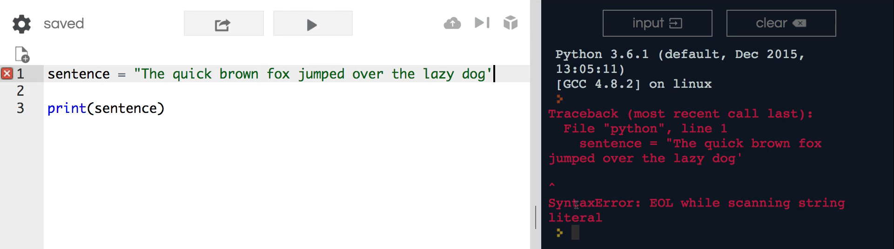
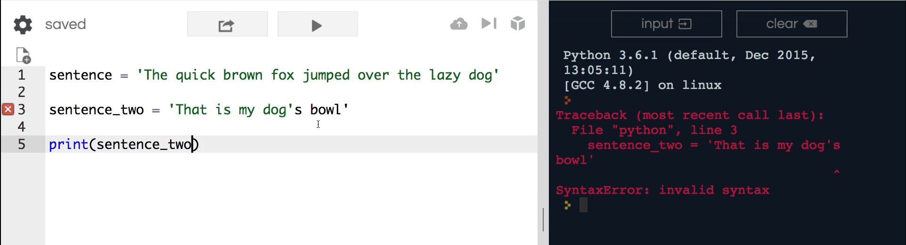
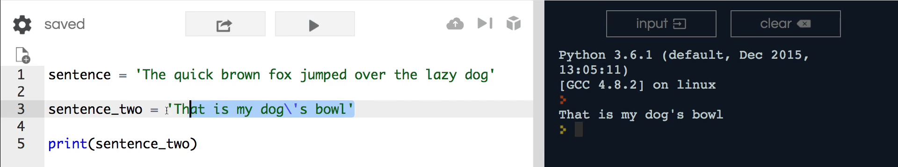
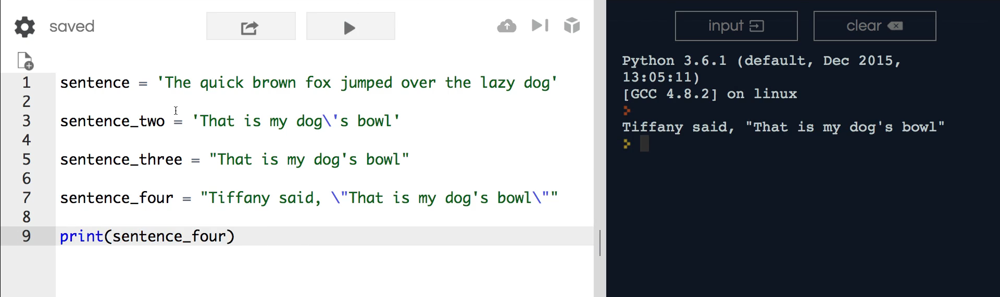

# MODULE 02 - 023: Python - Strings basics

***

This section is going to be all about how to work with strings in Python.   

Now if you went through the variable module then you've already seen a number of ways to build strings.  

 And in this introductory guide I want to show you the two different options that you have when it comes to creating a string in Python.  

Next, we will learn to use both single and double quotes and when to use one versus the other.   

To begin with an example, use a basic sentence such as “*the quick brown fox jumped over the lazy dog*”.   

The reasoning for using this sentence in programming examples is because <u>it contains 
every letter of the alphabe</u>t.   

With this kind of approach, you are able to check for any unique characters.  

 Although this is something you will see in your programming journey, it has nothing to do with strings.

You will see that this basic sentence has single quotes.   

If I say "print sentence", you will see it print this out. If I change it to double quotes and run it again, it will produce a syntax error stating “*end of line while scanning string literal*”.



This may seem like an obvious example however, these are the errors you will run into most often.   

Also, seeing this simple error will help you understand complex errors later. To fix once again, change it back to one quotation mark and run it.

In other programming languages, there are specific times when you want to use double quotes or single quotes.  

For example, if you're coming from the **Ruby** programming language, **double quotes are needed to perform string interpolation **(if you are not familiar with string 
interpolation, it will be expanded on in a later section).  

In Python, it does not matter whether you use single or double quotes unlike other 
programming languages. F  

or reference, let’s discuss situations in which you would want to use instead of the other and how they deal with escape characters.

I am now going to create a new variable for sentence two. I am going 
to begin with single quotes saying, “that is my dog’s bowl”.

Here, you may notice that we receive an error.

```python
sentence_two = 'That is my dog's bowl' # Meeeec ... error ... /n
```

The error appears not because we have bookend single quotes, but because
 there is an apostrophe. 

The Python interpreter will see the apostrophe as the end of the string, therefore causing a syntax error. 

If I try to run it, it says “invalid syntax” and shows exactly where the error is.



There are a couple different solutions to this challenge (`\n`), and I will demonstrate both. 

* One option is to escape the character by using a backslash.  
  A backslash tells the Python interpreter that the next character should still be treated as a string value instead of a programming construct.  
  If I hit enter, you can see it successfully prints everything out and includes the apostrophe instead of ending the line.  
  

* If I want a sentence three, I can wrap them in double quotes and rid the backslash character.  
  
  ```python
  sentence_three = "That is my dog's bowl"
  ```
  
  This can become very helpful if you are going to be using strings with an apostrophe like in our example. So, just wrap the entire string in double quotes and you will not have to deal with the messiness of the backslash characters.

* Below are some different examples and their variety of combinations:  
  
  ```python
  sentence_four = "Tiffany said, \"That is my dog's bowl\""
  ```

Here, I can use a backslash characters and do another one at the end of the set of quotation marks.   

The multiple backslash characters helps protect the double quotes.



So, these are four different examples of how to create strings and how to utilize backslash characters in order to escape string values within Python.
