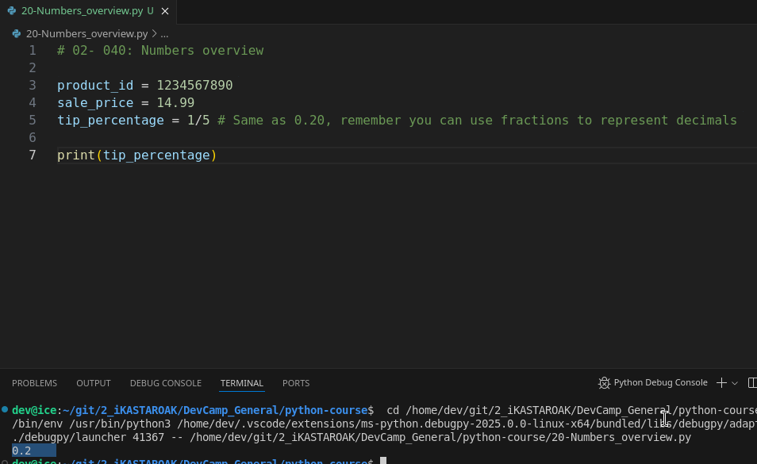
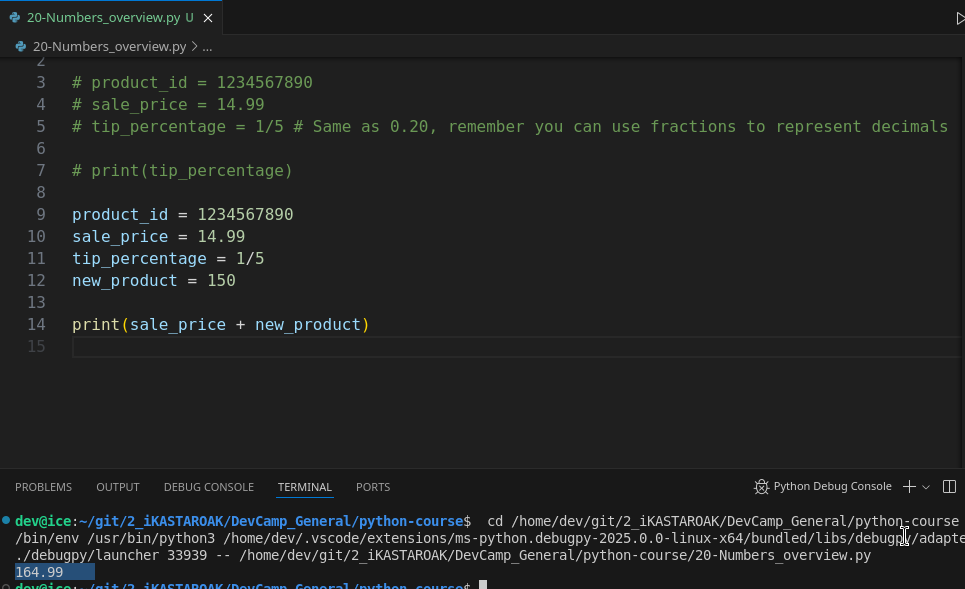

## MODULE 02 - 040: Python - Overview of Numbers

---

## **Understanding How Python Works with Numbers**

Python provides powerful tools for handling numbers, making it an essential skill for **performing calculations, implementing machine learning algorithms, and building dynamic programs**.

Python automatically assigns number types without explicit declaration, which differs from languages like Java or C++. This flexibility allows developers to focus on logic rather than type management.

✅ **Best Practice:** Use the appropriate number type for your calculations to ensure precision and avoid unexpected behavior.

---

## **1️⃣ Python's Main Number Types**

Python supports multiple numeric types. Let's explore them:

### **1. Integers (`int`)**

An **integer** is a whole number without decimals or fractions.

```python
product_id = 123  # Integer
new_product = 150  # Another integer
```

📌 **Use Case:** Counting items, indexing, and working with discrete values.

---

### **2. Floating-Point Numbers (`float`)**

A **float** is a number with a decimal point.

```python
sale_price = 14.99  # Float
```

🚨 **Warning:** Floats **aren't as precise** as decimals, making them unsuitable for high-precision applications (e.g., scientific computing, financial calculations).

📌 **Use Case:** Prices, measurements, and percentages.

---

### **3. Fractions (`Fraction`)**

Python provides support for **fractions** via the `fractions` module.

```python
from fractions import Fraction
tip_percentage = Fraction(1, 5)  # 1/5 or 0.2
print(float(tip_percentage))  # Output: 0.2
```

📌 **Use Case:** When you need exact fractional calculations (e.g., ratios, probability calculations).

---

## **2️⃣ How Python Dynamically Converts Number Types**

Python can **automatically convert** between numeric types based on operations:

```python
result = sale_price + new_product
print(result)  # Output: 164.99
```

### **Conversion Rules:**

- **Integer + Integer** → Integer
- **Integer + Float** → Float
- **Fraction + Integer** → Float (unless explicitly kept as `Fraction`)

📌 **Use Case:** Simplifies calculations by dynamically adjusting number types.

---

## **3️⃣ Example: Performing Operations with Different Number Types**

```python
product_id = 123
sale_price = 14.99
tip_percentage = 1/5
new_product = 150

print(sale_price + new_product)  # Output: 164.99 (Float result)
```

✅ **Best Practice:** Python handles type conversions automatically, but be mindful of precision issues when using floats.

---

## **🔍 Summary: Key Takeaways**

| Number Type               | Example | Use Case                                   |
| ------------------------- | ------- | ------------------------------------------ |
| **Integer (`int`)**       | `123`   | Whole numbers, counters, indexing          |
| **Float (`float`)**       | `14.99` | Prices, percentages, general calculations  |
| **Fraction (`Fraction`)** | `1/5`   | Exact values for mathematical computations |

---

## **📌 Python Documentation Reference**

🔗 **[Python Numeric Types](https://docs.python.org/3/library/stdtypes.html#numeric-types-int-float-complex)**

> Covers integers, floating-point numbers, and complex numbers.

🔗 **[fractions module](https://docs.python.org/3/library/fractions.html)**

> Provides exact fractional arithmetic in Python.

***

## Video lesson Speech

In this section of the course, we're going to walk through how python 

works with numbers. Now this is going to be very critical to performing 
calculations to implementing machine learning algorithms and having an 
understanding of the way that Python allows you to define and manage 
numbers and also see it's dynamic nature especially compared to other 
programming languages is really going to help you understand how to work
 with the language and how to build programs as a whole.

***

We're going to take in this guide a short overview of each one of the main number data types that we have access to in python.

I'm gonna start off with some examples. I'm going to say we have a 
variable here called Product ID. And I'm going to provide it with the 
number 123. The data type this is going to represent is the integer data
 type. Now if you're not certain what integers are or how they work in 
computer science an integer is a whole number. So it's not a decimal 
it's not a fraction. It's not a complex number. It is simply a number 
like this. It can be 123 could be 42 it could be 3. Any of those are 
going to represent integers.

With the way that Python works and we discuss this a little bit when 
we talked about the data types in python but with how python works all 
of this is decided and it's all processed. When we run our python 
program and when the interpreter comes across this value it's going to 
understand that this is an integer and it's going to assign that 
automatically. We don't have to define it ourselves like we would have 
to if we were working in Java or C++ or a language like that. So this is
 an integer and it'll be automatically parsed by the system.

Now the next type we're going to look at is one I'm going to create a
 variable here called sale price and I'm going to say 14.99.

Now, this is a floating-point type of data type it may look like a 
decimal but it's very important to not call this a decimal and we're 
going to have a guide that we see exactly why that is. And so the main 
point to remember is this is a float and there actually is a decimal 
library inside of python you have to import it manually. And we're going
 to do that in one of the upcoming guides. But the important thing to 
note is that a float's precision is not anywhere near as granular as a 
decimals precision which means that if you're performing very complex 
calculations that involve decimals then a float may not be your best 
choice and in fact, there have been some pretty big disasters including a
 shuttle crash just because floating-point numbers were not used 
properly so it's very important to understand that we're going to have a
 guide that goes through that and I'm going to show you where the 
differences are.

But for right now you can think of a float as a type of decimal. It 
simply is a type that isn't precise it wouldn't be an issue with saying 
that the sale prices $14.99

However, if you want to try to build a scientific program then this 
is going to not work properly and you have to be careful. But at the end
 of the day if you want a very basic decimal this float is going to be 
understood exactly like it is right here by the Python interpreter. So 
far we've covered integers and floats.

The next one we're going to cover is going to be fractions so I'm going to say tip percentage and I can say one fifth.

Now, this is going to represent 20 percent and we can check that here
 by print out percentage. You'll see that it prints out point 2 which is
 equivalent to 20 percent.



And so the cool thing about each one of these is notice how we didn't
 have to do any work to tell python what kinds of numbers that we're 
working with. And if you're brand new to programming then this may not 
seem like a big deal this may seem intuitive which is part of the reason
 why the creators of Python did it this way because it does seem logical
 that you should be able to place any type of number store it in a 
variable and have the system decide how to treat it.

But if you have been programming for a long time and you've worked 
with much more low-level type languages like C and those type of 
languages then this is going to look very odd because we're simply 
allowing the system the python languages self to manage the parsing and 
decide what data type to use so as it goes through it looks and it finds
 product I.D. It looks and finds 123 and it says this is an integer it 
comes to sale price looks at the value that's assigned and it says this 
is a floating-point number. And then it finds 1/5 and it says it's a 
fraction and it converts it just like you see in the above image.

I'm going to create one other one. I'm going to say "new product" and
 we're going to say this is 150 and this is just another integer. But 
the main thing that I wanted to show you is what happens when you 
combine such as when you perform calculations on these various data 
types because that's another nice thing about Python is it's a very 
flexible in allowing you to switch back and forth and if you remember 
back into our string section you may have remembered that when we tried 
to combine a string with a number we got an error and that's because you
 can't have that kind of overlap. Python doesn't want you to be able to 
become that flexible with your programming because you're going to end 
up with some very weird bugs.

But one thing it is flexible is with these numbers so you have all of
 these subtypes such as float and integer and they all can work 
together. And so if I do something like this where I say sale price plus
 new product and I go and I print this out you'll see it says 164.99



What happened here is we took two different data types or I should 
say two different numbered data types of float and integer and when you 
combine those such as when you add them or subtract them or multiply 
them Python goes through and it actually converts that final output into
 a float. And so if we were to have two different types of integers I'm 
going to copy this all commented out. And so if I were for some reason 
in a logical sense you wouldn't usually combine a product ID with a new 
product but just for the sake of being able to see the way that this 
works. These are two integers 123 and 150. If I add these together you 
see that it didn't convert it into a float it kept it as an integer but 
whenever we had sale price and new product. And one of these sale price,
 in this case, was a float then automatically converted the output to be
 a float to be that type of decimal-based value.

And so that's something that is also very helpful. So there are going
 to be many times where you're going to be dealing with situations where
 you need to perform calculations and you may have many different data 
types you may have a decimal or you may have a float you may have a 
fraction and an integer and you need them to all work together and 
that's what's so helpful with Python is it allows you to do that. It 
will automatically allow you to process each one of those perform the 
calculations and then it will perform dynamically the types of data type
 conversions just like we saw right there.

So that is your overview of the various number types inside of Python.

***

## Code

```python
product_id = 123
sale_price = 14.99
tip_percentage = 1/5
new_product = 150

print(sale_price + new_product)
```
