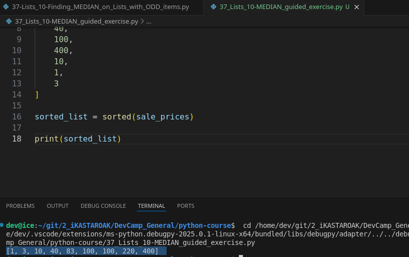
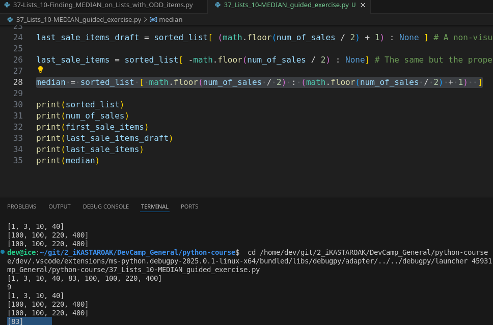
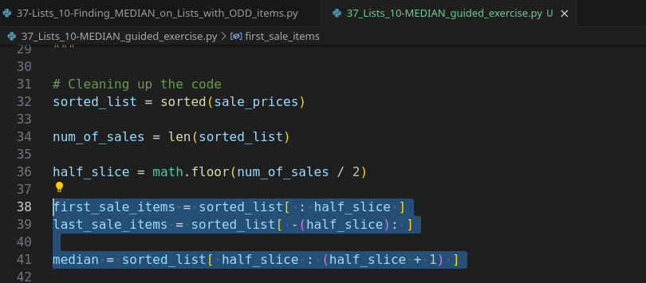

## **MODULE 02 - 058: Finding the Statistical Median in a Python List**

****

### ⚠️ This lesson includes an exercise, and some required attempts.

****

## **📌 Introduction**

In this guide, we will implement a **manual approach** to finding the statistical **median** of a list in Python **without using external statistical libraries**. This exercise reinforces core Python concepts such as:

- **Sorting lists** using `sorted()`.
- **Finding the median** using the `math` library with different indexes handling.
- **Slicing lists** to extract the median value.

🔹 **Note:** This implementation only works for lists with an **odd number of elements**.

📌 **Python Documentation References:**

- [`sorted()` function](https://docs.python.org/3/library/functions.html#sorted)
- [`math.floor()`](https://docs.python.org/3/library/math.html#math.floor)
- [`list slicing`](https://docs.python.org/3/tutorial/introduction.html#lists)

---

## **📝 Steps to Find the Median**

1️⃣ **Sort the list** using `sorted()`.  
2️⃣ **Find the middle index** using `math.floor()` to ensure we select the correct median value.  
3️⃣ **Extract the median** by accessing the middle index of the sorted list.

---

## **🔍 Implementation**

```python
import math

"""
Tools:

- math library
- sorted function
- list slicing
- computations
  """

sale_prices = [
 100,
 83,
 220,
 40,
 100,
 400,
 10,
 1,
 3
]
sorted_list = sorted(sale_prices)

num_of_sales = len(sorted_list)

half_slice = math.floor(num_of_sales/2)

first_sales_items = sorted_list[:half_slice]
last_sales_items = sorted_list[-(half_slice):]

median = sorted_list[half_slice:(half_slice + 1)]

print(sorted_list)
print(num_of_sales)
print(first_sales_items)
print(last_sales_items)
print(median)
```

---

## **✅ Best Practices & Optimizations**


✔ **Use Built-in Functions:** Python provides `sorted()` for ordering lists efficiently.  


✔ **Handle Large Lists Efficiently:** Sorting is an `O(n log n)` operation, but since we only access a single element after sorting, overall performance is reasonable for practical use cases.  


---

## **🚀 Summary & Key Takeaways**

✔ **Sorting ensures that the middle element is correctly positioned.**  
✔ **Using `math.floor()` helps locate the median index efficiently.**  
✔ **Python’s list indexing and built-in functions make the implementation concise and readable.**  
✔ **This method applies only to lists with an odd number of elements.**

****

## Video lesson Speech

This is going to be a really fun exercise in this guide.   

What we're going to do is walk through a relatively non-trivial problem which is 
**how to find the statistical median in a Python list.**

****

I have a list of sale prices right here.

```python
sale_prices = [
 100,
 83,
 220,
 40,
 100,
 400,
 10,
 1,
 3
]
```

You can either use these from the show notes or you can simply create your own list of integers and then I also have listed out the tools that you're going to need in order to implement this properly.

```python
"""
Tools:

- math library
- sorted function
- list slicing
- computations
  """
```

Now, I purposefully am setting this up exactly how I have because of what you've learned up to this point in order to find the median in a list.  

 There are a number of ways to do this in python and one of the most popular and probably the best one is to **use a python statistical libra**ry and **in a production application** that's exactly what you would do.

However, I want you to do this manually.  

 I do not want you to go through and find other people's implementations of this and I 
purposefully am positioning this exercise at this stage in the course because you have all the information you need in order to do this, but you don't have the right information for doing it properly yet.   

So I want to add that as a caveat.

In all the implementation so, if you google "*find the median in a Python list*" , you're going to have thousands of implementations and I did it to see exactly what other people had.  

 And each one of them had some kind of library or they performed looping or conditionals or anything like that.   

And we haven't learned about many of those topics.

I don't want you to just go and copy-paste something that someone else did.  

 I want you to use what you've already been taught.   

This is not going to be a production implementation of how to get the median.  And that is perfectly fine.   

This is not so, that you can learn stats better.   

This is so you can learn the ins and outs of python and exactly how it works.   

So I want you to build this and this is going to be a very specific type of statistical median.   

**It will only work if you have an odd number of elements inside of your list**.   

We're not going to get into how to do it with an even set of elements and we'll get into that later on in the course.

Just in case you need a little refresher on your math, the way that a median works is:

> Let's take just these three elements, these top three elements,  
> 
> then, 'm going to put these in their own list just for the sake of an example.  
> 
>  So, we have 100, 83, and 220 these if you have these in sorted order they're going to look like this.   
> 
> It's going to be 83, 100, and 220.   
> 
> **The median value is the value that is exactly in the middle of the list.**

So if you only had three elements then, in this case, it would be 100.   

That is how you find the median.   

So, in order to do this what you're going to have to **implement is the math library** because there are some libraries that we already have gone through.  

This is not something where you need to go research other things that we haven't 
learned yet.  

 This is something that we've already gone through.   

So, look back if you need to at the different guides where we talked about the 
math library, the sorted function which we just went over list slicing, and then running a number of computations.   

So, essentially what you need to **be able to do at a high level is:

1. **You need to sort the list** .

2. Then, you need to **split the list in two** in order to be able to grab the elements 
   on the left-hand side and the right-hand side.

3. Lastly, find whatever that middle value is.

Good luck with that.  

And I will walk through my own personal solution when you get back.

****

## Attempt #1:

```python
# 02 - 058: Python - Lists, Finding statical MEDIAN in a list

"""
sale_prices = [
    111,
    83,
    220,
    40,
    108,
    400,
    124,
    654,
    101,
    76898786,
    65454,
    16358,
    14412,
    610,
    65752413,
    321324,
    41564352135432134
]
"""
"""
Tools:

- math library
- sorted function
- list slicing
- computations
"""

# Attempt #1
import math
from decimal import Decimal

"""
1. Reordering the list

2. Getting how many items the list is

3, Depending on how many items, look for the median positioned item:
3.1 [Guide reviewed]    Half the item_list numbers
3.2 Assuming the MEDIAN is half_the_item_list AS IS (non-zero LEN + zero-based INDEX = DRAFT! )
3.2 But Round() only works well when the items < 10, so, math.ceil is the options

"""

sale_prices = [Decimal(1.546546546545321645343243423213451354), float(2.99999999999932413432543243299998), math.pi, round(math.log(76)), 5, 6, 7, 8, 9, 10, 11, 12, 13, 14, 15, 16, 17, 18, 19, 20, 21, 22, 23, 24, 25, 26, 27, 28, 29, 30, 31, 32, 33, 34, 35, 36, 37, 38, 39, 40, 41, 42, 43, 44, 45, 46, 47, 48, 49, 50, 51, 52, 53, 54, 55, 56, 57, 58, 59, 60, 61, 62, 63, 64, 65, 66, 67, 68, 69, 70, 71, 72, 73, 74, 75, 76, 77, 78, 79, 80, 81, 82, 83, 84, 85, 86, 87, 88, 89, 90, 91, 92, 93, 94, 95, 96, 97, 98, 99]

sorted_prices = sorted(sale_prices) # 1. Reordering the list
print(sorted_prices)

items_length = len(sorted_prices)
print(items_length)

half_length = math.floor(items_length / 2) # round() doesn't work very well ...
print(half_length)

median = sorted_prices[half_length]
print(median)
```

****

## Guided exercise

Welcome back! I hope that was a fun exercise for you if you went through that and that you were able to reinforce some of the knowledge that you have.

Now, if the code that you produced is working but it isn't a very good looking code that is perfectly fine.   

Like I already said this is not a production implementation. This is simply a way of reinforcing what we've learned so far in this section and in a few of the other guides.

So, with all of that being said, I'm going to come down and give us lots of room.  

 So, the first thing that I mentioned is we need to bring in the math library.  

 So, at the very top of the file, I'm going to say import math because we are going to be using some math modules.

So, the first thing that I want to do is sort that list so I'm going to say sorted_list equals. And in this case, I'm going to use the sorted function that we learned about. So you say sorted sale prices. And just to confirm that that is working let's look at our sorted list.   

If I print this out you can see that that list is sorted.



Now from a visual perspective in this example, I know that I have `1, 2, 3, 4, 5, 6, 7, 8, 9`elements and so that means that in this case, the fifth element which is 83 is going to be that median value.  

 So that is what we want our results set to have.

Now, we can know our number of sales by saying num_of_sales and set this equal to the length of the sorted_list.  

 And so now if I want to see how many elements there are without just counting them manually then I can print this out and see that is 9 which is what I counted.  

 So we are all good right there.

Now, this is not going to help us get the median, but l**et's just reinforce our knowledge on slicing**:

I'm going to create a slice of the first sale items, I'm going to say first_sale_items and I'm going to call our sorted list and to slicing.

I'm going to skip the first element so I want to have whatever that first element is I could put zero, but I'm just going to leave it blank.   

And then from there, I can call `math.floor` and then call num_of_sales divided by two. So remember,number_of_sales is 9 but if you divide 9 by 2 then you're going to get 
four and a half.

So I want to grab the first four elements.  

 So I want to have 4 and that is I can't just type in 4, this example has to work if I have 500 in one element or if I have a thousand and thirty-five elements, has to work on any set and any list of array items here that is odd.  

 So, I can't hard code so I'm just going to check for the whole number of sales. 
Divide it by 2.  

 That's going to give me some type of a fraction.  

 And then, I want the** lower end of that fraction** because I want to have the first half of the elements.   

So let's see if this is working.   

If I say print first sale items just like this. This is going to give me 1, 3, 10, and 40.  Which is perfect.


So, this takes me to everything except the median which is exactly what I wanted.   

If you wanted the last set of sale items you could say last_sales_item sorted list and then here what I could do is I could actually wrap this entire math floor and wrap it in parentheses.   

Put a negative in front of it and then that is going to give me my set of last  sale items. 

So if I go last_sales_items just like this. Print it out.   

Now you can see "oh I did something wrong. Oh yes."  

I have to put the `(math.floor(num_of_sales/2))` .  

That is what I need at the very end.

So I'm going to cut that out. Paste it in. And let me also just to make it a little easier to read all stretch that.  

 OK. So if you saw what
 I did wrong there I put the slice in that colon on the wrong side. Here
 we want to go negative because remember negative is going to take us 
backwards in our list. I want to go negative and then I want to go all 
the way to the end. So now if I try this again. There we go. So now I 
have 100, 100, 220, and 400 which is exactly what I want. It's the last 
four items.


Now, creating that first_sales_items and last_sale_items that were not part of the exercise. I simply wanted to reinforce exactly how slicing worked and how you could combine computations with that.

Now, to get the median it's actually a little bit more straightforward.  

With the median, I can say median equals sorted list and so now what I'm going to do is I'm going to take the math floor so I'm going to grab that everything that we have right here.  

 And so I'm going to say math floor just like this.   

This is going to be the start of my slice and then I'm simply going to in parens put the same exact code here and then just add one.   

And so now if I want to print out my median come down here and let's see if this worked. And there you go.   

We have 83 which was the median element so everything there is working properly



Now, **from a code perspective, this is pretty ugly**.   

**You have all of this duplicate code which is definitely a bad practice**.

## Practical code, but unneficient

A way that you could clean this up is you could come here and just say we could say 
`half_slice`, some type of variable just like that and then I could say 
math floor input all of this code here just like that.


And half_slice is not completely accurate but for the sake of everything we're doing here, we'll say that it is and I'm going to do the same thing here.   

And in each spot where we call this just to make it a little bit easier to read.  

 And now if I run this you can see all of the output is completely identical.



**That has less to do with programming and more to do with best practices**.   

If you were ever duplicating a lot of code like that, the best practice is to streamline it:

**Store it in a variable or later on when we learn about it store it in a function and then you'll be able to simply call that variable or function and not have to duplicate a lot of code and have a bunch of ugly code like we had a second ago.**

So this is how we are able to do this

****

In review let's kind of summarize the entire process.   

* We took a list.

* We sorted that list and so we created a new sorted list and we stored it inside of this variable.

* From there we counted how many items were in that list.

* After that, we used the math floor library to take in the number of sales so the number of elements divided by two which for all odd numbers is always going to give us a point five fraction, and then we said I want the bottom half of that.

So we're always going to get slightly less than the count of half of the number of items in this list.  

 And then,  for just some exercise here you didn't have to do this part I showed how we could grab the first slice and then the second slice of the entire element leaving the median alone.

And then for the median itself, we were able to call on our list and using slicing we were able to grab or bypass the first half and then also end before the second half by just adding one to it.  

 And one thing that's pretty neat about this, if you do go and you Google how to find 
the median in Python pretty much every example you're going to find has to deal with looping or bringing in outside libraries or things like that.

However, before you're even learning those kinds of topics you are able to do it just with what we know right now just by knowing a few of the math library functions and knowing how slicing works and sorting and finding the length of elements in a list you're able to find the median of an odd numbered list which I think is pretty impressive and you should be happy with the progress you are making and all of the work that you're doing that's pretty impressive.   

And it also shows some of the power of how python works in being able to give you this level of expressiveness and this level of being able to work with and manipulate 
data just like we have right here.   

So very nice job!

## Code

```python
import math

"""
Tools:

- math library
- sorted function
- list slicing
- computations
  """

sale_prices = [
 100,
 83,
 220,
 40,
 100,
 400,
 10,
 1,
 3
]
sorted_list = sorted(sale_prices)
num_of_sales = len(sorted_list)
half_slice = math.floor(num_of_sales/2)
first_sales_items = sorted_list[:half_slice]
last_sales_items = sorted_list[-(half_slice):]
median = sorted_list[half_slice:(half_slice + 1)]

print(sorted_list)
print(num_of_sales)
print(first_sales_items)
print(last_sales_items)
print(median)
```
