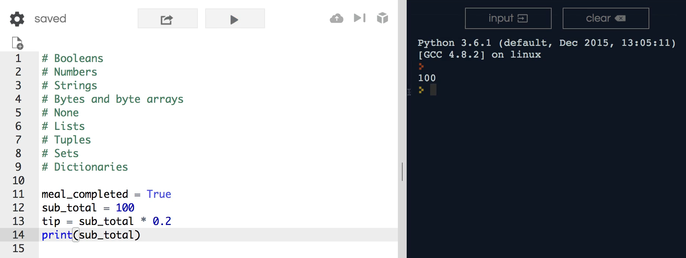
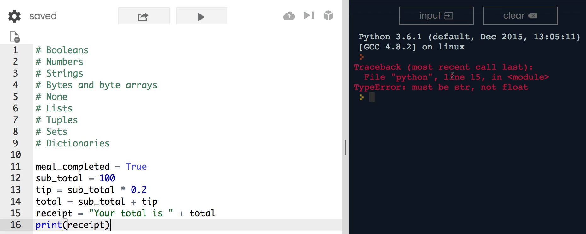
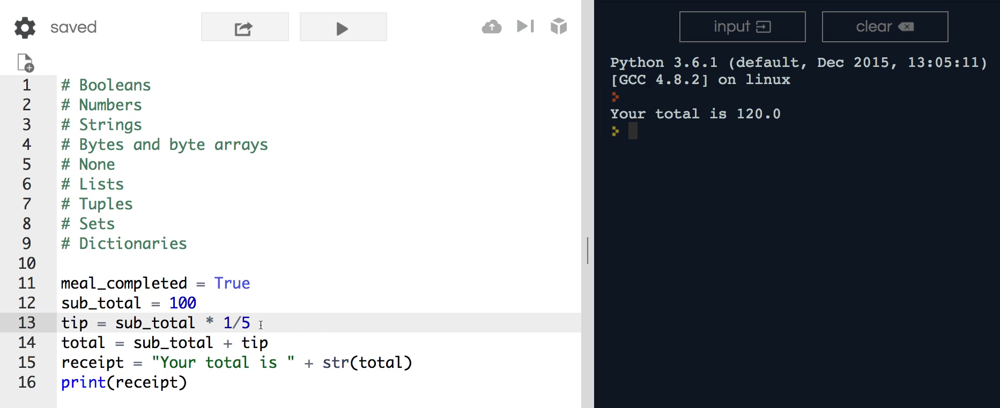

# MODULE 02 - 017 : Python - Primitive Data types

***

So far in this section on variable's we've been pretty limited with the 
number of data types that we've looked at from Python.   

And so I wanted to have one dedicated guide that gave a high level overview of what all 
the major data types are and how they're different from one another so that you'll know how to use them.  

As you can see, I've listed out the nine major types you can use in Python:

```
- Booleans
- Numbers
- Strings
- Bytes and byte arrays
- None
- Lists
- Tuples
- Sets
- Dictionaries
```

Because Python is dynamically typed, it will infer what type of stored data type to use based on the value.  

 Through practical implementation, we are going to solidify our understanding of how they are represented and how they can be used.   

### Booleans

For example, a `boolean` (a true or false value) if we had a blog post, the `boolean` could show if a post has been published or not by displaying "false" until it is published.

### Numbers

Since a `number` is an incredibly complex portion inside of Python, we have an entire section dedicated to it.   

Python, being one of the best APIs of the modern general-purpose programming languages, is a major reason why Python is preferred for machine learning.   

Its different options and libraries compatible with numbers can be anything 
from standard integers (i.e.. 1, 2, 3, etc.), to large decimal type numbers, fractions, and floating-point numbers, etc.  

 Numbers can also be connected to more powerful types of number-based libraries (addressed in the numbers section).   

For now, understand that **numbers can be a large variety of different elements**.  

 Here, we will walk through an example on how that can be represented.

### Strings

Next is the `string` data type.   

Strings can be any type of byte sequence ranging from a name or an entire HTML document.   

Therefore there is a wide selection of ways to integrate strings into your program.   

Typically, strings are wrapped with ' single ' ' or " double quotation " marks.  

### Bytes / Byte Arrays

Fourth on the list are `bytes` and `byte arrays`.

Bytes are a data type reserved for complex Python development when you begin performing tasks such as rearranging byte sequences or working with images on a byte level.   

This is also further expanded upon later as it's beneficial to achieve a high-level understanding of what bytes are then, getting into advanced development where you will see examples on how they can be best implemented.  

### None

Like most types of dynamically generated languages, Python has a concept of `none`.  
 Every type of language that is dynamically typed has a "none" or a "null" option of data type.  

An example of using the none data type would possibly if you want to define a variable, but do not want to set its value yet, leaving you with the option to later rearrange it and set it to another value.  

In other words, whenever a value has been typed, you are able to swipe it out with a string, integer, etc. and change the data type.   

In the beginning, this may seem useless, but this tool will become helpful in more complex types of programs, for example, being able to check to see if a value is still a none value is a tool often reached for while 
developing.

### Lists / Tuples / Sets / Dictionaries

The next four data types, `lists`, `tuples`, `sets`, and `dictionaries`,
 fit inside the category of **data structures**.  

With these, you can manage collections inside of Python.   

Since collections are one of the biggest building blocks when it comes to building web applications that implement machine learning and they require a very thorough knowledge of data structures, they will also have their own designated section.   

However, these are also fairly complex and have elements that need to be  mastered before addressing them, so we will not go into full detail just yet.   

At a high level, a l**ist is similar to an array**.   

In other programming languages, it gives you a list of items.   

**Tuples and sets are similar to lists, but they have some unique characteristics**.   

Dictionaries, differing from the first three, give you the ability to have key-value pairs.   

If you were coming from, say, the Ruby programming language, the hash data tructure is very similar.  

***

Now, we're going to build a program that uses multiple data types.

To use an integer, we're going to use a boolean and add a float (which are both inside of the number data type).  

 Then, we're going to convert numbers, so they are compatible with strings, and return to display a string at the end.   

For this example, we are building a small tip calculator.   

We will check if the bill is completed by showing a "true" value when it is, and not let us continue without having completed the meal. Technically, we have not mastered conditionals yet, so this is simply demonstrating what a boolean looks like.   

Now, an** important item to note with booleans** is that you designate if something 
is **true by using a capital T and if it is false, a capital F**.   

If you've come from other programming languages, many use "true" and "false" with a
 lower case leading to a need for some type checking since, **lowercase will not work while using booleans.**

Next, I'm going to use a standard number with an integer.   

Continuing our example, say, the subtotal is equal to 100 and we need to generate 
the tip.   

The tip is a product of the subtotal and 20 percent.  

 There are two ways of doing this with our number data type.  

One way is saying the tip equals the subtotal times 0.2 (there is no need for the trailing 0 in 0,20). To ensure this works, test it.



Now, print the tip calculated at 20 dollars. 

 Notice how** we didn't mention anything about this being a float, but because we added the zero point to Python, it automatically registered that we have with 
floating-point numbers,** adding the decimal for us.   

Here, we will add our tip to our subtotal by utilizing a few arithmetic things inside of our numbers section.  

 Although analyzing data types can be extremely tedious, this is a more practical example.   

You can test this out by stating "print total" where we will have the correct number.   What I want to do next is going to throw a wrench in things.  

To receive a receipt, this must contain a string, your total.  

Add a space, a plus sign, and "total". If I try to print this, we will run into a bug zone.   

Hit enter and see the error.  



It is telling us the type of error and that it is on line 15.   

The type of error is a "TypeError" meaning it must be a string, not a float.

 When we multiplied the subtotal by 20 percent, it was done properly because floats and integers are both inside of the number data type.   

However, a string cannot be combined with a number causing us to receive
 an error; it will not infer that we are wanting to slide the total inside.

Later on, in the string section, I'm going to walk through how to accomplish this in a better and cleaner way.   

For now, we will focus on converting from one data type to another one.

Here, I can call a method here called `str` (short for string) and use parens wrap total inside.  

This will take the value of the total and the data type and convert them to a string.  

Since this is now equal to a string, it can be combined with everything else. 

If I hit  enter, you'll see that it prints it out and combines the number data 
type.  


Now it reads, "your total is 120.0," and everything is working properly.  

 Remember earlier that I stated that numbers can be integers, floats, and even fractions? Well, because of this, 20 percent can be changed to 1/5 and still have the same output. If you run this, your total will still remain 120.



The options that you can implement for numbers is an extensive list and so you're able to work and perform calculations on all different types of numbers.   

This element is one of the things that make Python such a popular programming language.
